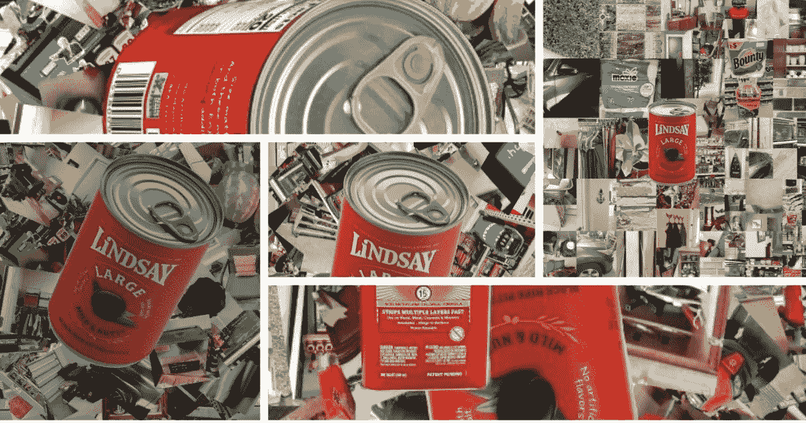
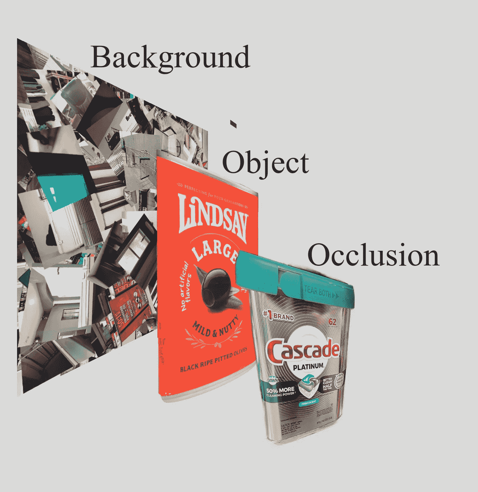
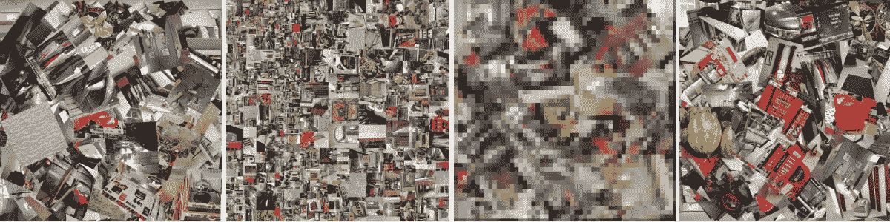
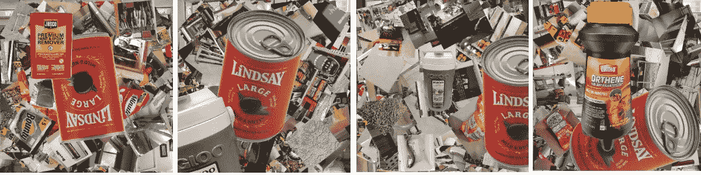
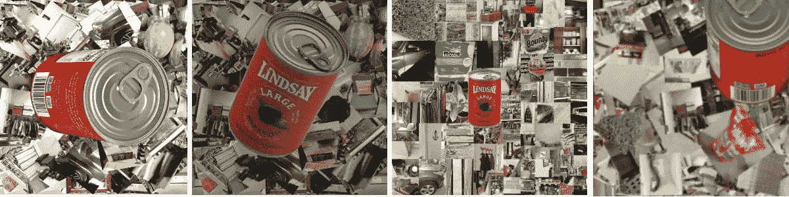
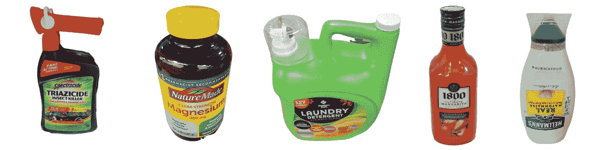

# 你一直想知道的关于简历培训图像的一切*

> 原文：<https://medium.com/mlearning-ai/everything-you-always-wanted-to-know-about-cv-training-images-c22ad1469e34?source=collection_archive---------5----------------------->

**却不敢问*

所以，我们研究计算机视觉已经有几年了——这很酷，不是吗？

同样非常酷的是，我们现在有大量优秀的视觉人工智能平台和公司可供选择。Python 库可以提供帮助。事实上，几乎所有关于 CV 的事情都变得更加容易和便宜。

除了生成良好的训练图像，一切都更容易。

> **就容易获得良好的定制简历培训图像而言，我们仍然回到了石器时代(2019 年)。**

更糟糕的是，仍然很难找到完整的、易于理解的指南来指导如何为 CV 创建优秀的定制培训图像。

几乎每个 CV 平台都可以标记图像——但是很少有地方可以让*得到训练高精度定制分类器所需的实际图像*。

每个人都给图像贴标签——没有人从头开始创造图像。

本文的目标是成为您为自定义计算机视觉项目创建正确训练图像的指南。

**Prep:**
所以，我就叫了披萨外卖，把我的数据科学家塞进实验室，播放“*办公空间*”的视频，以阻止他们“贡献”，让这太无聊了。

# **那又怎么样？**

为什么我不能让一个实习生拿着 iPhone 拍几十张照片，然后训练我的分类器呢？

> **答案是你可以-** 如果你不需要定制的分类器或高分类器精度…

**为什么量词“类型”很重要:**
为了以正确的方式开始这个讨论，我们需要整理出 CV 量词的类型。

一个普通的简历分类器可能被要求区分罐头食品和香蕉。好消息是，有许多免费的训练数据集(和预训练的通用分类器)可以用来做到这一点。

如果这是你正在努力做的事情，你很幸运——生活很简单。停止阅读。

另一方面，如果你的分类器必须对一个具有高复杂性或高通用性的对象进行分类(哎呀，被 nerdish 了)，生活就没那么容易了。

这意味着你正在构建一个“定制”的分类器。

你顾客分类员仍然必须区分罐头食品和香蕉——当然。

然而，它还会被要求区分一个罐装食品品牌和大约 40 个其他罐装食品品牌——所有的罐头都有完全相同的尺寸、形状和相似的颜色。

此外，您的自定义分类器还必须区分目标品牌中的产品类型或产品线(“橄榄”)(不是切片黑橄榄，而是黑橄榄)。

此外，分类器需要确定橄榄的大小(“大”、“中”或“小”橄榄)。

使这变得更具挑战性的是，这种分类器必须在这样的环境中准确无误，在这样的环境中，杂货店可能会库存超过 1，000 种类似的罐装商品 SKU，照明可能会很差，罐头是倒置的，只能看到一半，并且夹在 15 种其他罐装商品的堆中。

> 你可以用 Lear Jet 零件、医用耗材或电脑部件来代替罐装橄榄——同样的基本原则几乎适用于任何物品。被分类的项目越相似；构建有效的训练图像数据集需要更多的思考和努力。

因此，在 ImageDatasets.com，我们花了几年时间学习如何建立训练图像数据集，成功训练高精度定制视觉分类器。

以下是我们所学到的——在创建了数十万张用于训练定制分类器的合成图像之后。

**所以，用案例研究来解释更容易——所以我们在这里做:**

# 案例研究:橄榄项目

在我们的“橄榄”项目中，我们的任务是创建来自一个品牌的四种不同罐装橄榄产品(大、中、小和切片黑橄榄)的训练图像。

定制 CV 分类器被设计为 POS 收银台，取代当前的 UPC 扫描仪技术。

# 培训策略:

简而言之，训练这个自定义分类器的目标是确保(在合理的范围内)，无论我们的目标对象(我们的橄榄罐)在生产中呈现给 CV 时的状态如何，我们的分类器都被训练为将它识别为四个不同对象(大、中、小和切片黑橄榄)中的一个。

> **最重要的是，我们知道，我们生成的捕捉现实世界中橄榄罐存在的不同对象状态组合的定制训练图像越多，我们的分类器精度就越高。**

实际上，这意味着我们需要使用大量不同的对象状态来构建我们的数据集。

# 视觉差异(制作对象状态):

在 ImageDatasets.com，我们应用一个我们称之为“视觉差异”的概念/过程，以确保我们将所有需要的对象状态统一应用于每个项目中的每个对象。

视觉变化过程产生的训练图像与一个对象在现实世界中可以呈现的对象状态的几乎任何组合相匹配。

在现实世界中，我们必须在可以想象的最糟糕的情况下对橄榄罐头进行分类。

那么，我们该怎么做呢？

在过去的三年里，我们了解到分类器训练的准确性是由以下三个因素驱动的:

*   背景(橄榄罐头后面是什么)
*   处于一种或多种状态的对象(橄榄罐头)
*   遮挡(橄榄罐头前面是什么)

The composite sandwich (side view)

> **最基本的是，我们的视觉变化过程将大多数训练图像生成为图像的三层“三明治”。**

我们的视觉变化过程通过将每个训练图像与背景、对象和通常的遮挡合成来创建捕捉所有可能的现实的图像。

# 第 1 层-背景层:

嗯，背景比我们在 2019 年想的要简单得多。我们知道，当我们训练分类器时，我们训练分类器只做两件事:

*   认出这个物体
*   忽略背景和遮挡

就这么简单。

> **我们已经对大量的背景类型进行了广泛的实验，并得出了一个信念，即在创建训练图像时，最好告诉分类器背景并不重要。**

我们通过使用随机图像马赛克背景来创造独特性。本质上，我们使用的是不重复的“背景胡言乱语”。

Examples of backgrounds we use

我们已经知道，一个分类器用 10，000 张图像和 10，000 种不同的背景进行训练，总会得出背景无关的结论。

我们不能指望训练一个分类器去识别它可能遇到的每一个可能的背景/上下文。

**因此，我们永远不应该尝试。**

分类器不知道杂货店、森林、驾驶舱或手术室是什么，我们也不想让它知道。

# 第 2 层-对象/状态层:

每个训练图像中的第二层是以对象状态的组合表示的目标对象。

目前，我们以下列对象状态捕获每个对象(在这种情况下，我们的橄榄罐):

*   **旋转** -我们以 3.6 度的增量在 360 度水平方向拍摄物体。
*   **角度** -我们从 6 个不同的垂直角度(从 0 到 90 度)拍摄旋转的物体。
*   **旋转** -我们从 360 度 z 轴旋转垂直角度拍摄。
*   **加框** -我们在图像框内的数百个位置给物体加框。
*   **裁剪** -我们从每个角度将物体拍摄进/出画面。
*   **宽高比** -我们对物体进行全帧拍摄(放大)和远距离拍摄(缩小)。
*   **曝光过度/曝光不足**——我们两者都用。
*   聚焦——我们在焦点内外拍摄物体。

Example of spins, rotations, angles, crops, and occlusions

Examples of overexposed, underexposed, varied aspect ratio, blur

在我们的训练图像中，一个对象几乎从不存在于一个纯对象状态中——它几乎总是 2 到 8 个状态的组合。有时，我们的橄榄罐头看起来是水平旋转 20 度，从垂直方向 30 度射出，旋转 15 度。它也可能被裁剪(仅部分在帧中)，在帧的最右上角或最左下角，并过度曝光。

# 第三层——遮挡层:

顶层或“遮挡”层引入了在一些或全部图像前面存在其他物体/噪声/灰尘/手指/手的无数情况。

Example Occluding Items

说到做到，在橄榄项目中，当我们完成时，我们已经制作了超过 150，000 张橄榄罐头的图片。我们是否使用了所有这些图像来训练我们的分类器？

没有。但是，我们将它们作为数据科学家的培训资源。

# 图像力学:

作为一个规则，我们已经知道，最好使用图像本身是方形的，并且是 JPG 格式的。

对象和遮挡层图像都必须在透明背景上(背景已移除)。

我们创建的每个训练图像本身都是 1600 x 1600。当我们制作图像时，我们从不裁剪或重新格式化其他非方形格式的图像，以保持图像的完整性。

我们可以缩小图像以适应任何分类平台，但我们从不放大图像，或改变高 x 宽比。

# 我需要多少训练图像？

简短的回答是“视情况而定”——但通常越多越好。
每个人都想知道他们需要多少图像来训练一个定制的分类器。

这个问题的答案取决于被成像的物体的相似性，以及物体将占据的物体状态的复杂性。

**对于一个定制的分类器来说，需要 100，000 张或更多的图片来对一个项目进行准确分类并不罕见。**

# 一个陷阱:

我们强烈建议我们的客户不要使用任何非内部制作的图片。

来自搜索引擎和用于训练简历分类器的网络图像将成为版权律师的未来目标。不要让自己成为众矢之的——我们建议你总是创建自己的图像，或者从从头开始创建它们的人那里购买它们——并以书面形式授权给你。

我们还建议客户将这些图像永久保存在第三方保管处，以改善出处。

# 关于我们:

ImageDatasets.com 为高精度计算机视觉分类器构建定制的分类器图像数据集。

 [## Mlearning.ai 提交建议

### 如何成为 Mlearning.ai 上的作家

medium.com](/mlearning-ai/mlearning-ai-submission-suggestions-b51e2b130bfb)