# 关于 Edge AI 的一切

> 原文：<https://medium.com/mlearning-ai/everything-you-need-to-know-about-edge-ai-in-less-than-10-minutes-6ffd2a351672?source=collection_archive---------5----------------------->

我的文章中使用的图像是各自组织的财产，在此仅用于参考、说明和教育目的。(图片来源:谷歌)

## 最简单的边缘人工智能是边缘计算和人工智能的结合。

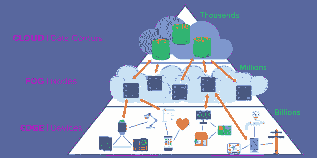

但是让我们从简单的开始。

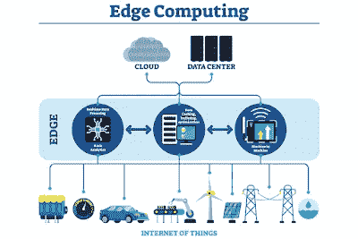

# 什么是边缘计算？

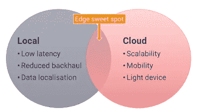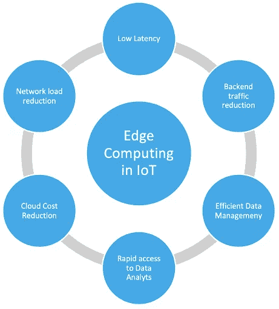

边缘计算是一种分布式计算架构，其中客户数据在网络边缘处理，尽可能靠近源。

它是一个分布式计算框架，将企业应用程序与物联网设备或本地边界服务器等数据源结合在一起。这种与数据源的接近可以提供强大的商业优势:更快的信息、改进的响应时间和更好的带宽可用性。

这是在用户的物理位置或数据源附近进行的计算。

它由多种技术组成，将数据收集、分析和处理带到网络边缘。这意味着计算能力和数据存储位于数据收集的位置。

你可以将边缘人工智能视为在本地进行的分析，并利用高级分析方法(如 ML & AI)、边缘计算技术(如机器视觉、视频分析和传感器融合)，并需要合适的硬件和电子设备(支持边缘计算)。此外，通常需要智能地理定位方法来实现边缘人工智能。-艾德维安

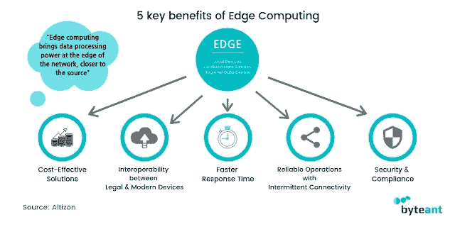

# 边缘计算的优点。

让我们来讨论 6 大好处。

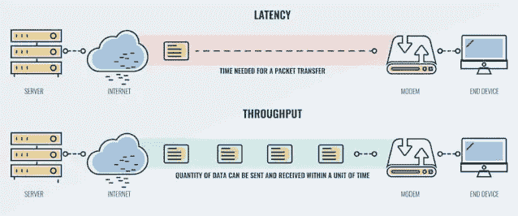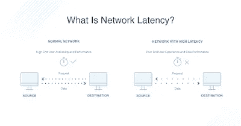

## 延迟和速度

处理数据的时间越长，相关性就越低。在自动驾驶汽车的情况下，时间是至关重要的，几秒钟后，它收集和需要的大多数数据都是无用的。毫秒很重要，尤其是在繁忙的道路上。在数字化工厂中，几毫秒也很重要，智能系统会持续监控制造过程的各个方面，以确保数据的一致性。在许多情况下，没有时间在云之间来回传递数据。设备故障和危险事故等情况需要对数据进行即时分析。将数据分析限制在创建数据的边缘消除了延迟，这意味着更快的响应时间。这使得您的数据更加相关、有用和可操作。边缘计算还降低了企业的整体流量负载，从而提高了所有企业应用和服务的性能。

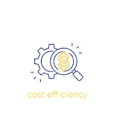

## 成本效益高

既然所有数据都不相同，包含的价值也不相同，那么在传输、管理和保护数据时，如何证明在所有数据上花费相同的资金是合理的呢？虽然有些数据对您的运营至关重要，但有些数据是可有可无的。边缘计算允许您从管理角度对数据进行分类。通过在边缘位置保留尽可能多的数据，您减少了连接所有位置的昂贵带宽需求，带宽直接转化为美元。边缘计算不是消除对云的需求，而是优化数据流以最大化运营成本。边缘计算还有助于减少一定程度的数据冗余。在边缘创建的数据必须至少临时存储在那里。当发送到云中时，它必须再次存储，这就产生了一定程度的冗余。当您减少冗余存储时，您就减少了冗余成本。

## 更高的可扩展性

虽然边缘计算提供可扩展性优势的想法似乎与推广的理论相反，但它是有意义的。即使对于云计算架构，在大多数情况下，数据也必须首先路由到一个集中式数据中心。扩展甚至改变专用数据中心是一个昂贵的提议。此外，物联网设备及其处理和数据管理工具可以在边缘一次性部署，而不是等待位于多个地点的人员协调工作。

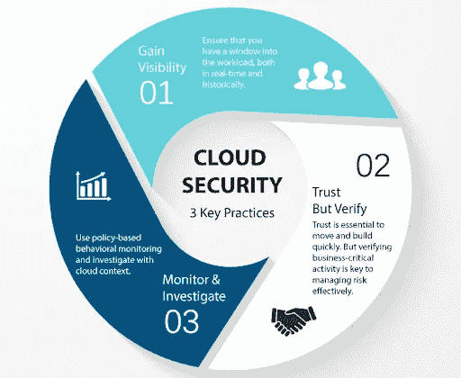

## 提高安全性

当您的所有数据最终都必须通过一个管道提供给云分析器时，依赖于可操作数据的关键业务和运营流程非常容易受到攻击。因此，一次 DDoS 攻击就可以中断一家跨国公司的整个运营。当您将您的数据分析工具分布在企业中时，您也分布了风险。虽然可以说边缘计算扩大了潜在黑客的潜在攻击面，但它也减少了对组织的影响。另一个固有的事实是，当您传输的数据越少，可以拦截的数据就越少。移动计算的激增使企业变得更加脆弱，因为公司设备现在被传输到企业受保护的防火墙边界之外。在本地分析数据时，数据仍然受到本地企业安全层的保护。边缘计算还能帮助公司克服本地合规性和隐私法规问题，以及数据主权问题。

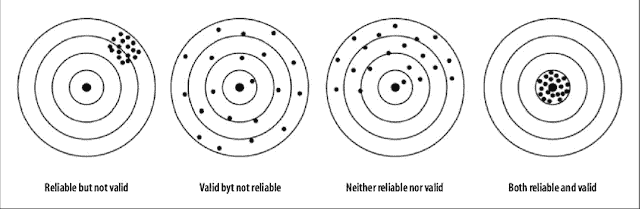

## 提高可靠性

物联网世界包括一些非常偏远的地区，包括农村和不太理想的互联网连接环境。当边缘设备可以本地存储和处理后续数据时，可靠性就会提高。如今，预制的微型数据中心可以在任何环境下运行。这意味着间歇性连接的暂时中断不会仅仅因为智能设备失去与云的连接而影响智能设备的操作。此外，每个站点对一次可以传输的数据量都有一些固有的限制。尽管您的带宽需求可能尚未得到评估，但对于许多企业来说，生成数据的指数级增长将在未来将带宽基础设施推向极限。

## 实时分析

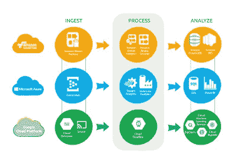

借助边缘计算，有可能实现近乎实时的分析。分析在几分之一秒内完成，这在时间紧迫的情况下至关重要。让我们想想工厂装配线上的机器。如果装配线上的机器人在错误的时间启动或启动太晚，可能会导致产品损坏，或者产品可能未经处理和接触就在装配线上继续移动。如果这个错误没有被注意到，有缺陷的产品可能会进入市场，或者在生产的后期造成损害。

# 边缘计算的缺点

## 难以防止安全漏洞

企业级的边缘设备也更难精确定位，因此很难监控使用企业数据的本地化设备并确定它们是否遵循企业网络的安全策略。对于致力于实施零信任网络安全方法的组织而言，身份验证功能和网络可见性有限的设备可能会对整体网络安全构成挑战。

## 地理差异

尽管边缘计算为本地化级别的数据处理和存储提供了更多的机会，但在边缘实施方面，一些地理区域可能处于劣势。

在人力、财力或技术资源较少的地区，网络上活跃的边缘设备和本地服务器会更少。许多相同的区域也将缺少能够启动和管理本地边缘网络设备的熟练 IT 专业人员。

## (要了解 AI 是什么，点击[这里](https://suryamaddula.medium.com/what-exactly-is-artificial-intelligence-2ea4f30885fe))

# Edge AI 是如何工作的？(来源:Advian)

在典型的机器学习设置中，我们首先在合适的数据集上为特定任务训练模型。训练模型意味着它被编程为在训练数据集中寻找模式，然后在测试数据集上进行评估，以验证它在其他看不见的数据集上的性能，这些数据集应该与模型被训练的数据集具有等效的属性。

一旦模型被训练，它就被部署或“投入生产”，这意味着它可以用于特定上下文中的推理，例如作为微服务。该模型通过 API 工作，通过将端点与输入数据进行 ping 来查询其预测。然后，模型输出或者被传送到另一个软件组件，或者在某些情况下被显示在应用前端。

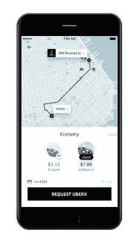

当请求旅行时，优步应用程序会在用户界面上显示客户的预定取车时间。

# 边缘人工智能的市场增长

根据[全球边缘人工智能软件市场增长报告](https://www.blogger.com/blog/post/edit/5580452969908580605/7600675203499973320#)，到 2024 年，仅边缘人工智能软件市场就将从 3.465 亿美元增长到约 11 亿美元。边缘人工智能硬件和咨询市场将同步增长。 [Grand View Research](https://www.blogger.com/blog/post/edit/5580452969908580605/7600675203499973320#) 估计全球边缘计算市场总额将每年增长 37.4%，到 2027 年将达到 434 亿美元。

## 边缘人工智能的趋势

## **5G**

5G 网络可以收集大量快速的数据流。5G 网络的建设逐渐开始，最初，它们将建立在非常局部和人口密集的地区。

当这些数据流的利用和分析尽可能靠近连接到 5G 网络的设备时，边缘人工智能技术的价值就会增加。

## **物联网生成的数据**

物联网和传感器技术产生了如此大量的数据，以至于在实践中甚至收集数据通常都很棘手，有时甚至是不可能的。

最新的空客 A350 飞机有 50，000 个传感器，每天收集 2.5 万亿字节的数据。相比之下，这比 1992 年沃尔玛庞大的 Teradata 数据仓库拥有的数据还要多。

## **客户体验**

人们期望从服务中获得流畅、无缝的体验。如今，仅仅几秒钟的延迟就可能轻易毁掉客户体验。边缘计算通过消除数据传输造成的延迟来满足这一需求。

此外，传感器、相机、GPU 处理器和其他硬件正在不断变得更便宜，因此越来越多的人可以使用定制和高度产品化的边缘人工智能解决方案。

# 边缘人工智能的各种使用案例和示例

## 零售

大型零售连锁店已经做了很长时间的客户分析。该分析目前主要基于对已完成购买的分析，即收据数据。

虽然使用这种方法可以获得令人满意的结果，但是收据数据并不能说明一切。它不会告诉你人们如何在商店里走动，他们有多开心，他们停下来看什么，等等。

视频分析分析从视频图像中提取的完全匿名的数据，并提供对人们购买行为的理解，从而改善客户服务和整体购物体验。

## 活力

智能电网会产生大量数据。真正的智能电网支持需求弹性、消费监控和预测、可再生能源利用和分散式能源生产。

然而，智能电网需要设备之间的通信，因此通过传统云服务传输数据可能不是最佳选择。

## 运输

长期以来，客机已经高度自动化。对从传感器收集的数据进行实时分析可以进一步提高飞行安全。

虽然完全自主和完全无人驾驶的船只可能要到几年后才能成为现实，但现代船只已经拥有大量先进的数据分析。

例如，边缘人工智能技术还可以用于计算乘客数量，并以极高的精度定位快速车辆。在列车交通中，更精确的定位是实现自主轨道交通的第一步和先决条件。

感谢阅读，快乐学习！

 [## Mlearning.ai 提交建议

### 如何成为 Mlearning.ai 上的作家

medium.com](/mlearning-ai/mlearning-ai-submission-suggestions-b51e2b130bfb)