# 关于直方图你需要知道的一切

> 原文：<https://medium.com/mlearning-ai/everything-you-need-to-know-about-histogram-296181b74137?source=collection_archive---------4----------------------->

## 直方图是描述统计的关键部分之一

描述性统计的主要目的是对数据进行汇总，并以一种易于理解的形式呈现数据，其中之一就是直方图。


Image by pressfoto on [Freepik](https://www.freepik.com/free-photo/economical-research_5402552.htm#page=2&query=statistics&position=37&from_view=search&track=sph)

数据是统计世界的主要部分。为了从数据中获得洞察力，我们需要统计数据。当你只需要总结数据而不需要得出任何结论时，描述性统计是正确的选择。有很多方法可以总结数据，包括直方图。

直方图在描述性统计中非常常见。在学习描述性统计的时候，你应该学过直方图，或者听过“直方图”这个词。本文将讨论与直方图相关的东西，也将有一些手动和使用 Python 创建直方图的方法。

# 直方图介绍

呈现数据分布的最佳方式之一是使用直方图。直方图是一种很好的条形图形式，用于查看连续数据点的频率分布。它绘制了两个数值轴，一个轴用于特定值(频率)的出现次数，另一个轴用于将值分组到箱(区间类)[1]。

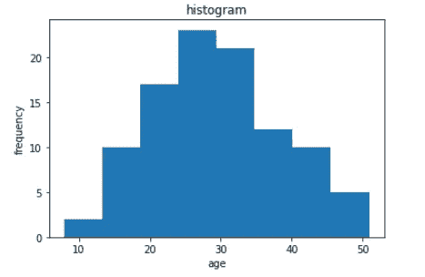

Example of a simple histogram where the x-axis represents age and the y-axis represents the frequency of each age class/bin (Image by author)

直方图中的每个条代表每个区间/类/仓中的频率数量。直方图有多种用途，包括帮助我们估计值集中的位置，帮助我们查看是否有异常值，以及帮助我们向机构提供数据的分布类型。

# 如何创建直方图

直方图最重要的部分是类的数量，或者我们称之为箱。其工作方式是将 x 轴划分为多个条柱，将数据集中的每个数据点分配到一个条柱，然后计算分配到每个条柱的数据点数量。然后，y 轴是每个箱中数据点的频率之和。

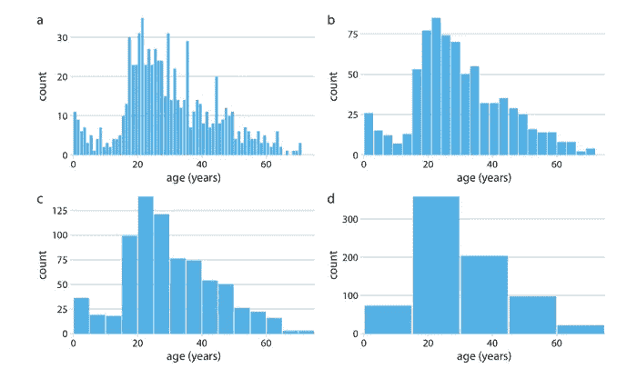

Example histograms with each different number of bins [2]

面元太少不会有任何意义，面元太多会让我们很难确定数据的汇总。制作一个好的直方图有许多步骤，以便我们更容易阅读数据摘要。

制作直方图的一个简单方法是首先制作一个频率数据表。制作频率数据表的步骤如下:

1.  用公式`1 + 3.3 log n`确定箱子的正确数量。实际 bin 值的范围总是从 5 到 20。
2.  用公式`max-min/bins`确定每个仓的宽度。
3.  指定第一个容器的最低容器限制。
4.  确定每个箱的边界。在确定每个箱的边界时，不应有间隙和重叠，并且每个箱的距离应相同。
5.  确定属于类/箱的数据量。

了解了制作柱状图的初始步骤后，我们来试着做一个频数数据表。以下数据收集了 56 名学生在数据科学课程中的成绩。

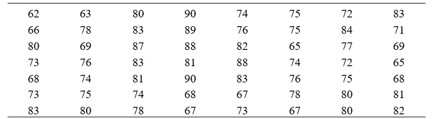

你们中的一些人肯定会想到一个关于数据的问题，比如有多少学生的分数低于 70 分。有多少学生得分在 85 分以上？这个学生得了多少分？还有更多。我们先把数据汇总成一个频数数据表，然后用柱状图的形式表示出来，这样就可以回答这些问题了。

1.  首先，我们先用公式`1 + 3.3 log(56) = 6.77`计算 bin 值。因为 bin 的值必须是整数，所以我们必须将其转换为整数。这里我们改成`6`。
2.  其次，我们必须用最大-最小/面元公式来确定面元的宽度。已知数据中的最大值是`90`，数据中的最小值是`62`，所以`90–62/6 = 4.66`。我们可以将值`4.66`设为`4`。

在获得箱值和每个箱的宽度之后，我们可以通过计算每个箱中包含多少数据(频率)来构建我们的频率分布表。

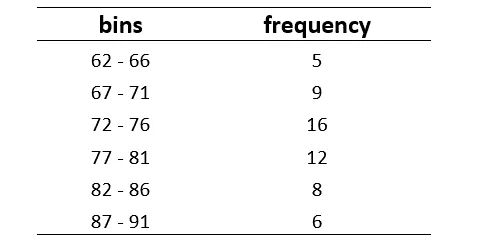

然而，除了这两个分量，频率分布表还包含中值、小于上限的值和大于下限的值。要找到每个箱的中间值，可以使用`upper limit + lower limit / 2`来完成。比如第一个 bin，也就是`62 + 66 / 2 = 64`。然后，我们还必须计算小于每个箱的上限的每个值，反之亦然，对于大于每个箱的下限的值也是如此。

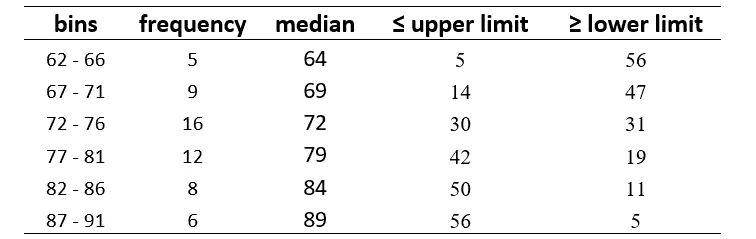

好了，我们已经成功地创建了我们的频率分布表。接下来，我们可以从表中创建一个直方图。直方图的 x 轴将表示仓的值，y 轴将表示每个仓的频率。

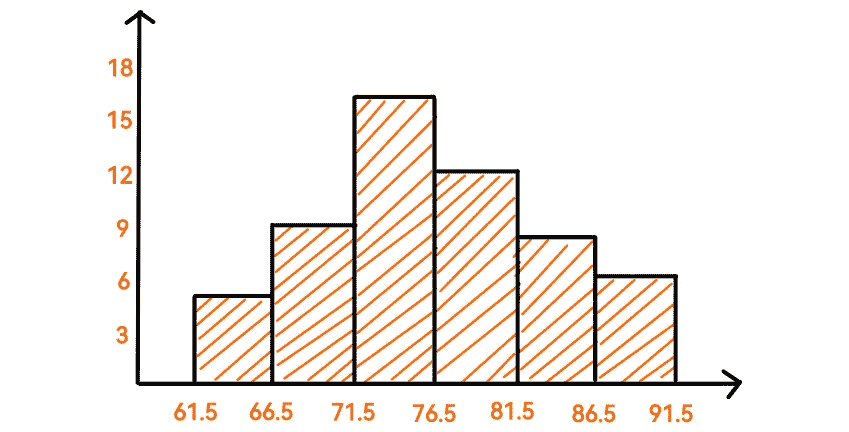

The histogram of the data we have made into a frequency distribution table (Image by author)

因此，从直方图中，我们可以解释数据中的一些见解，例如值范围为 71.5 到 76.5 的学生出现频率最高。然后，从直方图中，我们还可以看到数据分布的类型。此外，有了直方图，我们可以回答第一次查看原始数据时出现的问题。

# 使用 Python 中的各种库创建直方图

Python 提供了几个库，我们可以用它们来可视化数据。我们将使用一些库来创建直方图。其中一些库，如 Matplotlib、Seaborn 和 Plotly。你可以访问我们这里使用的 collab 笔记本:[https://bit.ly/3joXdmt](https://bit.ly/3joXdmt)

导入一些我们将使用的库。

```
import numpy as np
import matplotlib.pyplot as plt
import seaborn as sns
import plotly.express as px
```

我们将只使用我们使用 NumPy 创建的虚拟数据集，这样我们就可以专注于创建直方图。

```
age = 10 * np.random.randn(1000) + 30
```

代码的输出是一个 NumPy 数组，总共有 1000 个，正态分布，平均值为 30，标准偏差为 10。然后，我们可以继续制作直方图。

## Matplotlib

要在不调整某些参数的情况下创建直方图，我们在使用 Matplotlib 时只需要一行代码。

```
plt.hist(age)
```

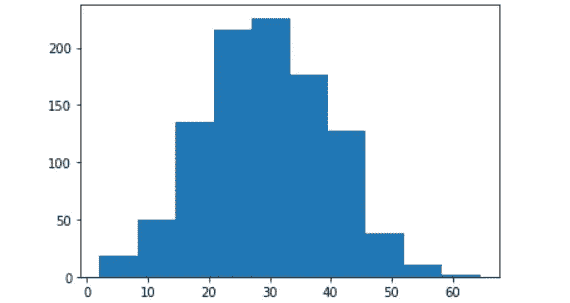

为了让直方图更吸引人，我们可以做一些参数调整，比如设置仓的数量、图表颜色、网格、轴标题等。

```
plt.figure(figsize=(9,7))
plt.hist(age, bins=20, color='yellowgreen', edgecolor='black', alpha=0.7)
plt.title('Histogram', {'fontsize':22})
plt.ylabel('Frequency', {'fontsize':14})
plt.xlabel('Age', {'fontsize':14})
plt.grid(axis="y", which='minor')
plt.show()
```

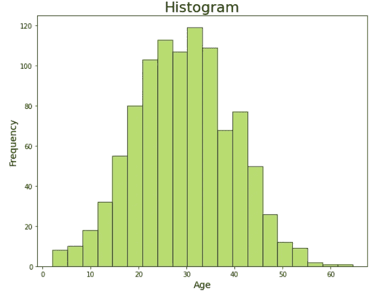

实际上还有更多参数调整来调整 Matplotlib 上的直方图，更多细节你可以阅读来自 [Matplotlib](https://matplotlib.org/stable/index.html) 的官方文档。

## 海生的

Seaborn 与 Matplotlib 几乎相似，因为 Seaborn 是建立在 Matplotlib 之上的。就像 Matplotlib 一样，我们也可以只用一行代码创建一个直方图。

```
sns.histplot(x=age)
```

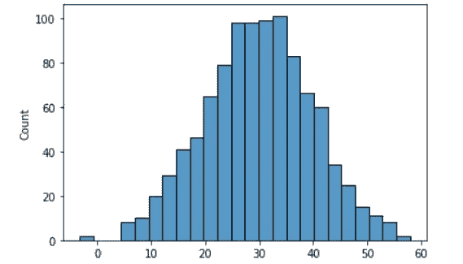

为了使直方图更有吸引力，我们还可以改变各种参数值。

```
sns.set_style("ticks")
plt.figure(figsize=(9,7))
sns.histplot(x=age, bins=11, kde=True, element="step")
plt.title('Histogram', {'fontsize':22})
plt.ylabel('Frequency', {'fontsize':14})
plt.xlabel('Age', {'fontsize':14})
plt.show()
```

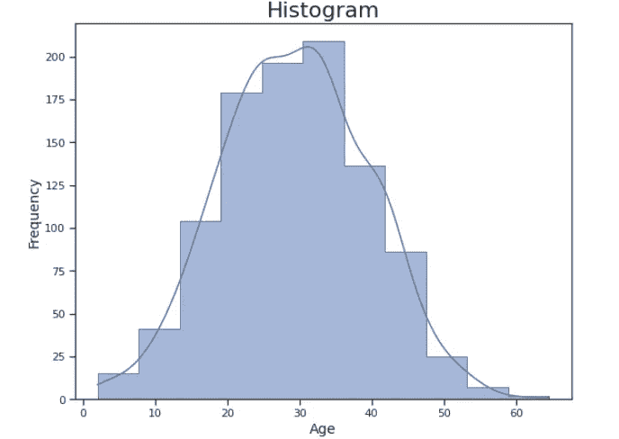

详细的参数调整，可以阅读 [Seaborn](https://seaborn.pydata.org/) 的官方文档。

## Plotly

与我们使用的两个库不同，Plotly 是一个用于动态可视化的 Python 库。以下是如何用 Plotly 创建直方图。

```
fig = px.histogram(x=age)
fig.show()
```

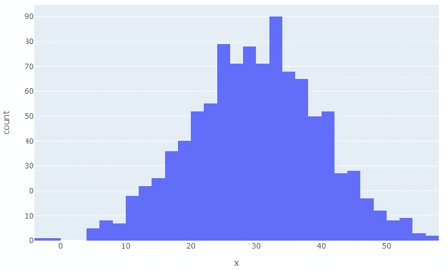

此外，我们可以像以前一样进行一些参数调整。

```
fig = px.histogram(x=age, nbins=15)
fig.update_layout(title = 'Histogram',
                  title_x = 0.48,
                  title_font= dict(size = 24, color = '#7C7C7C' ))
fig.update_xaxes(title= 'Age')
fig.update_yaxes(title= 'Frequency')
fig.show()
```

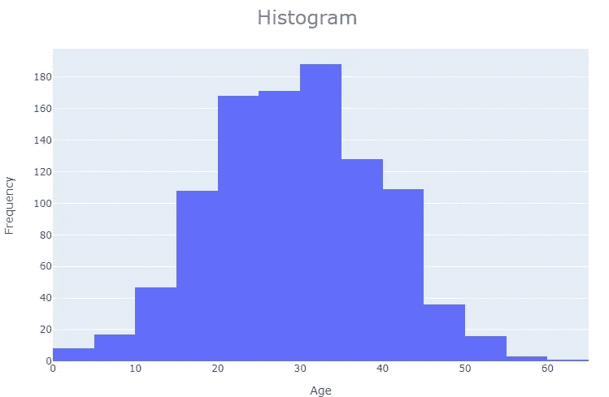

详细的参数调整，可以看 [Plotly](https://plotly.com/python-api-reference/index.html#) 的官方文档。

# 结论

直方图是描述统计的重要组成部分。有了直方图，我们可以回答数据中出现的几个问题，比如我们的数据是如何分布的？我们的数据是如何集中的？还有更多。当我们手工制作直方图时，需要先做一个频数分布表。然而，为了使我们的工作更容易，Python 提供了各种可以帮助我们创建直方图的库，如 Matplotlib、Seaborn 和 Plotly。

# 参考资料:

[1]奥尔钦，C. (2021)。*用数据交流:用数据证明你的观点*。奥莱利媒体。

[2]威尔基，C. (2019)。F *数据可视化的基础:制作信息丰富和引人注目的图表的初级读本*。奥莱利媒体。

[](/mlearning-ai/mlearning-ai-submission-suggestions-b51e2b130bfb) [## Mlearning.ai 提交建议

### 如何成为 Mlearning.ai 上的作家

medium.com](/mlearning-ai/mlearning-ai-submission-suggestions-b51e2b130bfb)