# 关于强化学习你需要知道的一切

> 原文：<https://medium.com/mlearning-ai/everything-you-need-to-know-about-reinforcement-learning-c7c2d333ed7a?source=collection_archive---------0----------------------->

Photo by [Pat Krupa](https://unsplash.com/@patkrupa?utm_source=medium&utm_medium=referral) on [Unsplash](https://unsplash.com?utm_source=medium&utm_medium=referral)

强化学习是教育机器学习模型做出一系列判断的过程。在一个不确定的，可能是复杂的环境中，代理人学习达到一个目标。在强化学习中，人工智能被置于类似游戏的环境中。计算机通过反复试验找到了解决问题的方法。为了说服计算机去做程序员所期望的事情，人工智能会为它所做的行为得到补偿。它的目标是最大化整体报酬。虽然开发人员制定了奖励政策，也就是游戏规则，但他没有向模型提供任何关于如何完成游戏的提示或建议。由模型来发现如何完成工作以最大化回报，从完全随机的试验开始，发展到复杂的策略和超人的能力。

# 强化学习科学

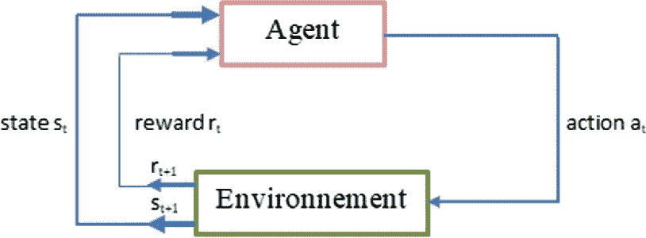

Standard scenario of reinforcement learning

*   **代理**——它是一个虚构的实体，为了获得报酬而在某个环境中行动。
*   **环境(e)** —代理必须处理的情况。
*   **奖励(R)** —为完成特定行动或活动的代理人提供的即时奖励。
*   **状态** — 术语“状态”是指环境所指示的当前情况。

# 强化学习的过程是怎样的？

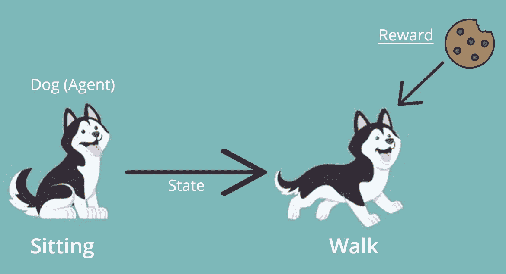

Reinforcement learning example

让我们看一些简单的例子来帮助你理解强化学习机制。考虑训练一只狗新把戏的场景。

*   我们不能指导狗做什么，因为它不理解英语或任何其他人类语言。相反，我们使用不同的方法。
*   我们模拟一种情况，狗试图以各种方式做出反应。如果狗以期望的方式回应，我们会奖励它一份礼物。
*   当狗再次暴露在同样的环境中时，它会更加兴奋地做类似的活动，希望得到额外的奖励(食物)。
*   这类似于狗如何通过有利的经历来学习“做什么”。
*   同时，狗知道当面对不利事件时不应该做什么。

# 强化学习算法

强化学习算法可以通过三种方式实现。

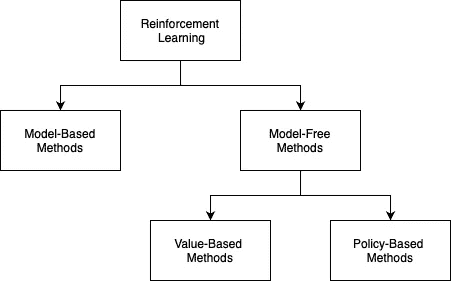

## 基于模型的方法

一种基本方法:如果我们不知道 MDP，我们可以从数据中估计它。代理在环境中行为(根据一些策略)并观察状态、动作和奖励顺序。

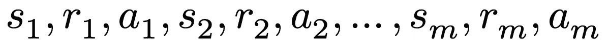

reward sequence

使用计数，创建 MDP 的经验估计值。

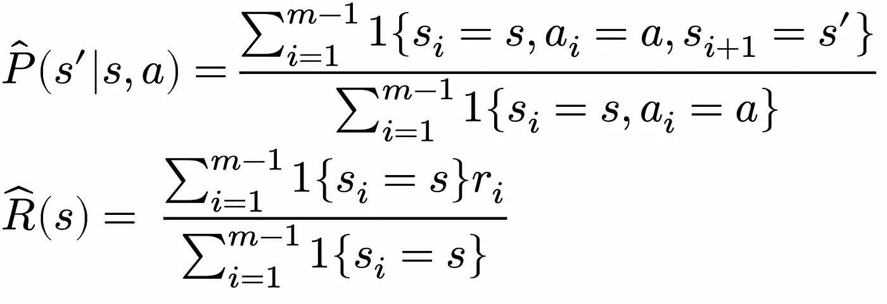

empirical estimate

然后通过例如值迭代求解 MDP M̂ = (𝒮,𝒜,𝑃̂,𝑅̂,𝛾)

## 基于价值的方法

你应该努力在基于价值的强化学习方法中优化价值函数 V(s)。在这个策略中，代理人预期在策略π下的当前状态的长期返回。

## 基于策略的方法

在基于策略的 RL 方法中，你努力设计一个策略，在每个状态下采取的每个行动都有助于你在未来获得最大的回报。

有两种基于策略的方法:

*   确定性的

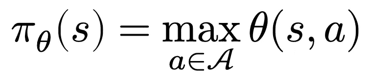

Deterministic

*   随机的

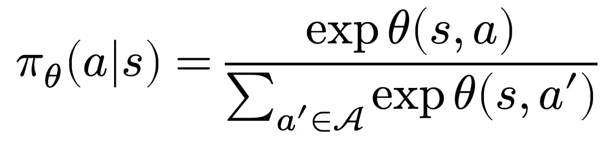

Stochastic

# 强化学习种类

正强化和负强化是强化学习的两种类型。

## 正面强化

当预测的行为模式被证明时，鼓励或添加一些东西以提高相同行为被重复的机会的技术被称为积极强化学习。

例如，如果一个孩子在考试中表现很好，他们可以得到一个冰淇淋作为奖励。

## 负强化

负面强化需要通过消除负面环境来提高特定行为再次发生的可能性。

例如，如果一个孩子考试不及格，他或她可能会因为不能玩电子游戏而受到负面强化。这并不完全是因为考试不及格而惩罚孩子，而是消除可能导致孩子考试不及格的负面情况(在这个例子中，是电子游戏)。

# 强化学习模型

在强化学习中，有两种主要的学习模型。

## 马尔可夫决策过程

马尔可夫决策过程是一个元组

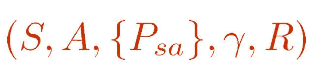

包括:

*   s 是状态的集合。(例如，在自主直升机飞行中，S 可以是所有潜在直升机位置和方向的集合。)
*   是动作的集合。(例如，直升机操纵杆可能被推动的所有可能方向的集合。)
*   状态转移的概率用 Psa 表示。Psa 是跨越每个状态 s ε S 和动作 a ε A 的状态空间的分布。Psa 表示如果我们在状态 a 中执行动作 a，我们将迁移到的状态的分布。
*   γε[0，1]称为 discout 因子。
*   r:s×a→ℝ是奖励函数。(奖励有时也被写成仅是状态 a 的函数，在这种情况下，我们会得到 R : S → ℝ)

用于映射强化学习中的解决方案的数学方法被重构为马尔可夫决策过程或 MDP。

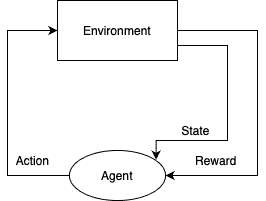

## q 学习

Q-learning 是一种用于时间差分学习的非策略 RL 算法。时间差异学习方法比较时间上连续的预测。它学习值函数 Q (S，a)，该函数描述了在给定状态“S”下执行动作“a”有多好

贝尔曼方程可以用来计算 Q 学习的值。考虑下面的贝尔曼方程:

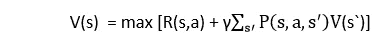

等式中有几个部分，包括奖励、折扣因子(Y)、概率和最终状态 s’。但是，没有提供 Q 值，所以检查下图:

在上图中，我们可以看到一个代理有三个值选项:V(s1)、V(s2)和 V(s3)。因为这里是 MDP，代理只关心当前和未来的状态。因为代理可以向任何方向行走(向上、向左或向右)，所以他必须选择最佳路径。在这种情况下，代理将根据概率进行移动并修改状态。然而，如果我们想要任何精确的运动，我们必须在 Q 值方面做一些改变。考虑下面的图像:

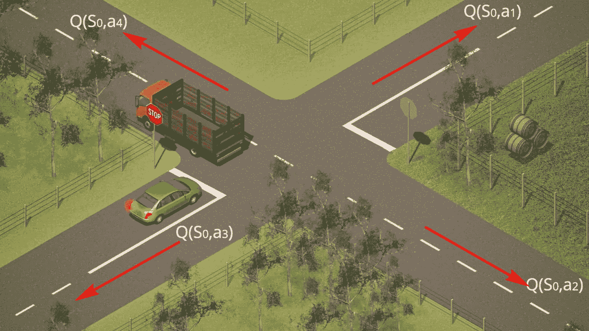

代表每个州的表演质量水平。因此，我们将使用一对状态和动作，即 Q. (s，a)，而不是在每个状态使用一个值。Q 值描述了哪些动作比其他动作更具润滑性，代理人根据最佳 Q 值做出下一步行动。可以使用贝尔曼方程来计算 Q 值。

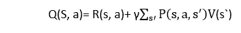

因此，我们可以说，***V(s)= max【Q(s，a)】***

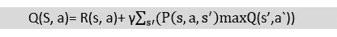

**下面的流程图展示了 Q-learning 是如何工作的:**

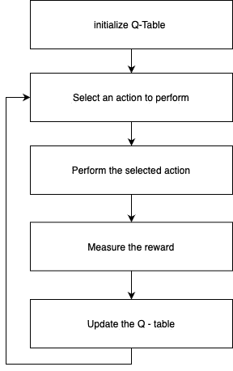

# 强化学习和监督学习有什么区别？

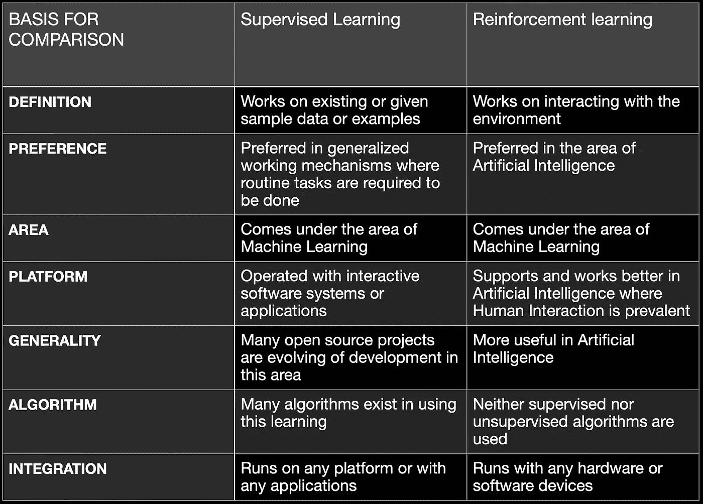

# 强化学习的应用

*   [自动驾驶汽车](https://arxiv.org/pdf/2002.00444.pdf)
*   [交易和金融](https://arxiv.org/ftp/arxiv/papers/1803/1803.03916.pdf)
*   [自然语言处理](https://www.researchgate.net/publication/318740604_Coarse-to-Fine_Question_Answering_for_Long_Documents)
*   医疗保健([动态治疗方案(DTRs](https://arxiv.org/pdf/1908.08796.pdf) )
*   [工程](https://engineering.fb.com/2018/11/01/ml-applications/horizon/)
*   [新闻推荐](http://www.personal.psu.edu/~gjz5038/paper/www2018_reinforceRec/www2018_reinforceRec.pdf)
*   [机器人操纵](https://ai.googleblog.com/2018/06/scalable-deep-reinforcement-learning.html)

# 结论

强化学习解决了具有很少或没有数据的自主代理学习控制方法的困难。因为收集和标记大量样本模式的成本高于数据本身，所以 RL 算法在机器学习中很有用。RL 总是在学习，所以它在手头的任务上成长得越来越好。在监督学习下，学习一个国际象棋游戏可能是一项耗时的工作，但 RL 在同样的工作上工作很快。在这种情况下，以最大化长期回报为目的尝试一项任务的试错策略可以产生更好的结果。马尔可夫决策过程的动态规划技术与强化学习(MDP)密切相关。

 [## ravindu kavishwara - CTF 球员-黑盒子| LinkedIn

### 我想象有一天我们生活在一个一切都自动化的社会。人工智能处理一切。我…

www.linkedin.com](https://www.linkedin.com/in/rkavishwara/)