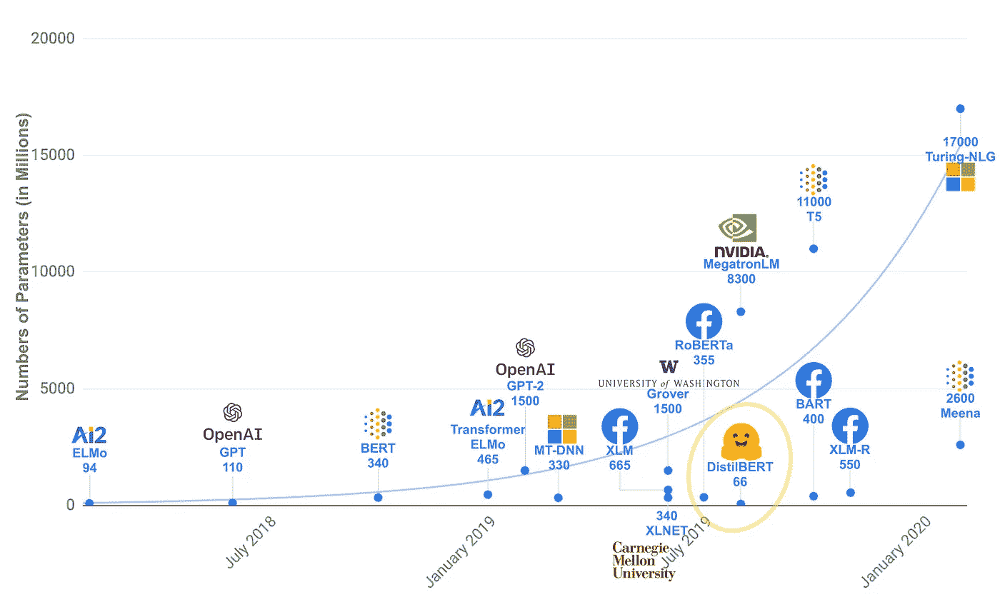
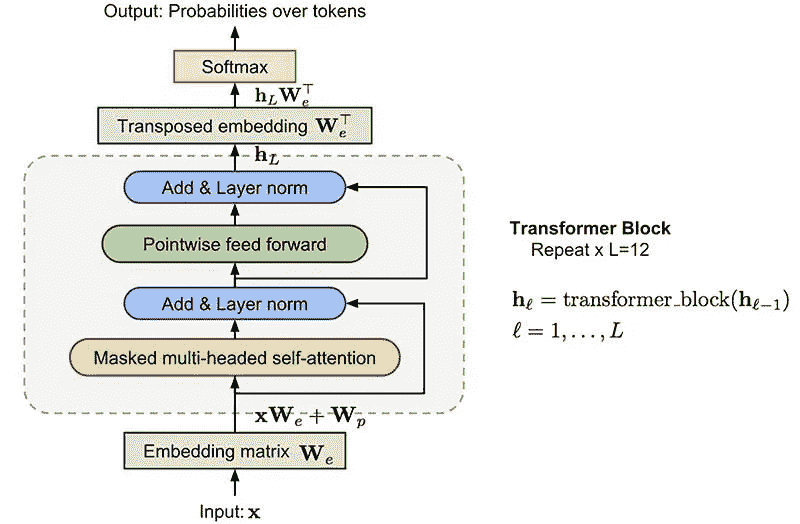
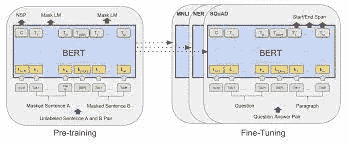
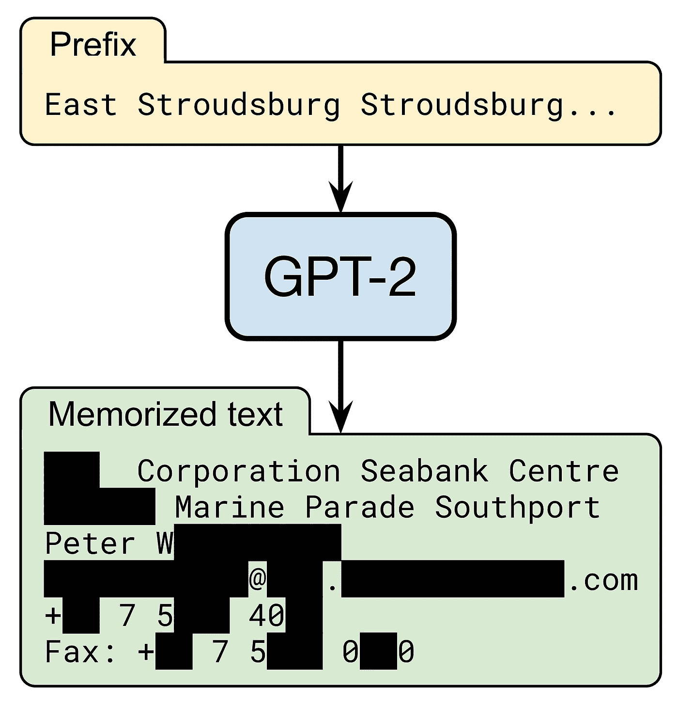

# 变压器的发展——第一部分

> 原文：<https://medium.com/mlearning-ai/evolution-of-transformers-part-1-faac3f19d780?source=collection_archive---------2----------------------->

Photo by [Samule Sun](https://unsplash.com/@samule?utm_source=medium&utm_medium=referral) on [Unsplash](https://unsplash.com?utm_source=medium&utm_medium=referral)

# 介绍

从 1956 年人工智能这个术语首次被创造出来开始，到今天，它已经被应用于各个领域，经历了一段漫长的旅程。深度学习正在慢慢超越机器学习，成为大多数涉及人工智能的任务的首选方法，引领这一演变的模型是变形金刚。

这将是一个由 3 篇文章组成的系列，将介绍自 2017 年第一台变压器开发以来，许多研究人员在过去 5 年中开发的一些开创性的变压器模型。

Evolution of Transformers. Courtesy: [HuggingFace](https://huggingface.co)

我们将简要回顾变压器和 4 种变压器架构，它们是在本部分变压器之后介绍的。

注意:在我们开始之前，让我们看看哪些任务由哪些模型执行。

1.  仅编码器模型:它们可以用于需要理解输入的任务，比如情感分析。
2.  纯解码器模式:它们可以用于需要生成文本的任务，比如写故事。
3.  编码器-解码器模型或序列到序列模型:它们用于必须从输入中生成文本的任务，例如摘要。

# 谷歌的变形金刚

上映日期:2017 年 6 月 12 日

[Transformers Architecture](https://arxiv.org/abs/1706.03762). Courtesy: [StackExchange](https://stats.stackexchange.com/questions/512242/why-does-transformer-has-such-a-complex-architecture)

变形金刚是一种革命性的模型，由谷歌研究人员在 2017 年在论文“[注意力是你所需要的全部](https://arxiv.org/abs/1706.03762)”中推出。变形金刚主要用于 NLP 任务。它们在以下方面不同于递归神经网络:

1.  rnn 接收顺序数据。例如，如果我的输入是一个句子，RNNs 将一次取一个单词作为输入。这不是变压器的情况，因为它们是非顺序的。他们可以把句子的所有单词作为输入。
2.  让变形金刚更特别的是注意力机制。正是由于这种注意机制，变形金刚才能够理解上下文并获取过去的信息。rnn 只能在一定程度上访问过去的信息，大多数情况下只能访问以前的状态。信息会在下一个状态中丢失。
3.  位置嵌入:转换器用它来存储单词在句子中的位置信息。

这些就是《变形金刚》迅速流行起来的原因。在所有的 NLP 任务中，变形金刚都超过了 RNNs。这就是为什么理解这种架构及其在过去 5 年中的演变非常重要。

# 开放的 GPT

上映日期:2018 年 6 月 11 日

[GPT](https://s3-us-west-2.amazonaws.com/openai-assets/research-covers/language-unsupervised/language_understanding_paper.pdf) Architecture. Courtesy: [OpenAI](https://openai.com/)

伙计，GPT 最近几年也有自己的发展。没有比 GPT 更好的模型来开始谈论变形金刚了。GPT 主张生殖预训练。它引入了无监督学习的概念，作为预训练和监督学习，用于微调，现在许多变压器广泛使用。

它在由 7000 本未出版书籍组成的书籍语料库数据集上进行训练。GPT 的架构由 12 个解码器堆叠在一起，这意味着它是一个只有解码器的模型。GPT-1 包含 1.17 亿个参数，与今天开发的变形金刚相比是个小数目！它是单向的，因为它由解码器组成。解码器屏蔽当前标记右侧的标记。它一次生成一个令牌，并将该输出作为下一个时间步长的输入。GPT 只是变形金刚时代的开始。前方的路更加迷人！

# 由谷歌伯特

上映日期:2018 年 10 月 11 日

[BERT](https://arxiv.org/abs/1810.04805) Architecture. Courtesy: [Stanford](https://nlp.stanford.edu/seminar/details/jdevlin.pdf)

BERT 代表来自变压器的双向编码器表示。顾名思义，BERT 是一个双向模型。注意机制能够关注当前令牌的两个方向，左和右。这是因为 BERT 是由 12 个编码器堆叠在一起制成的，这意味着它是一个只有编码器的模型。编码器可以将完整的句子作为输入，因此可以引用句子中的任何单词来执行任务。

BERT 由 1.1 亿个参数组成。像 GPT 一样，它被训练完成一项特定的任务，并可以针对其他任务进行微调。它以一种特殊的方式被预先训练过。简而言之，用来预先训练伯特的任务就是填空。

# OpenAI 的 GPT-2

上映日期:2019 年 2 月 14 日

[GPT-2](https://cdn.openai.com/better-language-models/language_models_are_unsupervised_multitask_learners.pdf) Example. Courtesy: [BAIR](https://bair.berkeley.edu/blog/2020/12/20/lmmem/)

GPT-2，顾名思义，是 GPT 的下一个版本。像 GPT 一样，GPT-2 Large 由 48 个解码器堆叠在一起，使它成为一个只有解码器的模型。它由 15 亿个参数组成。它被训练的任务是根据前面的单词预测句子中的下一个单词。它是在 800 万个网页的数据集上训练的！

# 脸书的罗伯塔

上映日期:2019 年 7 月 26 日

[RoBERTa 代表稳健优化的 BERT 预训练方法](https://arxiv.org/abs/1907.11692)。罗伯塔和伯特的建筑很相似。现在你可能想知道，它和伯特有什么不同？嗯，脸书的研究人员优化了 BERT 的超参数，以在 [MNLI](https://cims.nyu.edu/~sbowman/multinli/) 、 [QNLI](https://paperswithcode.com/dataset/qnli) 、 [RTE](https://paperswithcode.com/dataset/rte) 、S [TS-B](https://paperswithcode.com/dataset/sts-benchmark) 、 [GLUE](https://paperswithcode.com/dataset/glue) 和 [RACE](https://www.cs.cmu.edu/~glai1/data/race/) 任务中取得最先进的结果。

它删除了 BERT 的下一句话预训练目标，用更大的小批量和学习率训练它，还改变了掩蔽模式。它的训练数据也比 BERT 多。它在现有的未标注的 NLP 数据集以及 CC-News 上进行训练，CC-News 是一个从公共新闻文章中提取的新集合。

# 结论

正如我们所看到的，许多研究人员在 Transformer 发布后的最初方法是将编码器和解码器架构分开，并将它们堆叠起来，以创建一个全新的架构，能够比原始 Transformer 模型更好地执行某些 NLP 任务。我们谈到的另一个重要方面是用于预训练的无监督学习方法，然后是用于微调模型的监督学习。

Photo by [Etienne Girardet](https://unsplash.com/@etiennegirardet?utm_source=medium&utm_medium=referral) on [Unsplash](https://unsplash.com?utm_source=medium&utm_medium=referral)

在下一部分，我们将看到 2019-2021 年该领域的一些关键发展。下一部分的链接将在本文发布后立即更新。再见，敬请期待！

# 参考

[1]祖海卜·阿赫塔尔，[GPT 车型介绍](https://iq.opengenus.org/introduction-to-gpt-models/#:~:text=First%20was%20with%20117%20million,parameters%20(GPT%2D2).)

[2] Jacob Devlin，Chang Ming-Wei，[开源 BERT:自然语言处理的最先进的预培训](http://ai.googleblog.com/2018/11/open-sourcing-bert-state-of-art-pre.html)

[3]亚历克·拉德福德，杰弗里·吴，雷文·柴尔德，大卫·栾，达里奥·阿莫代，伊利亚·苏茨基弗，[语言模型是无监督的多任务学习器](https://cdn.openai.com/better-language-models/language_models_are_unsupervised_multitask_learners.pdf)

[4]刘，米莱奥特，纳曼戈亚尔，杜，曼达尔乔希，陈，奥梅尔列维，，卢克塞特勒莫耶，韦塞林斯托扬诺夫，[罗伯塔:一种稳健优化的伯特预训练方法](https://arxiv.org/abs/1907.11692)

 [## Mlearning.ai 提交建议

### 如何成为 Mlearning.ai 上的作家

medium.com](/mlearning-ai/mlearning-ai-submission-suggestions-b51e2b130bfb)