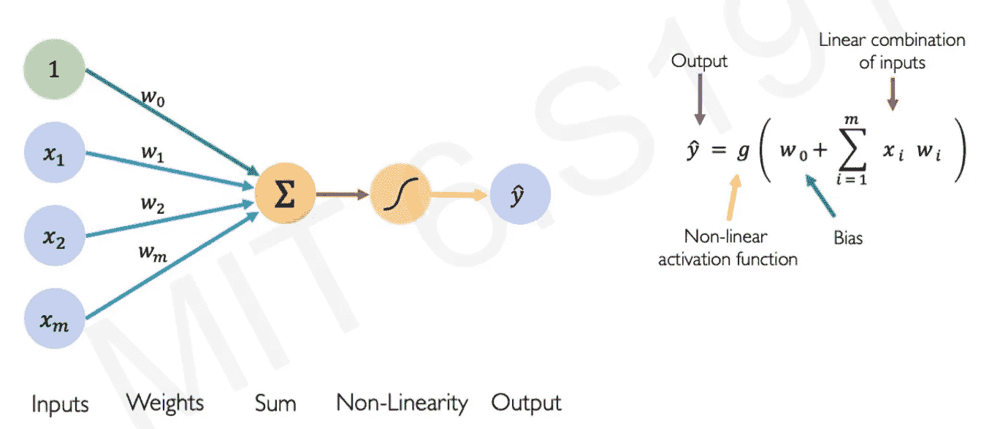
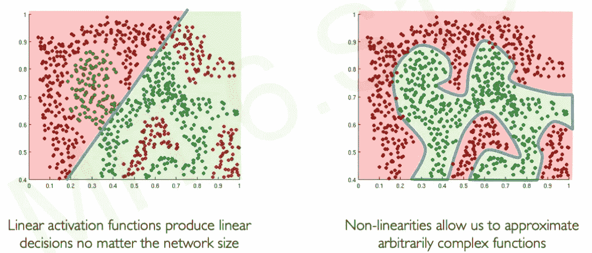
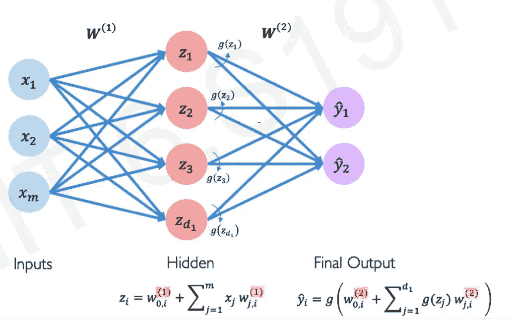
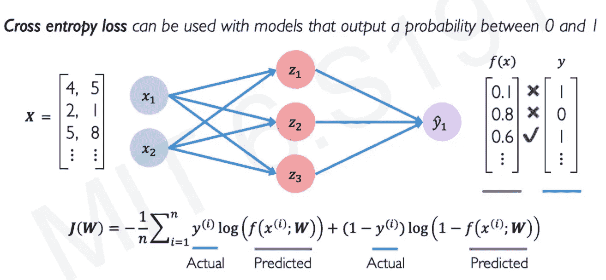
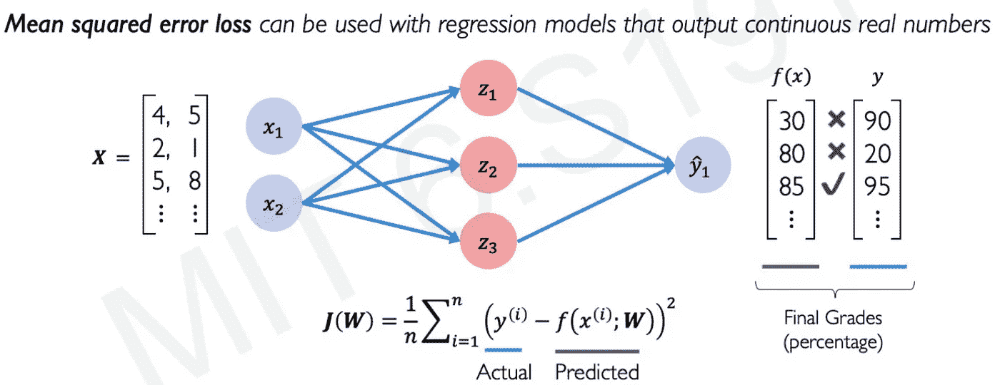
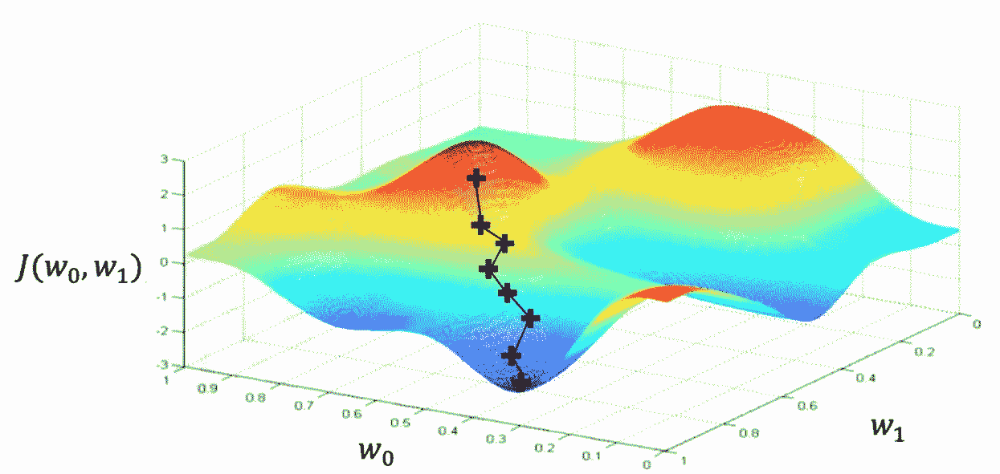
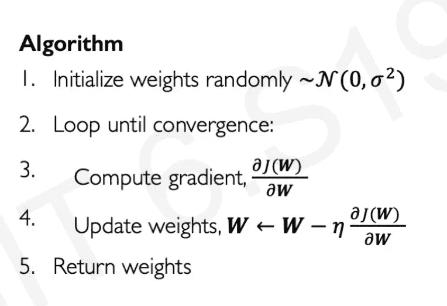
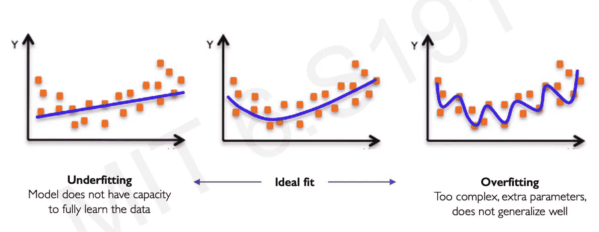
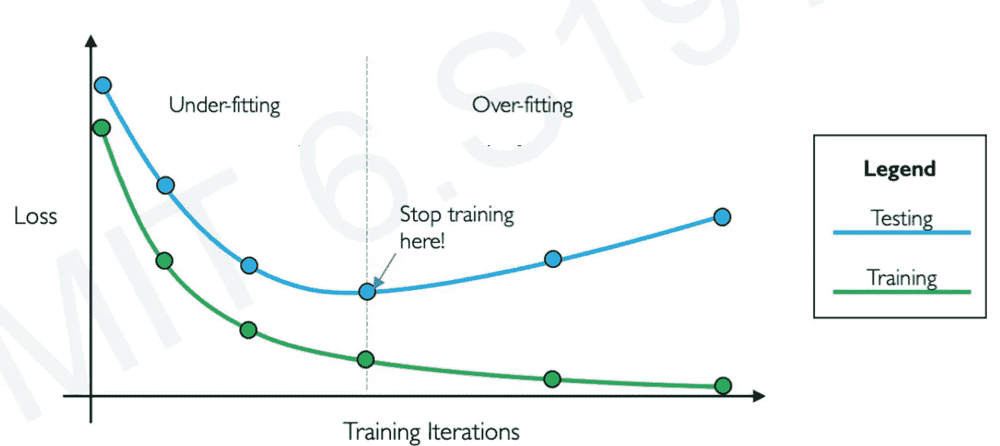

# 像 5 岁小孩一样给我解释:深度学习和神经网络初学者指南

> 原文：<https://medium.com/mlearning-ai/explain-it-to-me-like-a-5-year-old-beginners-guide-to-deep-learning-neural-network-1eb6a979f74?source=collection_archive---------0----------------------->

我是一名具有深度学习和数据科学背景的项目经理。深度学习令人生畏，我正试图让它尽可能直观。如果您认为下面的任何内容需要纠正，请随时联系我或发表评论——我对反馈持开放态度。

我在这里的意图是让理解深度学习变得容易和有趣，而不是数学和全面。我还没有详细解释每件事，但我相信在博客结束时，你将能够理解神经网络是如何工作的，并且你将永远不会忘记它！！！；)

欢迎在 LinkedIn 上与我联系！

# AI vs ML vs 深度学习:

人工智能顾名思义就是给计算机提供智能，类似于人类所拥有的。将人工智能视为一把大伞，由 ANI(人工狭义智能)——面向目标并为单一任务编程，AGI(人工通用智能)——允许机器以与人类无法区分的方式行事，以及 ASI(人工超级智能)——机器比最聪明的人类思维更聪明。

M 机器学习是人工智能的一个子集，在给定数据和算法的情况下，机器会自动训练自己，变得更加智能，无需人工干预。有 3 种类型的最大似然算法——监督的、非监督的和强化的。

eep 学习模仿人类大脑如何运作(因此它有神经元、网络等)。类似于人脑所具有的)。当数据量开始增加时，ML 只能应付到某个点，之后就会饱和。这就是深度学习发挥作用的地方——DL 是一种用于大型数据集的 ML。

感知机如何工作的想法，深度学习的构建模块，早在 1958 年就被发现了，那么为什么当时没有使用 DL，而现在却被广泛使用呢？数据！与运行 DL 算法相比，运行 ML 算法占用的资源要少得多，以我们在 1958 年可用的数据量，我们在 ML 上做得很好。但是随着硬件(GPU 等)的进步。)、软件(新模型、工具箱等。)和数据量的增加—我们正处于需要使用 DL 来提高模型性能的阶段

为了理解 DL 算法是如何工作的，我们首先需要理解感知机是如何工作的。为了简单起见，您可以认为大多数 DL 模型只是混合了多种感知，仅此而已。这就好比如果你理解了数字的含义(即感知器)，那么你就很容易用它们做加法和减法(即 DL 模型)。

# 感知器:

感知器是一种神经网络单元，它执行某些计算来检测输入数据中的特征或商业智能。

**直觉:**考虑你想买房子——你会考虑多个因素，比如位置(x1)、卧室数量(x2)、总面积(x3)、宠物友好(x4)、上班距离(x4)等。有些因素对你来说比其他因素更重要，例如位置和卧室数量，所以你在做决定时会对每个因素给予不同的重视。因此，当你的大脑想要做出中间决定时，它会将这些因素以及重要性考虑在内，并添加一点多年来形成的偏见(例如，如果你整天都在吃白面包，你的大脑会偏向于选择白面包而不是黑面包)。这正是感知器的运作方式。

Fig 1.1 MIT 6.S191

在上图中，您考虑的因素是*输入，*您为每个因素提供的重要性是*权重*，您采取的中间决策只是输入和偏差*(橙色节点)*的线性组合。

你的大脑和 DL 感知器之间的唯一区别是，你需要应用一个非线性的组成(在 DL 中它被称为激活函数)来将你的中间决策转换为最终决策。为什么非线性和非线性？看下面的图表

Fig 1.2 MIT 6.S191

有不同的非线性函数可以应用于你的中间决策——sigmoid、ReLU、双曲线等。，我们稍后会讲到。

总而言之，我们可以说图 1.1 中的最终决策(y)只是应用于你的中间决策(z)的非线性组合(g)——这就是感知器的工作方式，又名**正向传播**

# 神经网络:

难道你不认为与其只有一个中间决策(z)来得出最终决策(y)，不如有多个中间决策(z1，z2，z3，…)来帮助你做出最终决策(y)更容易吗？我们刚刚描述了单个神经网络。多个中间决策的集合在 DL 行话中被称为“隐藏层”

Fig 2.1 MIT 6.S191

在上面的例子中，他们已经使用隐藏层吐出两个决定(y1 和 y2)，你也可以有一个决定。

## 应用神经网络:

**直觉:**我们举一个简单的吉他调音的例子。假设你想调 E 和弦——你拨动琴弦，检查它是否与 E 和弦匹配。如果你觉得你的 E 和弦听起来和它应该听起来的差别很大，那么你拧紧或松开旋钮，让琴弦听起来更接近 E 和弦。在几次拧紧和松开旋钮的尝试之后，你找到了达到 E 和弦的完美平衡——这就是你的大脑的工作方式，也正是神经网络的工作方式。

在神经网络的情况下，考虑拨弦的动作为*输入*，旋钮为*权重。*因此，我们通过以下方式启动神经网络

*   **第一步:**给出输入(拨弦)并计算**经验损耗**(了解它应该听起来和听起来的区别)，
*   **第二步:**基于损失，我们调整权重(旋钮)。

这个过程也被称为**反向传播**

## 步骤 1:计算经验损失

这是经验损失的计算方法:

Fig 2.2 MIT 6.S191

所以如果你看到，这主要是你的模型给出的和它应该给出的不同。正如我们所知，我们可以预期不同类型的输出:二进制(0/1)或连续实数，有不同的方法来计算它们的损失(见下文)

**二进制输出的交叉熵损失:**

Fig 2.3 MIT 6.S191

**连续数字输出的均方误差:**

Fig 2.4 MIT 6.S191

## 第二步:优化我们的损失

如上所述，现在我们有了损失，我们将需要调整我们的权重(旋钮)来降低损失——这个过程被称为“损失优化”。
为了降低损失，我们使用了**【梯度下降】**算法。

很简单:

*   你首先要了解你目前所处的位置。
*   然后你对损失函数求导，也就是**计算梯度**——你会问为什么要求导？如果你想最大化你的损失，求导会给你指明方向。等等！但是我们不需要把损失降到最低吗？当然，因此在下面的公式中，你会发现导数前面有一个负号。
*   通过使用梯度调整权重，你开始朝着这个方向迈出一小步——步长有多小，由**“学习速率”(见图 2.6 的步骤 4)**定义

Fig 2.5 MIT 6.S191

Fig 2.6 MIT 6.S191

损失函数很难优化，因为很难知道我们需要采取多小的步骤(学习率)。如果太小，你可能会陷入局部极小值，如果太大，你会不断反弹，永远达不到全局极小值。

有多种梯度下降法可以帮助你做到这一点:

*   随机梯度下降
*   圣经》和《古兰经》传统中）亚当（人类第一人的名字
*   阿达德尔塔
*   阿达格拉德
*   RMSProp

# 过度拟合的问题:

Fig 2.7 MIT 6.S191

直觉:假设你即将面临一场考试，有人给你一个题库来修改你的材料。你不去修改，而是把 Q 银行作为唯一的学习来源，试着只学习银行的问题。因此，当你参加考试时，你可能知道 Q 银行中的问题的答案，但无法回答 Q 银行之外但与这些问题有一定关系的问题。这太合身了。

为了解决这个问题，我们有所谓的“**正则化**”——这有助于增加我们的模型对看不见的数据的泛化，在我们的情况下，问题不在 Q Bank 上。不同类型的正则化技术有:

*   **退出** —在训练过程中，随机设置一些激活为 0
*   **提前停止** —一旦测试设备上的损耗开始增加，就停止训练。注意:训练集的损失永远不会增加(见图 2.8)

Fig 2.8 MIT 6.S191

# 总结:

1.  分配随机权重
2.  得到最初的预测
3.  计算损失
4.  尝试优化损失:使用 SGD，Adam，Adaboost
5.  避免过度拟合:正则化-退出，提前停止

学分:麻省理工学院开放式课程，Simplillearn