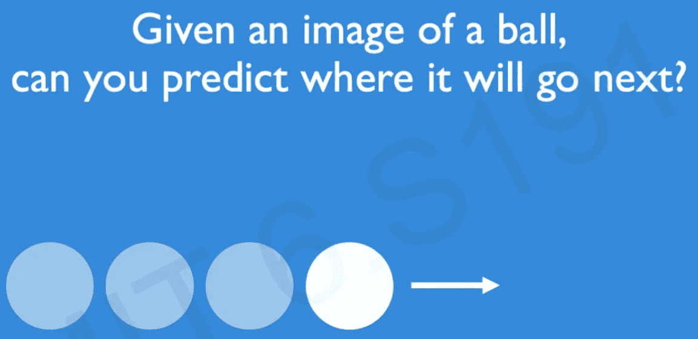
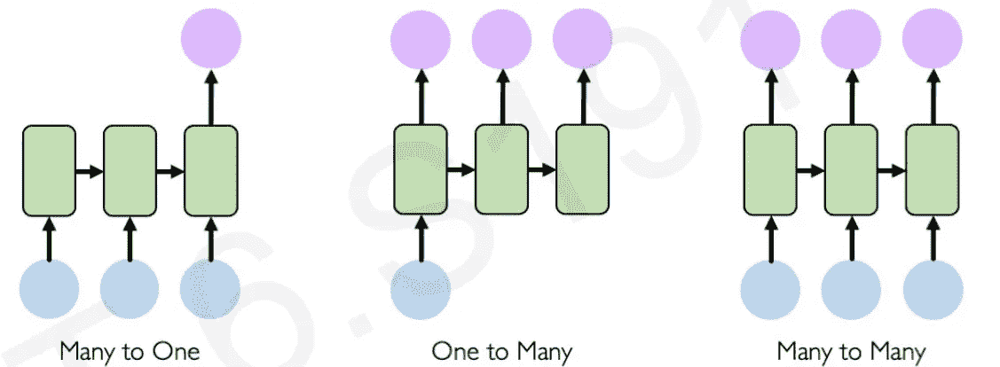
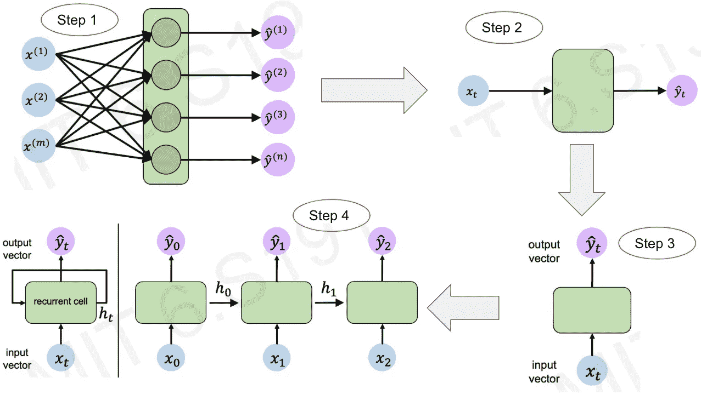
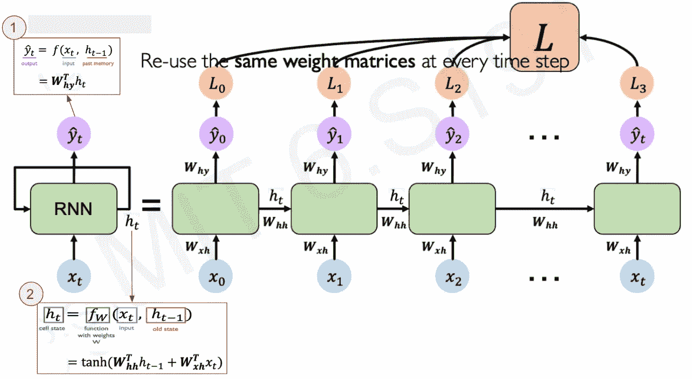
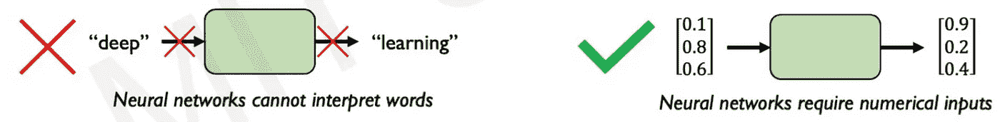
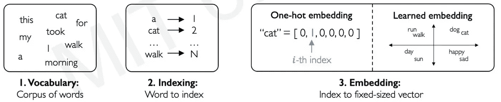
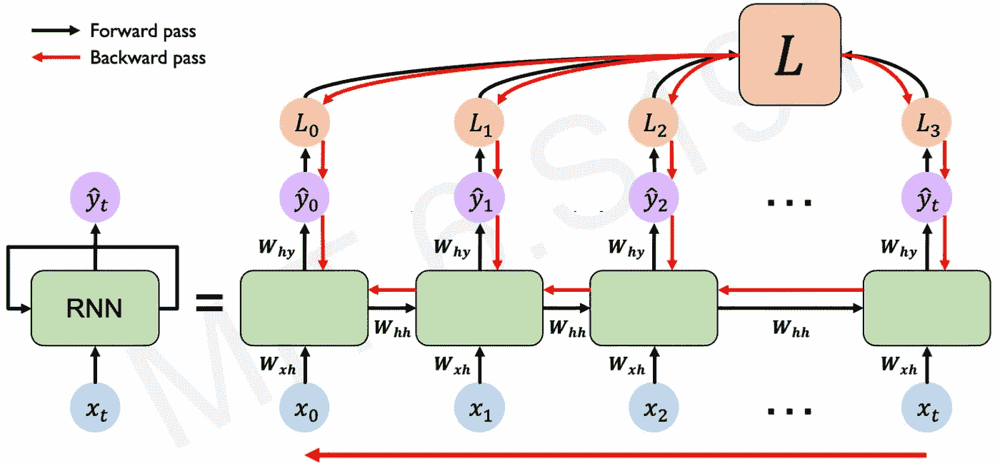
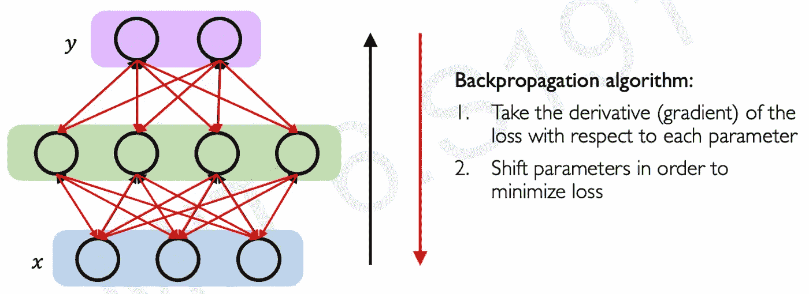
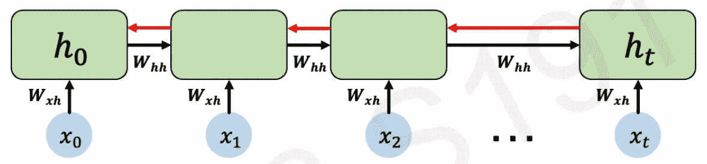

# 像 5 岁小孩一样给我解释一下:深度序列建模

> 原文：<https://medium.com/mlearning-ai/explain-it-to-me-like-a-5-year-old-deep-sequence-modeling-introduction-to-recurrent-neural-beb2ee02bc6c?source=collection_archive---------1----------------------->

## 递归神经网络导论:第 1/2 部分

Photo by [Maximalfocus](https://unsplash.com/@maximalfocus?utm_source=medium&utm_medium=referral) on [Unsplash](https://unsplash.com?utm_source=medium&utm_medium=referral)

我是一个产品经理，有一些深度学习和数据科学的背景。深度学习令人生畏，我正试图让它尽可能直观。如果您认为下面的任何内容需要纠正，请随时联系我或发表评论-我欢迎反馈。

我在这里的意图是让理解深度学习变得容易和有趣，而不是数学和全面。我还没有详细解释每件事，但我相信在博客结束时，你将能够理解神经网络是如何工作的，并且你将永远不会忘记它！！！；)

请留意 ***直觉*** 部分，它提供了对深度学习的真实类比

欢迎在 [LinkedIn](https://www.linkedin.com/in/ameya-shanbhag/) 上联系我！

# 为什么我们需要深度序列建模？

我们在前面[研究的](/mlearning-ai/explain-it-to-me-like-a-5-year-old-beginners-guide-to-deep-learning-neural-network-1eb6a979f74)，是如何使用前馈和反向传播机制将神经网络用于预测。如果你注意到，我们举了一个例子，使用多个因素，如位置，卧室数量，总面积，宠物友好，工作距离等来预测房子的价格。在这个例子中，我们正在计算一个特定时间戳的房屋价格——主要我们的输入是这样的(纽约，3，1200，是的，20 分钟),我们的输出是$4000000。正如您所观察到的，输入是从一个特定的时间戳开始的。

另一个例子——就像给你一张球的图片，然后问它下一步会去哪里？它可以去任何方向。但是如果我给你球的轨迹，然后问你它下一步会去哪里呢？你的大脑会把球过去的轨迹联系起来，并给你一种直觉，告诉你球会向右移动(图 1.1)

Fig 1.1 MIT 6.S191

当您的模型必须记住跨不同时间戳的信息，了解它们之间的关系，然后预测下一步最佳行动时，可以使用深度序列模型。
深度层序模型的少数应用:

*   股票预测
*   医学诊断学
*   气候变化
*   自动驾驶等。

## **深度层序模型类型:**

Fig 1.2 MIT 6.S191

1.  **多对一** 
2.  **一对多:** 
3.  **多对多:** 一种模型，在这种模型中，你的网络被输入多个输入，并被期望输出可变长度的值，例如机器翻译(你给你的模型一个英语句子，你的模型将把它翻译成法语)

## 设计序列模型:

要设计序列模型，我们需要:

1.  处理可变长度序列
2.  跟踪长期依赖关系
3.  维护订单信息
4.  在序列中共享参数

递归神经网络满足这些序列建模设计标准

# 递归神经网络；

Fig 2.1 MIT 6.S191

尽管上面的图表看起来令人望而生畏，但它是最简单的图表，也是理解 rnn 如何工作所需要知道的一切。让我来分解一下..

**第一步:基本神经网络:**我们设计了一个基本神经网络，看起来就像我们上一篇文章中第一步所示的一样[这里](/mlearning-ai/explain-it-to-me-like-a-5-year-old-beginners-guide-to-deep-learning-neural-network-1eb6a979f74)——你可以把输入(x1，x2，x3)看作(location，sq。英尺和房屋类型)并输出(y1，y2，y3，y4)作为(价格，安全状态，评估值，它能容纳的人数)

**步骤 2:简化基本神经网络:**为了简单起见，让我们将所有输入(x1，x2，x3..)转换为一个变量 x(t)，我们可以称之为时间戳 t 处的*输入。*让我们通过用一个绿框来替换隐藏层来消除绘制隐藏层的复杂性，并让我们将所有输出合并为一个变量 y(t)，我们可以*称之为时间戳 t 处的输出*。我们在这里所做的只是将输入和输出结合起来，这样看起来很简单。

**第三步:将它颠倒过来:**同样，我们仍然有来自第二步的简化的 NN(神经网络),这里我们只是将它颠倒过来。

**第四步:多个 nn:**这是好玩的部分。考虑将步骤 3 中的多个神经网络并排堆叠，并用一根细绳连接起来——就这样，您设计了一个 RNN。顾名思义，有一个由字符串连接的 nn 的循环流，我们称之为**“状态”(h)。**在上图中，将 y0 和 y1 视为特定时间戳 t 的中间输出，将 y2 视为最终输出。RNNs 也可以用步骤 4 中垂直线左边的图来描绘。

***直觉*** *:* 考虑一场接力赛，通常有一个 4-5 人的团队，每个人站在不同的检查站。第一个开始比赛的人携带一根接力棒，一旦他们在检查站相遇，他/她必须将接力棒传给另一名队员，并最终带着接力棒完成比赛。就 RNN 而言，你可以考虑

*   作为神经网络的参与者(x)
*   作为国家传递的接力棒(h)
*   接力棒作为中间输出(y0，y1)传递后，一个游戏者停止，另一个游戏者开始
*   作为预测输出完成比赛(y2)

## RNN 背后的简单数学:

我知道我强调了不要使用方程，但我在这里包含方程的唯一原因是它们很容易，并且我们已经发展了我们需要提出这些方程的直觉——我保证所有的方程都是直觉的。让我解释一下！

Fig 2.2 MIT 6.S191

该图与图 2.1 相同，只是多了一些符号:

*   输入向量 x(t)
    这是一个由你的输入组成的法向量——这里没什么特别的
*   **权重**
    **W(xh)** - >用于以隐藏状态可消费的方式转换输入的权重
    **W(hh)** - >定义前一隐藏状态和当前隐藏状态之间的关系的权重
    **W(yh)** - >用于将隐藏状态输出转换为基于预测的输出的权重。
*   **隐藏状态 h(t)**
    你还记得接力赛中接力棒在选手间传递的例子——这就是隐藏状态的作用。当你从一个神经网络移动到另一个神经网络时，隐藏状态从当前神经网络获取所有信息并传递，以便下一个神经网络在预测某事时知道上下文是什么。图表中的等式#2 表示，隐藏状态(h(t))是该 NN (x(t))和先前隐藏状态(h(t-1))的输入的参数化函数，这里输入有助于理解要预测什么，先前隐藏状态为您的 NN 提供了一些关于模型中正在发生的任何事情的上下文。参数化仅仅意味着它们是使用权重矩阵定义的(如上所述)。
    该函数可以是任何非线性函数——这与我们在这里[谈到的概念相同](/mlearning-ai/explain-it-to-me-like-a-5-year-old-beginners-guide-to-deep-learning-neural-network-1eb6a979f74)关于应用于您决策的构成。在上图中，使用的非线性函数是 *tanh* ，也称为双曲线激活函数。
    注意:在每个时间步使用相同的函数和参数集。rnn 有一个状态 h(t ),当序列被处理时，它在每个时间步被更新
*   **输出向量 y(t)**
    输出向量除了使用当前隐藏状态(h(t))和 W(hy)之外什么都不是，这基本上有助于将隐藏状态转换为输出预测值，如等式#1 所示。
*   **损失函数(L，L0，L1，L2 等..)**
    与任何模型一样，你需要将损失最小化，以便你的模型表现得更好，这基本上意味着从你的错误中学习。L0、L1、L2 等。图中所示为每一阶段计算的损耗，相加后计算出 L，然后我们的任务是利用反向传播使最终损耗函数最小化

## 为什么我总是听到对我的输入进行编码？

到目前为止，我们讨论了在我们向模型提供输入之后会发生什么，但是你想过模型是如何吸收输入的吗？我们都知道机器不懂语言，它们懂数字。例如，即使给我的模型输入这个字符串“今天早上我带我的猫去散步了”,模型输出“散步”,在这个可爱的句子下面是一组数字。

Fig 2.3 MIT 6.S191

这就是编码。编码是将字符串转换为机器可理解的数字序列的过程，解码是将数字转换为人类可读字符串的过程

我们如何做到这一点？这很简单—

*   **第一步**:我们首先取一组独特的单词
*   第二步:给每个单词分配一个唯一的号码
*   **步骤 3:** 使用步骤 1 和步骤 2(见下图)以矢量形式表示我们的输入→这一步基本上称为*嵌入*

Fig 2.4 MIT 6.S191

如您所见，上图显示了两种类型的嵌入:一键编码和学习嵌入(只是以矢量化形式表示输入的不同方式)

## 又是反向传播？

可以，但是流程和上一个[这里](/mlearning-ai/explain-it-to-me-like-a-5-year-old-beginners-guide-to-deep-learning-neural-network-1eb6a979f74)完全一样。记住反向传播做了什么的一个简单方法是记住我们作为人类为什么回顾。例如，在一次面试后，我们坐下来回想如果你用不同的方式回答，事情可能会有所不同——基本上了解你的不足之处，并从中吸取教训。这里只需应用相同的概念-反向传播是模型从错误中学习(通过更新权重)并尝试最小化损失的过程。在这种情况下，唯一的区别是，反向传播是通过时间进行的，这意味着损失会反向传播到每个模型，还会跨模型传播，因为它是一个序列模型。

Fig 2.5 MIT 6.S191

## RNN 有问题吗？耶！！

整体而言，反向传播算法的工作原理是通过计算梯度(即最终损失函数相对于每个参数的导数)，然后移动参数以最小化损失

Fig 2.6 MIT 6.S191

下面是图 2.6 的简化版本:

Fig 2.7 MIT 6.S191

想象一下计算梯度(损失函数的导数)w.r.t h0 ->这将涉及 W(hh)的许多因素以及在每个神经网络处的重复梯度计算

*:记得玩一个聚会游戏，一个人向旁边的人耳语一个消息，然后这个故事被逐步传递给其他几个人，随着游戏的进行，错误会不断积累。这个游戏的重点是从最后一个玩家所听到的故事中获得娱乐，这通常与原来的故事完全不同。这正是 RNNs 的情况——在向后传播时计算梯度变得很困难，因为当我们向后传播时有可能丢失信息*

***RNNs 面临的挑战:***

1.  ***爆炸梯度:当许多梯度值为> 1**
    时，当较大的误差梯度累积并导致训练期间神经网络模型权重的非常大的更新时发生。在训练期间使用梯度来更新网络权重，并且当这些更新小且受控时效果最佳。当梯度的幅度累积时，可能会出现不稳定的网络，这可能会导致不良的预测结果，甚至是报告任何有用信息的模型。有一些方法可以修复爆炸渐变，其中包括[渐变裁剪](https://deepai.org/machine-learning-glossary-and-terms/gradient-clipping)和权重正则化等。*
2.  ***消失梯度:当许多梯度值为<1
    1**时，由于梯度控制网络在训练期间学习的程度，如果梯度非常小或为零，则很少或没有训练发生，从而导致较差的预测性能。这也导致捕获短期依赖而不是长期依赖。
    **潜在方案:**
    1。**激活功能:**当 x > 0
    2 时，使用 ReLU 防止渐变收缩。**参数初始化:**将权重初始化为单位矩阵并偏向零——防止权重收缩为零
    3。**门控细胞:**在我们之前的图表中遇到的绿框中，使用一些逻辑(即门控细胞)来控制通过的信息。基于门控单元中使用的逻辑，我们将它们分类为 LSTMs、gru 等。*

*那都是乡亲们！在下一部分，我们将讨论 LSTMs 和注意力模型！*

*请随意跳转到艾娃的 https://www.youtube.com/watch?v=qjrad0V0uJE 讲座:)*

*一定要看看我的其他帖子，以获得更多关于金融和技术的知识。*

*如果你想让我写一篇关于深度学习的文章，请务必告诉我，我会尽力用更简单的术语解释它。*

*另外，欢迎在评论区提问。会很乐意帮你的:)*

*PS:我用的类比可能不是 100%正确，但用一个更简单的类比很容易理解。*

*学分:麻省理工学院开放课件*