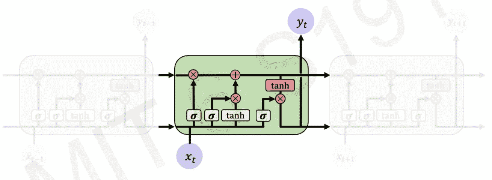
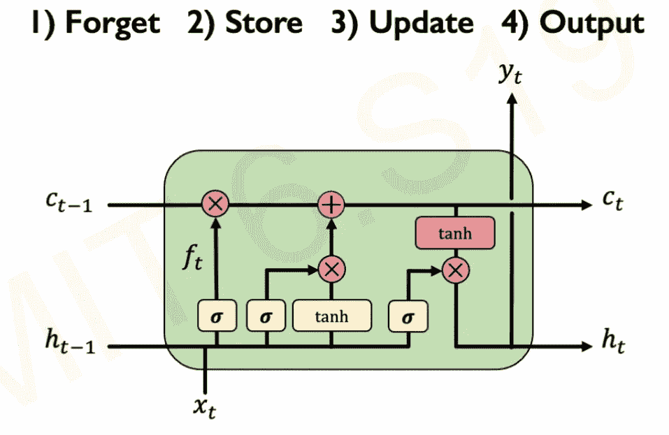
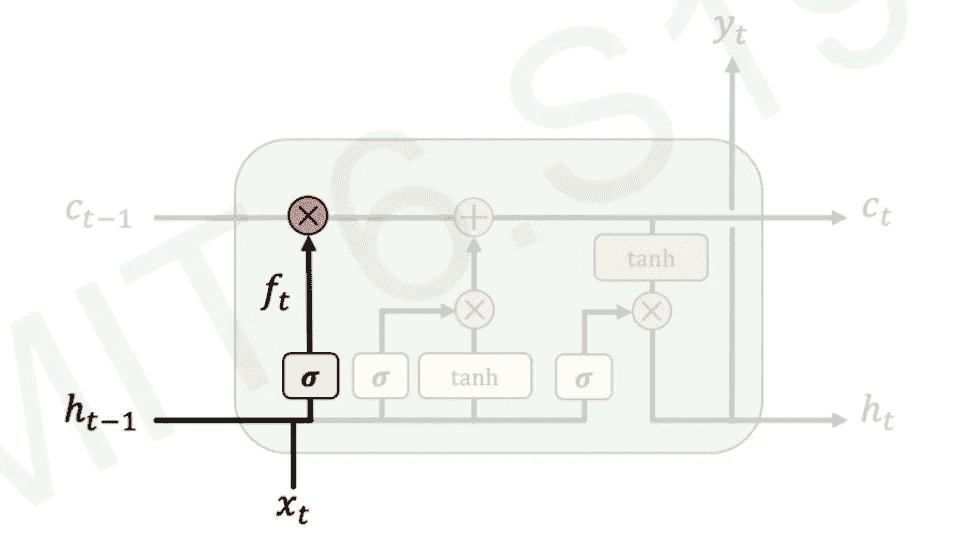
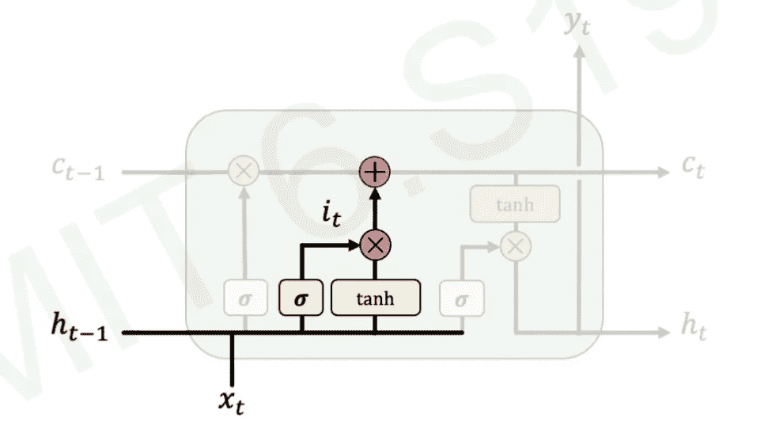
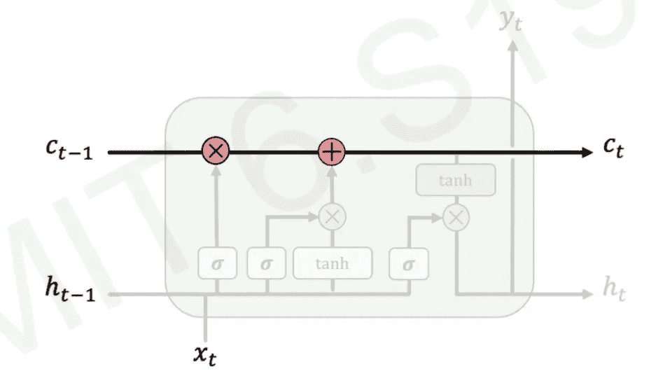
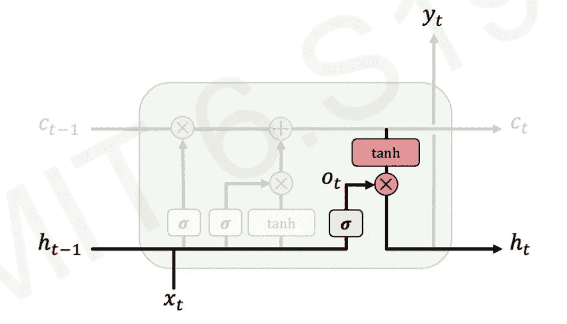
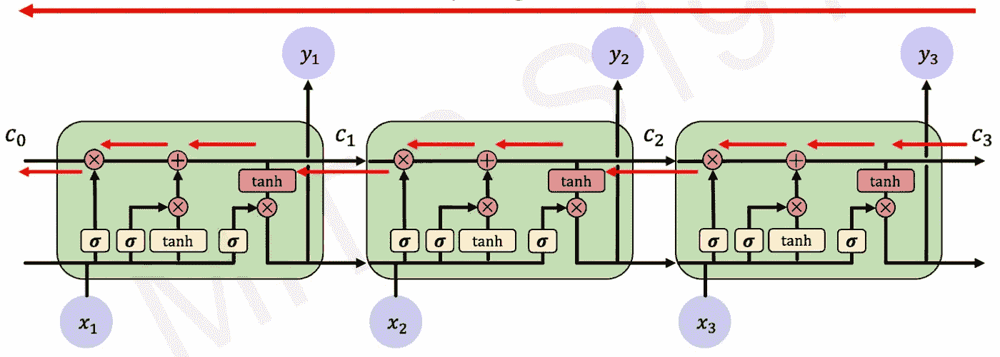
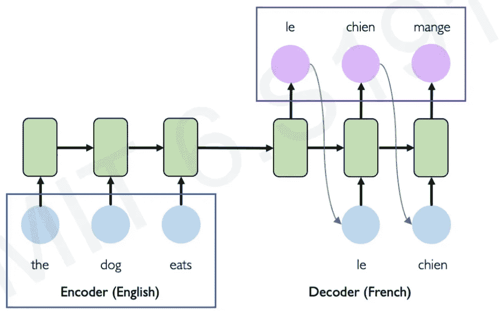
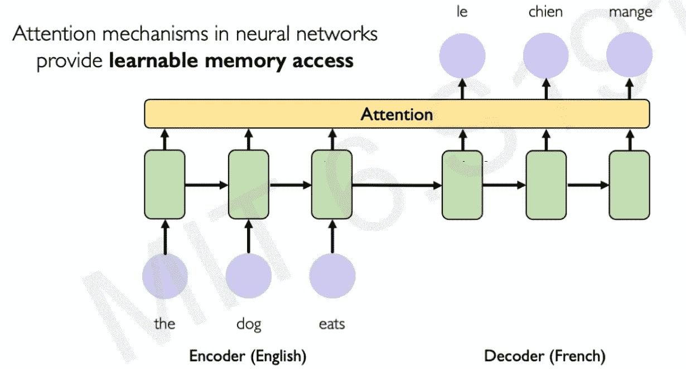

# 像一个 5 岁小孩一样解释给我听:LSTM 和注意力模型介绍——第二部分

> 原文：<https://medium.com/mlearning-ai/explain-it-to-me-like-a-5-year-old-introduction-to-lstm-and-attention-models-part-2-2-16482a58b30b?source=collection_archive---------1----------------------->

我是一个产品经理，有一些深度学习和数据科学的背景。深度学习令人生畏，我正试图让它尽可能直观。如果您认为下面的任何内容需要纠正，请随时联系我或发表评论-我欢迎反馈。

我在这里的意图是让理解深度学习变得容易和有趣，而不是数学和全面。我没有详细解释每件事，但我相信在博客结束时，你将能够理解 LSTM 是如何工作的，并且你将永远不会忘记它！！！；)

欢迎在 LinkedIn 上与我联系！

Photo by [Possessed Photography](https://unsplash.com/@possessedphotography?utm_source=medium&utm_medium=referral) on [Unsplash](https://unsplash.com?utm_source=medium&utm_medium=referral)

# 长短期记忆(LSTM)网络；

正如我们之前在简单 rnn 的情况下看到的，如果 rnn 序列很大，它会导致梯度问题，主要是因为当信息从最后一个 NN 反向传播到第一个 NN 时，在它们的隐藏状态中可能会有一些数据丢失。因此，在处理大句子和记忆大句子的上下文时，这使得简单的 RNNs 不太有效。

Fig 3.1 MIT 6.S191

为了解决这个问题，我们使用 LSTM 网络。它们只不过是简单神经网络的修改版本，但不是使用单个非线性函数和一个隐藏状态来完成所有工作(图 3.1)，我们有多个非线性函数来帮助我们控制信息流和一个隐藏状态(图 3.2)。这样，在反向传播时，隐藏状态就不必做所有的工作

Fig 3.2 MIT 6.S191

LSTM 的信息是在盖茨的帮助下控制的。盖茨有选择地让信息通过。

## LSTMs 是如何工作的？

Fig 3.3 MIT 6.S191

这四个步骤主要体现了每个 LSTM 单元的工作原理:

*   **忘了:**

Fig 3.4 MIT 6.S191

每个细胞从忘记所有与先前状态无关的信息开始。如图所示，先前的隐藏状态和当前输入通过 sigmoid 函数传递，该函数调节应保留多少内容和应保留多少内容(sigmoid 输出 0 或 1)，并将其存储在单元状态(c(t))

*   **店铺**:

Fig 3.5 MIT 6.S191

在这里，我们确定旧信息的哪一部分和新信息的哪一部分相关，并将其存储到单元状态中。

*   **更新**:

Fig 3.6 MIT 6.S191

LSTMs 最关键的部分是它们为单元状态(c(t))及其隐藏状态保持不同的值，该隐藏状态通过这些门选择性地更新。

*   **输出**

Fig 3.6 MIT 6.S191

最后，我们有一个来自 LSTM 的输出，也叫做隐藏状态。输出门控制来自单元状态的多少编码信息应该最终通过其当前隐藏状态流到下一个单元

***关键要点:****lstm 通过维护单元状态和隐藏状态来控制每个单元状态内的信息流，这有助于它们解决消失梯度的问题。*

**lst ms 中的反向传播:**

几分钟前，我们观察到反向传播在简单 RNN 中是一个问题，因为存在梯度消失的风险，我们谈到了 LSTMs 能够帮助解决这个问题。但是怎么做呢？正如我们所看到的，在 LSTM 中有一个隐藏状态和一个细胞状态——反向传播只应用于细胞状态，它使用门控机制选择性地更新，因此我们有一个不间断的梯度流。

Fig 3.7 MIT 6.S191

***直觉*** :基本上你可以把隐藏状态看成城市道路，把单元格状态看成高速公路。所以，如果你想从纽约去波士顿，你是愿意使用需要 9 个小时才能到达波士顿的城市道路，还是使用 4 个小时就能到达波士顿的高速公路？因此 LSTMs 工作得更好，因为它们使用单元状态(高速公路)进行反向传播。

# 注意力模型:

RNNs 的一个有趣的应用是在机器翻译中；把句子从一种语言翻译成另一种语言。

Fig 4.1 MIT 6.S191

在上图中，您可以看到 RNNs 如何用于机器翻译的架构。我们提供给 RNN 的输入使用编码器编码为状态向量，在执行计算之后，状态向量然后使用解码器解码为 RNN 的输出。

但是使用 RNNs 进行机器翻译有几个问题:

*   **编码瓶颈:** 
*   **缓慢的顺序模型:** 由于这是一个顺序模型，因此没有机会进行并行计算，这导致模型的训练时间缓慢
*   **不长记忆:** 我知道我们通过从简单的 RNNs 切换到 LSTM 解决了处理大句的问题，但当涉及到机器翻译时，lstm 很难处理非常长的时间依赖性。

那么，我们如何处理大型文本序列和正文中的这种依赖性呢？立正！

Fig 4.2 MIT 6.S191

不是解码器只能访问编码器的最终状态，而是可以使用 attentions 来授权解码器访问原始句子中每个时间步长之后的状态，并且模型将在整个训练中学习这些向量的权重。神经网络中的注意机制提供了可学习的记忆访问。基本上，模型被训练成只关注那些对输出有很大影响的输入部分。

***直觉*** :如果我问你“你叫什么名字？”你回复说“我的名字是 Ameya”。我住在纽约，喜欢跳舞。我忘了说我姓尚巴格。”因此，模型将给予第一句和最后一句更多的权重(关注)，因为这是更重要的！

那都是乡亲们！

请随意跳转到 https://www.youtube.com/watch?v=qjrad0V0uJE[的艾娃讲座:)](https://www.youtube.com/watch?v=qjrad0V0uJE&ab_channel=AlexanderAmini)

一定要看看我的其他帖子，以获得更多关于金融和技术的知识。

如果你想让我写一篇关于深度学习的文章，请务必告诉我，我会尽力用更简单的术语解释它。另外，欢迎在评论区提问。会很乐意帮你的:)

PS:我用的类比可能不是 100%正确，但用一个更简单的类比很容易理解。

学分:麻省理工学院开放课件