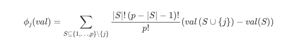
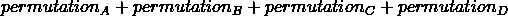
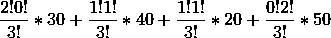
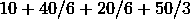
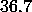

# 可解释技术——Shapley 值

> 原文：<https://medium.com/mlearning-ai/explainability-technique-shapley-value-f69adb363991?source=collection_archive---------3----------------------->

Photo by [GR Stocks](https://unsplash.com/@grstocks?utm_source=medium&utm_medium=referral) on [Unsplash](https://unsplash.com?utm_source=medium&utm_medium=referral)

创建好的模型是我们唯一关心的事情的日子已经一去不复返了。随着易于消费的开源项目和自动化机器学习，我们正在向审计 ML 模型迈进，其中可解释性是一个重要的方面。在这篇文章中，我们将探索一种解释技巧的博弈论方法:Shapley 值。不过，在我们开始这一部分之前，我们将快速绕道了解博弈论的基础知识。

**基本面**

博弈论简单来说就是用数学方法研究逻辑决策者行为的领域。它在多个学科中有着广泛的应用——从解释你的日常现象到揭示巨大规模的问题。博弈论的核心包含三个要素:

*   一款*游戏*
*   *选手*
*   *奖励*

游戏是玩家有一系列选择的情况，每个选择都与回报(和成本)相关联。目标是在给定其他玩家做出的选择的情况下得到最优选择。当然，一个游戏有很多变化，它会很快变得复杂。但是，谈论博弈论不可能不提到**囚徒困境**——这是一个同时非合作博弈的例子，参与者同时做出好的决策。然而，这并不意味着他们必须在 ***确切的*** 同一时间做出这些决定。关键是每个参与者都不能观察到其他人的选择。经典的囚徒困境有以下条件:

*   有两个球员正在接受犯罪审讯
*   每个玩家只有两个选择:要么让*保持沉默，要么让 ***出卖*** 他/她的同伙*
*   *每个行动都有自己的奖励，取决于另一方选择的行动*

*在这种情况下，有四种可能的排列(2):*

*   *两名球员都保持沉默，这将奖励他们一个较轻的判决*
*   *玩家 A 背叛了，玩家 B 保持沉默，这将让玩家 A 获得自由，但玩家 B 必须服刑*
*   *玩家 B 背叛了玩家 A，玩家 A 保持沉默，这将让玩家 B 获得自由，但是玩家 A 必须服刑*
*   *两个球员互相告密，所以他们都会被判重刑*

*最好的情况是双方都保持沉默。但是，互相告密是 **的最佳策略**。假设我们是 a。如果我们选择保持沉默，我们知道 B 会有背叛我们的动机，因为，谁不想无拘无束地把一切都归咎于我们呢？如果我们选择背叛，我们知道从逻辑上讲，B 不会选择保持沉默，因为这意味着我们将自由地将一切都寄托在 B 身上。因此，无论我们选择什么，B 都会背叛我们，因此，我们应该选择背叛。如果我们是 B，同样的分析也可以用。这个最佳策略叫做**纳什均衡(NE)** 。如果没有任何策略激励参与者改变他们的决策，那么这个策略就是无效的。简单来说就是玩家陷入僵局。然而，最佳策略**可能不是**的最佳情况，就像我们的例子一样。在这种情况下，最佳策略不是**帕累托有效**因为嗯，它不是有效的。*

# ***合作游戏—总结***

*既然我们已经讨论了游戏的最基本的例子，我们将增加一个等级的难度——我们将深入合作游戏，在这种情况下，玩家被允许建立联盟以最大化他们的收益。例如，在小组项目中，我们可能会选择与表现最好的学生组成一个小组，以获得更高的分数。然而，既然合作是可能的，就出现了一个问题:*

> *我们如何创建一个解决方案，为所有参与的玩家带来公平的回报？*

*回到小组项目的例子，通常会有同行评议会议，在会议的最后会评估我们对团队的贡献。评估的结果将会被考虑到我们的最终成绩中。因此，在我们的例子中，同行评审确保每个参与者得到公平的回报。但是在其他例子中，事情会变得稍微复杂一些。因此，需要一个通用的解决方案来确保合作博弈中的参与者能够获得公平的收益。该问题的完美解决方案满足四个特征:*

*   **效率*:每个玩家的收益总和应该等于总的可用收益*
*   *对称:对于两个贡献相等的玩家，他们的收益应该是相同的*
*   *虚拟人:对联盟贡献为零的玩家，他/她的收益应该为零*
*   **可加性*:对于一个玩家来说，他/她在不同子游戏中的总收益应该等于他/她在游戏中的总收益*

*而 **Shapley 值**是满足以上所有的**唯一的**解概念:*

**

*Shapley Value*

*直观地说，Shapley 值是一个玩家对联盟所有可能排列的边际贡献的加权平均值。在合作游戏中，玩家组队的顺序很重要。在这种背景下，我们必须考虑两种情况:*

*   *在玩家 *i* 加入之前，团队中现有玩家的排列由阶乘捕获:|S|！*
*   *在玩家 *i* 之后加入队伍的玩家的排列，用阶乘(p -|S|-1)来描述！*

*我们还必须知道特定玩家的边际贡献。举个例子，如果一个团队的总收益是 60，然后当玩家 *i* 加入时收益增加到 100，那么他的边际贡献就是 100 - 60 = 40。让我们用一个例子来帮助我们理解。假设有一个博弈，条件如下:*

*   *有三个玩家:甲、乙和丙*
*   *我们感兴趣的是找到 C 的 Shapley 值*
*   *当{C}加入{A，B}时，他的边际贡献是 30 — **排列 A***
*   *当{C}加入{A}时，他的边际贡献是 40 — **排列 B***
*   *当{C}加入{B}时，他的边际贡献是 20 — **排列 C***
*   *当{C}首先创建自己的团队时，他的边际贡献是 50 — **排列 D***

*当我们只和三个玩家打交道时，对每个玩家来说，我们在六种(3！)来计算 Shapley 值。这是因为有对称性。以排列 A 为例。从 C 的角度来看，是 A 先组队还是 B 先组队并不重要。就他的边际贡献而言，仍将是 30。排列 d 也是如此，A 先加入 C 还是 B 先加入 C 并不重要。他的边际贡献仍将是 50 英镑。通过考虑上述四种排列和公式，C 的 Shapley 值为*

********

# *它和 XAI 有什么联系？*

*XAI 的主要目标之一是解释为什么会做出某些预测，我们可以用以下细节将其转化为一个游戏:*

*   **游戏:确定哪些特征对预测很重要**
*   **玩家:模型训练阶段使用的特征**
*   **奖励:沙普利值**

*我们给功能自由形成联盟和“玩”对彼此。特定预测的最重要特征将是具有最高 Shapley 值的特征。重要的一步是确定馅饼的大小。换句话说，可以在特性之间共享的总收益。在机器学习上下文中，饼图的大小是特定实例的预测和数据集的平均预测之间的**差**。如果您想知道，Shapely Value 对分类和回归用例都有效，并且是模型不可知的。由于其坚实的理论基础，Shapley 值无疑是 ML 可解释性的一个有吸引力的选项。幸运的是，如果您想使用它，已经有一个开源实现:*

* [## 欢迎来到 SHAP 文档- SHAP 最新文档

### SHAP 是一种博弈论的方法来解释任何机器学习模型的输出…

shap.readthedocs.io](https://shap.readthedocs.io/en/latest/index.html) 

# 限制

虽然理论基础是坚实的，但沙普利价值观并不完美。它有自己的一套限制，在某些应用中可能会被关闭。例如，在我以前的工作中，我没有使用 Shapley 值，而是选择简单和可解释的算法，如线性回归和基于树的模型。在这一小节中，我们将探讨它的一些局限性。

## **运算速度慢**

如前所述，Shapely Value 考虑了联盟的所有可能排列。可以想象，这可能是一个瓶颈，尤其是当我们处理具有大量特征的复杂数据时。传统的 Shapley 值计算通常需要指数时间。但是，通过使用基于树的模型来近似 Shapley 值(TreeShap ),已经做出了一些改进。这将计算时间减少到多项式。最近，甚至更快版本的 TreeShap 算法已经被开发出来。我们将不得不看看这些算法是否可以应用于具有许多特征的大型数据集。

## **误导性解读**

对沙普利价值的解释比看起来要复杂。特征的 Shapley 值是**而不是**该特征对最终预测结果的直接影响。正确的解释是:给定我们所拥有的特征，特征的 Shapley 值是该特征对**实际预测**和**平均预测**之间的**差**的贡献。这意味着我们不能使用 Shapley 值进行分析，例如:

> 如果我改变特征 A，对这个特定人的预测会如何改变？

要做这样的分析，我们将需要一个*反事实的解释，*不是 Shapley 值。

## **假设特征独立**

Shapley 值最重要的限制之一可能在于它假设每个特征都是相互独立的(零相关)。这在业内几乎是不成立的。因此，当要素相互关联时，Shapley 值可能无法反映正确的解释，因此会产生误导。有人试图解决这个问题。然而，在撰写这篇文章的时候，我还没有看到算法在当前开源包中的实现。因此，实现从零开始是必需的，顺便说一下，这可能是一个有趣的附带项目！

## 结论

虽然 Shapley 值有其吸引力，但我们必须在正确的背景下应用它。作为一个个人准则，只要有可能，我宁愿选择简单和可解释的 ML 算法。然而，当我发现自己处于简单的 ML 算法不够用的情况下，Shapley 值当然可以有所帮助。数据的大小也会影响我的决定。如果我正在处理一个需要复杂算法的大型数据集，我总是可以考虑另一种可解释性方法:**局部可解释模型不可知可解释性(LIME)** ⁴.* 

*[1][https://www . scirp . org/(S(351 jmbntvnsjt 1 aadkozje))/reference papers . aspx？referenceid=2126587](https://www.scirp.org/(S(351jmbntvnsjt1aadkozje))/reference/referencespapers.aspx?referenceid=2126587)*

*[2]https://arxiv.org/abs/2109.09847*

*[3][https://www . science direct . com/science/article/pii/s 0004370221000539](https://www.sciencedirect.com/science/article/pii/S0004370221000539)*

*[https://arxiv.org/abs/1602.04938?context=cs](https://arxiv.org/abs/1602.04938?context=cs)*

* [## Mlearning.ai 提交建议

### 如何成为 Mlearning.ai 上的作家

medium.com](/mlearning-ai/mlearning-ai-submission-suggestions-b51e2b130bfb)*