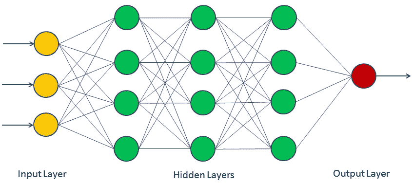
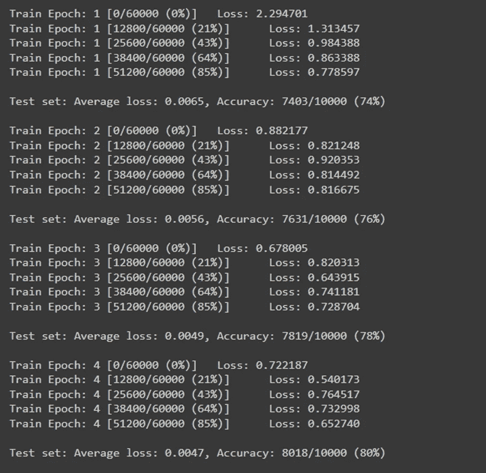
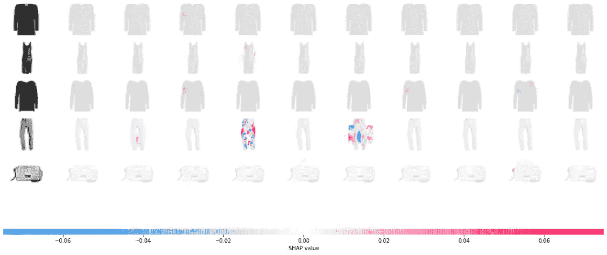

# PyTorch + SHAP 的可解释卷积神经网络

> 原文：<https://medium.com/mlearning-ai/explainable-convolutional-neural-networks-with-pytorch-shap-62ffb229a918?source=collection_archive---------2----------------------->

*用 PyTorch 和 SHAP 解释卷积神经网络的预测*

深度学习等复杂技术曾经是一种黑盒模型，因为你无法彻底了解内部发生了什么。然而，像 [SHAP](https://shap.readthedocs.io/en/latest/index.html) (匀称的附加解释)这样的工具让它成为过去。有了 SHAP，你可以用最少的编码轻松解读深度学习模型的预测。

CNN 不是最容易理解的概念。一个使用数学计算的网络学习图像的[内核](https://ieeexplore.ieee.org/document/7877043)，并检测有用的模式来正确分类看不见的图像。如果你想一想，你的大脑也有类似的行为，利用模式看到它面前的图像。例如，如何识别类似于 7 的东西？一条倾斜的直线，上面有一条水平线，对吗？这也正是 CNN 中模式的工作方式。

虽然我们当然可以知道 CNN 的衡量标准来确定他们的表现，但我们不能完全理解他们是如何得出结果的。SHAP 非常适合这个目的，因为它让我们用一种视觉的方式来观察内部。

所以今天，我们将使用时尚 MNIST 数据集来展示 SHAP 是如何工作的。教程对应的笔记本可以在我的 [GitHub](https://github.com/fenago/blog/blob/main/SHAP_CNN.ipynb) 上找到。

下面是我们将如何经历不同的部分:

模型架构

训练模型

与 SHAP 一起解读结果

包裹

# 模型架构

我们将使用 PyTorch 来训练时尚 MNIST 数据集，该数据集在这里[公开发布](https://www.kaggle.com/zalando-research/fashionmnist)。PyTorch 是一个非常流行的用于深度学习的 Python 库，它的特性非常丰富。但是，不要担心，即使您以前没有使用 PyTorch 的经验，因为它只是 Python。

在定义架构之前，让我们导入一些必需的库。

现在，让我们定义我们将用来训练我们的神经网络的架构。

就是这样！我们现在可以继续训练部分了。

# 训练模型

在开始模型训练部分之前，我们需要完成两项重要任务。首先，定义将控制我们训练的变量 batch_size 和 num_epochs，然后，定义我们的 *train()* 和 *test()* 函数。所以，让我们开始吧。下面是 batch_size 和 num_epochs 在这个场景中的含义。

batch_size:一次训练的图像数量

num_epochs:整个数据集从模型中通过的总次数

下面是上面提到的两个任务的代码片段。

接下来，我们必须加载并转换数据集，这样才能将其转换为张量并进行归一化。最后，分批整理。

最后，我们已经为训练模型做好了一切准备。让我们实例化模型，并为之前定义的纪元进行训练。

运行此单元可能需要一些时间，具体取决于可用的资源。但是，当模型正在训练时，您将能够在单元的输出框中看到训练结果。以下是我的输出区域在训练时的样子:

Image by Author

一旦这个细胞完成执行，我们的模型就完全训练好了！下一步是解释模型的结果。

# 与 SHAP 一起解读结果

SHAP 的模型解释非常简单。我们只需调用 SHAP 的 *DeepExplainer()* 函数，并提供模型和测试值作为参数。一旦完成，我们将创建几个 *numpy* 数组来存储 shap 值和测试值。最后，我们可以使用 SHAP 的 *image_plot()* 函数来绘制结果。

我们可以这样编码。

Image By Author

您可以在最左侧看到输入图像，而每个图像的预测都在各自的行上。随着颜色变红，模型输出增加，增加了模型预测的可信度。至于更蓝的一面，则是相反的情况。

这正是使用 SHAP 解释模型结果的快捷方式。它不仅速度快，而且还为您提供了模型性能的逻辑概述。

# 包裹

深度学习模型曾经是黑匣子，人们看不到里面发生了什么。然而，SHAP 在一定程度上改变了这种情况，并提供了一种很好的方式来可视化模型是如何执行的。

在上面的文章中，我们使用 PyTorch 从零开始创建了一个深度学习模型，对来自时尚 MNIST 数据集的衣服进行分类。此外，我们还看到了如何使用 SHAP 库轻松解释模型的结果。

如果您有任何问题或意见，请随时在下面提出。感谢阅读！

 [## Mlearning.ai 提交建议

### 如何成为 Mlearning.ai 上的作家

medium.com](/mlearning-ai/mlearning-ai-submission-suggestions-b51e2b130bfb)