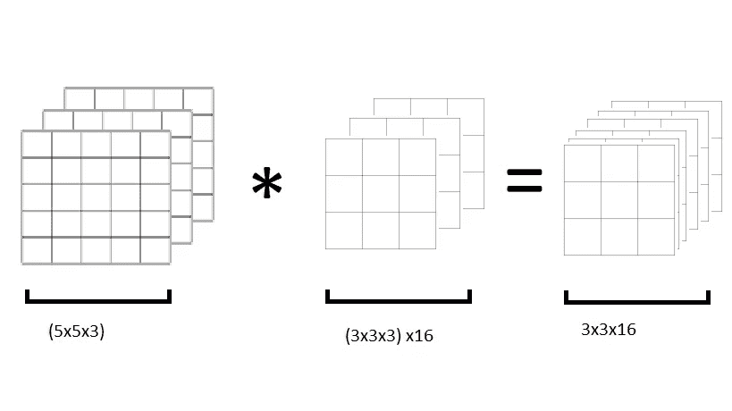
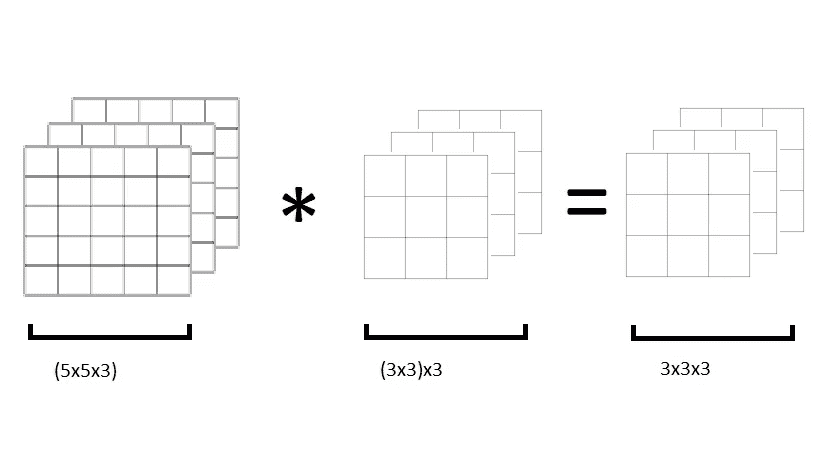

# 解释:V1 移动网络

> 原文：<https://medium.com/mlearning-ai/explained-mobilenet-v1-bb700abfe824?source=collection_archive---------8----------------------->

MobileNet V1 架构是计算机视觉应用中使用最广泛的深度网络架构之一。如果你是那些使用过基于这种架构的模型以及其他模型的人之一(像我一样)，那么你可能知道它在边缘设备(手机、开发板如 raspberry pi 等)上的速度和效率。).但是究竟是什么让 MobileNet V1 架构如此快速高效呢？这正是我们将要回答的问题。

要理解 MobileNet V1 架构的基本构建模块，有一个先决条件，您应该知道卷积层是如何工作的。如果你对此不太确定，[这里是吴恩达的播放列表，可以让你足够了解](https://www.youtube.com/watch?v=XuD4C8vJzEQ&list=PLkDaE6sCZn6Gl29AoE31iwdVwSG-KnDzF&index=2)。

影响深度学习模型速度的因素是“计算成本”，简单来说，就是进行预测所需的乘法次数。对于卷积层，计算成本很大。如果我们能够以某种方式降低计算成本，我们的模型将变得快速高效，这就是 MobileNet 所做的，它减少了通过卷积层所需的乘法次数。为了理解 MobileNet 是如何做到这一点的，让我们看一个例子。

假设有一个尺寸为 5x5x3 的输入图像，我们需要用 16 个滤波器对其进行卷积，每个滤波器的尺寸为 3x3x3。

Input image being convolved by 16 filters and producing an output of 3x3x16

每个滤波器同时应用于所有输入通道。输出维度的计算超出了本文的范围，但是您可以在这里[阅读相关内容。](https://stackoverflow.com/questions/53580088/calculate-the-output-size-in-convolution-layer)

卷积运算的计算成本通过以下公式计算，

**计算成本=过滤高度*过滤宽度*输入通道数*过滤数量*输出高度*输出宽度**

对于图中所示的卷积运算，计算成本可以给出如下:

计算成本= 3 x3x 3 x3x 16 = 3，888 次乘法。

这是执行图中所示卷积运算所需的乘法次数。

MobileNet 通过使用一种称为**深度可分卷积的概念来降低计算成本。**

## 深度方向可分离卷积；

深度方向可分离卷积包括以下两个步骤:

1.  深度方向卷积
2.  逐点卷积

在深度卷积中，与普通卷积不同，每个滤波器都保留给输入图像的一个通道，而不是所有通道。这意味着每个输入通道都与一个滤波器进行卷积，所有通道的输出最终连接在一起，形成最终输出。

如果我们继续我们的例子，那么在深度方向卷积期间，5x5x3 输入图像将与 3，3x3 滤波器进行卷积，每个滤波器用于一个输入通道，如下所示。

Depth-wise convolution performed on the input image that yields an output with dimensions 3x3x3

计算深度方向卷积运算的计算成本的公式略有不同，

**计算成本=过滤高度*过滤宽度*输入通道数*输出高度*输出宽度**

我们可以使用上面的公式来计算上图所示的深度方向卷积的计算成本，

计算成本= 3×3×3×3×3 = 243 次乘法。

但有一个问题，标准卷积层的输出维度为 3x3x16，而当我们应用深度卷积时，输出维度为 3x3x3。

这就是我们使用逐点卷积的地方。逐点卷积基本上是一种卷积运算，滤波器的维数为 1x1。因此，如果我们使用大小为 1 的 16 个滤波器，我们可以获得所需的输出尺寸(即 3x3x16)。如果你没有看到最后一部分，请参考[这里](https://stackoverflow.com/questions/53580088/calculate-the-output-size-in-convolution-layer)，然后再次阅读故事:)

Applying pointwise convolution to the output from depth-wise convolution.

我们将使用与用于标准卷积的公式相同的公式来计算逐点卷积的计算成本，

计算成本= 1x1x3x3x3x16 = 432 次乘法运算

现在应用于我们的例子的深度方向可分离卷积的总计算成本将是，

总计算成本= 243+432 = 675 次乘法。

这表明，通过应用深度方向可分离卷积而不是标准卷积，我们可以减少 82.64%的计算成本(那是 ALOOTT！！)

因此，深度方向可分离卷积使得 MobileNet V1 架构如此高效和快速。

更多类似内容，请订阅我的电子邮件列表，并在 [LinkedIn](https://www.linkedin.com/in/zain-ehtesham-24086b19b/) 上关注我。

 [## Mlearning.ai 提交建议

### 如何成为 Mlearning.ai 上的作家

medium.com](/mlearning-ai/mlearning-ai-submission-suggestions-b51e2b130bfb)