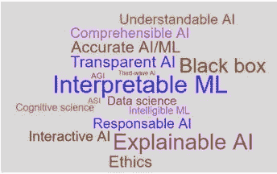
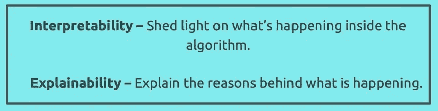
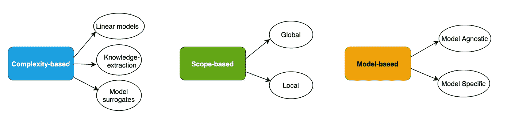
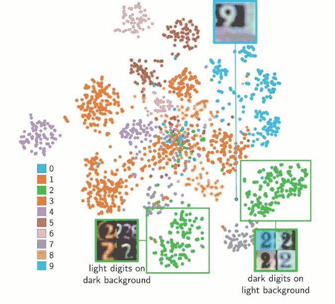
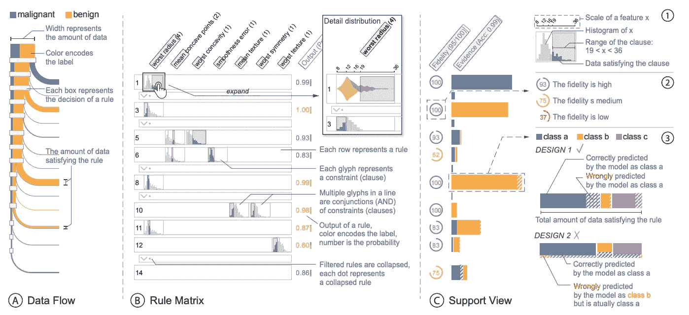
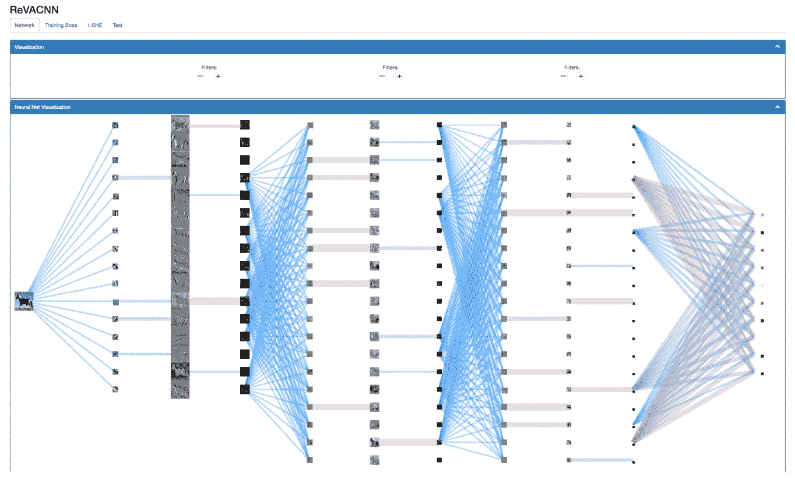

# 使用视觉分析解释/诠释机器学习模型-背景。

> 原文：<https://medium.com/mlearning-ai/explaining-interpreting-machine-learning-models-using-visual-analytics-a-background-db132c471cea?source=collection_archive---------1----------------------->

机器学习在当今世界已经变得无处不在，我们对算法所做决策的依赖也在增加。此外，随着现实生活中问题的复杂程度激增，ML 从业者一直在寻求开发更好的算法来拟合曲线。这也让我们想到一些常见的问题-

“我们如何理解这些复杂模型的运作？”

*“我们如何验证模型做出的决策？”*

随着最大似然算法应用的增加，对透明和可解释模型的需求变得至关重要。这对于涉及人类的决策尤为重要。这一领域的一个常见例子是 COMPAS(替代制裁的矫正罪犯管理概况)，这是一个判断刑事被告成为惯犯可能性的软件。该工具因其带有偏见的种族决定和未能解释这些决定而受到广泛批评。这种类型的场景质疑算法中的“信任”,并且可能是不道德的。

**那么这些问题的解决方案是什么呢？**

Ref: A. Adadi and M. Berrada, “Peeking Inside the Black-Box: A Survey on Explainable Artificial Intelligence (XAI),” in IEEE Access, vol. 6, pp. 52138–52160, 2018, doi: 10.1109/ACCESS.2018.2870052.

上面的云一词总结了处理上述问题的研究领域和相关术语。最近，从主要研究渠道获得牵引力的领域是**可解释的人工智能(XAI)** 和**可解释的人工智能**。虽然这两个词经常被用作同义词，但它们之间有着精确的区别。

## **讲解策略:**

在对现有可解释策略的文献调查中， *Adadi 等人*。将这些方法主要分为三种类型，我个人认为这些策略涵盖了解释的所有主要方面。他们是-

Explainability strategies

*   **基于复杂性的**:模型的复杂性往往与其解释成正比。所以，这种方法的想法是制造简单和更容易解释的模型。一个典型的*例子*可以是将深度神经网络提炼到决策树中，因为决策树非常容易理解(查找模型代理以获得详细信息)。
*   **基于作用域的**:解释一个模型可以从两个作用域——全局&局部。

*—全局:*目标解释整个模型逻辑，帮助人类理解模型的内部行为。*示例*:在决策过程中使用了哪些特征？模型学到的知识是什么？

*—本地:*解释特定的实例及其结果预测。例:为什么一个人被拒绝贷款？

*   **基于模型的**:触及模型的本质。

*—不可知:*适用于所有模型，不管其性质如何。

*—特定:*限于特定型号。*举例*:解释 CNN 的技巧。

## **用于解释的视觉分析&解释 ML 模型:**

很长一段时间以来，视觉隐喻已经被认为能够解决解释 ML 算法的问题。自然地，人类擅长使用可视化技术理解数据，同样的原理也适用于解释 ML 模型。近年来，许多视觉分析系统被开发出来，以理解如下所示的三个重要方面:

解释模型的内部工作原理。

*   *示例*—CNN 的最后一个隐藏层激活在下面的训练后被可视化。

Ref: P. E. Rauber, S. G. Fadel, A. X. Falcão and A. C. Telea, “Visualizing the Hidden Activity of Artificial Neural Networks,” in IEEE Transactions on Visualization and Computer Graphics, vol. 23, no. 1, pp. 101–110, Jan. 2017, doi: 10.1109/TVCG.2016.2598838.

从模型中提取信息，即事后可解释性。

*   *示例* —视觉分析系统 *RuleMatrix* 从神经网络中提取规则，并解释分类器的决策。

Ref: Y. Ming, H. Qu and E. Bertini, “RuleMatrix: Visualizing and Understanding Classifiers with Rules,” in IEEE Transactions on Visualization and Computer Graphics, vol. 25, no. 1, pp. 342–352, Jan. 2019, doi: 10.1109/TVCG.2018.2864812.

启用性能诊断以构建更精确的模型。

*   *示例* —可视化分析系统 ReVACNN，通过在训练过程中动态添加/删除节点和层来实现实时模型导向，以构建更好的 CNN 模型。

Ref: Chung, Sunghyo, Park, Cheonbok, Suh, Sangho, Kang, Kyeongpil, Choo, Jaegul, and Kwon, Bum Chul inFuture of interactive learning machines workshop at the 30th annual conference on neural information processing systems (NIPS) 2016

## **explability 的目标用户是谁？**

模型可解释性的观点因用户而异。例如:为 ML 模型开发人员构建一个工具可能不会对那些有 ML 基础知识的人有太大的影响。通常，目标用户分为以下三种类型:

Orig ref: Hohman FM, Kahng M, Pienta R, Chau DH. Visual Analytics in Deep Learning: An Interrogative Survey for the Next Frontiers. IEEE Trans Vis Comput Graph. 2018 Jun . doi:10.1109/tvcg.2018.2843369\. PMID: 29993551; PMCID: PMC6703958.

在这篇博客中，我们介绍了模型可解释性背后的背景，以及可视化分析如何在这个过程中作为一个补充工具。在接下来的几周内，我们将深入研究该领域的各种研究，以了解模型的可解释性/解释。我们还将看看各种可用的开源工具，以帮助我们更好地利用机器学习算法。

## 一些我真正喜欢的解释 ML 模型的工具:

*   [嵌入投影仪](https://projector.tensorflow.org/) —大规模嵌入的解释。
*   [TensorBoard](https://tensorboard.dev/#get-started) —理解、调试和优化基于 TensorFlow 的模型。
*   [TensorFlow Playground](https://playground.tensorflow.org/#activation=relu&batchSize=10&dataset=circle&regDataset=reg-plane&learningRate=0.03&regularizationRate=0&noise=0&networkShape=4,2,2&seed=0.32054&showTestData=false&discretize=false&percTrainData=50&x=true&y=true&xTimesY=false&xSquared=false&ySquared=false&cosX=false&sinX=false&cosY=false&sinY=false&collectStats=false&problem=classification&initZero=false&hideText=false) —可视化分析工具，无需编程即可探索简单的神经网络。
*   [可教机器](https://teachablemachine.withgoogle.com/)——教授图像、音频分类和姿态估计的基础知识。

想分享一些模型可解释性/可解释性工具？在—[LinkedIn](https://www.linkedin.com/in/dipankar-mazumdar/)&[Twitter](https://twitter.com/Dipankartnt)上与我联系。