# 探索性客户个性分析 I:数据可视化

> 原文：<https://medium.com/mlearning-ai/exploratory-customer-personality-analysis-i-data-visualization-51386c678f92?source=collection_archive---------5----------------------->

客户细分是将整个客户群划分为一组不同的子群，每个子群由具有相似需求和特征的客户组成。然后，公司可以针对每个不同的客户群制定具体的营销策略，从而提高客户满意度和忠诚度。

我从 [Kaggle](https://www.kaggle.com/imakash3011/customer-personality-analysis) 偶然发现了这个数据集，我认为它可能是客户细分项目的一个很好的起点。属性的描述可以在前面提到的 Kaggle 平台上找到。

本文的第一部分将重点关注数据可视化，而第二部分将更侧重于聚类分析和客户排名。在这个实验中我会用 R。让我们开始吧。

# 数据导入

首先，加载所需的 R 库包。

```
**library**(tidyverse)  *# Multiple packages for data analysis* **library**(visdat)     *# visualize missing values*
**library**(mice)       *# multiple imputation of missing values* **library**(knitr)      *# for tidy table display*
**library**(GGally)     *# for scatter plot matrix* **library**(ggmosaic)   *# mosaic plot* **library**(reshape2)   *# data wrangling* **library**(ggforce)    *# for parallet set plots*
```

接下来，将下载的数据加载到 R workspace 中。

```
*# Set the working directory to where the data file is located*
setwd("~/ml projects/customer segmentation")
cust_data = read.csv("marketing_campaign.csv", sep = "\t")
```

有 29 列(变量)和 2240 行(观察值)，如下面的输出所示。每行对应一个客户。

```
cust_data %>% str()
summary(cust_data)
```

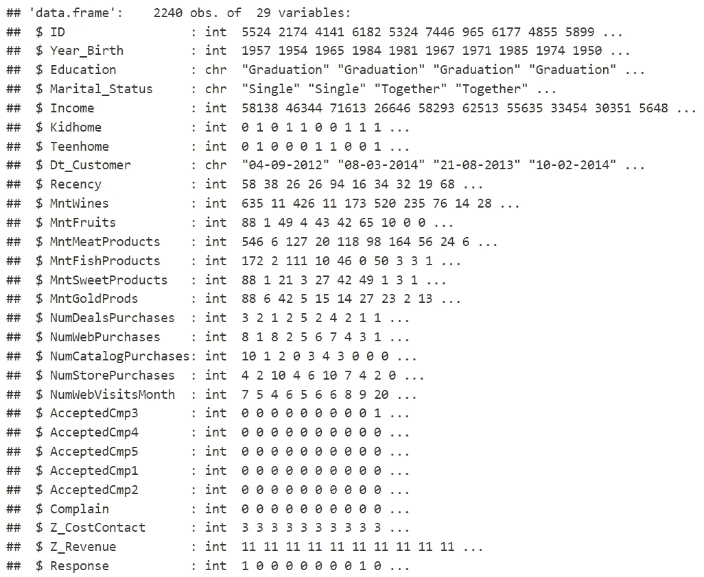

Internal structure of customer data.

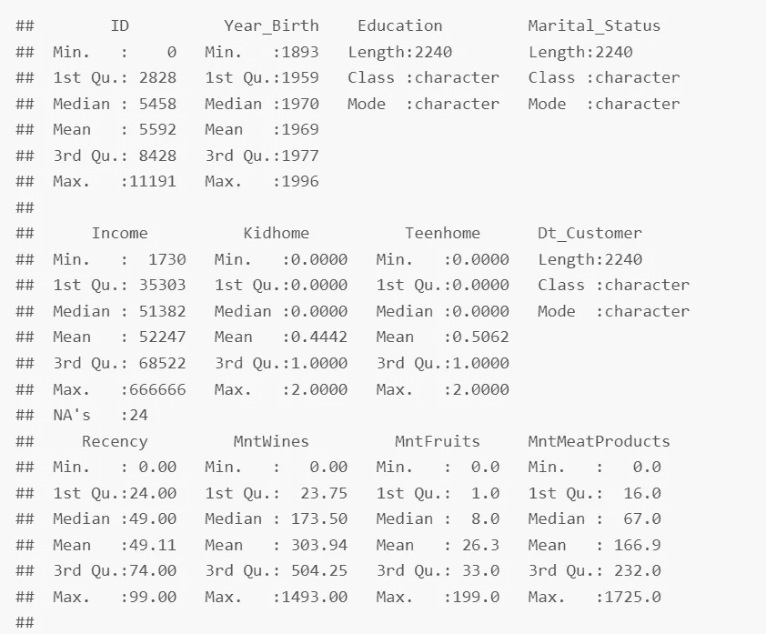

Statistical summaries of some of the attributes (the full output can be found on [RPubs](http://rpubs.com/JQ_programmer_92/906741)).

根据`summary()`函数的输出，有一些有趣的事情需要注意:

*   `Income`特征有`NA's`(缺失值)。
*   大多数数字特征描绘了正偏度。
*   像`ID`这样的特性可能没什么用，因为它不编码任何关于客户的信息。我将把它保存在`DataFrame`变量中，但不会在任何后续分析中使用它。
*   像`Z_CostContact`和`Z_Revenue`这样特征不是有用的属性，因为它们具有零方差。
*   像`Dt_Customer`这样的特征需要一些特征工程，因为它们没有存储在正确的数据类型中。这将在下面的小节中执行。`Year_Birth`可以转化为更直观的属性，如客户的**年龄**。
*   对于`Education`和`Marital Status`等特征，从`character`到`factor`的特征重组。

# 特征工程

## 零方差变量的去除

```
cust_data_copy = cust_data
cust_data = subset(cust_data, select = -c(Z_CostContact, Z_Revenue))
```

## 去掉无效的观察值

```
table(cust_data$Marital_Status)   # tabulate the frequency of each marital status category
kable(cust_data %>% filter(Marital_Status == "YOLO"), caption = "YOLO instances")
cust_data = cust_data %>% filter(Marital_Status != "YOLO")
```

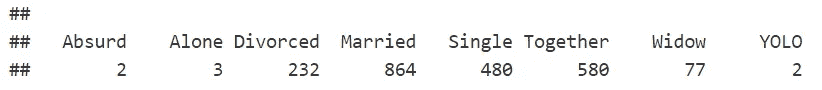

## 特征提取 I

1.  从属性`Marital_Status`、`Kidhome`和`Teenhome`中得出家庭成员的最小数量。
2.  将`Response`和五个`AcceptedCmp`特征相加，计算出已接受要约的总数。

```
*# Calculate total number of accepted campaign, minimum number of household members.*

min_num_member = **function**(x) {
  **if** (x[1]=="Married" || x[1]=="Together"){
    np = 2
  } **else** {
    np = 1
  }
  **return**(as.numeric(x[2]) + as.numeric(x[3]) + np)
}
min_num_household = apply(cust_data %>% 
                            select(Marital_Status, Kidhome, Teenhome), 
          1, min_num_member)
cust_data$min_num_household = min_num_household

cust_data = cust_data %>% mutate(tot_AcceptedCmp = AcceptedCmp1 + AcceptedCmp2 + AcceptedCmp3 + AcceptedCmp4 + AcceptedCmp5 + Response)
```

## 数据类型的重构

```
*# Change the date from string to date format*
cust_data$Dt_Customer = as.Date(cust_data$Dt_Customer, 
                                     format = c("%d-%m-%Y"))

*# Change the categorical features from character to factor*
categorical_features = c("Education", "Marital_Status", "AcceptedCmp1",
                         "AcceptedCmp2", "AcceptedCmp3", "AcceptedCmp4",
                         "AcceptedCmp5", "Complain", "Response")
**for** (i **in** 1:length(categorical_features)){
  cust_data[[categorical_features[i]]] = 
    as.factor(cust_data[[categorical_features[i]]])
}
*# ordered categorical variables: Kidhome and Teenhome*
cust_data$Kidhome = factor(cust_data$Kidhome, 
                           levels = seq(from = min(cust_data$Kidhome), 
                                        to = max(cust_data$Kidhome), 
                                        by = 1), ordered = TRUE)
cust_data$Teenhome = factor(cust_data$Teenhome, 
                           levels = seq(from = min(cust_data$Teenhome), 
                                        to = max(cust_data$Teenhome), 
                                        by = 1), ordered = TRUE)
```

## 特征提取 II

将属性`Year_Birth`更改为年龄，并将`Dt_Customer`更改为客户在公司注册的天数。

```
*# Change Year_Birth to age*
current_year = 2014
cust_data = cust_data %>% mutate(age = current_year - Year_Birth) %>% 
  subset(select = -c(Year_Birth))

*# Change Dt_customer to days of enrollment. Assume that the current date is 1st July 2014*
current_date = as.Date("2014-07-01")
cust_data = cust_data %>% 
  mutate(days_enroll = difftime(current_date, Dt_Customer, units = c("days")) %>% 
           as.numeric()) %>% 
  subset(select = -c(Dt_Customer))
```

## 剔除异常值

*   删除等于或大于 100 岁的客户。
*   丢弃`Income`超过`Income`中值 10 倍的实例。营销部门可能需要针对该客户制定独家营销策略。

```
summary(cust_data$age)
cust_data = cust_data %>% filter(age < 100)   # filter out age >=100# Unusually high Income 
cust_data %>% arrange(desc(Income)) %>% head(3) %>% kable()
cust_data = cust_data %>% filter(ID!=9432)   
# remove instance with ridiculously high income
```

## 缺失值插补

处理缺失值主要有两种方法:

1.  完成案例分析(缺失值的脱落观察)。
2.  归罪。
    -单一插补。
    -多重插补。

多重插补法通常优于单一插补法，因为缺失值被计算多次，许多不同的似是而非的值被汇集在一起得到估计值。有三种类型的丢失机制:1)完全随机丢失(MCAR)，2)随机丢失(MAR)，3)非随机丢失(MNAR)。关于缺失数据类型的更多详细信息和直观解释可在[这里](https://www.ncbi.nlm.nih.gov/books/NBK493614/)找到。

一般来说，多重插补通常可以处理 MCAR 和马尔，但不能处理马尔。如果缺失数据机制是 MNAR，则必须对缺失模式进行建模，因为缺失数据不依赖于观测数据。在本实验中，通过链式方程(MICE)实施多重插补，以获得缺失`Income`实例的估计值。关于鼠标算法的简洁说明，请参考这篇[文章](https://cran.r-project.org/web/packages/miceRanger/vignettes/miceAlgorithm.html)。

```
*# Write a utility function to check for missing values.*
check_missing_values = **function**(cust_data){
  vec_missing = apply(cust_data, 2, **function**(x){ sum(any(is.na(x)))})
  idx_missing = which(as.vector(vec_missing)==1)
  **if** (length(idx_missing)>0){
    cat("The columns(features) with missing values: ", 
      colnames(cust_data)[idx_missing])

  } **else** {
    print("No missing values")
  }

}
check_missing_values(cust_data)
```


另一种可视化缺失数据的方法是通过`vis_miss()`函数。

```
vis_miss(cust_data)
```

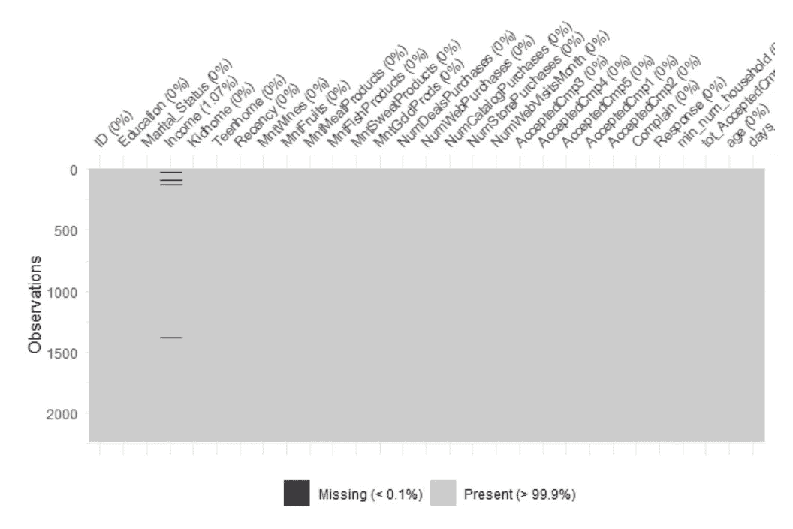

1.07% of “Income” values are missing.

```
cat(" \nThe number of missing values for income: ", sum(is.na(cust_data$Income)))
idx_missing = which(is.na(cust_data$Income))
```


## 执行多重插补(MICE 实施)

```
*# MICE implementation*
imp = **mice**(cust_data, maxit = 0, print = F)
pred = imp$predictorMatrix
pred[,"ID"] = 0
*# Use the default value of 5 iterations*
imp = **mice**(cust_data, seed = 10, predictorMatrix = pred, print = F)
**stripplot**(imp, Income~.imp, pch = 20, cex = 2)
```

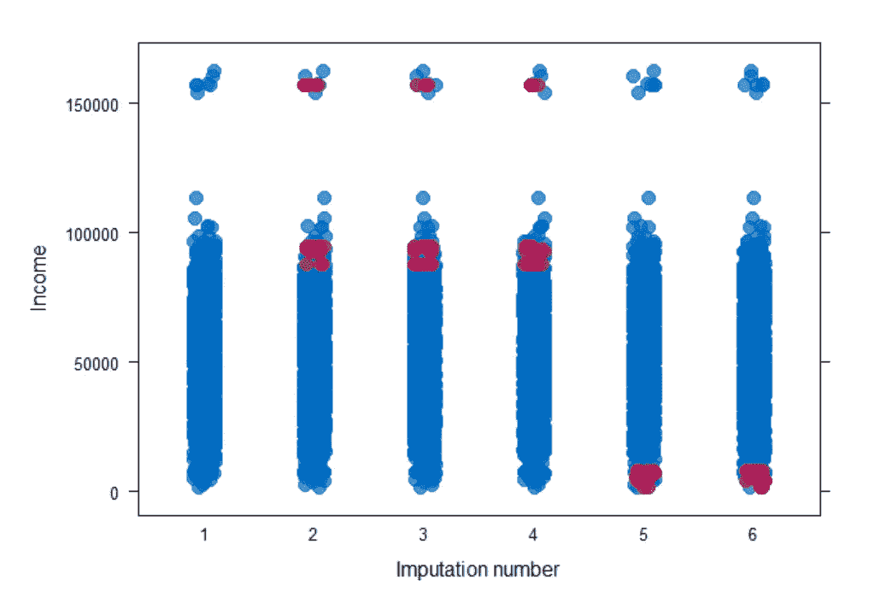

One dimensional scatterplot for Income variable in each iteration. The red points represent the imputed missing values.

```
cust_data = **complete**(imp, 5)
kable(cust_data[idx_missing[1:5],] %>% select(ID:Income), caption = "Missing values imputed customer data")
# Show the first 5 instances whereby the missing values are imputed
```

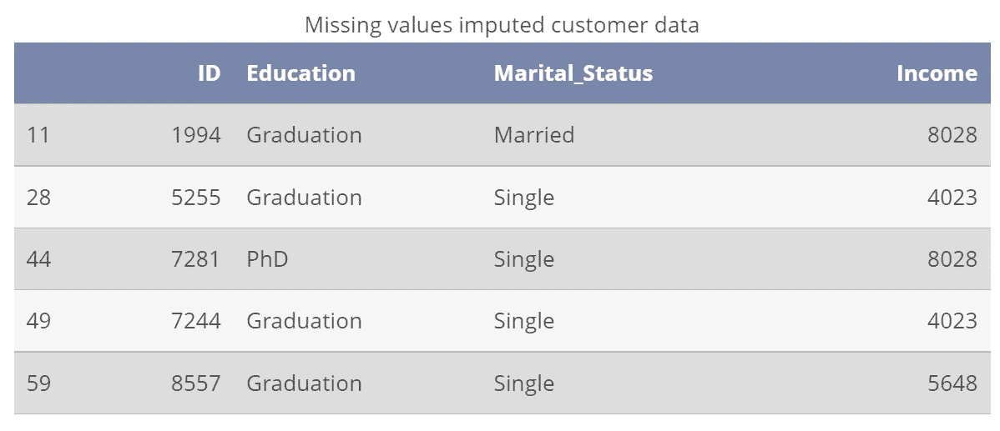

如一维散点图和上表所示，估算的家庭年收入徘徊在 1 万英镑以下。

# 数据可视化

假设您是处理该数据集的数据科学家之一，您的上级提出了如下几个问题:

1.  如何在客户中分配`Income`属性？
2.  数字特征之间有什么关系？有没有什么有趣的数据模式或相关性值得注意，可以提供有用的见解？
3.  分类特征之间的关系是什么？(例如，`Response`(在上一次活动中接受报价)的比率如何随着家庭中儿童和青少年的存在而变化？)
4.  分类特征和数字特征有什么关系？(例如，在不同的教育背景下，购买不同商品的金额分布如何？)

上面列出的所有问题都可以通过利用一组适当的数据可视化工具来回答。

## 直方图/密度图

```
cust_data %>% **ggplot**(**aes**(x = Income)) + 
  **geom_histogram**(**aes**(y = **stat**(count)/**sum**(count)), binwidth = 10000, 
                 boundary = 0) +
  **ylab**("Relative frequency")
```

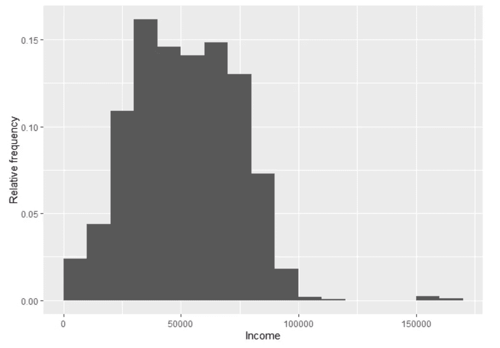

```
*# density plot*
cust_data %>% **ggplot**(**aes**(x = Income)) + **geom_density**(fill = "lightblue", alpha = 0.5) +
  **geom_vline**(**aes**(xintercept=**mean**(Income)), color = "blue", linetype = 2) + **geom_vline**(**aes**(xintercept=**median**(Income)), color = "red", linetype = 3) + **xlim**(0, 2e+05) + **theme_classic**() + **ggtitle**("density plot for customer annual household income")
```

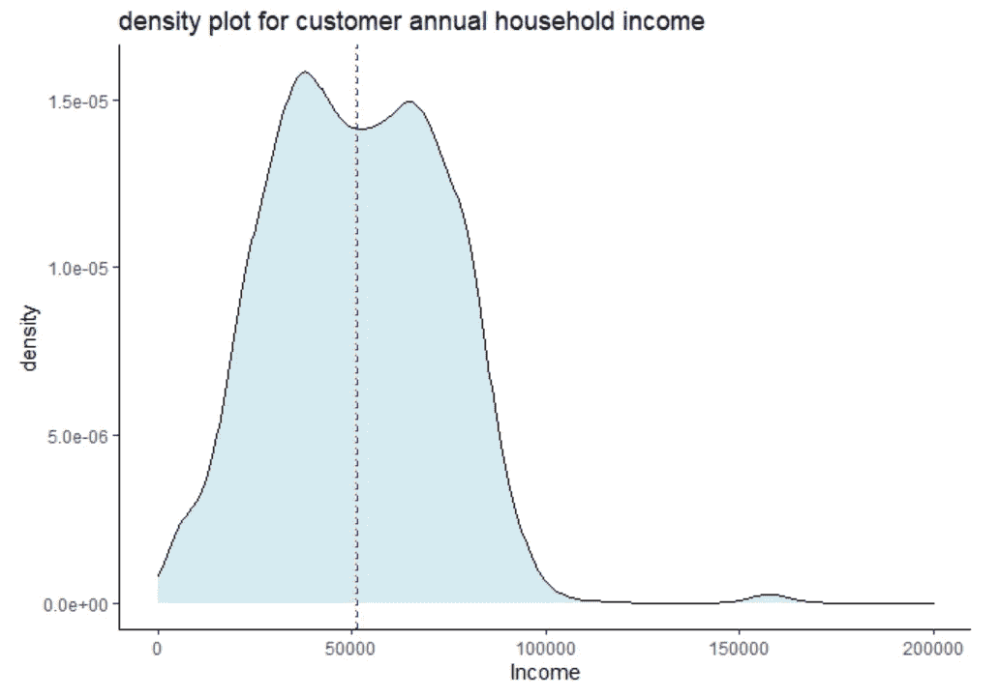

大多数客户(99.5 %)的收入等于或少于 10 万英镑。事实上，(90.91 %)的客户家庭年收入在 2 万-9 万之间。直方图和密度图都有一个粗的右尾，表示家庭年收入相对较高的客户(有 7 个客户的`Income`超过 15 万)。

## 相关图/相关矩阵

```
*# Linear correlation and scatter plots matrix for amount spent on different merchandise*
idx_cont_features = **grepl**("Mnt", **colnames**(cust_data))
cust_data[, idx_cont_features] %>% **ggpairs**(title = "correlogram")
*# Linear correlation and scatter plots matrix for number of purchases.*
idx_cont_features = **grepl**("Num", **colnames**(cust_data))
cust_data[, idx_cont_features] %>% **ggpairs**(title = "correlogram")
```

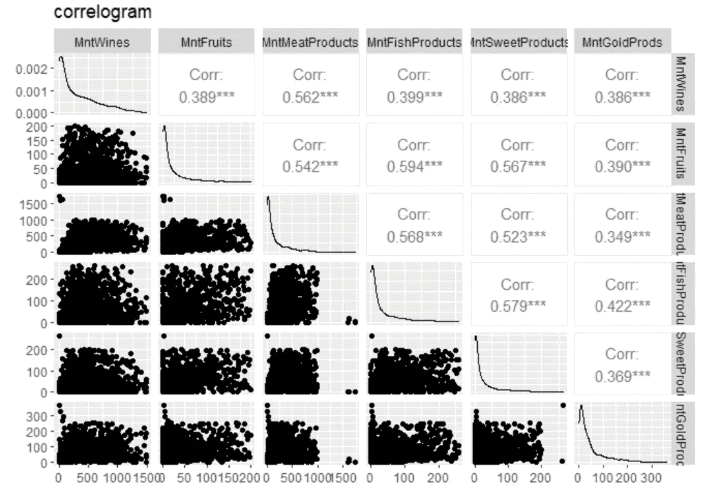

Scatter plot matrix + correlations for products-related features set.

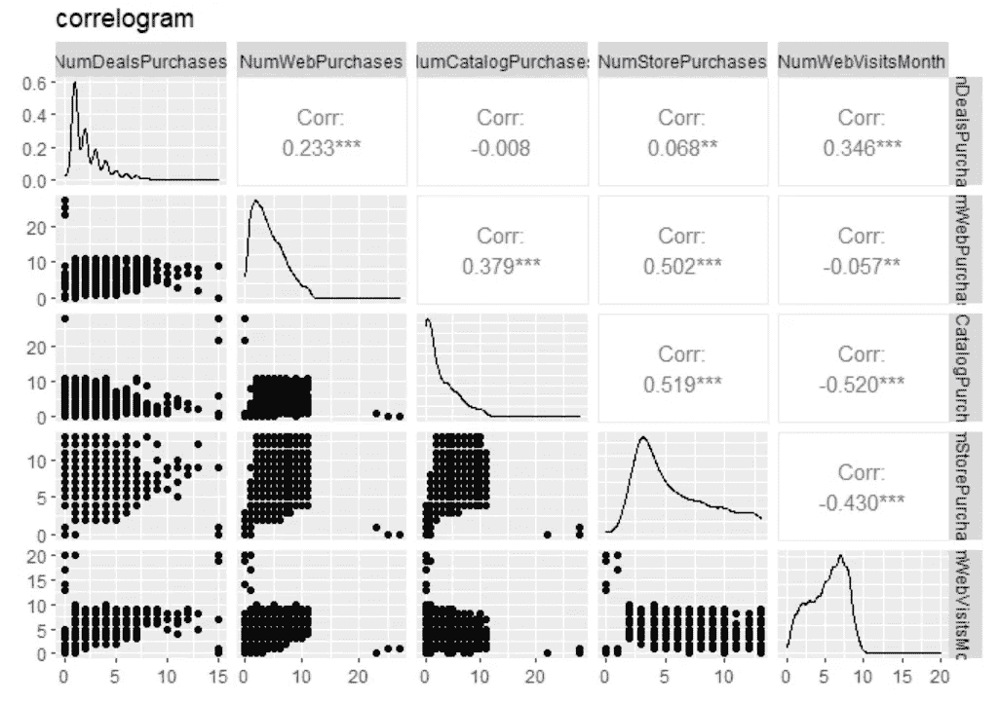

Scatter plot matrix + correlations for “purchase behavior” features set.

从上面的图中，我们可以很快掌握一些有用的信息:

1.  在不同产品类型对上花费的金额是*正线性相关*。(注:右上方矩阵中相关性旁边的星号表示统计显著性。更多信息可在`GGally`文档[中找到。).这意味着，随着在某一类产品上花费的金额增加，在另一类产品上花费的金额也会增加。](https://ggobi.github.io/ggally/reference/ggally_cor.html)

2.`NumDealsPurchases`与`NumWebVisitsMonth`正相关。这可能是因为客户上个月通过访问公司网站获得了折扣信息。

3.`NumWebVisitsMonth`和`NumStorePurchases`负相关。更喜欢直接在商店购买的客户访问公司网站的频率较低。

最后，所有数字属性的相关矩阵(包括在特性工程小节中讨论的衍生特性)如下所示:

```
seq = **c**("Mnt", "Num","Age", "days", "Income", "Recency", "household","tot")
a = **sapply**(seq, **function**(x) **grep**(x, **colnames**(cust_data)))

idx = **c**()
**for** (i **in** (1:**length**(seq))){
  idx = **c**(idx, a[[i]])
}

corr_mat = **cor**(cust_data[,idx])
corr_mat[**upper.tri**(corr_mat)] = NA
melted_cormat = **melt**(corr_mat, na.rm = TRUE)
*# The dimension becomes nx3 matrix*

melted_cormat %>% **ggplot**(**aes**(x = Var1, y = Var2, fill = value)) +
  **geom_tile**(color = "white") + 
  **scale_fill_gradientn**(limit = **c**(-1,1), colors = **hcl.colors**(40, "Earth")) +
  **theme_minimal**() +
  **theme**(axis.text.x = **element_text**(angle = 45, vjust = 1, size = 10, hjust = 1)) + **coord_fixed**() +
  **geom_text**(**aes**(Var1, Var2, label = **round**(value, 2)), color = "black", size = 1.5)
```

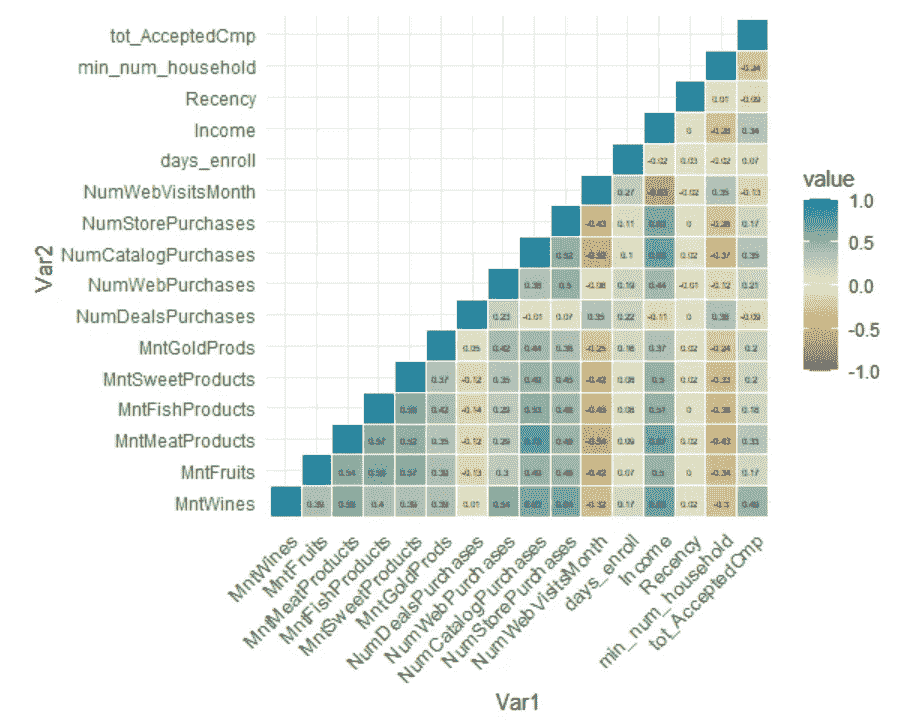

`MntMeatProducts`和`NumCataloguePurchases`(第 13 行，第 9 列)的强正线性相关性(0.72)可能表明，与其他产品相比，通过《家居指南》进行的大量支出用于肉制品。

## 镶嵌图/平行集图

这些可视化工具可用于研究分类特征之间的关系。

```
cust_data %>% **ggplot**() +
  **geom_mosaic**(**aes**(x = **product**(Marital_Status, Education), fill = Response)) +
  **theme**(axis.text.x = **element_text**(face = "bold", angle = 90),
        axis.text.y = **element_text**(face = "bold")) +
  **ggtitle**("Mosaic Plot of Response, Marital status and Education")cust_data %>% **ggplot**() +
  **geom_mosaic**(**aes**(x = **product**(Kidhome, Teenhome), fill = Response)) +
  **ggtitle**("Mosaic Plot of Response, Kidhome and Teenhome")
```

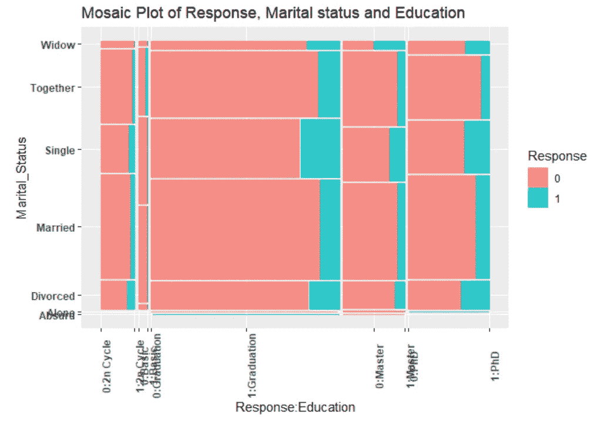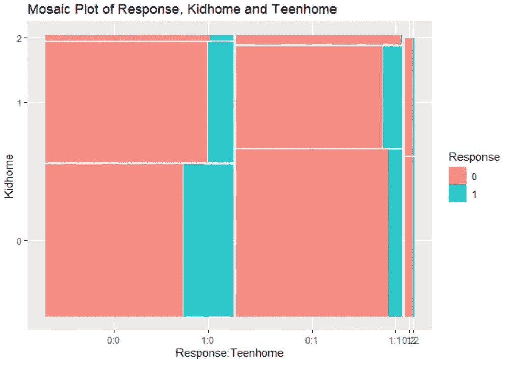

通过对上述镶嵌图的经验观察，我们知道 1)已婚和同居的`Response`比率通常小于单身、离婚和寡妇。2)对于没有儿童和青少年的顾客，接受报价的概率相对较高。换句话说，蓝色矩形的面积与整个单元格的面积之比(在上面马赛克图的左下角)代表了假设客户家中没有儿童和青少年时接受报价的条件概率。平行设置图可以在 [RPubs](http://rpubs.com/JQ_programmer_92/906741) 上发布的 html 文档中找到。

**小提琴图/分组盒图**

```
seq = **c**("Income", "Education", "Marital", "min")
idx_plot = **sapply**(seq, **function**(x) **grep**(x, **colnames**(cust_data)))

idx = **c**()
**for** (i **in** (1:**length**(seq))){
  idx = **c**(idx, idx_plot[[i]])
}
cust_data %>% dplyr::**select**(idx) %>% 
  **ggplot**(**aes**(x = Education, y = Income, fill = Education)) +
  **geom_violin**(scale = "count", draw_quantiles = **c**(0.25, 0.5, 0.75)) + **stat_summary**(fun = mean, geom = "point", shape=21, size=1.5, color = "red") + **ylim**(0, 2e+05)
```

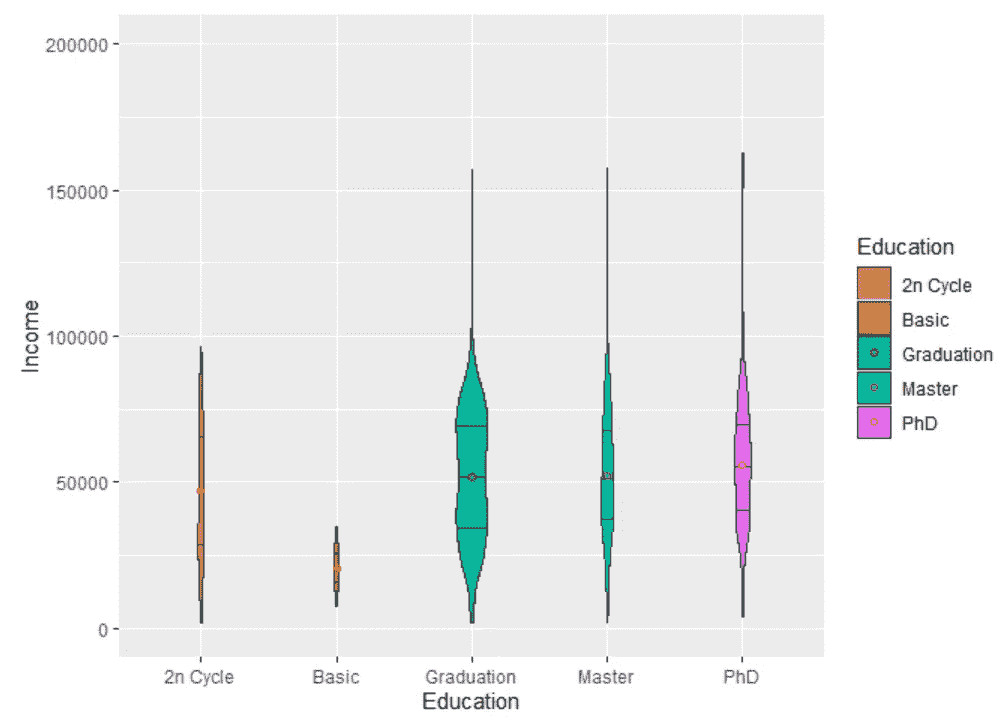

Distribution of Customer annual household income under different educational backgrounds.

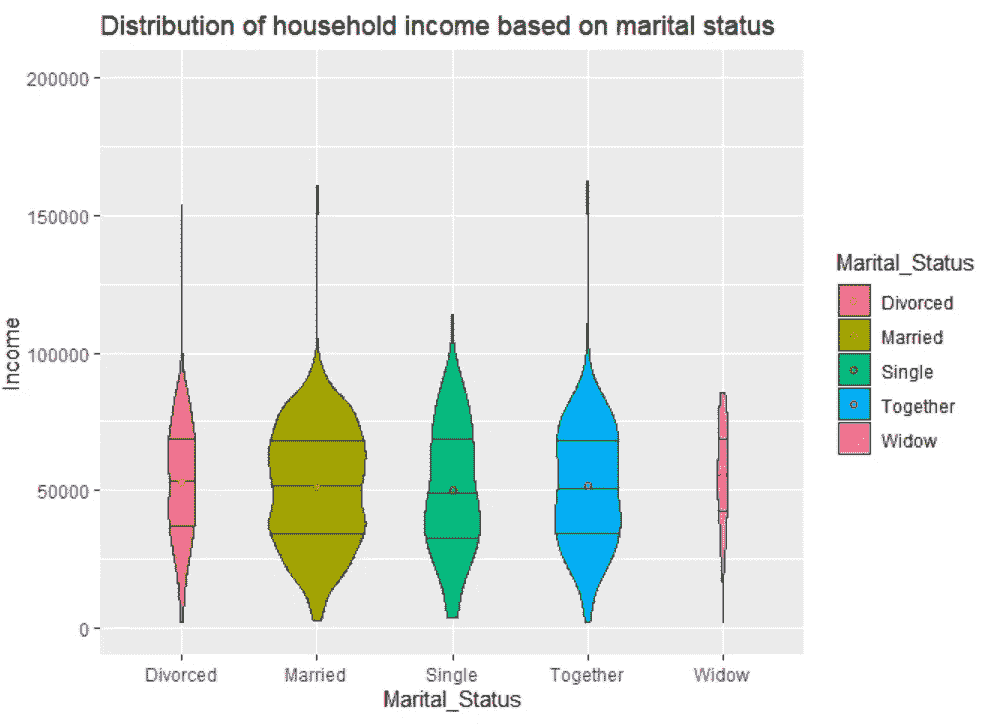

Distribution of Customer annual household income under different marital statuses.

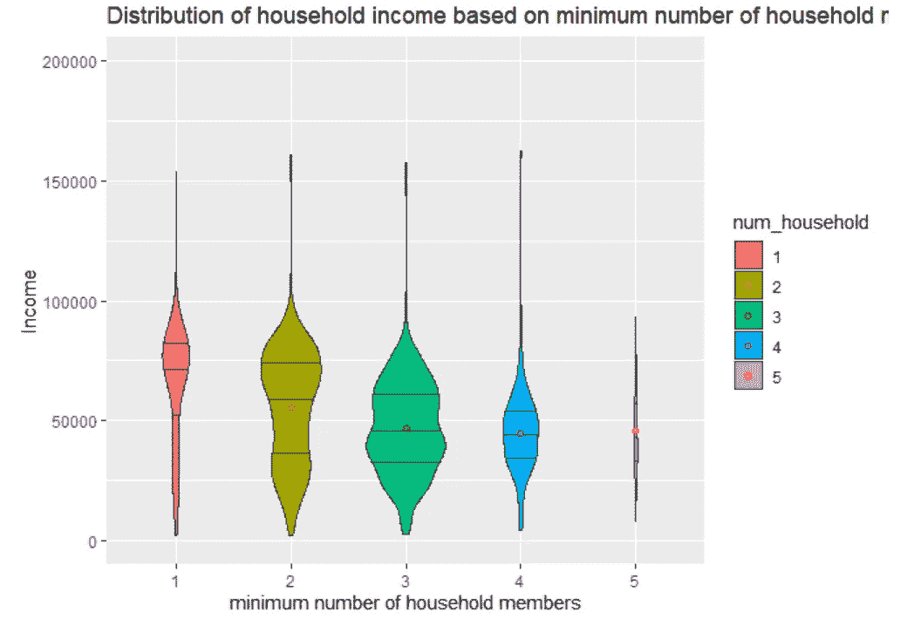

Distribution of Customer annual household income under different minimum number of household members (household size).

根据上面的小提琴情节，

*   与其他教育层次相比,"基础"教育层次的收入通常较低。
*   所有婚姻状况的收入都差不多。
*   家庭规模较小的客户家庭年收入较高。

分组箱线图用于显示不同教育背景、婚姻状况和家庭规模的客户在不同类型产品上的消费金额分布。

```
seq = **c**("Mnt", "Education", "Marital", "min")
idx_plot = **sapply**(seq, **function**(x) **grep**(x, **colnames**(cust_data)))
# Alternative, unlist() function could be used to flatten the nested list
idx = **c**()
**for** (i **in** (1:**length**(seq))){
  idx = **c**(idx, idx_plot[[i]])
}
cust_data %>% dplyr::**select**(idx) %>% 
  **pivot_longer**(**starts_with**("Mnt"), names_to = "purchase_types",
               values_to = "amount_spent") %>% 
  **ggplot**(**aes**(x = Education, y = amount_spent)) +
  **geom_boxplot**(fill = "chocolate2", notch = TRUE) + **stat_summary**(fun = mean, geom = "point", shape=21, size=1.5, color = "red") + **theme_classic**() + **facet_wrap**(~purchase_types, ncol = 2, scales = "free_y")
```

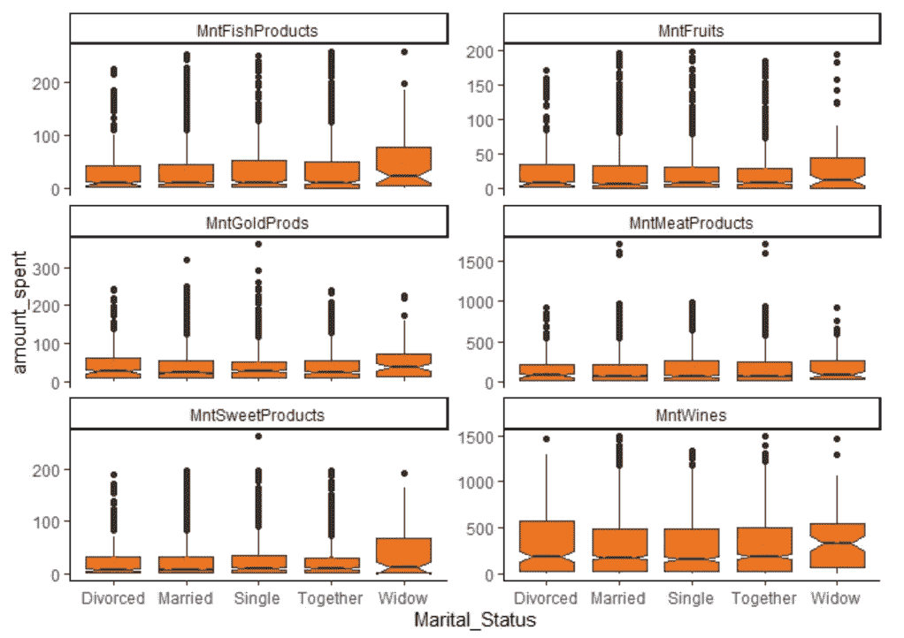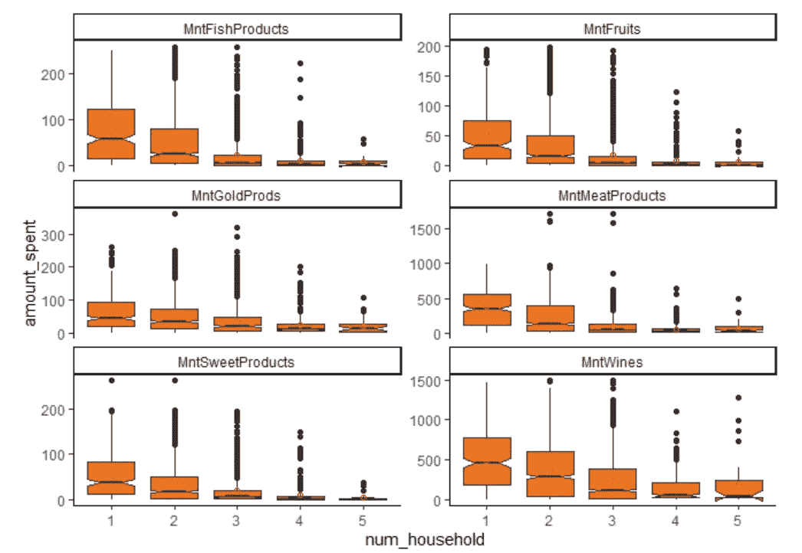

让我们看看顶部分组箱线图的右下方(“MntWines”)。博士箱线图的等级不与其他等级重叠，表明具有博士学历的客户在葡萄酒上花费的中值在统计上不同于其他教育水平较低的客户。代表不同群体平均值的红点也显示了博士客户在葡萄酒上的较高消费。根据底部分组箱线图，在所有产品类型中，家庭人口越多，花费越少。

# 结束语

数据可视化是一种非常强大和有用的技术，可以快速粗略地理解数据模式，并最终导致更好的决策。我想引用[这篇在线文章](https://www.tableau.com/learn/articles/data-visualization)中的一句话来结束我的发言:

> 一个好的可视化可以讲述一个故事，去除数据中的噪音，突出有用的信息。

接下来，我们将继续进行聚类分析和客户排名，这将是本文第二部分[的重点。](https://jq0112358.medium.com/customer-personality-analysis-ii-cluster-analysis-and-customer-ranking-bdad75000b33)

这篇文章的所有代码都可以在 [Github](https://github.com/Jacky-lim-data-analyst/programmer.git) (“客户细分”文件夹)和 [RPubs](http://rpubs.com/JQ_programmer_92/906741) 上找到。感谢阅读。祝您愉快！

[1]:ka ggle 帖子上的数据集描述没有显示`Income`变量的货币。

[2]:为了万无一失，我们不会将这种前后移动的线性关系扩展到两个以上的特征。例如，随着 A 和 B 的增加，C 也增加。相关性测量用于量化变量的*对之间的线性关系。如果要检查 3 个变量的关系，3D 散点图是一个不错的选择。*

[](/mlearning-ai/mlearning-ai-submission-suggestions-b51e2b130bfb) [## Mlearning.ai 提交建议

### 如何成为 Mlearning.ai 上的作家

medium.com](/mlearning-ai/mlearning-ai-submission-suggestions-b51e2b130bfb)