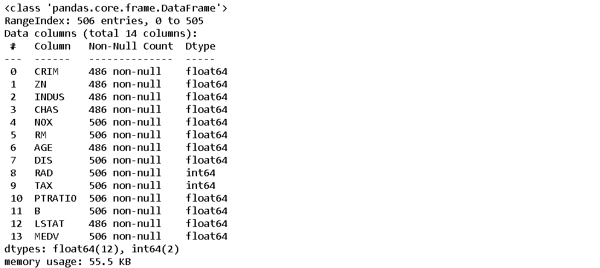
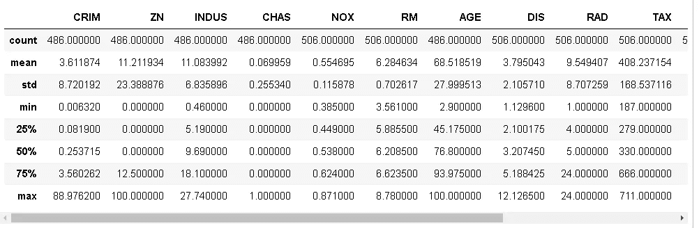
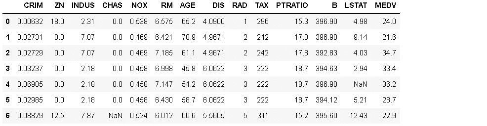
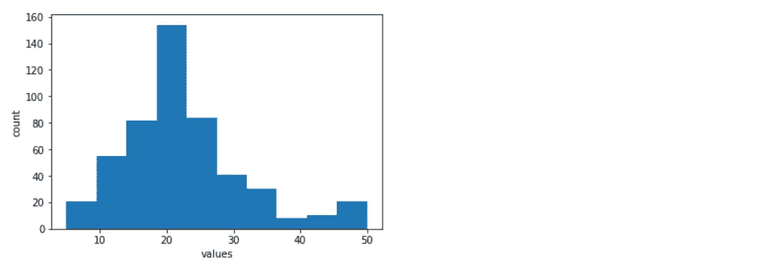
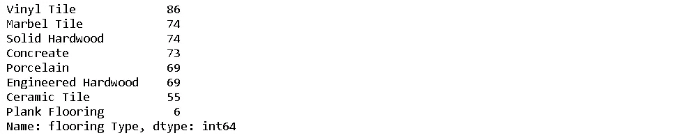
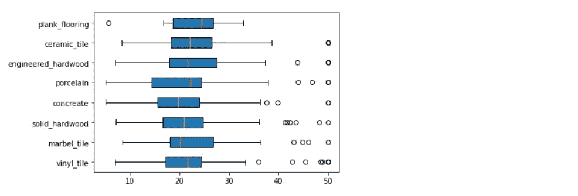
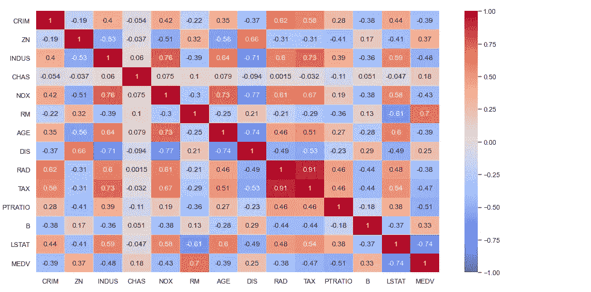
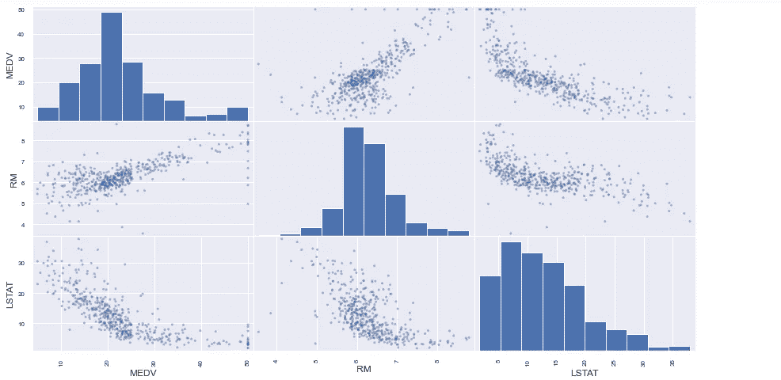

# 探索性数据分析

> 原文：<https://medium.com/mlearning-ai/exploratory-data-analysis-eda-89e9468bf75?source=collection_archive---------0----------------------->

## 初学者指南

执行探索性分析以提取见解并理解数据集。

在我们迷失在茫茫人海中之前，这是我们需要在获得数据集后尽快完成的第一步。

## 我们为什么要做探索性数据分析(EDA)？

我们的目标是学习更多关于数据集的知识，这将有助于我们在数据清理、功能工程等整个项目中做出明智的决策。

EDA 还将帮助我们理解特性、数据质量和数据可视化之间的关系。

EDA 是创建机器学习模型的非常重要的第一步，这一步不应该被忽略，也不应该延长很长时间。应该迅速果断。

> 那么我们如何知道我们是否做了足够的分析呢？

在这里，我们将讨论某些问题，并在我们有了这些问题的答案后总结我们的 EDA。

我以来自 Kaggle 的[波士顿住房数据集](https://www.kaggle.com/altavish/boston-housing-dataset)为例。

```
**import** pandas **as** pd**housing** = pd.**read_csv(**“HousingData.csv”**)**
```

现在，我们应该问的第一个问题是，我们有多少数据点，有哪些可用的功能，我的目标变量是什么

```
housing.info()
```



这里我们看到总共有 506 个数据点和 14 列。此外，我们还可以看到每一列的数据类型以及有多少非空值。

这里的列名非常模糊，我们无法从这些名称中理解任何东西。因此，在这种情况下，你需要接触你的利益相关者或数据收集者，以深入了解这些首字母缩略词的含义。

在这种情况下，因为我们从 Kaggle 获取数据，所以我们也有每个缩写的描述，有时在下载数据时，您会得到一个包含这些名称和描述的文件。

```
# CRIM — per capita crime rate by town
# ZN — proportion of residential land zoned for lots over 25,000 sq.ft.
# INDUS — proportion of non-retail business acres per town.
# CHAS — Charles River dummy variable (1 if tract bounds river; 0 otherwise)
# NOX — nitric oxides concentration (parts per 10 million)
# RM — average number of rooms per dwelling
# AGE — proportion of owner-occupied units built prior to 1940
# DIS — weighted distances to five Boston employment centres
# RAD — index of accessibility to radial highways
# TAX — full-value property-tax rate per $10,000
# PTRATIO — pupil-teacher ratio by town
# B — 1000(Bk — 0.63)² where Bk is the proportion of blacks by town
# LSTAT — % lower status of the population
# MEDV — Median value of owner-occupied homes in $1000's
```

由此，我们对我们的数据有了更多的了解，比如 MEDV 是我们的目标变量，并且缩小了 1000 倍。CHAS 只能有 1 或 0 作为值以及它们所表示的含义。

现在，我们可以在数据框上运行 describe 函数，它将为我们提供一些有用的信息，如最大值、最小值、平均值、标准差等，这些信息可以帮助我们更好地理解数据中的数值以及它们在列中的分布情况。

```
housing.describe()
```



现在，让我们打印一些数据来看看。这将帮助我们回答列是否有意义如果列有意义，值是否有意义，值是否在正确的范围内，以及丢失的数据是否会导致大问题。

这只是对数据有个感觉，并没有对数据做任何严格的分析。

```
housing.head(7)
```



D 数据可视化总是更善于理解数据的趋势，而不是查看原始数据。因此，我们应该绘制图表以获得更多的信息。

但是你可以用不同的特征和目标组合来绘制成千上万的图。我们应该避免这样做，有目的地绘制图表。图表应该告诉我们一些关于数据的有用信息，例如值的分布、潜在的错误/异常值、数据之间的相关性、数据的边界/范围。

让我们看看一些能帮助我们的情节。

## 数字分布

一个非常常见的图是各列的**直方图**，以找到数值的范围和分布。例如，这里我们绘制了目标值的直方图。

```
**import** matplotlib.pyplot **as** pltplt.**hist(**[housing.MEDV], bins=10**)** plt.**xlabel(**'values'**)**
plt.**ylabel(**'count'**)**
plt.**show()**
```



在这里，我们必须小心

*   意外分布。
*   像我们的目标这样没有意义的界限不能是负的，我们没有看到具有负值的数据点是好的。
*   潜在的测量误差，如果有的话。

## 分类分布

现在，对于分类特征，我们可以使用条形图来了解它们的分布。在这个数据集中，我们没有一个分类特征来最好地展示这一点，但是让我们创建一个称为地板的特征，它将告诉我们地板的材料

```
**import** random**flooring_types** = [‘Marbel Tile’, ‘Solid Hardwood’, ‘Concreate’, ‘Ceramic Tile’, ‘Porcelain’, ‘Vinyl Tile’, ‘Engineered Hardwood’]
**flooring_features_values** = []
**for** x **in** **range(**0, housing.MEDV.count()**)**:
 **if(**x % 100 == 0**)**:
   flooring_features_values.append(‘Plank Flooring’) 
 **else**:
   flooring_features_values.append(random.choice(flooring_types))
**housing[**'flooring Type'**]** = flooring_features_values
**housing[**'flooring Type'**]**.**value_counts()**
```



在这里，我用我们可以使用的数据点制作了一个虚拟特征。

这个虚拟特征“地板类型”告诉我们房子的地板类型。我们可以看到这里有 8 种不同类型的类别，为了直观显示，我们可以创建一个条形图。

```
plt.barh(housing[‘flooring Type’].value_counts().keys(), width=housing[‘flooring Type’].value_counts())
```


在这里，我们可以观察分类数据的分布，并寻找任何*稀疏分类。*稀疏类别是指与其他类别相比数据点较少的类别。对于我们的特征工程步骤，我们应该注意这些类别。

## 细分:分类数据和数字数据之间的关系

找到数值和分类数据之间关系的一个非常重要的方法是对数据进行分段，然后绘制图形。

所以让我们举个例子，找出地板类型和房子价格之间的关系。

首先，我们需要根据类别划分数据集，如下所示。

```
*# segmenting the data* **vinyl_tile** = housing[housing[‘flooring Type’]==’Vinyl Tile’]
**marbel_tile** = housing[housing[‘flooring Type’]==’Marbel Tile’] 
**solid_hardwood** = housing[housing[‘flooring Type’]==’Solid Hardwood’] 
**concreate** = housing[housing[‘flooring Type’]==’Concreate’] 
**porcelain** = housing[housing[‘flooring Type’]==’Porcelain’] 
**engineered_hardwood** = housing[housing[‘flooring Type’]==’Engineered Hardwood’] 
**ceramic_tile** = housing[housing[‘flooring Type’]==’Ceramic Tile’] 
**plank_flooring** = housing[housing[‘flooring Type’]==’Plank Flooring’]*#Getting house price array for plotting based on segmentation*
**plot_values** = **[**vinyl_tile.MEDV, marbel_tile.MEDV, solid_hardwood.MEDV, concreate.MEDV, porcelain.MEDV, engineered_hardwood.MEDV, ceramic_tile.MEDV, plank_flooring.MEDV**]**
**label_values** = **[**‘vinyl_tile’, ‘marbel_tile’, ‘solid_hardwood’, ‘concreate’, ‘porcelain’, ‘engineered_hardwood’, ‘ceramic_tile’, ‘plank_flooring’**]***#plotting box plot* plt.**boxplot(**plot_values, patch_artist=True, labels=label_values, vert=False**)**
```



在这里，我们可以了解每个类别数据的最小值、最大值、中值和任何异常值。

注意:这里的地板类型是我们为便于理解而创建的虚拟数据。

# 相关

相关性帮助我们理解数据的数字特征之间的关系。

使用关联热图，我们可以将这些信息可视化。

```
**import** seaborn **as** sns**sns**.**set(r**c = {‘figure.figsize’:(15,8)}**)**
**sns**.**heatmap(**housing.**corr()**, vmin = -1, vmax = +1, annot = True, cmap = ‘coolwarm’**)**
```



此处的相关值介于-1 和 1 之间，表示 2 个要素的相关程度。例如，我们看到 MEDV 和 RM 的值为 0.7，这完全合理，因为房间数量越多，房价越高。这意味着它们具有正相关性。

此外，我们可以看到 LSTAT 对 MEDV 的值为-0.74，这意味着人口状况值降低%将导致更高的房价。这意味着它们具有负相关性。

这里我们应该关注与目标值强相关的特性，无论是正相关还是负相关。此外，特征之间任何意想不到的强相关性都应该被记录下来并进一步分析。

我们还可以从熊猫散点图中寻找与目标值密切相关的特征趋势。

现在我们已经看到 RM，LSTAT 与 MEDV 有很强的相关性，让我们画一个散点图，看看结果。

```
pd.plotting.scatter_matrix(housing[[‘MEDV’ , ‘RM’, ‘LSTAT’]])
```



在散点图中，我们可以清楚地看到，RM 值越低，MEDV 值越低，LSTAT 值越低，MEDV 值越高。

此外，我们可以看到一些不符合趋势的异常值，为了了解为什么我们会有这些异常值，我们应该联系利益相关者，并获得对这些数据的更多见解。比如为什么一个两室的房子比一个八室的房子价格高。根据我们得到的答案，我们可以决定是否要删除或限制这些数据。在这里，我们可以看到，对于多个值，价格上限为 50，因为这是从 Kaggle 预先清理的数据。

在 EDA 结束时，我们应该对数据集有一个很好的理解，我们还会有数据清理的笔记和功能工程的想法。

> 感谢您的阅读，如果您有任何意见，请留下您的评论。
> 
> *享受你的编码吧！*