# H-1B 签证探索性数据分析

> 原文：<https://medium.com/mlearning-ai/exploratory-data-analysis-of-h-1b-visa-c157eb35243b?source=collection_archive---------1----------------------->

Source: https://unsplash.com/photos/htQznS-Rx7w

# 介绍

H-1B 是一种基于就业的非移民签证类别，适用于美国的临时外国工人。对于申请 H1-B 签证的外国公民，美国雇主必须提供一份工作，并向美国移民部申请 H-1B 签证。这是国际学生完成大学/高等教育(硕士、博士)并从事全职工作后最常申请和持有的签证身份。

为该项目选择的 H-1B 数据集包含来自雇主的劳动条件申请和由外国劳工认证办公室(OFLC)处理的案例认证决定的数据。劳动条件申请(LCA)是一份文件，当潜在 H1B 雇主寻求在预期就业领域的特定工作职业中雇用非移民工人不超过三年时，该雇主向美国劳工部就业和培训管理局(DOLETA)提交该文件。这些数据集来自劳工部的网站。项目可以在我的 [GitHub Repo](https://github.com/chaurevishwajit/EDA-H1B-Visa) 中找到，如果你感兴趣的话。

# 数据概述

这些样本数据集倾向于每年修订一次，除非出现错误。

***未命名:0*** ID 的行。

***CASE_STATUS*** 与最后一个重大事件或决策相关的状态。有效值包括“认证”、“认证撤销”、“拒绝”和“撤销”。

***雇主名称*** 提交 H1-B 申请的雇主名称。

***SOC_NAME*** 与 SOC_CODE 关联的职业名称。SOC_CODE 是与临时劳动条件下请求的职务相关联的职业代码，由标准职业分类(SOC)系统分类。

***JOB_TITLE*** 职位的名称，我们可以使用它来筛选具体的职位，例如数据科学家、数据工程师等。

***FULL _ TIME _ POSITION***申请的是全职还是兼职。Y =全职职位；N =兼职职位

**普遍的工资是基于雇主对该职位的最低要求。**

***年*** 提交 H-1B 签证申请的年份。

***工作地*** 外国劳工打算就业的地区。我们将探讨不同地点的数据科学家职位的普遍工资之间的关系。

***经度*** 雇主工地的经度。

***雇主工作地点的纬度*** 。

# 数据可视化和探索

> **探索和评估数据**

我们使用 read.csv 访问了数据，并为每个数据集创建了数据框。数据集已根据 JOB_TITLE 列进行了筛选，以确定数据科学的全职和兼职员工。像数据科学、业务分析师、数据分析师、数据工程师这样的职位头衔被归类到用于分析的数据科学职位中。

PREVAILING_WAGE 列用于查找数据科学全职/兼职员工的平均工资。此外，为了更好地分析，计算了中位数、范围、标准差、分位数和方差。

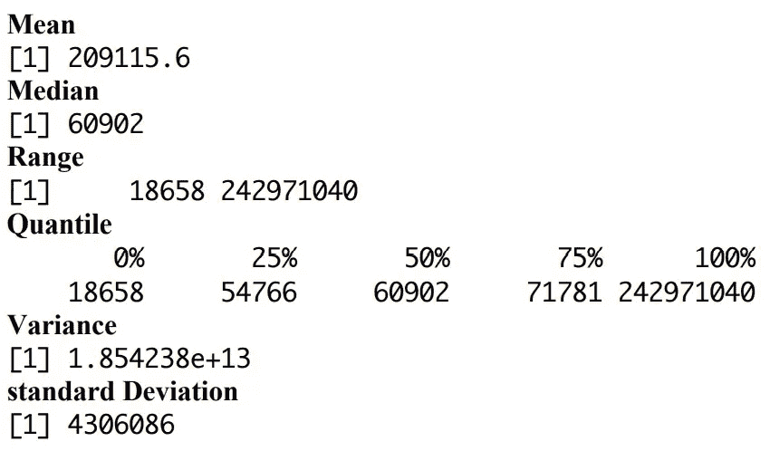

Fig 1: Data Exploration

*变异系数= 13.81227*

最后，方差系数用于比较两个不同的数据集。PREVALING_WAGE 列用于比较这些数据集中的工资差异。有趣的是，变异系数并不太高，这意味着平均值周围的离差水平很低。

> **PMF、CDF 和 2011- 2016 年受理申请的预期值**

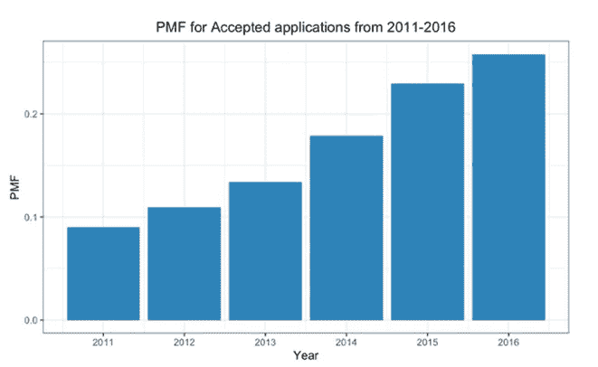

Fig 2: PMF for Accepted Applications from 2011–2016

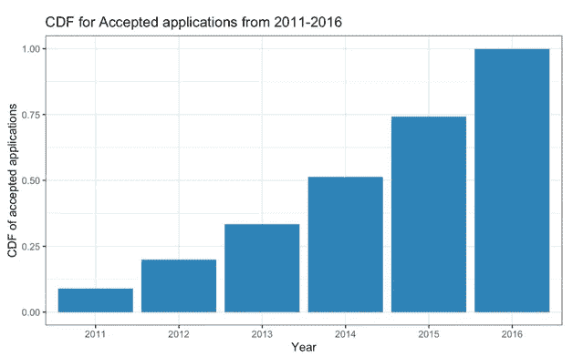

Fig 3: CDF for Accepted Applications from 2011–2016

在这里，我们正在查看数据科学专业人士的 PMF 和 CDF 已接受应用程序的分布。在 PMF 图表中，2011 年的概率约为 0.08，2016 年的概率约为 0.25。因此，这些年来，数据科学工作的接受概率逐渐增加，这受到许多因素的影响，如政策变化或对特定角色需求的增加。

此外，2011-2016 年签证申请人的年份和数量之间存在正相关关系，2011-2018 年期间的年份和普遍工资也是如此。

> **每年申请数据科学工作的人数**

图 4 显示，在巴拉克·奥巴马总统任期内，数据科学申请人每年都有所增加，但在 2017 年大选后，由于特朗普政府修订的新政策，数据科学申请人有所减少。2016 年，大约有 12000 名员工申请了 H1-B 签证。

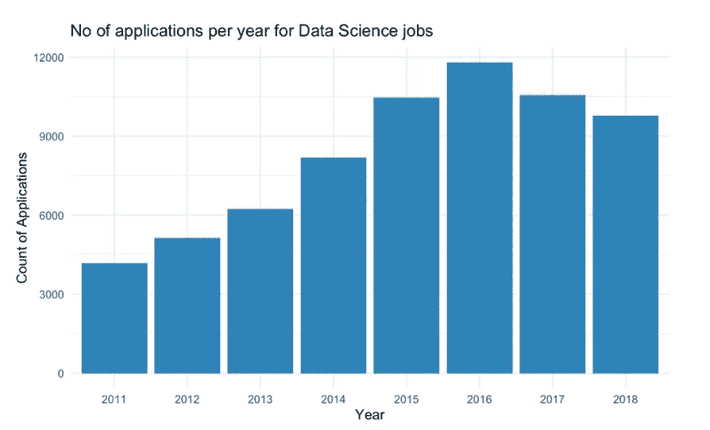

Fig 4 : Number of Applications per year for Data Science Job

> **H1B 签证情况分布**

下面的饼状图(图 5)向我们展示了 H1B 签证状态的分布，在这个数据集中，绝大多数情况下的状态是“已认证”。因此，我的进一步分析将只依赖于经过认证的案例，这将为这种情况提供更准确的见解。

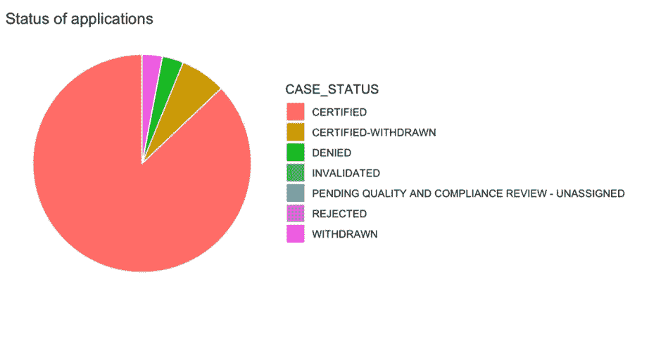

Fig 5 : Distribution of H1B Visa Case Status

> **现行工资分配**

观察主要工资向量分布的最简单的图示是直方图。然而，该数据集包含超过 300 万个文档，其中许多文档具有极值。显示工资直方图的另一种方法是随机抽取大约十分之一的记录，并从抽样数据集中排除最低 10%和最高 5%的数据点。

我们现在有了理想的普遍工资直方图。这种右偏分布表明，大多数外国雇员的年收入在 6 万美元至 6.5 万美元之间。分布的右尾向我们显示，随着工资的增加，外国工人越来越少。

但是这个柱状图最大的缺陷是我们没有根据通货膨胀调整工资。这张图表包括了 2011 年到 2018 年的所有数据。

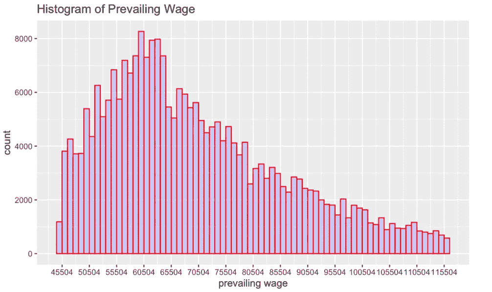

Fig 6 : Histogram of Prevailing Wage

> **H1B 各国的请愿书**

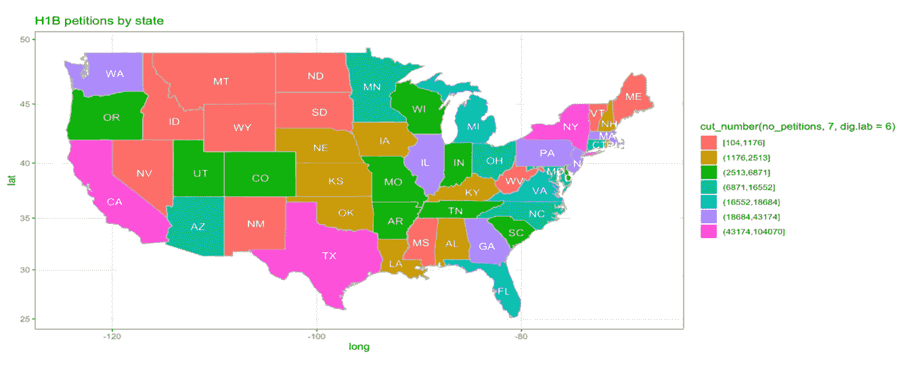

Fig 7 : H1B Petition by States

在过去的五年中，加利福尼亚州的 H1B 签证申请数量最多，其次是德克萨斯州和纽约州。

> **卡伦和弗雷图**

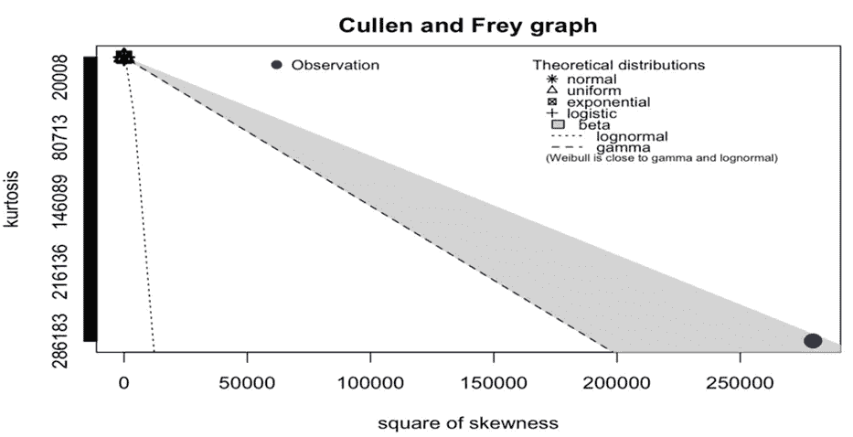

Fig 8 : Cullen and Frey Graph

因为从 Cullen 和 Frey 图可以明显看出，不止一个分布符合我们的数据集，所以我们使用逻辑分布来完成我们的分析并进行分布拟合。

> **拟合优度图**

“fitdist”类对象的图提供了四个经典的拟合优度图:

*   表示拟合分布的密度函数以及经验分布直方图的密度图
*   经验分布和拟合分布的 CDF 图

代表经验分位数(y 轴)与理论分位数(x 轴)的 Q-Q 图

*   P-P 图表示在每个数据点(y 轴)评估的经验分布函数与拟合分布函数(x 轴)的对比。
*   我们已经使用逻辑分布来创建良好的拟合图。

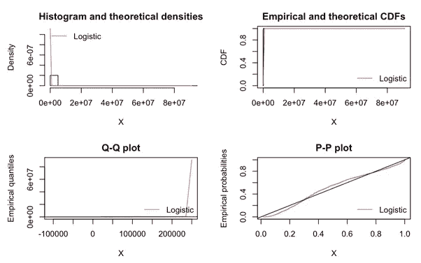

Fig 9 : Goodness of Fit Plots

> **前 10 名员工的现行工资**

我们可以从箱线图中看到，微软的工资中位数高于其他任何大型赞助商，工资范围为 0 美元到 15，000 美元。与其他公司相比，塔塔咨询公司现行工资的四分位数分布是最小的；换句话说，在塔塔咨询公司，H1B 员工中间的 50%的工资是最不稳定的。

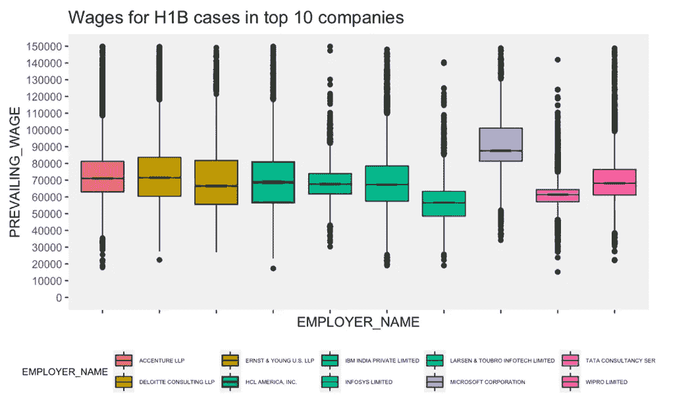

Fig 10 : Wages for H1B applicants in top 10 companies

> **各年度工资分配**

每年，大多数 H1B 申请人的工资在 5 万到 7 万美元之间。每年的工资分布是右偏的。

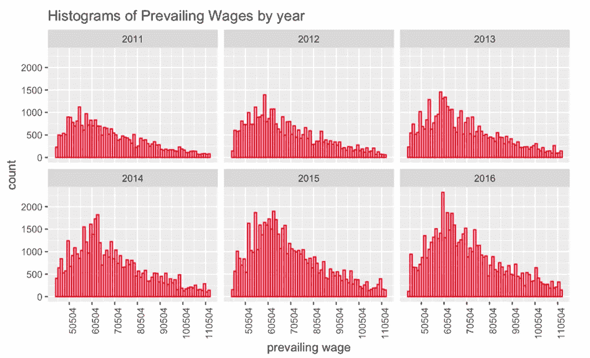

Fig 11 : Prevailing wage distribution from 2011–2016

# 统计分析

> **一个样本 Z 测试**

X =雇员工资的相对价值

H0: = 176240

H1≠176240

z 值= 0.1174008

由于 z 值在(-1.96，1.96)范围内，我们未能拒绝零假设并得出样本平均工资和总体平均工资之间没有显著差异的结论。

> **一个样本 t 检验**

该测试旨在了解微软公司员工的平均工资是否等同于人口平均工资。

因此，我们的无效假设和替代假设是:

X =雇员工资的相对价值

H0: = 84538.73

H1: ≠ 84538.73

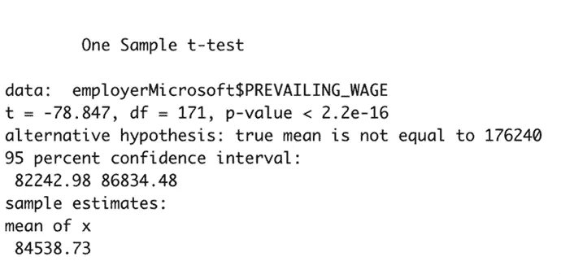

Fig 12 : One Sample t-test

当 p 值≤ 0.05 时，我们拒绝零假设，并得出结论:微软员工的样本平均工资与总体平均工资之间存在显著差异。

> **左尾巴测试**

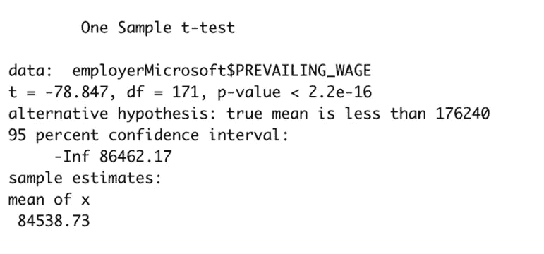

Fig 13 : Left tail test

> **右尾巴测试**

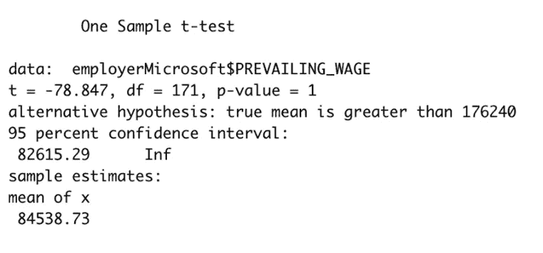

Fig 14 : Right tail test

> **两条尾巴测试**

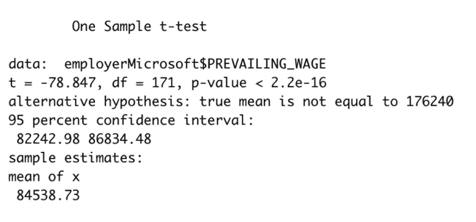

Fig 15 : Two tail test

> **双样本 Z 检验**

X1 =第一个样本中员工工资的标准差

X2 =第二个样本中一名雇员工资的标准差

H0:12 = 0

H1:12≠0

z 值= -1.719223

因此，对于α= 0.05 的显著性水平，我们无法拒绝零假设，因为 z 值位于范围[1.96，1.96]内，并得出两个样本的平均工资之间没有显著差异的结论。

> **两样本 t 检验**

X1 =第一个样本中一个人的工资的标准差

X2 =第二个样本中一个人的工资的标准差

H0: 1 — 2 = 0

H1: 1 — 2 ≠ 0

由于 p 值≥ 0.05，我们未能拒绝零假设，并得出两个样本的平均工资之间没有显著差异的结论，得出了与双样本 z 检验相同的结论。

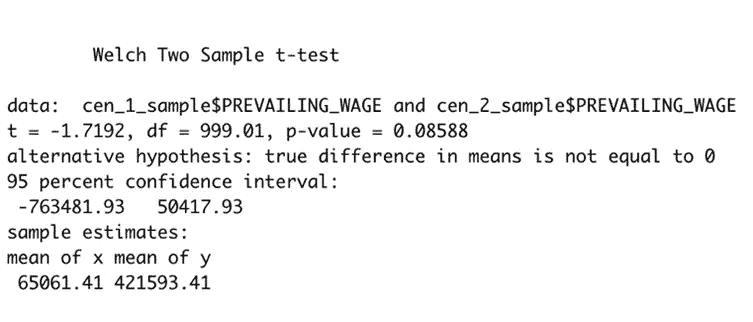

Fig 20 : Two Sample t-test

# 高级分析

逻辑回归是机器学习从统计学领域借用的技术。这是一种用一个或多个解释变量模拟二项式结果的强大统计方法。它通过使用逻辑函数(累积逻辑分布)估计概率来衡量分类因变量与一个或多个自变量之间的关系。

我们已经进行了逻辑回归，根据雇员的职称、全职职位、年份和工资来预测签证申请的接受程度。

下面是对给定数据集使用逻辑回归创建的模型的总结。

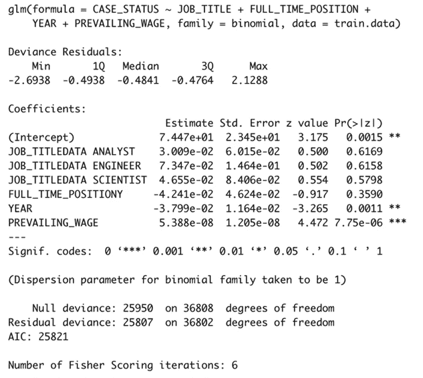

Fig 21 : Logistic Regression

从模型中可以看出，职位和年份的 P 值更能预测签证申请的状态。

为了更好地了解模型是否正确，我们根据测试数据确定了模型的准确性，得到了 88%的准确性。

> **结论**

该数据集中唯一直接可用的数字变量是 previous _ WAGE，因此我们决定基于不同的群体，在分析 H1B 工人的工资方面投入更多的精力。当我们试图绘制工资直方图时，我们注意到大量的数据加上极大值的存在减慢了这一过程。

最大的限制之一是数据集缺乏 H1B 工作人员的学术背景。一些人在美国获得大学学位，而另一些人在自己的国家获得大学学位。一些人遵循他们在学校所学的职业道路，而另一些人在毕业后进行了职业转型。这些都是重要的信息，可以帮助我对美国雇主对美国大学或 STEM 专业的偏好进行深入分析。

> **GitHub**

 [## GitHub-chaurevishwajit/EDA-H1B-签证

### H-1B 是一种基于就业的非移民签证类别，适用于美国的临时外国工人。对于一个…

github.com](https://github.com/chaurevishwajit/EDA-H1B-Visa) 

> **参考文献**

1.[https://www . data camp . com/community/tutorials/logistic-regression-R](https://www.datacamp.com/community/tutorials/logistic-regression-R)

2.[https://www.kaggle.com/jmpark746/h1b-visas?select=h1b16.csv](https://www.kaggle.com/jmpark746/h1b-visas?select=h1b16.csv)

3.[https://tinyheero.github.io/2016/03/20/basic-prob.html](https://tinyheero.github.io/2016/03/20/basic-prob.html)

4.[https://home page . div ms . ui OWA . edu/~ Luke/classes/stat 4580/qqpp . html](https://homepage.divms.uiowa.edu/~luke/classes/STAT4580/qqpp.html)

5.[https://geocompr.robinlovelace.net/adv-map.html](https://geocompr.robinlovelace.net/adv-map.html)