# 探索性数据分析:初学者指南

> 原文：<https://medium.com/mlearning-ai/exploratorydataanalysis-8ca08e630e8b?source=collection_archive---------0----------------------->


Photo by [Luke Chesser](https://unsplash.com/@lukechesser?utm_source=medium&utm_medium=referral) on [Unsplash](https://unsplash.com?utm_source=medium&utm_medium=referral)

如果你想启动机器学习，EDA 是一个很好的起点。那么，我们开始吧。

# 什么是 EDA？

探索性数据分析是一种确定给定数据集中最重要信息的方法，它通过单独和共同比较和对比所有数据属性(独立变量)来对输出变量进行分类。

# 我们为什么需要 EDA？

EDA 的主要目标是在做出任何假设之前帮助分析数据。它可以帮助检测明显的错误，以及更好地理解数据模式，检测异常值或异常事件，并发现变量之间有趣的关系。

你可以点击下面的链接从 kaggle 下载数据集。

[](https://www.kaggle.com/gilsousa/habermans-survival-data-set) [## 哈伯曼生存数据集

### 接受乳腺癌手术患者的存活率

www.kaggle.com](https://www.kaggle.com/gilsousa/habermans-survival-data-set) 

该数据集包含一项关于 1958 年至 1970 年间在芝加哥大学比林斯医院接受乳腺癌手术患者存活率的研究案例

让我们一步一步来，首先理解数据集，然后尝试几个不同的情节，看看我们能从中学到什么。

1.  理解数据
2.  我们实验的目标
3.  单变量分析
4.  双变量分析
5.  结论
6.  参考

# **1。了解数据集**

**1.1 导入所需库**

```
import pandas as pd
import matplotlib.pyplot as plt
import seaborn as sns
import numpy as np
```

**1.2 在 pandas dataframe 对象中加载数据集**

```
data = pd.read_csv("haberman.csv")#shape of data tells us no of columns , rows present in the data setdata.shape
```

**输出:** (306，4)

```
# This 
gives us top 5 rows of the data along with col names
data.head()
```

**输出:**

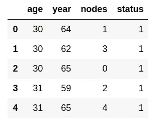

**1.3 属性描述**

1.“年龄”——这告诉我们手术期间患者的年龄，这是数字数据

2.“年份”——告诉我们操作是在哪一年进行的，是数值型数据

3.“淋巴结”——在患者体内检测到的阳性腋窝淋巴结(我在数据帧中将其改为淋巴结)的数量。这些淋巴结被称为淋巴结，如果癌症扩散，它们会出现在腋下

4.“状态”——这告诉我们患者在手术后存活的总年数

5.我们数据集中的**输入变量**是**年龄、年份和节点**。它们也被称为特征，通过它们我们可以分析我们的数据。

6.这里的“状态”称为输出变量/类变量

```
# get the information about the attributes present in data
data.describe()
```

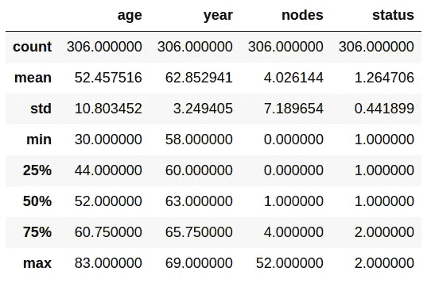

**1.4 检查任何一行中出现的空值**

```
data.isnull().values.any()
```

**输出:**假

在我们的数据集中，没有空值。在接下来的几个博客中，我们将看看如何处理有缺失值或空值的数据。

```
#To get information about data type of attributesdata.info()
```

**输出:**

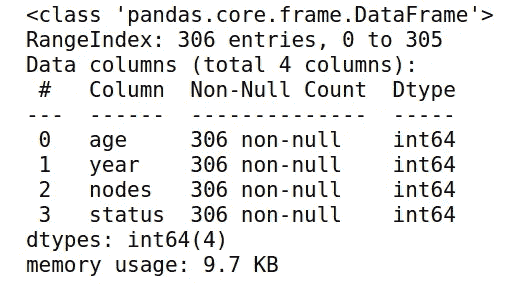

```
#checking different values present in status variable data['status'].value_counts()
```

**输出:**

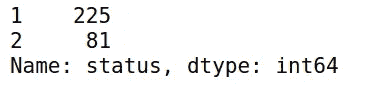

Above image is showing total no of 1’s , 2’s in status variable

状态属性有两种类型的数据点，即“1”或“2”

1 ->患者存活了 5 年或以上

2 ->患者存活不到 5 年

# **2。我们实验的目标**

我们的主要目标是使用不同的探索性数据分析技术，如配对图、单变量图和其他图，使用独立变量(如年龄、年份和节点)将患者分类为存活(1 类)或无存活(2 类)，以便绘制这些独立变量之间的关系，并确定我们分类问题的决定因素。

# **3。单变量分析**

1.  单变量分析是一种只使用一个变量的统计分析。这种分析有助于我们根据单一特征识别模式。

2.不同的单变量图，如 PDF、CDF、箱线图和 violin 图，可用于了解哪些特征对分类 **n** 有用

# 3.1 PDF(概率密度函数)

1.  通过称为 KDE(核密度估计)的过程平滑绘制的直方图(对于任何数值变量)来获得 PDF
2.  我们观察每个输入变量，看它是否能自己给输出值增值。同样，我们对所有输入变量做同样的事情，看看哪些变量可以提供最高值来将输出类分类为 1(生存)或 2(非生存)。
3.  在下面的 PDF 图中，x 轴包含我们考虑的独立变量的不同值，y 轴包含给定情况下 x 轴的频率/计数。

**年龄与计数的 PDF**

```
#pdf for "age" input variable
sns.set_style("whitegrid")
age_plot = sns.FacetGrid(data, hue="status", height=6)
age_plot.map(sns.distplot, 'age').add_legend()
plt.xlabel("PDF of AGE")
plt.ylabel("Counts")
plt.title("Probability density function between Age vs Counts")
plt.show()
```

**输出:**

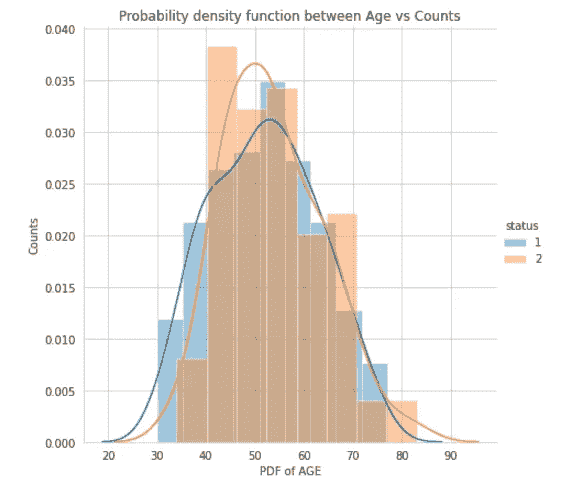

**观察:**

1.来自两个类别(1，2)的大多数数据点是重叠的，因此它表明患者的存活率并不依赖于患者的年龄。

2.30 至 40 岁之间生存的机会更多，40 至 60 岁之间生存的机会更少

3.在 60 到 75 岁之间，存活和不存活的机会大致相等

4.超过 90 岁，就没有生存的机会了

5.尽管我们可以从这个属性中推断出来，但是我们不能仅仅通过单一的参数来推断存活率

**年度与计数的 PDF**

```
# pdf of year plot sns.set_style("whitegrid")
year_plot = sns.FacetGrid(data, hue="status", height=6)
year_plot.map(sns.distplot, 'year').add_legend()
plt.xlabel("PDF of Years")
plt.ylabel("Counts")
plt.title("PDF between Years vs Counts")
plt.show()
```

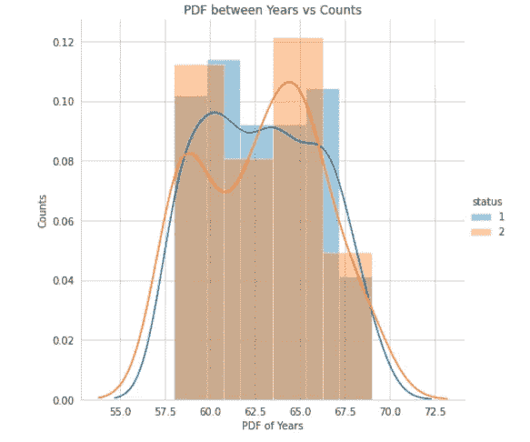

**观察:**

1.今年图中的大部分区域都是 1 和 2 重叠的，所以这不能成为患者存活的决定因素。

2.然而，大多数手术在 1957 年至 1965 年间失败，代表 2(存活时间不超过 5 年)的棕色在 1957 年至 1965 年间最为普遍。

**节点与计数的 PDF**

```
sns.set_style("whitegrid")
nodes_plot = sns.FacetGrid(data, hue="status", height=6)
nodes_plot.map(sns.distplot, 'nodes').add_legend()
plt.xlabel("PDF of nodes")
plt.ylabel("Counts")
plt.title("PDF between Nodes vs Counts")
plt.show()
```

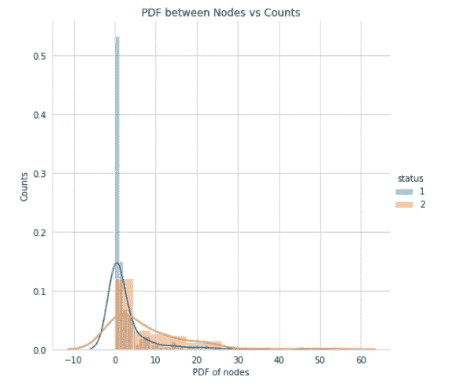

**观察:**

1.如果特定患者包含的淋巴结数量为 0 到 2，则存活机会很高

2.如果节点数超过 26，那么存活的机会就非常小

# **3.2 CDF(累积分布函数)**

1.  CDF 对于分析大部分数据在哪里非常有用，因为它给出了在 x 的特定极限之前存在的总值的百分比。

2.例如，对于某个 x=x1 处的给定值，CDF 告诉我们直到 val 出现的值的百分比

**绘制年龄的 CDF**

```
#splitting the data frame into two data frames having status as 1,2data_yes = data.loc[data["status"] == 1];
data_no = data.loc[data["status"] == 2];
#data_yes = all the data points in status where values are 1
#data_no = all the data points in status where values are 0#status = 1
counts, bin_edges = np.histogram(data_yes['age'], bins=10,
density = True)
#pdf gives you the total percent of output values (1 or 2) present #for the selected x value (which is age in our case)pdf = counts/(sum(counts))
cdf = np.cumsum(pdf)
plt.plot(bin_edges[1:], cdf,label=1)# status = 0
counts, bin_edges = np.histogram(data_no['age'], bins=10,
density = True)
pdf = counts/(sum(counts))
cdf = np.cumsum(pdf)
plt.plot(bin_edges[1:], cdf,label=2)plt.title("CDF for age of patients")plt.xlabel("Age of Patients")
plt.ylabel('cumulative % of patients')
plt.legend()
```

输出:

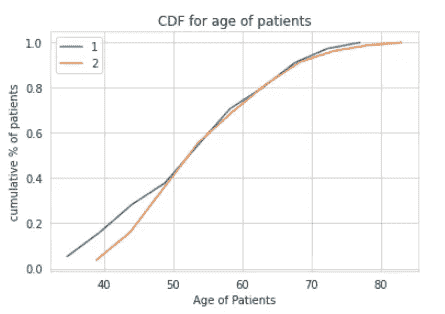

**观察:**

1.该图清楚地表明，属性“年龄”不能单独用于确定患者是否存活(因为橙色和蓝色的线在整个区域都重叠)

2.如你所见，如果患者年龄≤ 50，40 %的人可能存活，也可能不存活(因为两条线都是存在的，没有重叠)。因此，我们不能依靠这个属性来正确地对结果进行分类。

**绘制年度 CDF**

```
data_yes = data.loc[data["status"] == 1];
data_no = data.loc[data["status"] == 2];
#data_yes = all the data points in status where values are 1
#data_no = all the data points in status where values are 0#status = 1
counts, bin_edges = np.histogram(data_yes['year'], bins=10,
density = True)
pdf = counts/(sum(counts))
cdf = np.cumsum(pdf)
plt.plot(bin_edges[1:], cdf,label=1)# status = 0
counts, bin_edges = np.histogram(data_no['year'], bins=10,
density = True)
pdf = counts/(sum(counts))
cdf = np.cumsum(pdf)
plt.plot(bin_edges[1:], cdf,label=2)plt.title("CDF for year of operation")
plt.xlabel("year of operation")
plt.ylabel('cumulative % of patients')
plt.legend()
```

**输出:**

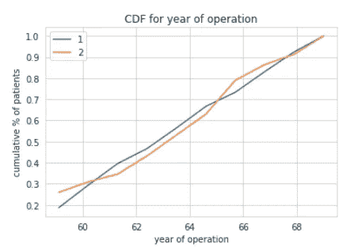

**观察:**

1.即使是年份属性也不能帮助我们将一个给定的患者分为两个不同的患者类别，因为图表是以相同的方式重叠和引导的。

**绘制节点的 CDF**

```
data_yes = data.loc[data["status"] == 1];
data_no = data.loc[data["status"] == 2];
#data_yes = all the data points in status where values are 1
#data_no = all the data points in status where values are 0#status = 1
counts, bin_edges = np.histogram(data_yes['nodes'], bins=10,
density = True)
pdf = counts/(sum(counts))
cdf = np.cumsum(pdf)
plt.plot(bin_edges[1:], cdf,label=1)# status = 0
counts, bin_edges = np.histogram(data_no['nodes'], bins=10,
density = True)
pdf = counts/(sum(counts))
cdf = np.cumsum(pdf)
plt.plot(bin_edges[1:], cdf,label=2)plt.title("CDF for No of nodes of patients")
plt.xlabel("Nodes")
plt.ylabel('cumulative % of patients')
plt.legend()
```

**输出:**

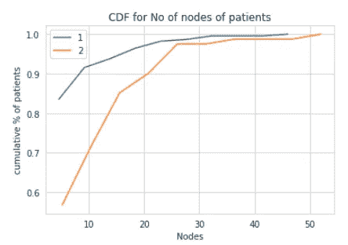

**观察:**

1.在洞察患者生存细节方面，该属性优于年龄和年份。

2.如果一个病人有≤ 4 个腋窝淋巴结，存活的机会接近 83 %;然而，随着腋窝淋巴结数量的增加，存活的机会明显减少。

# **箱线图**

箱线图是一种通过四分位数表示数字数据组的方法。

方框的下半部分代表绘制值的第 25 个百分位数(称为下四分位数)，中间部分代表第 50 个百分位数(中位数)，上半部分代表第 75 个百分位数(上四分位数)。

**年龄、年份和节点的方框图** s

```
#box plot for status vs age
sns.boxplot(x='status',y='age', data=data)
plt.title('status vs age boxplot')
plt.show()#box plot for status vs year of operation
sns.boxplot(x='status',y='year', data=data)
plt.title('status vs year boxplot')
plt.show()#box plot for status vs nodes
sns.boxplot(x='status',y='nodes', data=data)
plt.title('status vs node boxplot')
plt.show()
```

**三个地块的产量:**

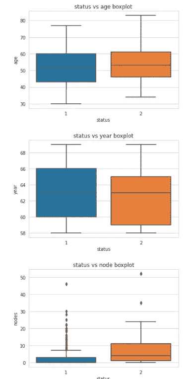

Width of the box seen ( in horizontal direction) doesn’t imply anything

**观察:**

1.对于年龄和年份的箱线图，很难进行分类，因为这两种属性的大部分数据是相同的，因此我们无法将它们完全归类为“1”类或“2”类，但在年份图中，可以推断的一点是，1960 年之前的生存机会非常小，1965 年之后的生存机会有所增加

2.与年龄和年份箱线图相比，节点的箱线图具有较少的重叠，年龄和年份的箱线图具有大量的重叠，且如果患者具有的节点数少于 4，则存活机会大部分是集中的

# **小提琴剧情**

它混合了方框图(中间突出显示的区域)和 pdf(当我们水平观察时，对称的 PDF 可以在 violin 图的左右两侧看到)

在 violin 图中，密度较高的数据区域较粗(意味着该区域中有更多的数据)，而密度较低的数据区域较细(该区域中存在的数据量较少)。

年龄、年份和节点的小提琴图

```
#VIOLIN PLOT FOR AGE ATTRIBUTE
sns.violinplot(x='status',y='age',data=data)
plt.title('status vs age violinplot')
plt.show();#VIOLIN PLOT FOR YEAR ATTRIBUTE
sns.violinplot(x='status',y='year',data=data)
plt.title("status vs year violinplot")
plt.show();#VIOLIN PLOT FOR NODES ATTRIBUTE
sns.violinplot(x='status',y='nodes',data=data)
plt.title('status vs nodes violinplot')
plt.show();
```

**输出:**

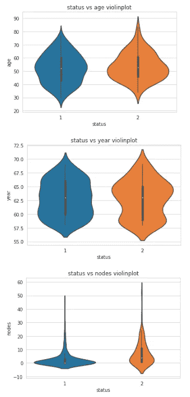

Black region at centre represents box plot

**观察:**

与箱线图类似，状态与年龄和状态与年份图的重叠程度很高，在状态与节点的 violin 图中也存在重叠，因此我们无法根据状态进行准确分类。观察结果仅与箱线图相同。

**整体单变量分析观察值**

1.节点数量与存活几率成反比，我们可以看到节点越多，存活几率越小

2.具有 1 个或 0 个淋巴结的患者存活最多，同时在该区域甚至几乎没有不存活的机会。所以我们不能完全按照地位来分类

3.年龄本身不能成为决定患者生存的决定性参数

4.Nodes 参数是所有三个参数中最有用的，但它并不总是正确的

# **4。双变量分析**

在此分析中，同时分析两个变量，以确定它们之间的关系，从而对输出变量进行分类。配对图、散点图(2D)

**4.1 散点图**

```
# Plot between age and year
sns.set_style("whitegrid");
sns.FacetGrid(data, hue="status", height=5).map(plt.scatter, "age", "year").add_legend();
plt.title('Scatter plot between Age vs Year')
plt.show();
```

**输出:**

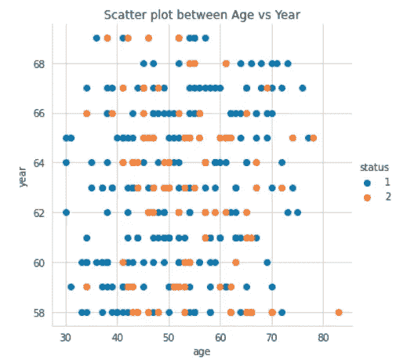

**观察:**

我们不能根据年龄对年图来判断患者的存活率，因为可以看出所代表的数据是不平衡的。但是，我们可以看到，随着患者年龄的增长，状态数据点的随机性保持不变，因此我们可以绘制其他配对点并检查关系。

**配对图**

为给定的独立变量一次绘制散点图，这样我们可以比较用 2 个独立变量绘制的配对图和用 2 个独立变量(年龄、年份、节点)的任何其他组合绘制的配对图，以查看哪种组合更好地导致输出变量的分类

```
sns.set_style("whitegrid")
sns.pairplot(data, hue="status", height = 5)
plt.show()
```

**输出:**

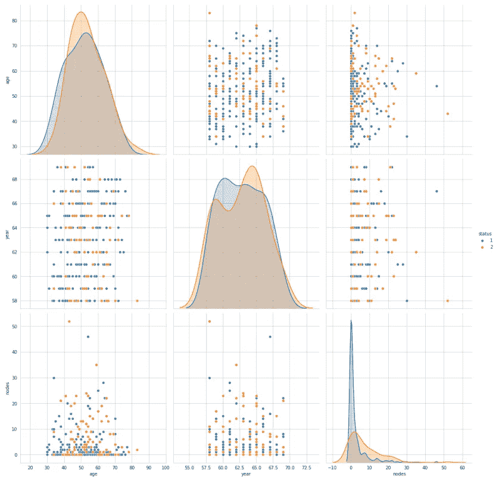

**理解剧情:**

1.  地块 2、地块 4 是相同的年龄、年份地块(仅属性互换)，类似地，第 3 和第 7 地块是相同的(年龄、节点)，第 6 和第 8 地块是相同的(年份、节点)
2.  图 1、5 和 9 分别表示年龄、年份和节点的 pdf

**观察:**

1.  在所有配对图中，很明显，年份和节点之间的配对图(即图 6 或图 8)相对更好
2.  所有其他情节都没有多少有价值的信息可以推断。

# **5。结论**

1.在给定数据的情况下，对接受手术的患者的生存状态进行分类是非常困难的，因为数据是不平衡的，因此我们需要更平衡的数据或其他有助于得出有价值见解的特征

2.像年龄这样的属性对患者的生存分类没有帮助

3.节点数量越多，存活的机会就越小，即使节点数量非常少或为零，存活的机会也是不确定的。所以我们不能确切地说。

# 6。参考文献

1.  [https://www.kaggle.com/gilsousa/habermans-survival-data-set](https://www.kaggle.com/gilsousa/habermans-survival-data-set)
2.  [http://archive . ics . UCI . edu/ml/datasets/Haber man ' s+survival high](http://archive.ics.uci.edu/ml/datasets/Haberman's+SurvivalHIGH)
3.  https://unsplash.com/@lukechesser?utm_source=medium[UTM _ medium = referral](https://unsplash.com/@lukechesser?utm_source=medium&utm_medium=referral)

感谢您的耐心和阅读整个博客。如果博客中有任何错误，请让我知道，以便我可以纠正它们。

我也很乐意回答你的问题..下次博客再见:)