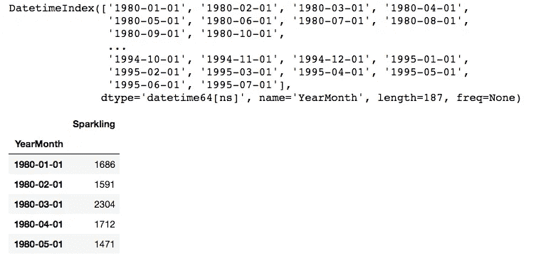
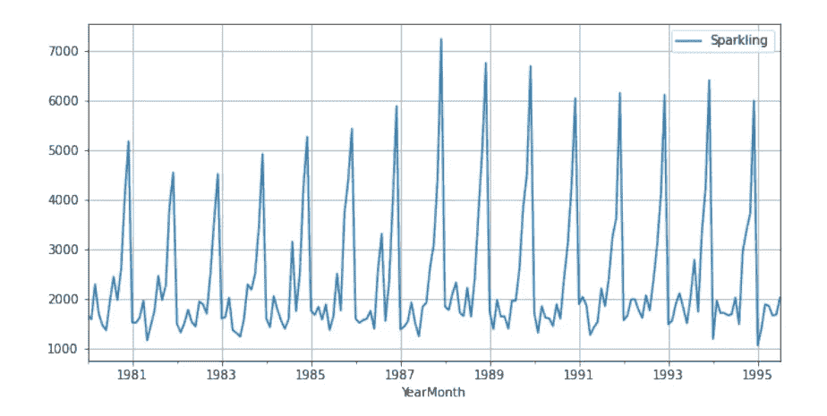
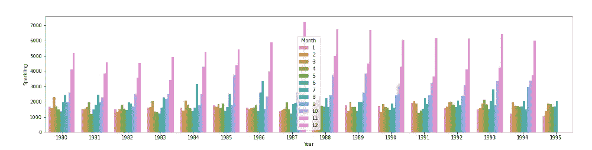
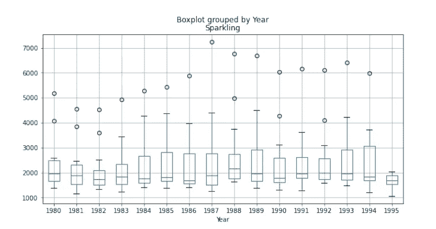
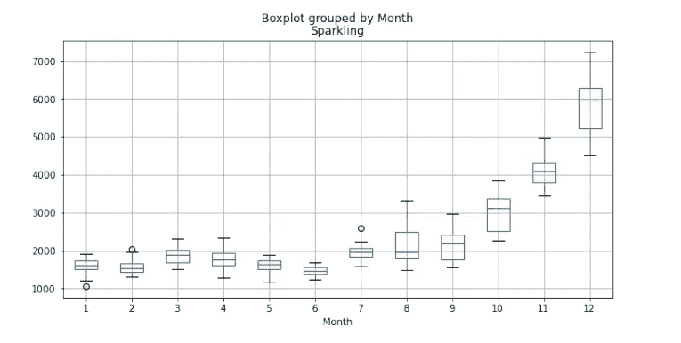
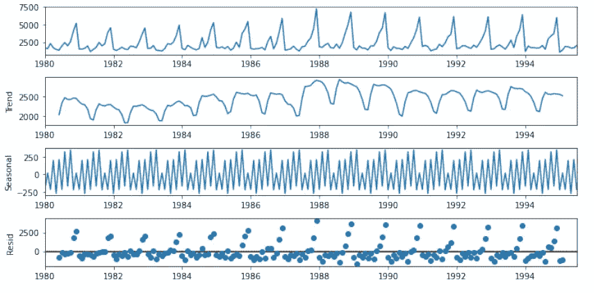
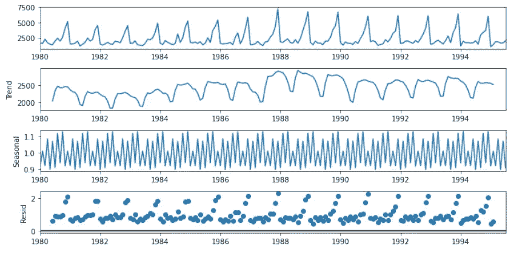
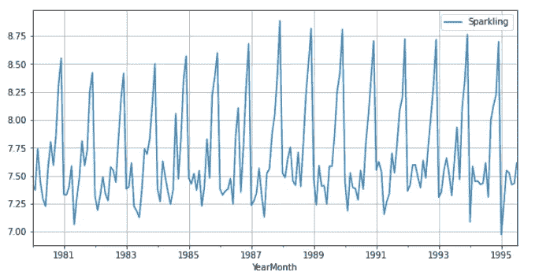

# 探索和分析时间序列

> 原文：<https://medium.com/mlearning-ai/exploring-analyzing-a-time-series-d1e9a8e2081a?source=collection_archive---------1----------------------->


Photo by [Nathan Dumlao](https://unsplash.com/@nate_dumlao?utm_source=medium&utm_medium=referral) on [Unsplash](https://unsplash.com?utm_source=medium&utm_medium=referral)

以有序方式记录的并且在时间上相关的观测值构成时间序列。时间序列的一个非常普遍的应用是用它来预测未来会发生什么。例如**销售预测、股票市场分析、库存预测等。**

利用时间序列而不是预测的另一个感兴趣的领域是异常值检测。离群点检测是从时间序列数据挖掘过程中得出的有重点的推论。时间序列数据挖掘旨在从历史数据中提取所有有意义的知识，这些历史数据以等间隔的时间间隔表示为一系列变量的值。

我将展示我分析 20 世纪葡萄酒销售时间序列的方法。以下是采取的步骤:

1.  探索性数据分析
2.  级数的分解
3.  推理

*注意:这个练习已经用 python 实现了。我在下面添加了代码片段。*

让我们看一下数据集的前几行及其图表:

```
sparkling_df = pd.read_csv("Sparkling.csv", parse_dates= True, index_col= 'YearMonth')  # Sparkling
#index_col= 'YearMonth'
display(sparkling_df.index)
sparkling_df.head()
```



Sparkling Wine Data set

```
from pylab import rcParams
rcParams['figure.figsize'] = 10,5
sparkling_df.plot(grid = True)
plt.show()
```



Plot for the Dataset

该图显示了 1985 年后的趋势略有增加，1991 年后保持不变，然而，它显示了明显的季节性(一种逐年可重复的模式)，尽管不能称之为不变。我们将深入探讨趋势和季节性，但首先，让我们深入探讨数据集本身。

条形图:

```
plt.figure(figsize=(20, 10))
ax1= plt.subplot(2,1,1)
sns.barplot(x = sparkling_df1['Year'], 
y = sparkling_df1['Sparkling'], hue= sparkling_df1['Month'], ax= ax1)
ax2= plt.subplot(2,1,2)
plt.show()
```



条形图的高层次视图向我们显示，葡萄酒销售额似乎在每年年底都会上升。

箱线图:

```
ax = sparkling_df1.boxplot('Sparkling', by= 'Year')
ax1 = sparkling_df1.boxplot('Sparkling', by= 'Month')
plt.show()
```



我们没有看到每年都有很多异常值，这有助于我们更好地理解分解中的季节性。月度箱线图不能给我们提供太多我们已经不知道的信息。

现在我们已经对数据进行了一些探索，让我们对时间序列进行分解。时间序列有三个组成部分:

I .趋势(Tx)—趋势是代表低频变化的时间序列的组成部分，高频和中频波动已被滤除。趋势用于捕捉长期变动，如果变量值在很长一段时间内保持法定值，则称该序列没有趋势

二。季节性(Sx) —以固定频率在系列中重复循环

三。残差(Ix)——序列中既不构成趋势也不构成季节性的部分，基本上是噪声

根据从数据集绘图中获得的最佳直觉，可以进行两种类型的分解:

1.  **加法**分解顾名思义，时间序列是其分量之和的函数(TS = Tx + Sx + Ix)而
2.  **乘法**分解，其分量乘积的函数(TS = Tx * Sx * Ix)

我们将探索我们系列的两个分解图:

```
#additive decompose
decompose_sparkling_add = seasonal_decompose(sparkling_df, model='additive', period=10)
ax = decompose_sparkling_add.plot()
plt.show()
```



Additive Decomposition

在相加分解中，我们看到一个不够平滑的趋势，然而，在 1986 年至 1990 年之后，这一趋势略有上升，随后又略有下降。一般来说，关于残差需要注意的一点是，残差必须具有随机性，这种随机性可以构成波动，最终有助于发现与通常模式不同的异常值。残差不应该捕获序列中的任何模式。这里确实显示了随机性。因为我们已经知道季节性的存在，我们现在唯一的动机是发现重复的块随着趋势的一个因素而变化&残差或者只是一些噪声的增加(波动)。现在我们来看看乘法分解。

```
#multiplicative decompose
decompose_sparkling_mul = seasonal_decompose(sparkling_df, model='multiplicative', period=10)
ax1 = decompose_sparkling_mul.plot()
plt.show()
```



Multiplicative Decomposition

乘法分解看起来非常类似于加法，除了尺度变化。在这个阶段，我们看到季节性和残差取决于趋势波动。峰值和噪声随着趋势增加而放大，尽管看不出很大的差异。让我们来看看我们的时间序列的对数变换。

如果序列是乘法的，它将被转换成具有恒定波峰和波谷的加法序列(平滑的季节性)

乘法— TS = Tx * Sx * Ix

加法—Log(TS)= Log(Tx)+Log(Sx)+Log(Ix)


Dataset Plot

```
from pylab import rcParams
rcParams['figure.figsize'] = 10,5
np.log(sparkling_df).plot(grid = True)
plt.show()
```



Logarithmic-Dataset plot

由于我们看不到明显的差异，可以说季节性与趋势无关，不规则性在本质上是相加的。

根据我们的最佳直觉，我们总结了以下几点:

1.  波动可以用于异常值分析，因为它们是特殊的，不会随着趋势或季节性的%或倍数而变化
2.  由于季节性是不变的，它可以被形象化&促销策略可以在低谷期前后制定
3.  在制定预测策略时，趋势和季节性可以分开处理

这是我对这个系列的分析，请让我知道你们是如何分析你们的系列的。谢谢！

[](/mlearning-ai/mlearning-ai-submission-suggestions-b51e2b130bfb) [## Mlearning.ai 提交建议

### 如何成为 Mlearning.ai 上的作家

medium.com](/mlearning-ai/mlearning-ai-submission-suggestions-b51e2b130bfb)