# 在足病临床网络上探索病人错过的预约

> 原文：<https://medium.com/mlearning-ai/exploring-patient-appointments-on-a-podiatry-clinical-network-62beef32f752?source=collection_archive---------6----------------------->

探索性数据分析

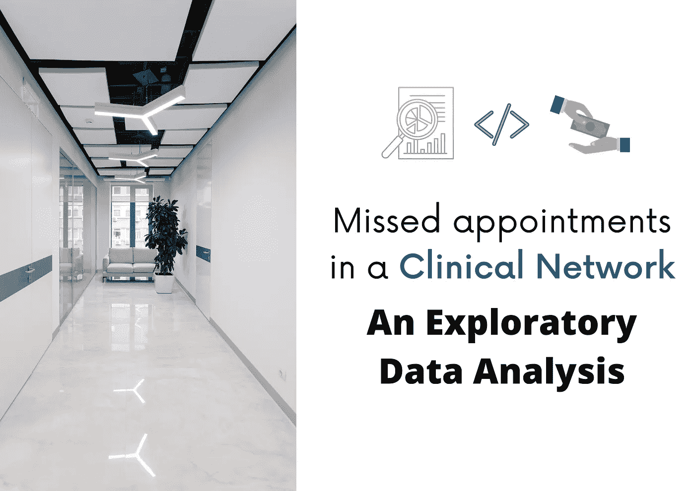

# 1.商业问题

一个专门从事足病学(与足、踝和下肢相关的医学领域)的诊所网络希望降低其诊所的错过预约率。为了制定战略决策，该小组需要知道哪个诊所的这个问题更严重，以及为什么病人会错过预约。

数据集是从 [Kaggle](https://www.kaggle.com/datasets/drjfalk/clinic-utilization-patient-missed-appointments) 中检索的，包含 2022 年 1 月 28 天的预约信息。这些信息包括医生 ID、诊所位置、预约时间、临床就诊原因、保险、就诊状态(预约结果)等等。响应是一个分类特征，对于约会有四种可能的结果:

*   完成
*   重新安排
*   取消
*   未出现(患者未出现且未联系诊所)

该项目由一个 ***探索性数据分析*** ( ***EDA*** )和 *Python* 进行，在 *Google Colab IDE* 上执行。此外，分析还涉及*描述性统计*、*数据操作*、*假设检验*和*数据可视化*。使用的工具有 **numpy** 、 **pandas** 、 **matplotlib** 和 **seaborn** 。本文报告了从分析中得出的主要结论和推论。

## 1.1 了解临床网络

足疗临床网络的一些特征如下图所示:

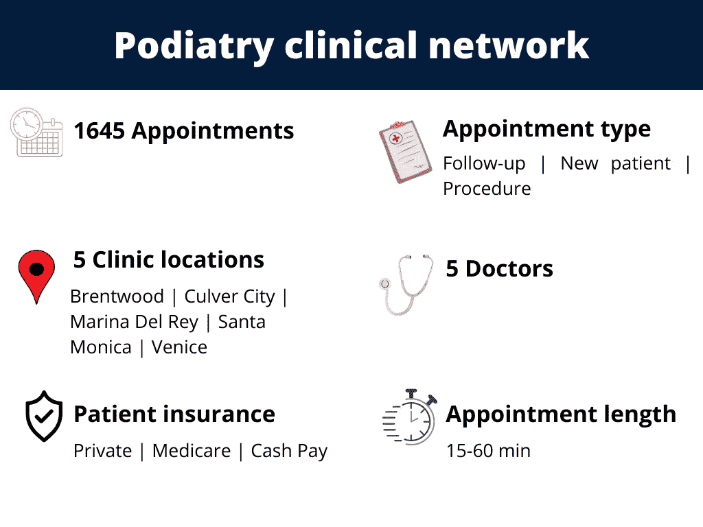

Some obtained characteristics by **descriptive statistics**.

这些特征是通过**熊猫**数据帧*数据帧*的 ***describe()*** 方法获得的:

The output of **dataframe.describe()** method.

## 1.2 评估错过的约会场景

错过的预约占临床网络所有预约的 7.8%。

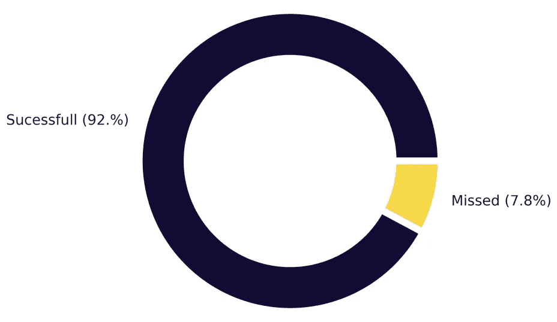

The proportion of **successful** and **missed** appointments.

然而，降低(2%)当前值可能会对临床网络产生有趣的财务影响。让我们假设一次门诊的平均费用是 60 美元。因此，错过约会在两种不同情况下的财务影响是:

> 今日: **- $7740.00**
> 
> 更好的情况: **- $-5765.99**
> 
> 差额: **$1974.00**

换句话说，通过将****减少 2%*** ，将获得临床网络的 **25%的经济效益***

# *2.假设检验*

> ***H1。关于错过的预约，所有诊所位置都是相似的。** *(假)**

*错过预约的问题在所有诊所位置都非常相似，然而，在这个问题上有更多的问题位置。简单地按位置绘制错过的约会，而不将这种方法标准化为总的预定约会，可能会导致 ***错误解释*** 。例如， **Marina Del Rey** 原本是错过预约*数量最高*的诊所。另一方面，**圣莫尼卡**的失约率*最低*。*

*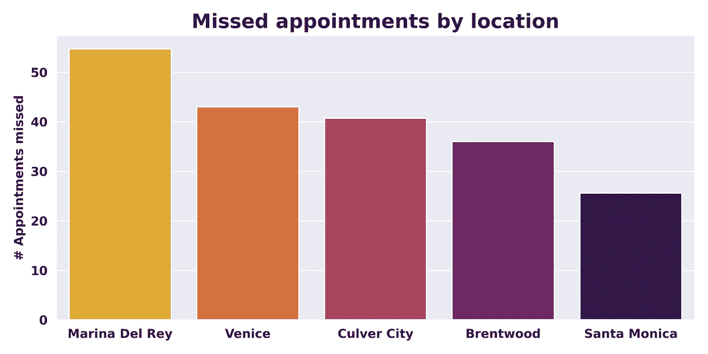*

*Visualization of the Results (missed appointments by location **without** standardization).*

*通过标准化上面的情节，我们有下面的结果。我们可以看到，威尼斯是**第二个**约会**多**的地方，然而，它是**失约**次数**最少**的地方。*

*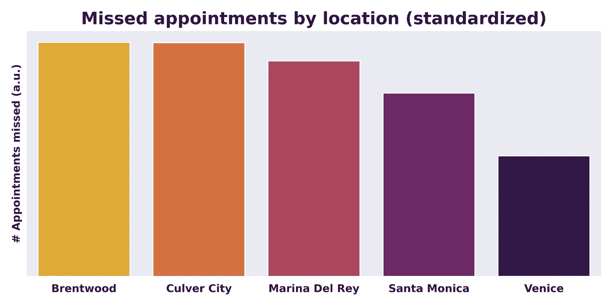*

***Standardized** results (missed appointments by location).*

> *H2。保险会干扰错过的约会。 *(假)**

*病人的三种保险按以下方式分配:*

*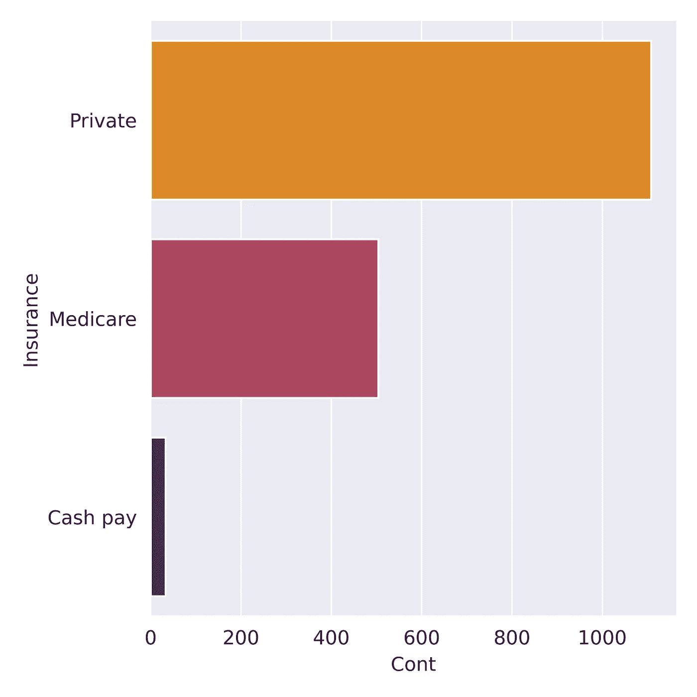*

***Insurance** for the Clinical Network patients.*

*此外，错过的预约似乎与每种保险类型的患者数量成正比。换句话说，`canceled`或`no-show`预约与每份保险的患者比例成正比。*

*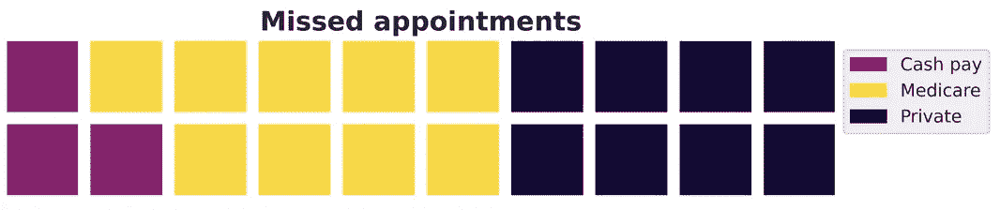*

> *H3。约会原因和错过的约会之间存在关系。 *(真)**

*如下面的输出所示，约会的原因似乎干扰了错过的约会。**日常足部护理**似乎对*失约*呈现出 ***更高的倾向*** (以`canceled`或`no-show`的方式表示)*

**

*Missed appointments by appointment **reason**.*

> ***H4。错过的约会取决于约会的长度。** *(真)**

*15 分钟的约会似乎有更高的`no-show`案例和相当多的`canceled`案例。同样，30 分钟的约会也有相当数量的`no-show`。因此，可能有些病人不愿意走很远的路去做 15 分钟的门诊。*

*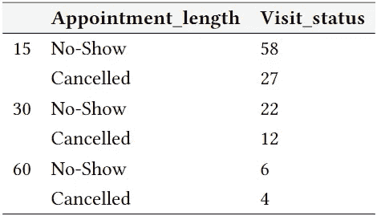*

*Missed appointments by the **length** of the appointment.*

> ***H5。有些医生对错过预约更有疑问**。*(真)**

*医生似乎有相似的失约率(标准化为每个人收到的所有预定预约)。然而，在失约率方面，医生 1 比其他医生更成问题。在做出任何可能影响他自信的决定之前，检查一下他是否可以被认为是一个`outlier`是一件有趣的事情。*

*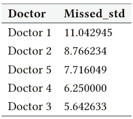*

***Standardized** missed appointments (in relation to *scheduled visits*) by **doctors**.*

*根据描述性统计(*使用****df . describe()****方法*)显示*的平均失约率为所有预约的 **7.9%** ，标准差为 **2.1%** 。因此，对于那些失约率高于 **10%** 的医生应该小心，就像**医生 1** 的情况一样。有趣的是得到一个箱线图。**

**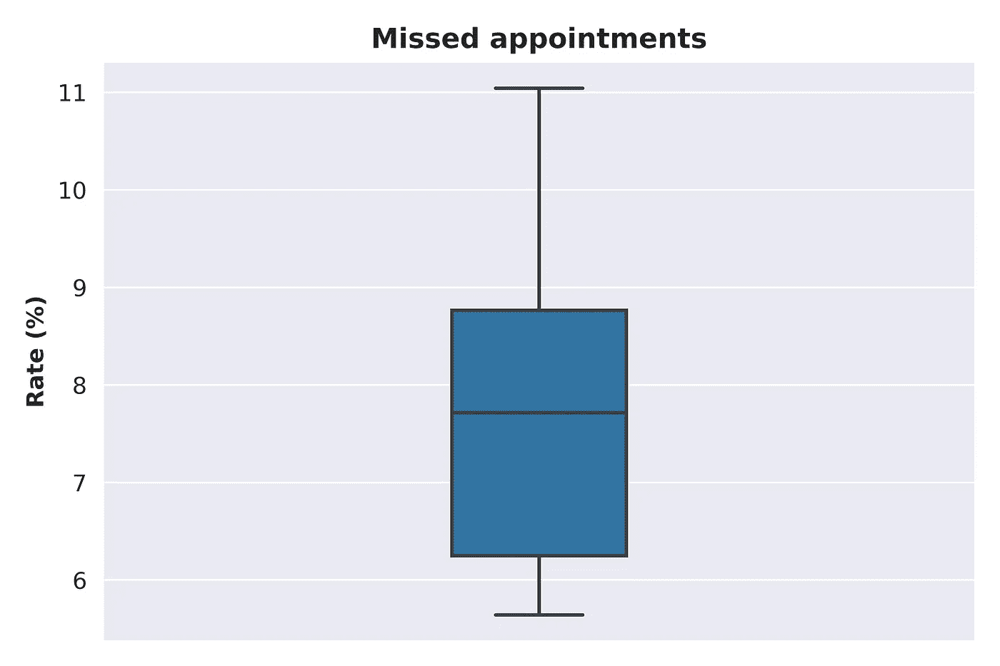**

****Boxplot** for missed appointments (considering all the **five doctors**).**

**从上面的方框图可以看出，**医生 1** 是**而不是**医生 1`outlier`，这意味着如此高的失约率可能发生在网络中的任何其他医生身上。此外，不应采取额外的激烈决策(例如离职)。**

> **H6。错过预约的比率取决于预约类型。*(真)***

**通过使用**熊猫**的 ***groupby()*** 方法，可以得到按约会类型划分的未赴约人数，如下图所示:**

**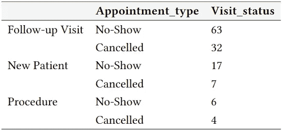**

**The output obtained by the **groupby()** method.**

*****复诊*** 比**新患者**有明显**更高的失约率**。由于患者可能会认为与**程序**相关的就诊对他们的生活更有影响，他们可能会倾向于**不会错过**预约。**

**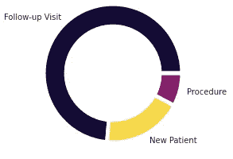**

# **3.结论**

**通过 **EDA** ，可以看到与错过的约会相关的一些关键点。因此，通过***做出决策*** 和 ***对这些点进行实验*** ，有可能**减少**在*足科临床网络*错过**预约**的百分比。**

**一些调查结果/建议如下:**

*   **尽管临床网络的**失约**率**较低**，但以此**率**的微小**下降**可能会对网络产生巨大的**财务影响**。**
*   ****保险**似乎对**而非**失约产生干扰。**
*   **与 ***常规足部护理*** 相关的预约可用于设计 **A/B 测试**和实验，因为与 ***常规足部护理*** 相关的门诊是具有**更多错过的预约**的门诊。**
*   **长度为 **15 分钟**的访问**更高**与 m **issed 约会相关，**因此在这些情况下应该小心。例如，临床网络可以为这些患者提供**更密切的联系**或**免税的驾车服务**，因为有可能跨越很长的距离获得短期的临床就诊。跟踪过去**患者关于错过预约的历史**可以被实现并用作有价值的数据。**
*   ****医生**有没有**不干涉**与 ***失约*** ，因此，这可以暴露给他们，以维持他们的**信心**。**
*   *****随访*** **重要性**应通过**活动**向患者公开。**

***Python 笔记本*和*数据*可以在 [**Github**](https://github.com/OviedoVR/Patient_missed_appointments) 上找到。你喜欢这个项目吗？免费与我连线[**Linkedin**](https://www.linkedin.com/in/vinicius-oviedo/)**。****

** [## Mlearning.ai 提交建议

### 如何成为 Mlearning.ai 上的作家

medium.com](/mlearning-ai/mlearning-ai-submission-suggestions-b51e2b130bfb)**