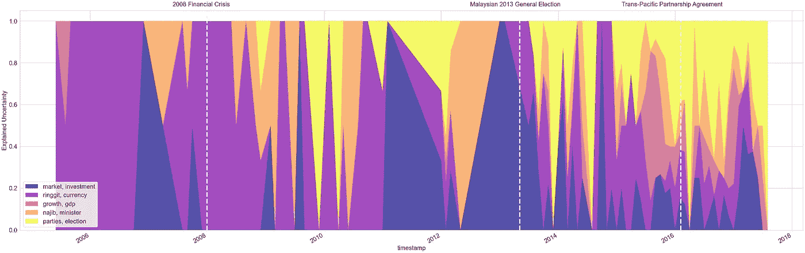
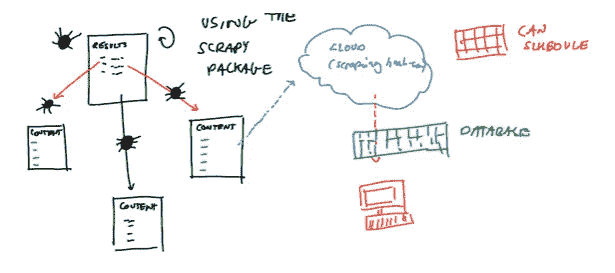
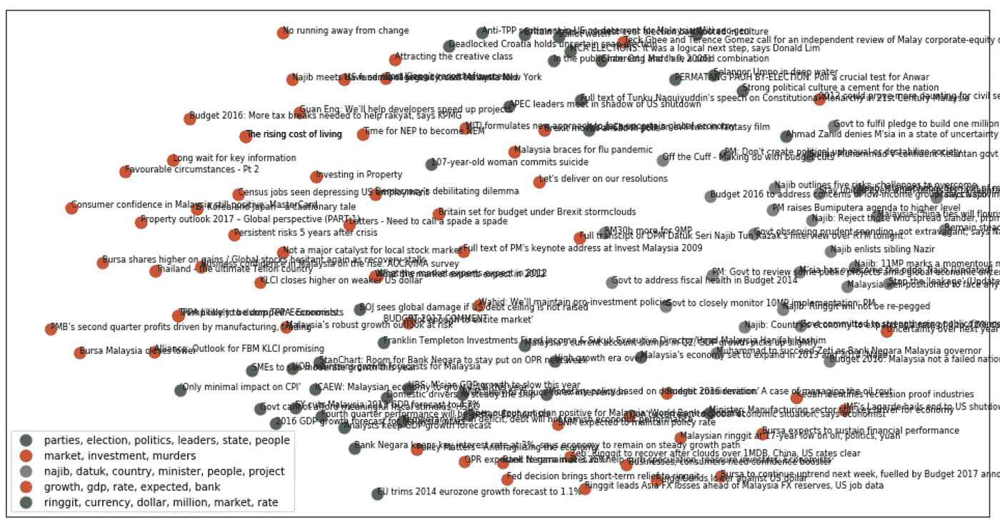

# 使用自然语言处理来可视化新闻内容中的不确定性

> 原文：<https://medium.com/mlearning-ai/exploring-policy-uncertainty-in-malaysia-from-the-eyes-of-a-physicist-6bb09ed6399b?source=collection_archive---------6----------------------->

## 从物理学家的角度探索马来西亚的政策不确定性

作为一名物理迷，我一直对政府中使用的定量分析很感兴趣。虽然我同意统计数据和数字不能说明全部情况，但以创造性的方式应用数学和计算机科学仍然很有趣，这可能有助于指导政策决策。

这篇文章将概述量化和定义公众对政府和政策的不确定性的重要性。我还将描述几年前我设计的一个简单的机器学习解决方案。作为可视化政策不确定性的第一步，我写了一段简单的代码。

## 公共政策中不确定性的作用

2021 年 8 月，穆希丁·亚辛辞去了马来西亚总理的职务。马来西亚人民选举了 2018 年 5 月上台的 Pakatan Harapan。政权更迭将马来西亚及其人民再次带入了一个不确定的时代。其领导层及其社会和政治政策的命运如何？在这个动荡的时代，理解和管理公众对其领导力的不确定性似乎变得越来越重要。

马来西亚的新闻记者和专家经常使用“重大政策变化后的不确定性”这个词，但他们很少做工作或分析来量化任何特定时期的不确定性程度。此外，将当前的不确定性与之前的不确定性进行比较的工作甚至更少。甚至对于*意味着什么*，已经有了复杂的哲学争论。我们也很少听说市民感到不确定背后的**原因**。随着马来西亚最近的政治变化，公众对新政府感到焦虑。但是为什么呢？

*   人们不确定整体经济的走向吗？
*   他们担心孩子的命运吗？
*   他们是否不确定将来如何处理新冠肺炎？

一旦对政策的不确定性有了更多的了解，一个更积极的政府可能希望采取几个实际步骤。他们可能会确定“高优先级问题”，这是最紧迫的，他们可能希望在这些确切的问题上向公众保证。它们还可以为那些特别关心不确定问题的外国直接投资来源提供保证。

## 我在数学系本科时第一次接触政策，以及一些学术灵感

那是 2017 年的夏天，我刚刚在剑桥大学度过了令人疲惫不堪的数学本科第一年。我知道我想在政府中有所作为，但我不知道如何运用我的特殊技能。我在政府部门认识的人都是经济学家，但我在第一年专注于物理应用数学，所以我的技能会有多大帮助还不是很清楚。幸运的是，我有机会在马来西亚中央银行的货币政策部门做一些研究。

我知道如何做一些基本的编码，并且有一整套大学一年级的数学知识来帮助我弄清楚我想做什么。最终，我和我的导师决定按照 Baker，Bloom and Davis (2016)中概述的精神，就量化公共政策不确定性的方法做一个粗略的项目。在这篇论文中，他们开发了一个美国经济政策不确定性指数，并研究了其自 1985 年以来的演变。作者统计了美国 10 家主要报纸上包含以下三个术语的文章:“经济”或“经济”；“不确定”还是“不确定”；以及“国会”、“赤字”、“美联储”、“立法”、“监管”或“白宫”中的一个或多个，然后对计数进行归一化，以考虑总体上发布的文章的变化数量。

利用报纸文章来量化政策不确定性，听起来是一个不错的起点。但是，我想做一些修改:

*   我更关心“解释”政策不确定性——所以我的策略是想办法将马来西亚新闻文章中与政策不确定性相关的不同主题形象化。因此，我想找到一种程序化的方法来对“政策不确定性文章”进行分类，并了解随着时间的推移导致不确定性的不同主题。但是，当然，指数仅仅是一种测量工具。毫无疑问，一个指数的*内容*和*故事*一样有趣。
*   我不想手动统计基于搜索结果的文章，所以我构建了一些 python 代码来自动从一系列马来西亚网站收集新闻文章元数据。

## 最终项目本身

因此，我最终选定的项目有一个三步走的计划，我执行了这个计划。首先，我将统计整个时间内发表的与政策不确定性相关的文章，然后将组成这些文章的“主题”可视化。

1.  首先，我找到了一种从各种马来西亚新闻网站大规模自动抓取文章元数据的方法，使用的是我用 Python 编写的自动抓取代码。然后，我必须做一些工作，只获取与马来西亚政策不确定性相关的文章，并过滤掉垃圾和清理数据集——我将在下一节描述这一点，我遵循的方法与贝克、布鲁姆和戴维斯提出的方法非常相似。
2.  一旦我有了与政策不确定性相关的文章的数据集，我就使用简单的聚类算法作为一种无监督的方法，将不同的文章分成五个不同的组，其中每个组代表政策不确定性的一个不同的“主题”。每个聚类的“标签”是最接近每个聚类的质心的前两个单词。因此，这些标签可以解释为每个集群的“主题”。
3.  最后一步是做一些初步汇总，以查看一段时间内每个集群中的文章比例，然后将其绘制在面积图中。

最终结果是成功抓取了 2005 年至 2018 年约 600 篇不同新闻文章的文章元数据。然后，我在单词矩阵上使用 k-means 聚类将这些文章分为 5 个不同的簇，每个簇都有标签(最接近质心中间的单词)，如下图所示。正如你所看到的，有趣的第一个结果是，每个质心标签都相当容易解释，每个聚类代表什么也很清楚——我不需要检查。看起来 k-means 聚类选择了相当自然的主题(完全由它自己)作为政策不确定性的可能类别。

下面的堆积图显示了这些集群在一段时间内的相对权重。y 轴显示了在给定时间，每个主题在属于不确定性的整套文章中的流行度的累积比例。如果有更多的某种颜色，那么就有更多的文章属于这一类别。x 轴是时间。总的来说，我们看到了一些并不令人意外的事件——围绕林吉特的不确定性几乎构成了 2008 年前后所有可解释的不确定性。我们还看到，在 2013 年大选前，围绕前总理纳吉布的不确定性有所增加。随着 2018 年大选的到来，对于谁将掌权存在严重的疑问，因此黄色的“选举”类别更加普遍。

One of the final outputs — a stacked area plot of the factors which explain policy uncertainty in Malaysian news articles. The topics were chosen through unsupervised clustering.

我认为这是一个初步的，但也许是有用的开端，让我们可以找到一种方法来可视化公共不确定性。如果我们在收集数据方面更加积极主动，这可能有助于政府和组织围绕上述可视化信息做出决策。我非常相信在政策决策中利用技术，这是一个新颖的例子。

这是一种远非完美的方法论。显然，人们对报纸的偏见、报道的准确性以及报纸是否准确地抓住了一个国家的心理存在疑问。此外，还有更多工作要做，试图捕捉整个时间内不确定性的相对“幅度”——然而，如果没有对任何给定时期马来西亚报纸的总生产率的估计，这个问题很难回答。

下面是我如何构建这个索引的一些粗略的注释。如果你对更多的细节感兴趣，请继续阅读。

## 构建 web 刮刀

首先，我选择了一系列受欢迎的马来西亚网站，我认为它们是马来西亚新闻生态系统的一个很好的样本。我还确保(根据我自己的直觉)我选择的网站不是来自公开的固执己见的来源——我不会在这篇文章中公开这些网站的名字。

然后我用 Python 混合使用了 *scrapy* 、 *beautifulsoup* 和 *requests* 包来建立一个自动的过程来抓取这些网站搜索页面中的链接。如果你是网络抓取的新手，理解如何使用 XPath 语法选择正确的网页元素会使这项工作更容易管理——在这个[网页](https://devhints.io/xpath)上有一个很好的 XPath 选择指南。

然后，我编写了一个自动循环，通过 web 服务下载与搜索中出现的每篇文章相关的文本内容，人们可以查找这些内容。这里的图表显示了流程:

## 过滤掉我们想要的

尽管我只收集了搜索中出现的文章——但我们的文章中仍然有很多垃圾文章。抽查显示，只有约 10%的文章包含可以说与“政策不确定性”有关的内容。所以我决定用一些简单的启发法来帮助我选择重要的文章。令人惊讶的是，我设法按照 Baker、Bloom 和 Davis 概述的方法得到了一些不错的结果，但是我把它改编成了这个用例。

在搜集了所有的文章之后，我只选择了那些至少包含了这些列表中的一个单词的文章:

*   *经济、经济、市场*
*   *不确定性，不确定性，不确定性*
*   *纳吉布，政府，议会，bnm，BNM*
*   *马来西亚，马来西亚，吉隆坡*

## 聚集文章的内容

我尝试用简单的 k 均值聚类来帮助我可视化所选文章的内容。我将文档转换成一个词频、逆文档频数矩阵，然后将文档聚类成 5 个簇。布兰登·罗斯(Brandon Rose)在这里有一个很棒的指南。下面，我们展示了集群和复合文档的图像。

I used Brandon Rose’s post on document clustering to generate some clusters myself.

*本文最初发表于 https://www.afiqhatta.com***。**