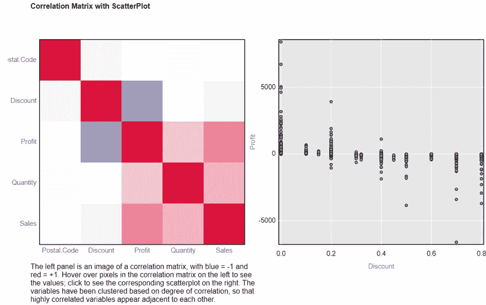
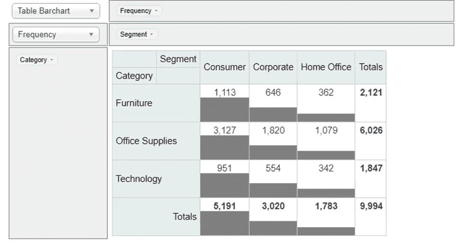
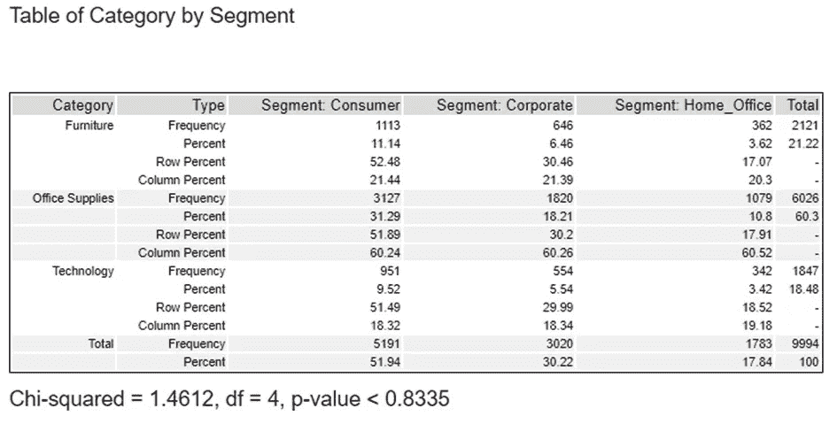

# 使用 Alteryx 探索数据中的关系

> 原文：<https://medium.com/mlearning-ai/exploring-relationships-in-data-with-alteryx-602750cbed7a?source=collection_archive---------5----------------------->

我正在认真准备几周后即将到来的 Alteryx 预测大师认证。你可以在这里找到更多关于这次考试的信息。出于准备的目的，我写博客一方面是为了巩固我的知识，另一方面是为了给读者提供进一步的浓缩学习材料。对于我的分析，我使用超市数据集。您可以选择下载类似的(！)数据集[这里](https://community.tableau.com/s/contentdocument/0694T000001GnpUQAS)。在该数据集中，一行对应于一个订单 ID 以及该订单中的产品。如果同一订单 ID 出现在多行中，则买家在购物车中有多个产品。

在我们能够执行有意义的分析或构建模型之前，我们需要理解我们的数据。模型的目标是以一种简化的方式表示一个上下文。因此，一个好模型的先决条件是节俭。数据调查用于确定我的数据的哪些字段应该包含在模型中，哪些不应该包含在模型中。

## 1.连续变量到连续变量

连续变量之间的关系总是可以使用相关性来映射。Alteryx 为此提供了三个工具:
-皮尔森关联工具
-斯皮尔曼关联工具
-关联分析工具

皮尔逊相关测量两个数值变量之间的线性关系，而斯皮尔曼相关系数则表明两个变量之间是否存在单调关系。两个工具都返回所选数值字段的相关系数。

如果您想要比较大量数值字段的相关性，那么关联分析工具是合适的。它返回一个交互式相关矩阵。输出可能如下所示:

(Image by author)

如果您单击相关矩阵的方块，散点图会在右侧调整。您不仅可以看到哪些变量可能与模型的选择相关，还可以看到哪里存在多重共线性的风险。

在关联分析工具中，您可以决定是基于皮尔逊系数还是斯皮尔曼系数来计算相关性。对于这个可视化，我选择使用斯皮尔曼相关系数。在这个示例中，您可以看到折扣金额和利润之间存在负的单调相关性。这是显而易见的，因为当你给一个折扣时，你自动有一个较低的利润。

## 2.连续变量到分类变量

一个量纲的不同表达式的平均值是否有显著差异？为了能够回答这样的问题，我们在 Alteryx 特别使用了两个工具:
-均值绘图工具
-均值测试工具

每个品类的销量是否相差很大？为了获得第一个视觉印象，我们使用了均值图工具。

(Image by author)

基于这一可视化，我们已经可以清楚地看到，所有三个类别的平均销售额都有很大差异。

如果我们不喜欢可视化，并且希望从统计上验证某些值之间的显著差异，我们可以使用均值检验工具。使用这个工具，我们必须选择一个值作为控制组。如果我们选择控制组“家具”，输出将如下:

(Image by author)

由于 p 值非常小，即使在 1%的显著性水平，人们可以拒绝零假设，即办公用品和技术的平均销售额与家具没有区别。

## 3.范畴关系

范畴关系可以用混淆矩阵来表示。Alteryx 为其创建提供了列联表工具。例如，如果我们要分析客户的细分市场和所购产品的类别之间的关系，会出现以下仪表板:

(Image by author)

如果可以使用过滤器将度量从绝对转换为百分比，并交换可视化的类型。通过查看列联表工具的 R 输出，我们还可以在一个表中查看所有关键度量。

(Image by author)

此外，我们获得了一个 p 值，当它接近 0 时，表明这两个变量之间的显著关系。

## 结论

彻底分析变量之间的相互关系对于决定模型中包含的变量非常重要。许多模型基于不应该有多重共线性的假设。人们可以使用本博客中介绍的工具来识别这些。此外，分析相关性有助于识别相关变量。

本博客涉及的工具:
-皮尔逊相关工具
-斯皮尔曼相关工具
-关联分析工具
-均值检验工具
-均值图工具
-列联表工具

 [## Mlearning.ai 提交建议

### 如何成为 Mlearning.ai 上的作家

medium.com](/mlearning-ai/mlearning-ai-submission-suggestions-b51e2b130bfb)