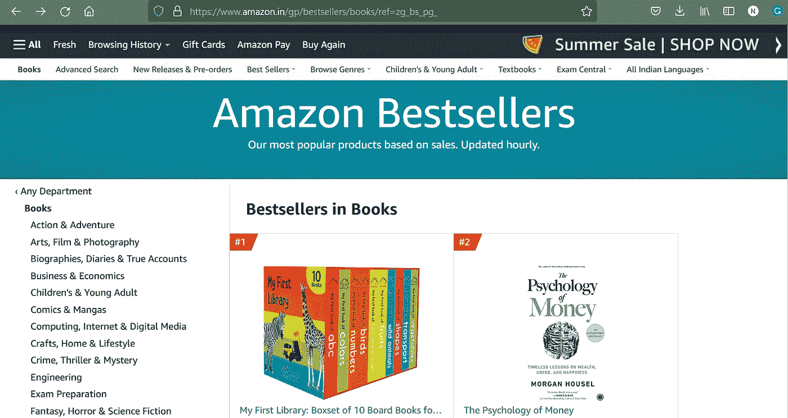
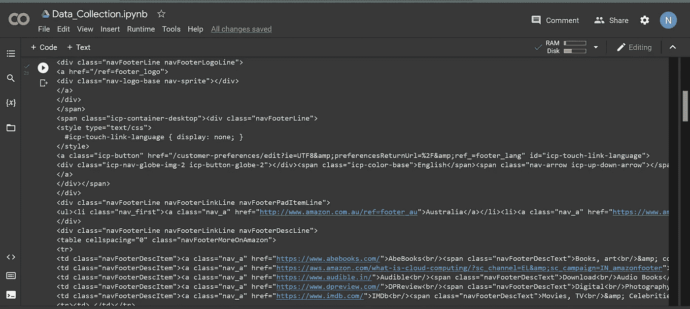
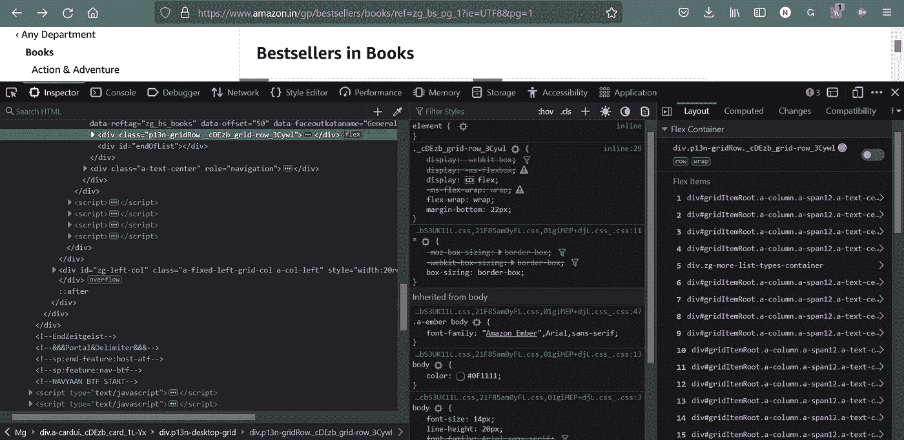

# 使用网络抓取探索亚马逊畅销书:Python，美丽的汤

> 原文：<https://medium.com/mlearning-ai/exploring-the-amazon-bestselling-books-using-web-scraping-python-beautiful-soup-3d42d029f184?source=collection_archive---------2----------------------->

# 介绍

紧跟 Instagram 潮流，这里给你一个观点。

PoV:您希望收集亚马逊上的畅销书信息。你去亚马逊网站，搜索畅销书，然后浏览网页，它显示了畅销书的矩阵。现在，你求助于提取信息的繁琐手段，即复制粘贴。选择第一本书，慢慢打开每个链接，将书的详细信息复制粘贴到 Excel 中。从单个链接复制粘贴数据似乎没问题；从 2 到 3 个链接看起来还不错，但是你很快就会想，“有更简单的选择吗？”“如何从可数的链接中提取信息？”


Image source: Canva

# 什么是网页抓取？

*网页抓取*可以定义为从网站和网页中加载、抓取、提取或筛选数据的自动过程。它使开发人员能够根据自己的需求获取、构建和分析数据。Web 抓取也可以称为 Web 数据抽取或 Web 收获，在数据挖掘中起着至关重要的作用。

此外，当我们探索用于数据收集的各种网页时，我们观察到因特网上可用的大部分数据属于非结构化数据，这可以在 HTML 格式中找到。然而，为了从数据中获得有意义的见解和关联，我们需要将数据转换成表格数据库或电子表格形式的结构化数据。

有几种方法可以用于网络搜集。其中一些包括:

1.  使用在线服务(ParseHub、Scrapy、BrightData)
2.  应用程序编程接口，即 API(Scraper Box API、可读性 API、WebKrawler API)
3.  从头开始创建您的 Web 抓取代码
4.  使用来自编程语言的内置框架和包(熊猫，硒，美丽的汤)

Google、Twitter 和 StackOverflow 等流行网站公开提供 API，以结构化格式访问它们的数据。如果一个人希望从一个不为他们的数据提供 API 的网站获取数据，Web 抓取是一个方便的工具。

本文将使用 Python 包——美汤收集数据，报废互联网。

**网页抓取基础**


Image Source: Google Images

首先，我们画出网站的 URL。
网页抓取器然后为提供的网站加载 HTML 代码。
然后，刮刀从代码中获取所需信息，并以用户指定的格式(Excel 表格、CSV 文件、JSON 文件)输出。

# 美汤网刮

Python 为我们提供了一个高效的库，叫做‘美丽的汤’。它允许网络抓取，并以刘易斯·卡罗尔(Lewis Carroll)在《爱丽丝漫游奇境记》(Alice's Adventures in Wonderland)中发表的一首诗“美丽的汤”命名。这是一个 Python 包，它解析不想要的数据，并允许我们从 HTML/XML 文档中提取数据。

**设置环境**

```
pip install requests
pip install html5lib
pip install bs4
```

请求-帮助我们从网站获取 HTML 内容
html5lib-帮助我们解析内容(可选)
bs4-帮助搜索并获取所需内容

为了处理 HTML/XML 文档，我们必须将 URL 链接转换为字符串，这需要“请求”的帮助。此外，HTML 内容可以被解析并形成树状结构，以便于遍历。

**我们将遵循的方法:**

1.  获取 URL
2.  获取数据
3.  将输出保存在 excel 表/中。csv 文件

我们使用以下链接查看亚马逊畅销书-【https://www.amazon.in/gp/bestsellers/books/ref=zg_bs_pg_ 

此链接将打开以下网页-



这个链接让我们只能访问显示亚马逊上前 50 本畅销书的第一个网页。如果我们想访问额外的页面，我们的网址将被改变。下一页的链接是-[https://www.amazon.in/gp/bestsellers/books/ref=zg_bs_pg_2?ie=UTF8 & pg=2](https://www.amazon.in/gp/bestsellers/books/ref=zg_bs_pg_2?ie=UTF8&pg=2)

所以，我们观察到的 URL 的格式是:
https://www.amazon.in/gp/bestsellers/book/ref = ZG _ bs _ pg _ '+pageno+'？ie=UTF8 & pg='+pageno

这为我们提取多个网页的代码提供了基础。我们定义一个函数来提取名为“get_data”的 URL。

我们分别创建请求和美丽的对象 Soup、r 和 soup。我们使用。以字节为单位获取响应的内容。或者，我们也可以使用。以 Unicode 格式获取响应内容的文本。解析器创建了一个类似树的结构。顾名思义，prettify 属性组织数据并使数据看起来更有说服力。

然而，如果我们输入页码为 1，我们将获得一个巨大的输出，可能不容易理解。因此，我们进一步细化了代码，以更有组织的格式获取信息。



# 步骤 2:获取数据

我们需要将 URL 链接提供给漂亮的 Soup 对象，以获取所需的信息。正如我们在上一步中看到的，我们知道每本书的每个 web 文档都有大量的数据。

整个 web 文档是用 HTML 编码的，我们的数据存储在 HTML 标签中；当我们查看网页时，我们看到每本书都有一个单独的分部，它属于 HTML 的' div '标签。此外，每个标签都有包含子数据的属性。

右键单击网页并选择 inspect 来检查原始 HTML 代码。代码将类似于下面所示。



如果我们希望分析代码，美丽的汤提供了几种方法。但是，我们为此使用了“find_all”和“find”方法。“find_all”将查找具有指定属性值的标签的所有匹配项，而“find”将只查找第一个匹配项。

人们可以将鼠标悬停在相应的书籍上，找到它们对应的 HTML 代码。我们希望获得这篇文章的书名、作者名、评级、图书类型、图书价格和相应的图书链接。用户可以右键单击任意细节，比如图书名称，并选择 inspect 选项来查看图书代码中的 HTML 行。

我们将编写下面的代码来提取我们想要的信息。

```
all=[]
    for d in soup.find_all('div',attrs={'class':'a-section a-spacing-none aok-relative'}):
        name=d.find('span', attrs={'class':'zg-text-center-align'})
        book_name=name.find('img',alt=True)
        author_name=d.find('a',attrs={'class':'a-size-small a-link-child'})
        ratings=d.find('span',attrs={'class':'a-icon-alt'})
        rating_score=d.find('a',attrs={'class':'a-size-small a-link-normal'})
        book_type=d.find('span',attrs={'class':'a-size-small a-color-secondary'})
        price=d.find('span',attrs={'class':'p13n-sc-price'})
        book_link=d.find('a',attrs={'class':'a-link-normal'})
```

现在，我们可以创建另一个列表，比如“all1”，我们将继续追加提取的信息。如果我们查看网页，我们会发现所有列出的书籍可能没有我们想要的所有信息。因此，我们需要下面的附加代码。

```
all1=[]
        if book_name is not None:
            all1.append(book_name.get('alt'))
        else:
            all1.append('unknown')
        if author_name is not None:
            all1.append(author_name.text)
        else:
            all1.append('unknown')
        if ratings is not None:
            all1.append(ratings.text)
        else:
            all1.append('unknown')
        if rating_score is not None:
            all1.append(rating_score.text)
        else:
            all1.append('unknown')
        if book_type is not None:
            all1.append(book_type.text)
        else:
            all1.append('unknown')
        if price is not None:
            all1.append(price.text)
        else:
            all1.append('unknown')
        if book_link is not None:
            all1.append('https://www.amazon.in/'+book_link.get('href'))
        else:
            all1.append('unknown')
        all.append(all1)

    return all
```

# 步骤 3:存储数据

现在，我们已经创建了我们的函数，使用这个函数，我们可以将我们的数据转移到一个数据框中，该数据框将用于将其保存在一个 excel 表中。为此，我们需要提到页数，即我们希望从多少页中提取数据。此外，我们可以创建一个函数，比如说“flatten ”,它将展平列表的子列表以压缩数据。

```
import pandas as pd
results = []
no_pages=5
for i in range(1, no_pages+1):
    results.append(get_data(i))
flatten = lambda l: [item for sublist in l for item in sublist]
df = pd.DataFrame(flatten(results),columns= ['Book Name','Author','Rating','Customers_Rated', 'Book_type','Price','link'])
```

既然我们已经提取了所需的数据，并将其修改为数据帧，那么我们可以将它存储为我们喜欢的任何格式。csv，代码如下。

```
df.to_csv('books.txt', sep='t')
```

网络抓取是一种广泛使用的从你选择的网站中提取信息的过程。你可以从 Flipkart 收集你选择的特定品牌的数据，从运动鞋网站收集关于他们的销售、趋势和更多应用的细节。我们需要 Python 库“美丽的汤”来做同样的事情。以前的 HTML 知识，即使理解网站的编码是一个优势，美丽的汤帮助我们从零开始从标记语言代码之间提取信息。

这标志着我们对亚马逊畅销书搜索的结束。如果需要，我们可以提取更多的信息，并使用美丽的汤的其他属性，如 type(soup)和 soup.title 来获取所需的内容。相同的网页抓取方法可以根据需要在不同的网站上使用。

# 参考

[什么是网页抓取？](https://www.google.com/url?sa=t&rct=j&q=&esrc=s&source=web&cd=&cad=rja&uact=8&ved=2ahUKEwi4mNiEn8b3AhVcUGwGHcGvCH0QFnoECAQQAQ&url=https%3A%2F%2Fwww.geeksforgeeks.org%2Fwhat-is-web-scraping-and-how-to-use-it%2F&usg=AOvVaw1MbAfQJ6g-XyKrpGnjZGzb)

[网页抓取教程](https://www.google.com/url?sa=t&rct=j&q=&esrc=s&source=web&cd=&cad=rja&uact=8&ved=2ahUKEwie6vCin8b3AhXrRmwGHWLdC04QwqsBegQIDRAB&url=https%3A%2F%2Fwww.youtube.com%2Fwatch%3Fv%3DxUs6F7qBhbo&usg=AOvVaw1NsEdiG6TiPN7LCk3FB9ll)

[数据帧到。csv](https://www.google.com/url?sa=t&rct=j&q=&esrc=s&source=web&cd=&cad=rja&uact=8&ved=2ahUKEwi-1eu_n8b3AhUTSGwGHUr1DSoQFnoECAUQAQ&url=https%3A%2F%2Fpandas.pydata.org%2Fdocs%2Freference%2Fapi%2Fpandas.DataFrame.to_csv.html&usg=AOvVaw0YU4NfV7GXp7ONlogqDITf)

请访问这个[笔记本](https://colab.research.google.com/drive/1XAcZPVyS9w9t6IYxYcOaD39DOX2duLOk?usp=sharing)以访问完整的代码并验证输出。

我希望你喜欢这篇文章！

如有任何信息、疑问或机会，请通过 https://www.linkedin.com/in/netrahirani/
T5 联系我

[](/mlearning-ai/mlearning-ai-submission-suggestions-b51e2b130bfb) [## Mlearning.ai 提交建议

### 如何成为 Mlearning.ai 上的作家

medium.com](/mlearning-ai/mlearning-ai-submission-suggestions-b51e2b130bfb)