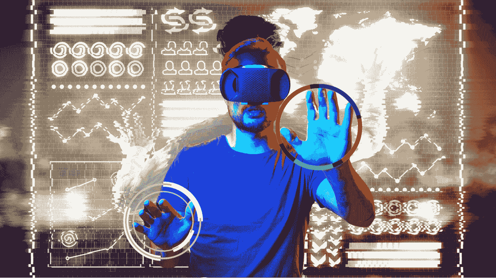

# 通过虚拟现实挡风玻璃探索数据世界

> 原文：<https://medium.com/mlearning-ai/exploring-the-dataverse-through-a-virtual-reality-windshield-92a4a82e3be3?source=collection_archive---------0----------------------->

## “一些人”的一次小小宣传，还是“人类的一次巨大飞跃”？

我想象以一种目前不可能的方式看到你的数据。伸出你的手，在三维空间中旋转，获得一个简单的空间限制之前隐藏的视角。那会是我们下一个伟大的探索吗？不是外部的…