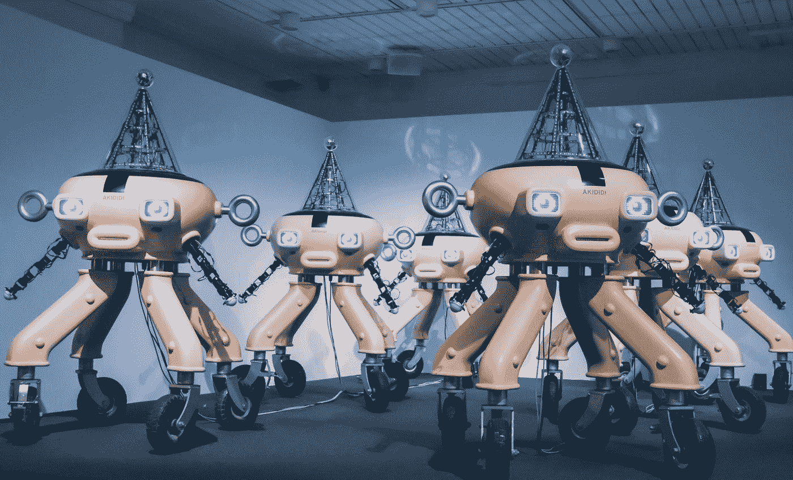

# 探索人工智能的魅力和恐惧

> 原文：<https://medium.com/mlearning-ai/exploring-the-fascination-and-fear-of-artificial-intelligence-66fcbec27096?source=collection_archive---------5----------------------->

人工智能(AI)长期以来一直是世界各地人们着迷和恐惧的主题。从早期的科幻故事到现代对工作自动化和人工智能超越人类智能的潜力的担忧，这个话题一直吸引着人们的想象力并引发了辩论。

Photo by [Ticka Kao](https://unsplash.com/it/@tin1023565?utm_source=medium&utm_medium=referral)

在这个故事中，我们将探索人工智能的各个方面，检查它的历史，目前的能力和未来的潜力。我们还将深入探讨围绕人工智能的伦理考量，并考虑社会如何应对它带来的挑战和机遇。

# 人工智能的历史

艾有着悠久而传奇的历史，其根源可以追溯到古希腊和皮格马利翁的神话，皮格马利翁是一位雕塑家，他创造了一座栩栩如生的雕像。在现代，人工智能的概念出现在 20 世纪 50 年代，当时研究人员开始探索创造能够像人类一样思考和学习的机器的可能性。

人工智能的早期先驱之一是英国数学家艾伦·图灵，他通常被认为是计算机科学之父。图灵最著名的工作是在第二次世界大战期间破解德国恩尼格玛密码，但他也对人工智能领域做出了重大贡献。1950 年，他发表了一篇论文，其中他提出了一个测试来确定一台机器是否可以被认为是智能的。这项测试，现在被称为图灵测试，涉及一个人类评估者与人类和机器互动，而不知道哪个是哪个。如果评估者不能区分机器和人，机器被认为通过了测试，被认为是智能的。

在随后的几十年里，人工智能研究继续前进，早期的成功包括自动驾驶汽车的开发和可以击败人类对手的下棋计算机的创造。然而，该领域也面临着重大的挑战和挫折，导致了现在所谓的“人工智能冬天”，这是一个人工智能研究资金和兴趣减少的时期。

在 20 世纪 90 年代末和 21 世纪初，人工智能经历了一次复兴，部分原因是海量数据的可用性和机器学习算法的发展，这些算法可以更有效地处理和分析这些数据。今天，人工智能是一个快速增长的领域，应用范围从医疗保健和金融到交通和娱乐。

# 人工智能目前的能力和局限性

自早期以来，人工智能已经走过了漫长的道路，今天的系统能够实现令人印象深刻的壮举。例如，人工智能驱动的语言翻译系统可以准确地将文本和语音从一种语言翻译成另一种语言，人工智能驱动的图像识别系统可以准确地识别照片中的物体和人。

然而，需要注意的是，人工智能系统的能力仍然有限。虽然它们可能能够高度准确地执行某些任务，但它们还不能完全复制人类思维和决策的复杂性和细微差别。

人工智能系统受限的一个关键领域是它们理解和解释上下文的能力。虽然人类可能能够根据上下文理解一个词或短语的含义，但人工智能系统可能很难做到这一点。当 AI 系统被要求执行需要深入理解语言或上下文的任务时，这可能会导致错误或误解。

人工智能的另一个局限是它无法像人类一样学习和适应。虽然可以训练机器学习算法来识别模式并基于这些模式进行预测，但它们不具备像人类一样从经验中学习的能力。这可能会限制人工智能系统的灵活性和适应性，因为它们可能会努力处理新的或意想不到的情况。

# 人工智能的潜力

尽管目前存在局限性，但人工智能有可能彻底改变我们生活的许多方面，并改变从医疗保健和金融到运输和制造的各种行业。

例如，在医疗保健领域，人工智能可用于分析医疗数据并提供治疗建议，使医生和护士能够专注于更复杂的任务。在金融领域，人工智能可用于分析市场和做出投资决策，有可能带来更高效、更有利可图的投资。在交通运输方面，自动驾驶汽车和卡车可以大大减少人为错误导致的事故数量，并提高运输效率。在制造业，人工智能机器人可以执行对人类来说危险或重复的任务，从而提高工作场所的生产率和安全性。

人工智能也有潜力帮助寻找复杂的全球问题的解决方案，如气候变化和贫困。通过分析大量数据并预测未来趋势，人工智能系统可以帮助决策者和研究人员确定并实施应对这些挑战的有效解决方案。

# 人工智能的伦理思考

随着人工智能的不断发展，并在我们的日常生活中变得越来越普遍，它提出了一些必须解决的伦理问题。一个关键的担忧是人工智能可能被用来歧视某些人群。例如，如果人工智能系统根据有偏见的数据进行训练，它可能会延续和放大现有的偏见，导致对某些个人或群体的不公平结果。

另一个伦理问题是人工智能可能取代目前由人类完成的工作，导致大范围失业和经济混乱。虽然人工智能有可能提高许多行业的效率和生产率，但重要的是要考虑对工人的影响，并确保在自动化面前有公平和平等的再培训和就业机会。

还有人担心人工智能可能被用于恶意目的，如传播错误信息或操纵公众舆论。确保人工智能系统透明和负责任对于防止这种滥用至关重要。

最后，随着人工智能系统变得更加先进，并有可能超越人类智能，我们应该如何对待这些智能机器并与之互动，这是一个问题。他们会被认为是平等的存在，还是会被看作是被人类利用的工具？我们将如何确定人工智能系统的权利和责任，以及我们将如何让他们对自己的行为负责？随着人工智能的不断发展，这些都是复杂而困难的问题，需要仔细思考和考虑。

# 政府和公司在监管人工智能方面的作用

随着人工智能变得越来越普遍和有影响力，政府和公司在监管其开发和使用方面发挥作用非常重要。这可能涉及为人工智能系统的设计和使用建立指导方针和标准，以及确保有机制让组织对其人工智能系统的任何负面影响负责。

政府可以通过建立管理人工智能使用的法律法规，在管理人工智能方面发挥关键作用。例如，可以制定法律来防止将人工智能用于歧视，或者确保公司对他们使用人工智能的方式保持透明。政府也可以资助人工智能领域的研究和开发，以确保它的使用方式有利于整个社会。

公司也有责任考虑其人工智能系统的道德影响，并确保以负责任的方式设计和使用它们。这可能涉及对人工智能系统进行道德评估，建立内部政策和使用指南，以及与外部组织合作以确保它们与更广泛的社会价值观保持一致。

# 社会在塑造人工智能未来中的作用

随着人工智能的不断发展，并更加深入地融入我们的日常生活，社会在塑造其发展和使用方面发挥作用是很重要的。这可能包括教育公众了解人工智能及其能力，以及鼓励就该技术的伦理影响进行对话和辩论。

社会塑造人工智能未来的一种方式是通过草根运动和倡导团体，提高对人工智能对社会潜在影响的认识，并努力影响与其开发和使用相关的政策决定。通过与政策制定者和行业领袖接触，这些团体可以帮助确保随着人工智能技术的发展，所有社会成员的利益都得到考虑。

社会也可以通过它作为消费者做出的选择来塑造人工智能的未来。通过支持透明和负责任地使用人工智能的公司，以及选择符合其价值观和信仰的产品和服务，消费者可以帮助塑造人工智能在世界上的使用方式。

# 结论

人工智能是一项快速发展的技术，有可能改变我们生活的许多方面。虽然它有很大的希望，但也提出了必须解决的重大伦理问题。确保以造福社会的方式开发和使用人工智能需要政府、公司和个人共同努力塑造未来。通过考虑人工智能的潜在影响，并参与关于其伦理影响的对话和辩论，我们可以应对它带来的挑战和机遇，并为所有人建立一个更光明、更公平的未来。

 [## Mlearning.ai 提交建议

### 如何成为 Mlearning.ai 上的作家

medium.com](/mlearning-ai/mlearning-ai-submission-suggestions-b51e2b130bfb)