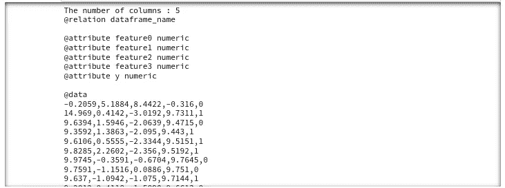
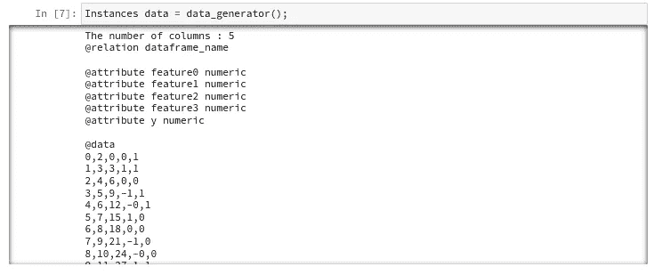
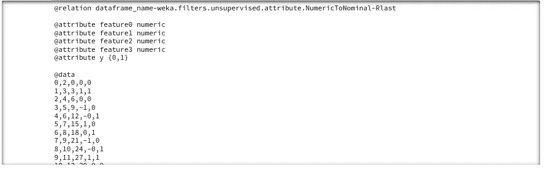
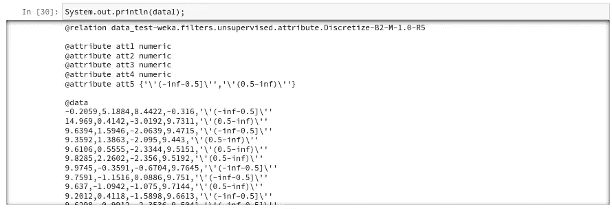
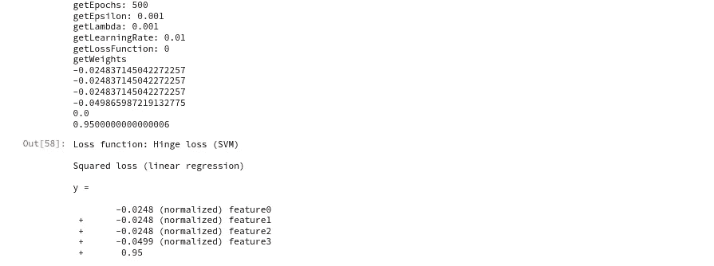
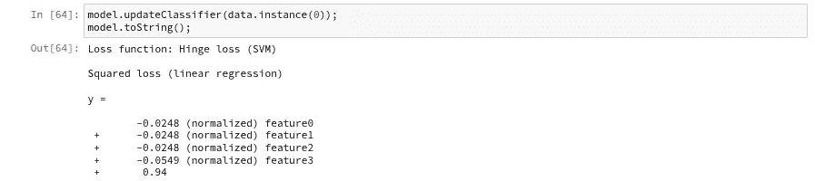
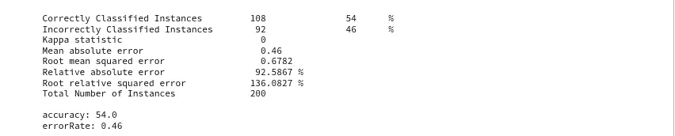
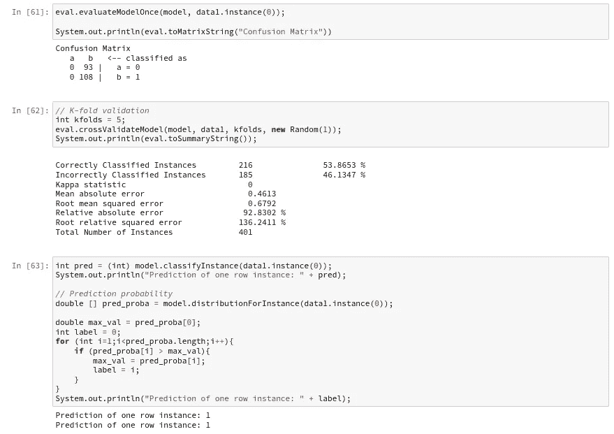

# 探索 Java Weka 机器学习库

> 原文：<https://medium.com/mlearning-ai/exploring-the-java-weka-machine-learning-library-48e842b88307?source=collection_archive---------1----------------------->

有几个星期，我需要使用一些 Weka 机器学习模型。我知道 Weka 因其 GUI 而闻名，但我不知道我可以用 Java 编码访问他们的库。很高兴你可以使用带有 Java 编码的 Weka，这些功能在[https://weka.sourceforge.io/doc.stable/](https://weka.sourceforge.io/doc.stable/)有解释。

与许多 Python 库(如 Pandas 和 Tensorflow)不同，Weka Java 没有给出许多如何执行函数的直接示例。我不得不在网上搜索如何正确调用函数的例子，这是一个漫长的过程。这篇博文是如何调用 Weka Java 的主要函数的快速指南。希望本指南能帮助其他人使用这个伟大的机器学习库。Weka Java 非常适合对快速流数据进行机器学习，许多功能执行迅速，数据按数据样本/行进行处理(每个数据帧行称为一个实例)。

我真的很喜欢学习 weka，因为与主流的 python/pandas/scikit _ learn/tensor flow/py torch 机器学习相比，它们实现了“不同”的术语和对机器学习主题的思考。

# 加载库

我在 jupyter-notebook 中使用 ijava 内核运行 weka 代码片段；有关链接，请参见参考资料部分。导入所需的 jar 文件。可以用*。jar 来导入所有依赖的 jar 文件，就像我下面做的那样，如果您找不到包含所有需要的可执行类文件的压缩/fat jar。

All the .jar files that are needed for the Weka Java library.

# 开始分类的主要 weka 功能！

## [0]加载 CSV 文件

Loaded data in terms of Weka: columns are represented as attributes and rows are represented as Instances.

查看上图，我们在 csv 文件中有 4 个列特征和一个标签/类别列。“关系”标签只是数据帧的名称，属性是一列，csv 文件中的所有数据行都称为实例。一行称为一个实例。

## [1]从流数据/java 阵列创建数据实例

data_generator 函数成功创建了一个“data frame”/数据实例。

## [2]将类别类型从数字更改为名义或二进制

在上图中，请注意属性要素和分类标签旁边显示的是“数字”。随着你更多地使用 weka 库，一些像 SMOTE 或 SGD 这样的函数会说它们要求类标签是“名义”类型。名义类型是类似字符串值。您可以使用过滤器(我更愿意把它看作是转换数据的预处理方法/管道)将类标签数据类型从数值型更改为名义型。Filter 函数可用于许多其他数据转换，而不仅仅是更改列的数据类型。

如果这个命令不起作用，我发现 Discretize 函数也可以将数值列转换成名义列。

## [3]训练分类器

除了定型模型之外，您还可以使用新的数据样本/实例来更新现有模型。根据新数据样本更新模型与根据新数据样本通过计算损失(即:在 Tensorflow 中使用 GradientTape)执行梯度更新相同；我们可以看到，由于“updateClassifier ”,模型权重发生了变化。

## [4]模型评估

我使用的数据只是随机组成的数据，所以它是合理的准确性是 54%的随机性能。

Weka 库很大！我在这里提到的函数只是运行一个基本模型的基本函数。总的来说，Weka 库非常有用，但它缺乏如何使用这些函数的例子，因此很难像 pandas/python 那样轻松地访问/转换数据。

一如既往的快乐练习！👋

# 参考

1.  在 juyper-notebook 中运行 Weka Java 代码片段是通过 iJava 内核实现的:[https://github.com/SpencerPark/IJava](https://github.com/SpencerPark/IJava)。
2.  Weka jar 文件下载:[https://jar-download . com/artifacts/NZ . AC . waikato . CMS . WEKA/WEKA-stable/3 . 8 . 0/source-code](https://jar-download.com/artifacts/nz.ac.waikato.cms.weka/weka-stable/3.8.0/source-code)。请注意，如果您使用较新的功能，如 SMOTE，它们不包括在下载中。因此，您需要单独搜索这些 jar 文件，并将它们链接到您的笔记本。
3.  韦卡图书馆。【https://weka.sourceforge.io/doc.stable/ 

 [## Mlearning.ai 提交建议

### 如何成为 Mlearning.ai 上的作家

medium.com](/mlearning-ai/mlearning-ai-submission-suggestions-b51e2b130bfb)