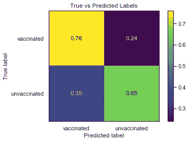
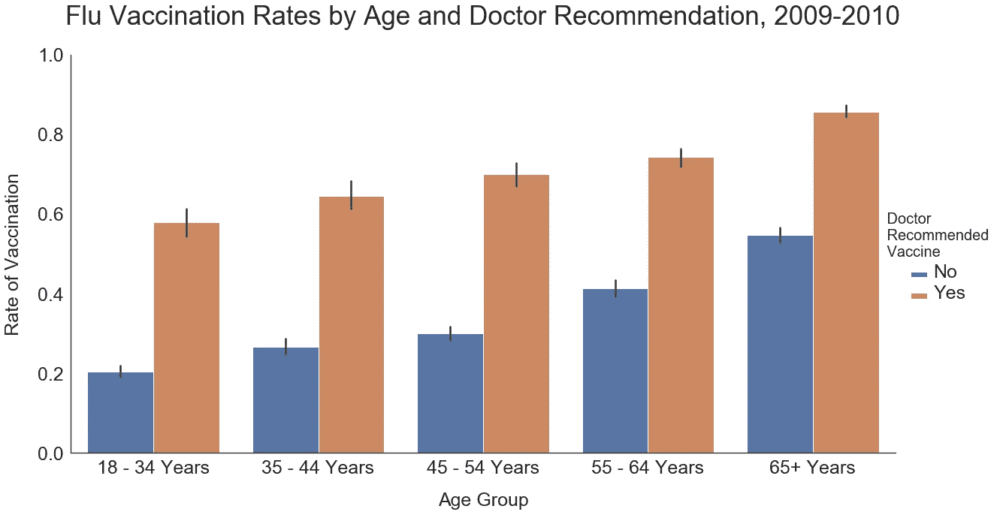
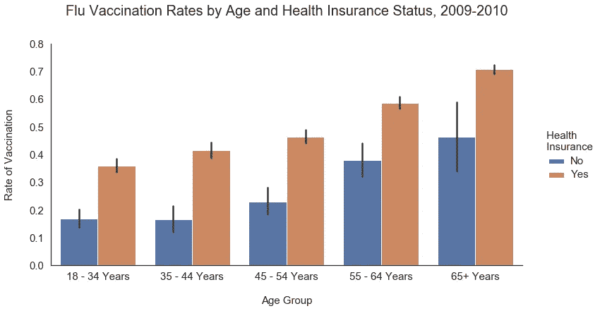
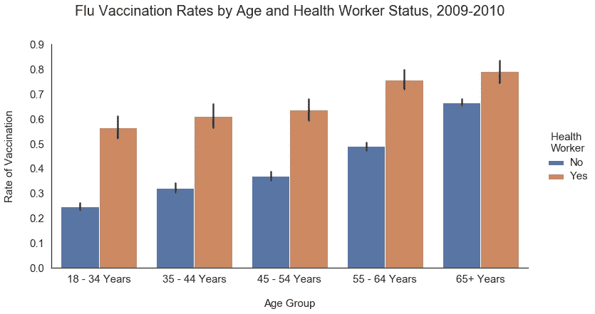
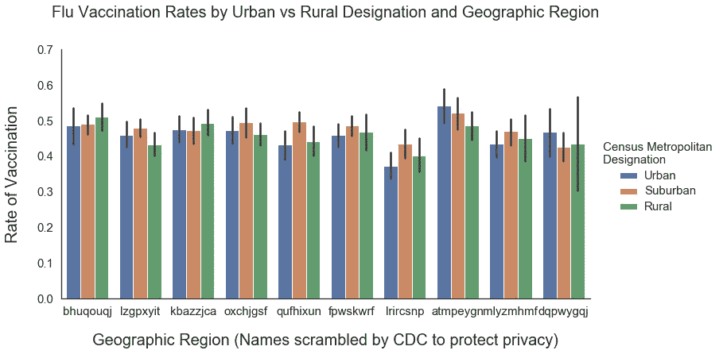

# 通过数据科学探索疫苗犹豫:2009 年季节性流感疫苗分析

> 原文：<https://medium.com/mlearning-ai/exploring-vaccine-hesitancy-through-data-science-an-analysis-of-seasonal-flu-vaccines-in-2009-538f8cb9eb63?source=collection_archive---------3----------------------->

美国处于一个特殊的位置。据《华盛顿邮报》报道，截至 5 月 23 日，39%的人口接种了新冠肺炎疫苗，另有 10%的人口接种了第一针疫苗，成为世界上接种疫苗最多的国家之一。

然而，由于剩余的美国人对疫苗犹豫不决，每天接种的疫苗数量[在 4 月中旬](https://www.npr.org/sections/health-shots/2021/01/28/960901166/how-is-the-covid-19-vaccination-campaign-going-in-your-state)达到高峰，此后一直在下降，这使得[不太可能通过疫苗接种实现群体免疫](https://www.nytimes.com/2021/05/03/health/covid-herd-immunity-vaccine.html)。

专家们现在正在探索接触那些犹豫不决的人的方法，并承认犹豫不决可能有不同的原因。虽然有些人可能对尝试未经时间考验的新事物持谨慎态度，但其他人可能愿意接种疫苗，但不愿从日常工作中抽出时间或前往陌生的地方接种疫苗。

在这个故事中，我将分享我对 2009 年美国流感疫苗接种率数据的分析结论，我希望这可以为当前关于犹豫不决的讨论提供信息。我检查了这些数据，作为熨斗学校数据科学训练营[机器学习项目](https://github.com/lilisbeit/vaccine-learning)的一部分。尽管 2009-2010 年流感季节的背景与当前的全球疫情非常不同，但数据显示不同人群之间疫苗接种率的差异并不是一个新现象。影响 2009 年流感疫苗接种率的主要因素是医生是否推荐疫苗、年龄、健康保险状况以及农村与城市的位置。包括保健在内的某些职业类别的疫苗接种率也很高。

虽然已经有很多关于对疫苗接种持犹豫态度的种族和民族群体的文章，但这些数据讲述的故事主要是一个可及性的故事:看过医生、有健康保险或从事某些职业的人更有可能接种疫苗。疫苗接种率也随着年龄的增长而增长，这意味着年轻人(2009 年为[现在为](https://covid.cdc.gov/covid-data-tracker/#vaccination-demographics-trends))不太可能优先接种疫苗。虽然让那些对疫苗接种持犹豫态度的社区参与进来当然很重要，但也不应该忽视改善获取途径和让年轻人参与进来。

# 项目商业案例

我的项目的目标是建立一个机器学习模型，可以预测哪些患者最不可能接种流感疫苗。然后，卫生保健组织可以接触这些潜在的犹豫不决的患者，以提高其患者群体的免疫力。(当然，卫生保健组织应该首先针对最有可能出现流感并发症的患者，将社区范围的免疫作为次要目标。)

# 数据背景

这些数据来自[全国 2009 H1N1 流感调查](https://www.cdc.gov/nchs/nis/data_files_h1n1.htm)，这是一项政府赞助的电话调查，旨在监测 2009 年至 2010 年流感和 H1N1 疫苗接种率。具体来说，我使用了 DrivenData 为其[流感疫苗学习](https://www.drivendata.org/competitions/66/flu-shot-learning/)竞赛策划的数据。我只使用了卫生系统存储在其电子健康记录中的健康和人口统计数据，尽管调查结果也包含与健康相关的观点和行为的信息。

该数据包含来自 18 岁及以上美国人的 20，000 多份调查回复，并显示约 47%的受访者接种了流感疫苗。这些回答显示了每个回答者的年龄、性别、种族、婚姻状况、地理位置、健康保险状况和职业。它们还显示了受访者是否有慢性健康状况，以及他们的医生是否推荐了流感疫苗。

数据中的人口统计类别并不完全代表当时的美国人口。例如，59%的受访者是女性，受访者的年龄倾向于老年人。此外，79%的调查受访者是白人，而在 2010 年人口普查中，只有 72%的人口被认定为白人。分别只有 8%和 7%的调查对象认为自己是黑人和西班牙裔；相比之下，2010 年人口普查的比例分别为 13%和 16%。人口普查将西班牙裔/非西班牙裔视为一个种族，而调查将其归类为一个种族，这一事实在一定程度上解释了西班牙裔人口比例的巨大差异。这些差异意味着我们应该对基于种族得出结论持怀疑态度。

最后，为了保护受访者的身份，疾病控制中心打乱了地理区域和职业的名称(卫生工作者除外)。这也是为什么 CDC 将白人、黑人和西班牙裔以外的种族归入“其他或多个”类别的原因——这些群体如此之小，以至于将他们分开可能会损害受访者的隐私。

# **机器学习模型**

我使用逻辑回归模型来预测数据集中每个人接种疫苗或未接种疫苗的概率。当我将这些预测与显示哪些患者接种了疫苗的真实标签进行比较时，72%的预测是正确的。下面的混淆矩阵显示，76%的接种疫苗的人和 65%的未接种疫苗的人被模型正确标记。

虽然这些结果并不完美，但对于预测接种概率接近 1 或 0 的患者，该模型更准确。例如，在被模型标记为接种概率低于 20%的患者中，只有 14%被错误标记并实际接种了疫苗。该模型的 F1 值为 0.68，ROC-AUC 值为 0.77。

除了逻辑回归，我还测试了随机森林和梯度增强树模型。这些模型产生了与逻辑回归模型相似的准确性和 ROC-AUC 评分。由于它们在计算上更加昂贵和耗时，我坚持使用逻辑回归，这对于医疗保健组织来说更容易实现。

有趣的是，当我查看这些其他模型发现哪些变量最重要时，它们与逻辑回归模型确定的变量相同:医生推荐、年龄、健康保险状况和某些职业。唯一的偏差是，基于树的模型将城市/农村名称和白人也列为十大最重要的因素之一。这可能是因为决策树可以捕捉逻辑回归所不能捕捉的特征之间的复杂交互。我将在下面的未来工作部分对此进行更多的讨论。

# 什么影响疫苗接种率？

在我测试的所有模型中，有两个因素显然是预测最重要的决定因素。首先，医生的推荐无疑是最有影响力的变量。第二，疫苗接种率随着年龄的增长而增长。下图说明了这两个发现。

某人的医生推荐流感疫苗促使他们接种这一事实并不令人惊讶。人们信任他们的医生，通常对他们的建议反应良好。也许更重要的是，这些回答者在得到建议时可能正在医生的办公室里，他们可以很容易地伸出手臂去打针。这表明，卫生系统的参与和疫苗接种的便利性在决定谁接种疫苗方面起着很大的作用。或许向近期没有就医的患者伸出援手将有助于提高流感疫苗接种率，在这些患者方便的时间和地点提供疫苗也是如此。

疫苗接种率随年龄增长也不足为奇，因为老年人更容易患流感并发症，与医生接触更多，也更有可能投保。这意味着卫生系统可以通过接触更年轻、更健康的患者来为更多人接种疫苗。事实上，华盛顿 DC 最近试图利用这一观点，在一个弹出式 covid 疫苗接种网站提供免费啤酒，并发起 T2“为妈妈接种疫苗”和“为爸爸接种疫苗”活动，鼓励年轻居民在母亲节和父亲节这天接种疫苗。

2009 年，某人是否有医疗保险也是决定谁接种流感疫苗的一个重要因素。如下图所示，未投保的年轻人接种疫苗的可能性不到他们投保的朋友的一半，甚至在美国老年人中也存在很大的差异。也许卫生系统可以通过向未参保患者提供免费或打折疫苗来解决这一差异，并专门向他们解释打折的原因。

该模型还将某人是否是卫生保健工作者列为一个有影响的变量，再次表明方便获得疫苗是重要的。雇主经常鼓励卫生工作者在工作中接种疫苗。当然，他们也可能优先接种疫苗，因为他们患流感的风险更大。

# 结论和未来工作

模型结果表明，向年轻人、未参保者和其他不经常接触卫生保健系统的人伸出援手，可能会提高人群的疫苗接种率。但是这些结论仅仅触及了上述变量之间错综复杂的相互作用的表面。这些因素之间的关系可能很复杂，正如数据中的农村与城市和种族特征所显示的那样。

一个社区是农村、城市还是郊区对其疫苗接种率都有影响，农村社区的总体疫苗接种率较低。然而，在一些地理区域，农村地区的情况比城市地区好，如下所示。(为了保护受访者的隐私，疾病控制中心打乱了这些地区的名称。)

此外，数据显示，在农村地区，黑人受访者的疫苗接种率低于城市和郊区的黑人，而那些被认定为西班牙裔的人在农村地区的疫苗接种率实际上高于城市和郊区。虽然这些数字不可靠，因为黑人和西班牙人在数据中的代表性不足，但它们表明这些群体在不同的地方可能会遇到不同的护理障碍。梳理出这些变量之间的相互作用所讲述的故事将是一个具有挑战性的下一个项目。

感谢您阅读我的项目！我欢迎任何想法、评论和问题。