# 指数加权平均值

> 原文：<https://medium.com/mlearning-ai/exponentially-weighted-average-5eed00181a09?source=collection_archive---------1----------------------->

指数加权移动平均(EWMA)通常用作时间序列的平滑技术。然而，由于几个计算优势(快速、低内存成本)，EWMA 是深度学习中许多优化算法的幕后，包括带动量的梯度下降、RMSprop、Adam 等。

为了计算 EWMA，必须定义一个参数β。此参数决定了当前观测值在 EWMA 计算中的重要性。

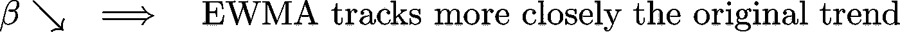

让我们以 2019 年法国巴黎的[气温为例(【1】)。](https://academic.udayton.edu/kissock/http/Weather/default.htm)

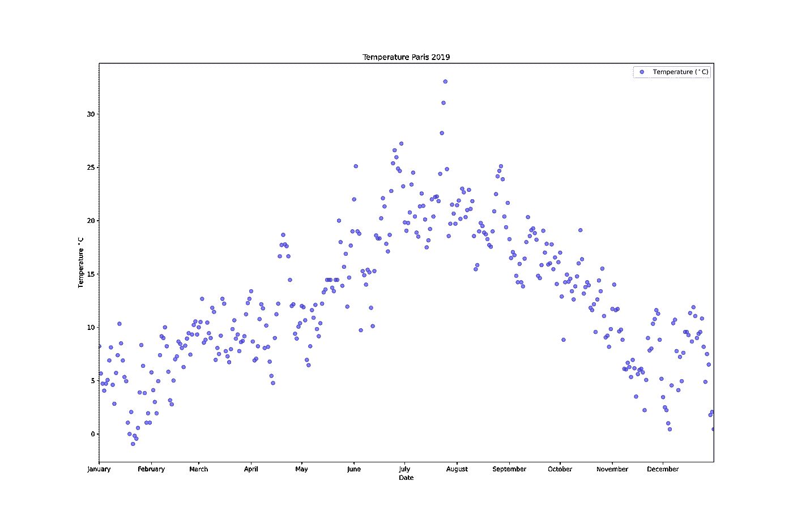

定义:

对于本例，假设β = 0.9，因此 EWA 旨在将当天的温度与之前的温度相结合。

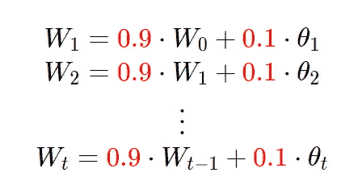

通常，为了计算给定权重参数β的 EWA，我们使用

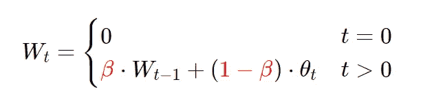

如果我们用红色绘制，我们可以看到我们得到的是每日温度的移动平均值，它就像一条平滑的，噪音较小的曲线。

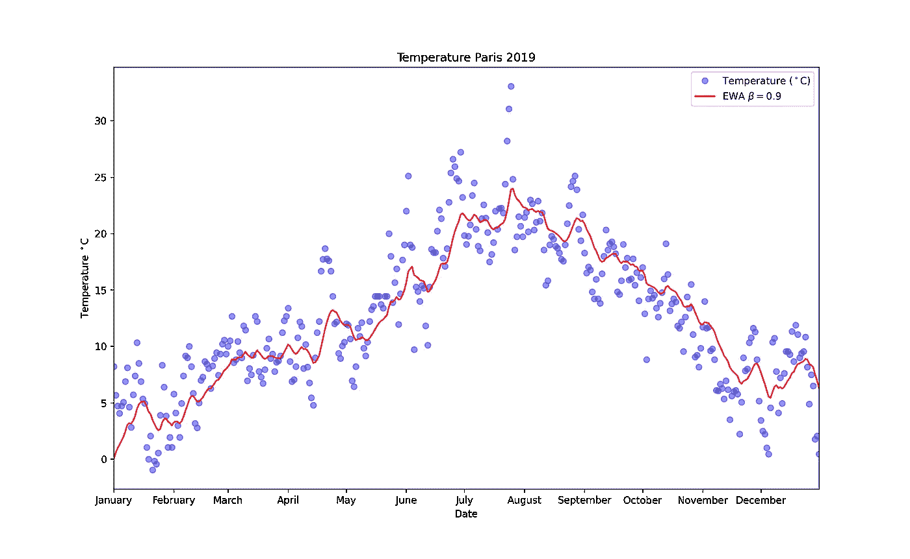

让我们解释一下这个通用等式:

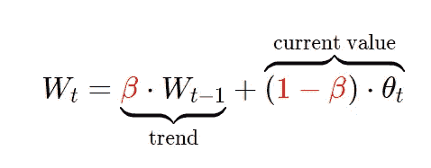

我们可以看到，β的值决定了前一个值(趋势)有多重要，(1-β)决定了当前值有多重要。

取β = 0.98 的值并用绿色绘制，注意曲线更加平滑*，因为现在的趋势更重要(当前温度值不太重要)，所以当温度变化时，它会适应得更慢。*

*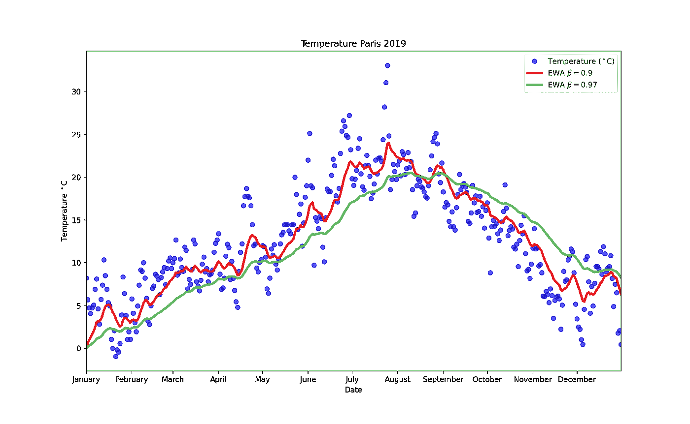*

*让我们尝试另一个极端，设置β = 0.5，这样你得到的图是*噪音*，因为它更容易受当前温度的影响(这包括异常值)。*

*但是它能更快地适应温度的变化。*

*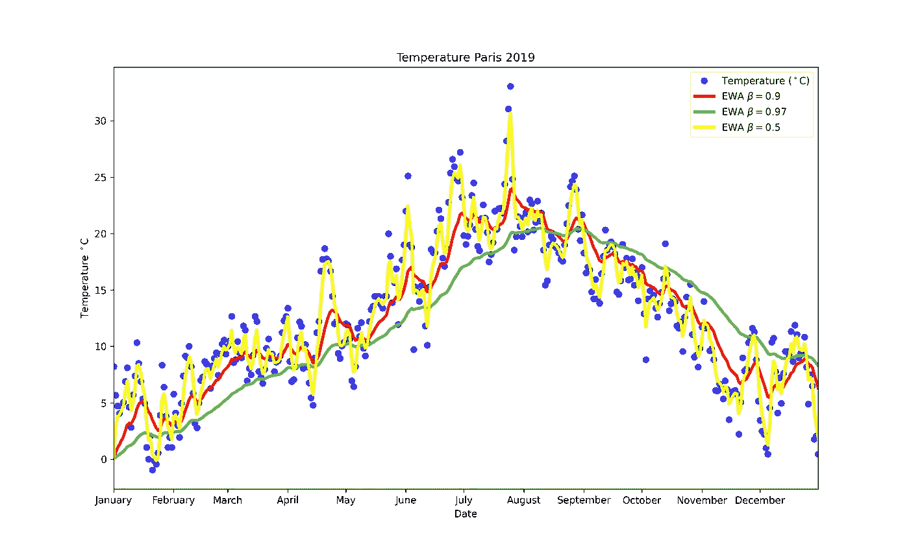*

*如果你想理解参数β的含义，你可以想想它的值*

*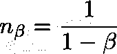*

*作为用来适应你的 EWA 的观察数字。*

*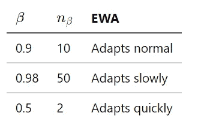*

*为了更深入地了解这个算法实际上做了什么。*

*让我们用主方程展开第三项(W₃):*

*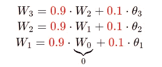*

*插件 W₁在 W₂，然后在 W₃:*

*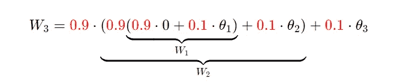*

*简化*

*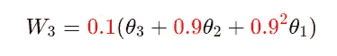*

*这里很清楚β = 0.9 的滚动参数在 EWA 是什么，我们可以看到旧的观测值被赋予较低的权重。随着数据点变老，权重呈指数下降，因此得名指数加权。*

*一般来说，我们有:*

*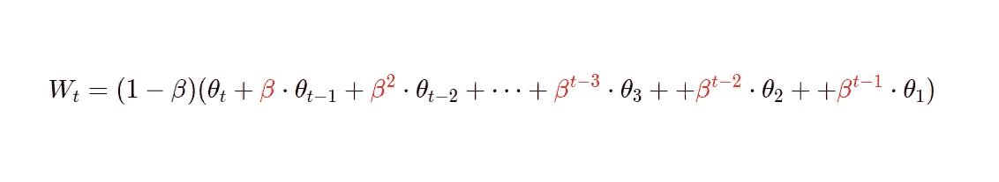*

*或者封闭公式:*

*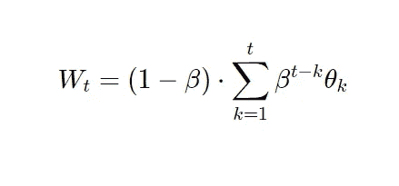*

*如果你是视觉学习者，这是另一种方法:*

*使用点积(*)重写 Wₜ:*

*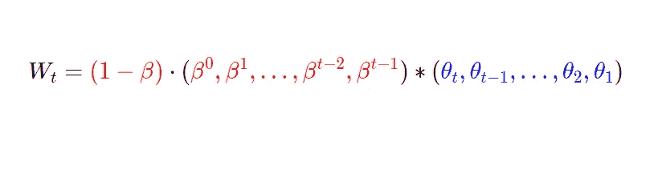*

*进而认为 Wₜ是以下两个情节的产物:*

*   *指数权重*
*   *温度*

*在该图中，我们看到当 t 增加时权重如何衰减:*

*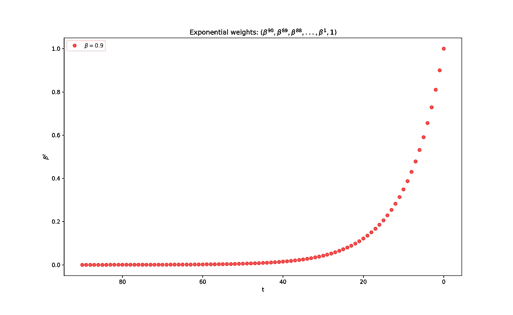*

*然后画出温度*

*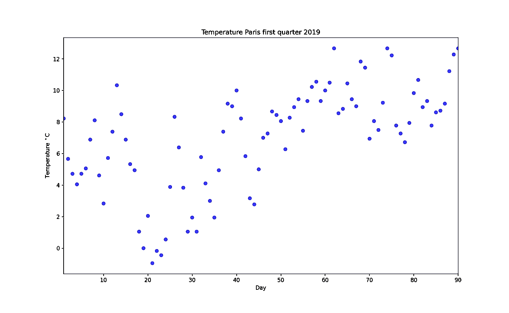*

*现在为了得到 Wₜ，只需将每个点(重量和温度)相乘并相加，对每个 t 都这样做，我们就得到洋红色曲线。*

*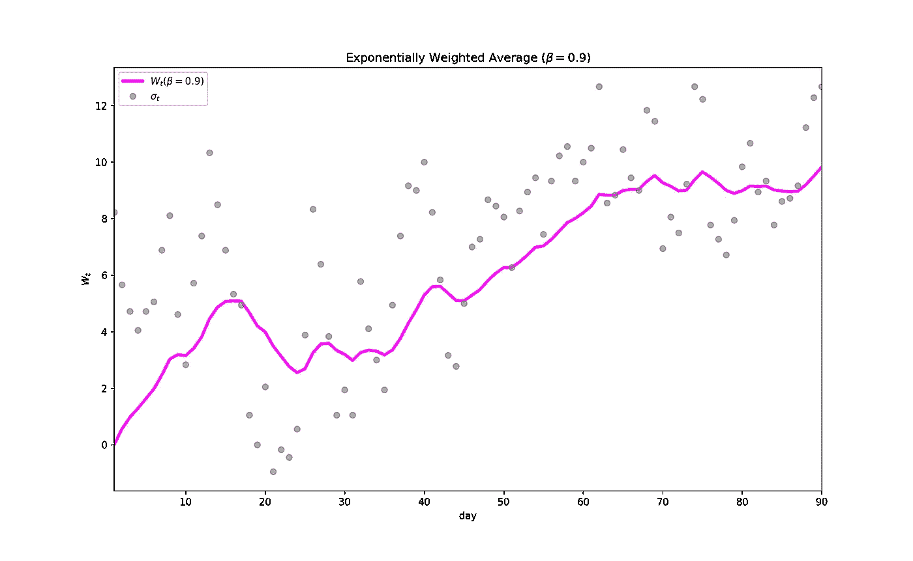*

# *参考资料:*

*   *[1] [代顿大学—环境保护署平均每日温度档案。](https://academic.udayton.edu/kissock/http/Weather/default.htm)*
*   *[2] *改善深度神经网络:超参数调整、正则化和优化*—Andrew NG 在线课程:[https://www . coursera . org/learn/Neural-Networks-Deep-learning？专业化=深度学习](https://www.coursera.org/learn/neural-networks-deep-learning?specialization=deep-learning)*
*   *【https://github.com/tobias-chc/Exponentially-WA】GitHub 库:*

* [## Mlearning.ai 提交建议

### 如何成为 Mlearning.ai 上的作家

medium.com](/mlearning-ai/mlearning-ai-submission-suggestions-b51e2b130bfb)*