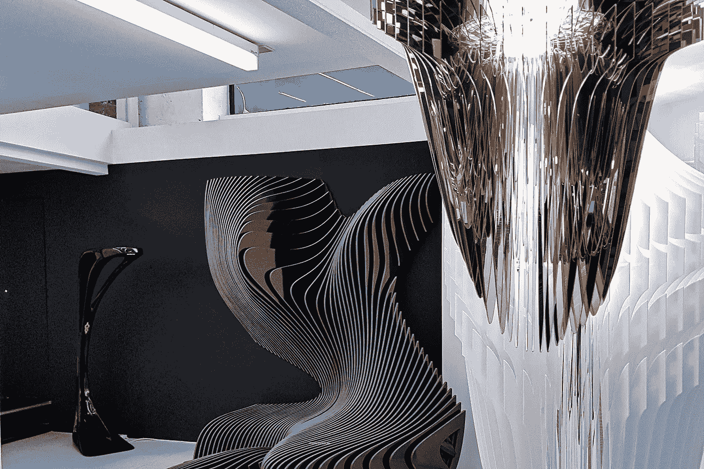

# 揭露深藏的真相

> 原文：<https://medium.com/mlearning-ai/exposing-the-deep-hidden-truth-fd4f9c5ce990?source=collection_archive---------2----------------------->

## [机器学习艺术](https://mlearning.substack.com)

## 关于机器学习如何影响我们

The Art of Machine Learning (click to read more)

我正在写一个关于机器及其对人类影响的故事。比如，在科技环境下人们会变得更聪明吗？还是闹得更窝囊？例如，在亚洲，人们对数字化的前景要轻松得多。他们不太关心。我认为这与他们如何…