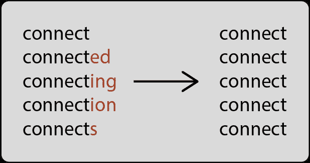
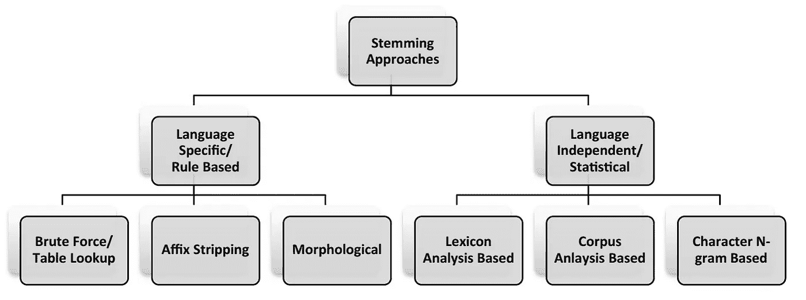
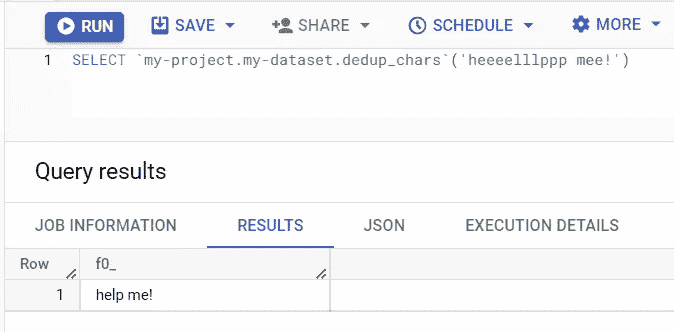
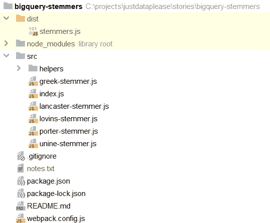
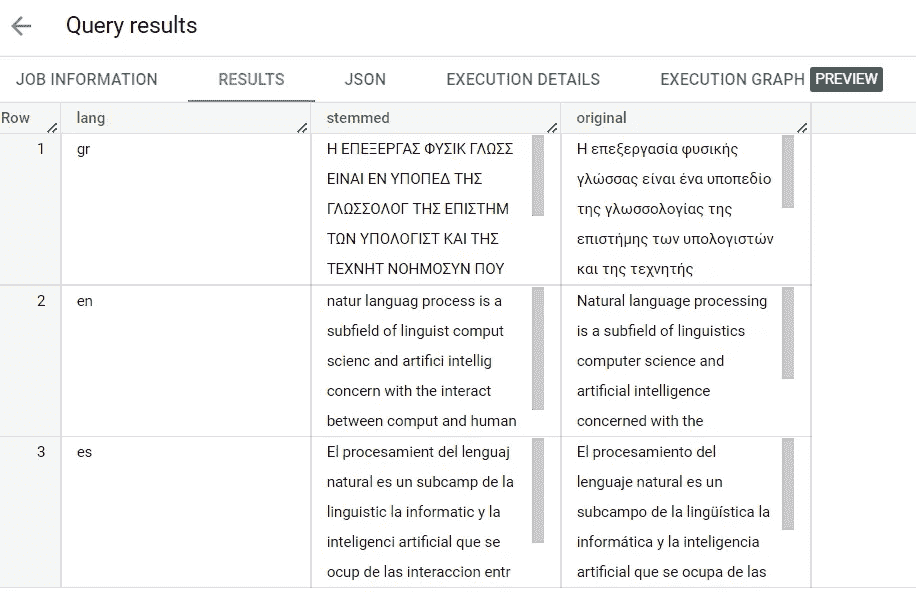

# 用词干分析器扩展 BigQuery NLP 库

> 原文：<https://medium.com/mlearning-ai/extend-bigquery-nlp-armory-with-stemmers-995fae853b0e?source=collection_archive---------5----------------------->

使用 Javascript UDFs 实现英语、西班牙语和希腊语词干分析器。


Photo by [Brett Jordan](https://unsplash.com/ja/@brett_jordan?utm_source=unsplash&utm_medium=referral&utm_content=creditCopyText) on [Unsplash](https://unsplash.com/s/photos/WORDS?utm_source=unsplash&utm_medium=referral&utm_content=creditCopyText)

# 动机

为什么要扩展现代数据库的功能，而不是编写一个简短的 Python 函数？

在云计算和无服务器架构的时代，许多组织正在脱离传统的内部系统，将其数据和应用程序迁移到云中。这使他们能够利用云计算的诸多优势，如可扩展性、灵活性和成本效益。

一个例子是现代数据库的广泛使用，如 Google Bigquery、Amazon Redshift 和 Snowflake。现代数据库不仅能有效地存储和处理大量数据，还能支持超出传统数据库能力的各种附加功能。这些功能包括数据集成、数据处理、数据可视化甚至机器学习等特性。由于所有这些不同的任务都可以简化，用户可以减少他们需要花费的时间和精力，转而关注最重要的事情。

例如，我们从各种来源收集了大量新闻文章，我们希望训练一个 NLP 模型。
这需要几个领域的知识，包括编程、机器学习框架、数据库和服务器管理。必须知道如何用 Python 等编程语言编写脚本来准备数据，如何使用 TensorFlow 或 PyTorch 等机器学习框架来训练模型，以及如何使用 MongoDB 等 NoSQL 数据库来存储和检索数据。此外，在大型数据集上训练机器学习模型需要大量的计算能力，而管理基础设施来支持这一点可能是一项具有挑战性的任务，需要服务器管理方面的专业知识。
另一方面，在像 BigQuery 这样的现代数据库中执行相同的步骤只需要了解 SQL，这是一种广泛用于处理关系数据库中的数据的语言。

这样，使用现代数据库可以大大简化处理数据的过程，使更广泛的用户更容易访问数据。

# 堵塞物



Stemming, Photo by Author.

词干化是一种标准化单词技术，也是自然语言处理(NLP)中非常常见的预处理步骤，用于将单词简化为其基本形式或词干。词干是指一个词的词根形式的形态变体，它不一定总是有效的词根形式。词干处理允许将具有相同含义的单词视为单个项目，例如“连接”、“被连接”、“正在连接”、“连接”和“连接”，它们都源自相同的基本形式“连接”。这一过程减少了数据集中唯一单词的数量，这可以显著提高文本分析算法的效率和准确性。

谷歌搜索在 2003 年采用了词干分析法。以前搜索“鱼”不会返回“钓鱼”或“鱼”[1]。

词干算法通常使用试探法或基于规则的方法来从单词中识别和移除词缀(如前缀和后缀)，从而得到简化的单词形式。虽然这种方法可以非常快，但它也可能容易出错，因此当速度和效率是重要的考虑因素时，应该首选这种方法。

错误可以被描述为词干过多或不足。
当算法将单词减少到相同的词干，而它应该将它们减少到不同的词干时，就会发生过度词干化。例如，根据 Porter stemmer,“大学”和“宇宙”被简化为“宇宙”,而应该简化为两个不同的词干，因为它们没有相同的含义。
当算法将单词缩减为不同的词干，而它应该将它们缩减为相同的词干时，就会出现词干不足。例如，基于波特词干分析器，单词“数据”和“数据”在应该归入同一词干时，分别归入“数据”和“基准”。

词干算法大致分为两类:



Types of stemming algorithms. Photo by Singh J., Gupta V. [2].

**基于规则的** 一种强力方法是使用查表法将单词映射到词干。另一种众所周知的方法是通过应用一系列规则去除词缀来减少单词的词干。其他过程考虑词的形态，包括词性。这些方法需要大量的语言规则，因此是语言相关的。因此，大多数已知的基于规则的词干分析器可用于广泛研究的语言(英语)。基于规则的词干分析器包括 Lovins、Dawson(基于 Lovins)、Porter(最近的 Porter2)、Paice/Husk(又名 Lancaster)词干分析器。

**统计** 统计方法需要从词典、语料库或语言单词的基于字符的 n 元语法中训练模型。使用这种方法，词缀剥离规则被导出。
统计词干分析器与语言无关，因为它们不需要任何特定于语言的信息。统计词干分析器包括 N-Gram、Krovetz 和 Xerox 词干分析器。
统计方法也是一个开放的研究领域，因为人们对具有少量语言资源的语言的文本搜索感兴趣。

在本教程中，我们将使用 Javascript 中已有的部分实现来实现一些基于规则的词干分析器:

1.  Lovins(英语)[3] — [GitHub repo](https://github.com/Yomguithereal/talisman) (麻省理工学院许可)
2.  波特(英语)[3] — [GitHub repo](https://github.com/Yomguithereal/talisman) (麻省理工学院许可证)
3.  Paice-Husk / Lancaster(英语)[3] — [GitHub repo](https://github.com/Yomguithereal/talisman) (麻省理工学院许可)
4.  UniNE(西班牙语)[3] — [GitHub repo](https://github.com/Yomguithereal/talisman) (麻省理工学院许可)
5.  希腊语斯特梅尔(希腊语)[4] — [GitHub repo](https://github.com/skroutz/greek_stemmer) (麻省理工学院许可)

# BigQuery 用户定义函数(UDF)

*用户自定义函数(UDF)允许您使用 SQL 表达式或 JavaScript 代码创建函数。UDF 接受输入列，对输入执行操作，并将这些操作的结果作为值返回。* [*谷歌文档*](https://cloud.google.com/bigquery/docs/reference/standard-sql/user-defined-functions)

正如我们前面讨论的，我们选择使用 BigQuery UDFs(用户定义函数)而不是为特定任务编写 Python 程序有几个原因。

*   简单易用:允许使用 SQL 在 Bigquery 中实现定制逻辑。这有很多好处，特别是对于不熟悉 Python 或其他编程语言的用户。
*   性能和可伸缩性:BigQuery UDFs 可以在 BigQuery 分布式系统中的多个虚拟 CPU(slot)上并行执行，允许对大型数据集进行高效和可伸缩的处理。相比之下，Python 程序通常在单个服务器上运行，可能也无法扩展。
*   成本节约:BigQuery UDFs 允许用户利用 BigQuery 的现有基础设施和资源，而不需要管理额外的计算资源来运行 Python 程序。

Bigquery 支持两种类型的 UDF，基于 SQL 的和基于 Javascript 的(也支持远程函数 UDF，但我们将在另一篇文章中引用该功能)。

**基于 SQL 的** 当我们想要创建一个使用 BigQuery 现有功能的函数时，我们应该使用 SQL UDFs。例如，我们想创建一个从单词中删除重复字母的函数。

```
CREATE OR REPLACE FUNCTION `my-project.my-dataset.dedup_chars`(s STRING) AS (
(SELECT
  STRING_AGG(
    IF
      (c = SPLIT(s, '')[SAFE_OFFSET(off - 1)],
        NULL,
        c), '' ORDER BY off)
FROM
  UNNEST(SPLIT(s, '')) AS c
  WITH OFFSET off)
);
```



SQL-based UDF, Photo by Author.

**基于 Javascript 的** 另一方面，当我们想要创建一个在 [BigQuery 的函数](https://cloud.google.com/bigquery/docs/reference/standard-sql/functions-and-operators)上找不到，但在外部 Javascript 库中可以找到的函数时，我们应该使用基于 Javascript 的 UDF。

在本教程中，我们将把不同的 Javascript 库组合成一个自定义的 Javascript 库，并用它来创建一些基于 Javascript 的 UDF。

# 词干分析器实现

点击查看完整代码[。](https://github.com/justdataplease/bigquery-stemmers)

如果您只想在 BigQuery 中测试或使用词干功能，而不想实现它，请跳过这一节，转到下一个——词干分析器演示。

为了实现 Bigquery 的词干分析器，我们将执行以下步骤:

1.  克隆存储库

```
git clone https://github.com/justdataplease/bigquery-stemmers
```

我们的存储库具有以下结构:



Project structure, Photo by the Author.

*   **package.json** :保存与项目相关的各种元数据，处理项目的依赖关系。
*   src 文件夹:包含我们的 javascript 函数。里面有一个 **index.js** 文件，我们在其中定义了函数(以及它们的名字)，我们希望将它们实现为 UDF 函数。
*   **webpack.config.js** :使用 [webpack](https://webpack.js.org/) 包将我们所有的函数(在 **index.js** 中定义)捆绑到一个文件 **stemmers.js** 中。
*   **dist** 文件夹:包含 webpack 输出， **stemmers.js** 。

2.安装 **package.json** 中定义的必要包。

```
npm install
```

3.使用 [webpack](https://webpack.js.org/) 运行 **webpack.config.js** 来创建我们的包。

```
npm run-script build
```

4.在 GCS 中创建一个存储桶。确保用您的 [GCP 项目 id](https://support.google.com/googleapi/answer/7014113?hl=en) 更改“您的项目”,用您想要的存储桶名称更改“您的存储桶”(必须是全球唯一的)。

```
gsutil mb -c nearline -l europe-west3 -p yourproject gs://yourbucket
```

5.将 webpack 输出或 **stemmers.js** 复制到 GCS。

```
gsutil cp dist/stemmers.js gs://yourbucket
```

6.实现词干分析器。例如，我们将把下面的英语句子翻译成希腊语和西班牙语。

**“自然语言处理是语言学、计算机科学和人工智能的一个分支，涉及计算机和人类语言之间的交互”**

```
-- Define corpus
DECLARE grString,enString,esString STRING;
SET grString = "Η επεξεργασία φυσικής γλώσσας είναι ένα υποπεδίο της γλωσσολογίας της επιστήμης των υπολογιστών και της τεχνητής νοημοσύνης που ασχολείται με τις αλληλεπιδράσεις μεταξύ των υπολογιστών και της ανθρώπινης γλώσσας";
SET enString = "Natural language processing is a subfield of linguistics computer science and artificial intelligence concerned with the interactions between computers and human language";
SET esString = "El procesamiento del lenguaje natural es un subcampo de la lingüística la informática y la inteligencia artificial que se ocupa de las interacciones entre las computadoras y el lenguaje humano";

-- Create greek stemmer
CREATE TEMP FUNCTION grStemmer(word STRING)
RETURNS STRING
LANGUAGE js
OPTIONS (
library=["gs://yourbucket/stemmers.js"]
)
AS r"""
return utils.greekStemmer(word);
""";

-- Create english stemmer
CREATE TEMP FUNCTION porterStemmer(word STRING)
RETURNS STRING
LANGUAGE js
OPTIONS (
library=["gs://yourbucket/stemmers.js"]
)
AS r"""
return utils.porterStemmer(word);
""";

-- Create Spanish stemmer
CREATE TEMP FUNCTION esStemmer(word STRING)
RETURNS STRING
LANGUAGE js
OPTIONS (
library=["gs://yourbucket/stemmers.js"]
)
AS r"""
return utils.unineStemmer(word);
""";

-- Remove accents and convers to upper case - greek stemmer requirement
CREATE TEMP FUNCTION fix_word(word STRING) AS ((
SELECT UPPER(regexp_replace(normalize(word, NFD), r"\pM", ''))
));

-- Union all sentenses
WITH corpus AS (
  SELECT word, 'gr' lang FROM UNNEST(SPLIT(grString," ")) word 
  UNION ALL
  SELECT word, 'en' lang FROM UNNEST(SPLIT(enString," ")) word 
  UNION ALL
  SELECT word,'es' lang FROM UNNEST(SPLIT(esString," ")) word 
)

-- Run stemmers
SELECT 
lang,
string_agg(
CASE lang 
WHEN 'gr' THEN grStemmer(fix_word(word))
WHEN 'en' THEN porterStemmer(word)
WHEN 'es' THEN esStemmer(word) 
ELSE 'missing' END," ") stemmed, 
string_agg(word," ") original
FROM corpus
GROUP BY 1
```



Stemming output, Photo by the Author.

# 词干分析器演示

您可以使用公开可用的函数来测试或使用 BigQuery 中词干分析器的功能(由 Author — [JustFunctions](https://justdataplease.com/bigquery-justfunctions/) 创建)。

*以下示例是基于欧洲的数据集。要将位置更改为基于美国的数据集，请将“eu”更改为“us”(即 just functions . eu . porter stemmer->just functions . us . porter stemmer)*

```
-- Define corpus
DECLARE grString,enString,esString STRING;
SET grString = "Η επεξεργασία φυσικής γλώσσας είναι ένα υποπεδίο της γλωσσολογίας της επιστήμης των υπολογιστών και της τεχνητής νοημοσύνης που ασχολείται με τις αλληλεπιδράσεις μεταξύ των υπολογιστών και της ανθρώπινης γλώσσας";
SET enString = "Natural language processing is a subfield of linguistics computer science and artificial intelligence concerned with the interactions between computers and human language";
SET esString = "El procesamiento del lenguaje natural es un subcampo de la lingüística la informática y la inteligencia artificial que se ocupa de las interacciones entre las computadoras y el lenguaje humano";

-- Remove accents and convers to upper case - greek stemmer requirement
CREATE TEMP FUNCTION fix_word(word STRING) AS ((
SELECT UPPER(regexp_replace(normalize(word, NFD), r"\pM", ''))
));

-- Union all sentenses
WITH corpus AS (
  SELECT word, 'gr' lang FROM UNNEST(SPLIT(grString," ")) word 
  UNION ALL
  SELECT word, 'en' lang FROM UNNEST(SPLIT(enString," ")) word 
  UNION ALL
  SELECT word,'es' lang FROM UNNEST(SPLIT(esString," ")) word 
)

-- Run stemmers
SELECT 
lang,
string_agg(
CASE lang 
WHEN 'gr' THEN justfunctions.eu.grStemmer(fix_word(word))
WHEN 'en' THEN justfunctions.eu.porterStemmer(word)
WHEN 'es' THEN justfunctions.eu.esStemmer(word) 
ELSE 'missing' END," ") stemmed, 
string_agg(word," ") original
FROM corpus
GROUP BY 1
```

# 结论

本文强调了现代数据库的重要性，以及如何使用 BigQuery 用户定义函数(UDF)来执行复杂的预处理任务，如词干提取。我们还通过用三种不同的语言实现一些基于规则的词干分析器来演示这一点。

# 参考

【1】[词干](https://en.wikipedia.org/wiki/Stemming)，维基百科。

[2]辛格，j .，古普塔，v .，[对文本词干提取技术的系统评述。*Artif Intell Rev*48，157–217](https://doi.org/10.1007/s10462-016-9498-2)(2017)， [Springer](https://www.springer.com/) 。

[3] Plique，g .[Talisman(2020)](https://joss.theoj.org/papers/10.21105/joss.02405)，[开源软件杂志(JOSS)](https://joss.theoj.org/) 。

[4] Ntais，g .，[希腊语斯特梅尔的开发(2006)](https://people.dsv.su.se/~hercules/papers/Ntais_greek_stemmer_thesis_final.pdf) ，[硕士论文——斯德哥尔摩大学计算机与系统科学系](http://dsv.su.se/)。

[](/mlearning-ai/mlearning-ai-submission-suggestions-b51e2b130bfb) [## Mlearning.ai 提交建议

### 如何成为 Mlearning.ai 上的作家

medium.com](/mlearning-ai/mlearning-ai-submission-suggestions-b51e2b130bfb)