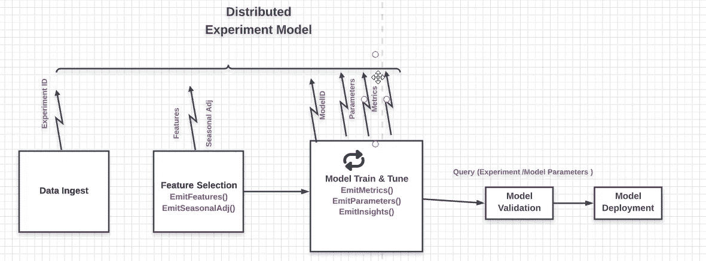
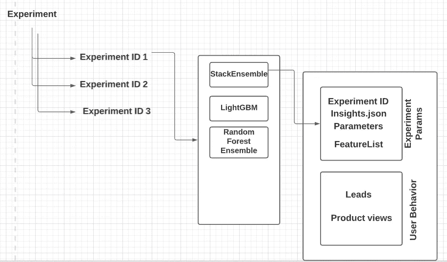
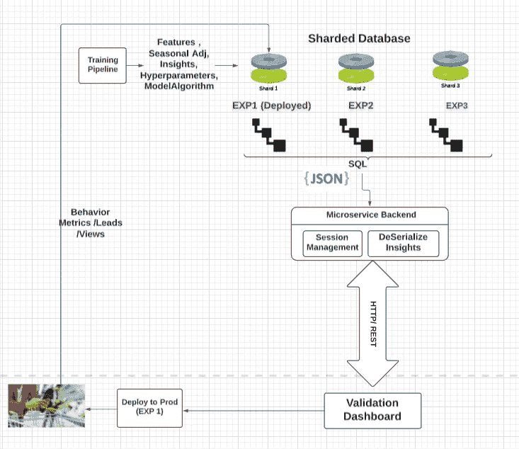
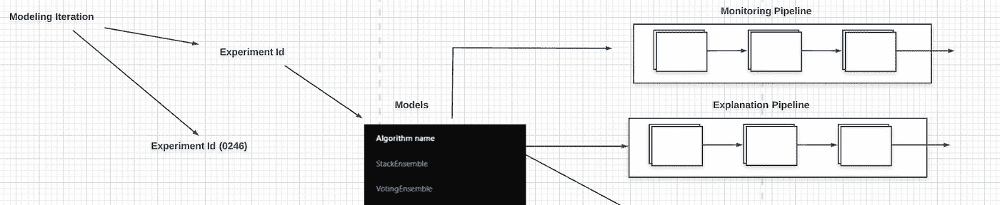

# 超越 MLFlow 的 ML 实验

> 原文：<https://medium.com/mlearning-ai/extending-machine-learning-experimentation-platform-beyond-mlflow-eea5584e5ff8?source=collection_archive---------0----------------------->

在这篇博客中，我解释了扩展 MLFlow 的想法，以增强对机器学习实验的跟踪及其在实际 ML Ops 中的应用。这些设计理念中的一部分来源于制造部门如何构建产品生命周期跟踪系统的灵感

# **什么是 ML Ops？**

M L Ops 是建立一个服务、API、管道和仪表板的生态系统的实践，能够系统地生产一个 ML 模型。ML Ops 功能的例子包括模型监控、模型解释、模型测试/评估等等。

如果你是一个 ML 工程师，正在开发一个面向消费者的 ML 产品(例如:定价模型/推荐系统等),每天有成千上万的消费者在使用它，它会在利益相关者和消费者之间激发一些动力。需要不断迭代和改进模型，并关闭反馈回路。这意味着我们不仅在数据科学家可见的仪表板上跟踪实验，还跟踪与已部署模型实验相关的一切(超参数、选定功能、季节调整因素、见解等)，并在模型生命周期的所有阶段建立与最终用户影响指标的关联/持续关联。我们举一个具体的例子。假设一个股东问你以下问题:

> 我们从 6 个月前部署的导致销售线索下降的模型中学到了什么？

为了定量地回答这个问题，我们需要系统地收集、存储和查询实验生命周期数据。

## 制造业的先例和启示

几十年来，在制造业中，产品生命周期管理一直是关于从概念->设计->制造->服务->报废收集、存储和查询产品元数据。这有助于飞机制造商跟踪设计阶段假设和其 20 年服役期间产生的相应转速表数据之间的关联。工程师依靠跟踪的关联来关闭未来变体/衍生物中的反馈回路。这个类比几乎完全适用于机器学习模型。

> ML 工程师应该绝对关心通过推荐系统的消费者交互产生的数据，以便在未来的模型训练/部署迭代中关闭反馈回路。(当然，除了实时可以做的以外)

**为什么实验跟踪？**
ML Flow 是一款开源产品，支持实验跟踪，但仍有明显的差距需要解决。虽然在 ML 实验中收集遥测数据并不新奇，但系统的 ML 实验数据收集&存储对 ML Ops 服务的成功设计具有深远的影响。

机器学习的生命周期保证了一种永恒的实验状态——培训、A/B 测试和生产

**如何收集&整理实验数据？**

下图显示了一个培训管道，其中包含了 ML 模型部署的几个步骤。每个流水线步骤执行一个“目标任务”+“附带/副作用”。这使得每个流水线步骤将标记的实验参数/序列化的可视化“发射”到分布式数据库。

上述步骤中收集的数据被分割成多个分区，每个分区代表一个实验的数据图。实验数据图聚集了在实验中创建的每个模型的实体，例如超参数、洞察力和度量

**好的，我们收集了实验数据。现在怎么办？**

**应用一——综合选型**

> 模型选择过程必须结合使用指标和准确性，包括产品利益相关者关心的指标。一个例子可以是房屋估价模型的平均预测价格的转换，以及它给你的企业带来的货币风险

上述架构可用于部分自动化模型选择，该模型选择使用这样的度量标准组合(准确性、转换、用户交互)。我们可能拥有所有的计算能力来为一个版本训练几十/几百个模型。然而，系统化的数据收集能够可管理地可视化和比较各种模型的性能分布，从而针对复杂性缩放模型选择。此外，人们可以注意到，当模型选择仪表板可以将它们作为工件(想想 plotly json)在浏览器中显示时，序列化可视化变得很方便

人们还会注意到，我们维护着一个已部署模型的用户行为指标和一个数据科学家在概念化模型时生成的实验参数之间的关联。最终，我们希望将数据科学家的行为与用户互动联系起来。这也可用于 A/B 测试设置

**应用二参数化 ML Ops 管道:**

上图显示了从管道中分离模型生成数据的模式，管道表示应用于模型数据的操作

诸如解释管道或监控管道之类的 ML Ops 管道由模型参数化。这意味着我们在为仪表板准备数据时重复使用相同的管道，该仪表板将每个模型的预测数据与群组/用户交互数据相结合。实验数据模型有助于这种连接的惰性评估

我经常看到数据科学家在实验平台上采用开箱即用的实现。虽然需要尽可能多地重用可用的内容，但我们必须扩展这些框架(如 ML Flow ),以获得特定数据科学生命周期所需的最大价值。

在我以后的博客中，我将详细介绍 ML Ops 的生命周期(模型解释、模型监控和模型部署)