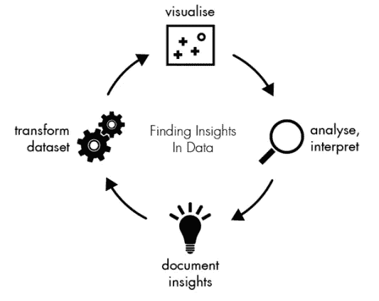
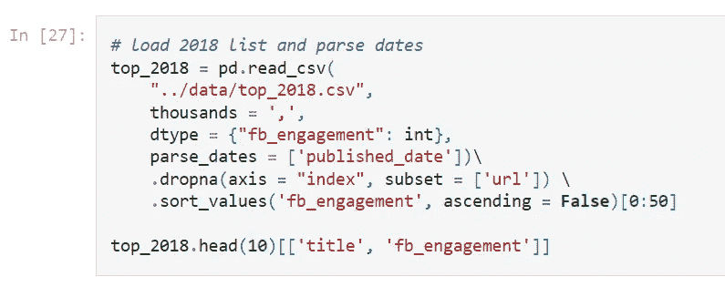
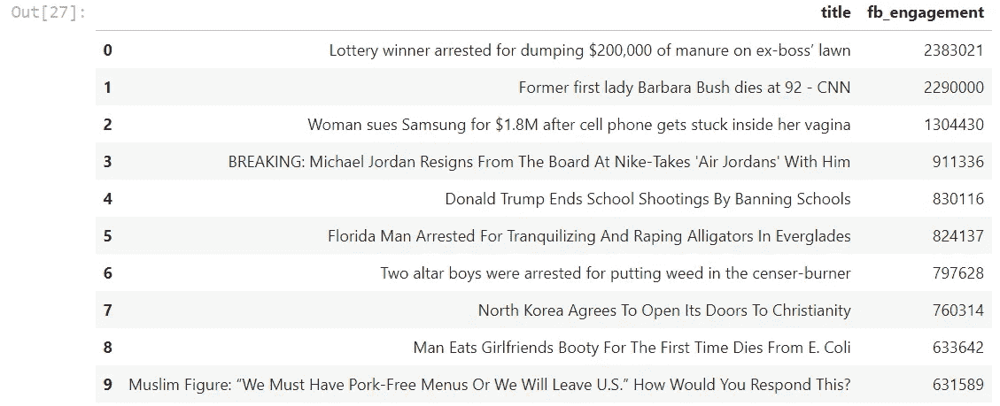
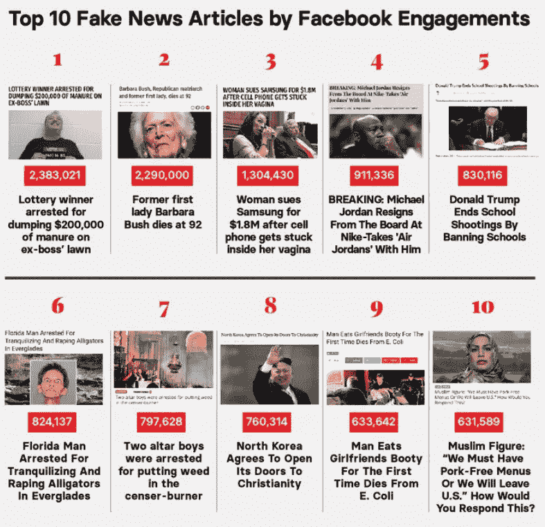

# 号外！号外！

> 原文：<https://medium.com/mlearning-ai/extra-extra-fe3ebc3a9df6?source=collection_archive---------9----------------------->

## 阅读所有关于数据新闻的内容

Image from Freepik

数据科学几乎在人类努力的每个主要领域都产生了影响:商业、教育、能源、软件和新闻。

在这篇文章中，我将向您展示记者如何在文档集合中找到数据故事。

## 什么是数据新闻？

数据新闻是一种搜索、理解和可视化数字资源的新技能，在这个时代，传统新闻的基本技能是不够的。

在信息来源数字化的时代，记者可以也必须更接近这些信息来源。它不是对传统新闻的替代，而是对传统新闻的补充。

互联网开启了超越当前理解的可能性，而数据新闻只是进化过去的实践以适应网络的开始。

## 为什么记者应该使用数据

Photo by [Possessed Photography](https://unsplash.com/@possessedphotography?utm_source=unsplash&utm_medium=referral&utm_content=creditCopyText) on [Unsplash](https://unsplash.com/s/photos/first-one?utm_source=unsplash&utm_medium=referral&utm_content=creditCopyText)

利用数据，记者的工作重心从最先报道转变为告诉我们某项发展可能意味着什么。

话题的范围可以很广很广:酝酿中的下一场金融危机、我们使用的产品背后的经济学、资金的滥用或政治失误等等。这些主题可以用引人注目的数据可视化来呈现，几乎没有争论的余地。

但是处理数据就像踏入一片广阔的未知领域。为了形象化，很难正确地塑造它。它需要有经验的记者，他们有毅力去看往往令人困惑、往往令人厌烦的原始数据，并“看到”其中隐藏的故事。

## 数据之旅

Photo by [Alexander Andrews](https://unsplash.com/@alex_andrews?utm_source=unsplash&utm_medium=referral&utm_content=creditCopyText) on [Unsplash](https://unsplash.com/s/photos/journey-data-map?utm_source=unsplash&utm_medium=referral&utm_content=creditCopyText)

数据新闻过程可以分为几个不同的步骤:

*   确定谁保存数据以及如何保存:电子表格、PDF 格式、CSV、XML 等。
*   获取数据:开放数据门户、抓取等。
*   下载并准备数据。
*   创建一个数据库，可以在途中通过其前端进行查询。
*   仔细检查和分析数据。
*   交付数据:故事、应用或可视化。

## **数据记者工具包**

Photo by [David Pupaza](https://unsplash.com/@dav420?utm_source=unsplash&utm_medium=referral&utm_content=creditCopyText) on [Unsplash](https://unsplash.com/s/photos/text-data?utm_source=unsplash&utm_medium=referral&utm_content=creditCopyText)

处理数据并非易事。

文件往往有最多样的格式、布局和内容，这使得
用一套不同的文件进行调查变得复杂。数据清理、准备和分析可能因文档集合的不同而不同。

随着可用数据量的不断增加，记者了解数据新闻技术比以往任何时候都更加重要。

使用现成的文本挖掘软件是一个很好的起点，可以让自己熟悉基本的文本分析操作及其结果:字数统计、实体提取、文档之间的联系等。

有专为记者设计的平台，例如:

*   [文档云](https://www.documentcloud.org/app)。
*   谷歌记者工作室这是一个帮助调查记者的工具集合。
*   [谷歌新闻计划](https://newsinitiative.withgoogle.com/)提供数字工具、培训和资源，帮助他们寻找、验证和讲述引人入胜的故事。

记者没有时间浪费在手工抄写东西上，也没有时间浪费在从 pdf 中获取数据上，所以学习一点点代码是非常有价值的。

许多免费和开源工具允许更多的自定义分析，包括 [Python 语言](https://www.python.org/) (NLTK，spaCy，selenium，scikit-learn)和 [R 语言](https://www.r-project.org/) (tm，cleantext)等资源，对于已经熟悉这些语言的记者来说可能更方便。

## 转换新闻中的数据

Image from [https://datajournalism.com/read/handbook/one](https://datajournalism.com/read/handbook/one)

BuzzFeed 新闻的文章[尽管做出了努力，但脸书仍然是病毒式传播的假新闻的家园](https://www.buzzfeednews.com/article/craigsilverman/facebook-fake-news-hits-2018)，发表于 2018 年，是一个很好的例子，展示了如何在新闻业中使用数据。

多年来，BuzzFeed News 一直维护着发布完全捏造的故事的网站列表。当他们遇到新的并揭穿其内容时，他们会将它们添加到列表中。

该分析包含在 [Jupyter 笔记本](https://jupyter.org/)中。用 Python 编写的代码将 2018 年的网站列表与 2017 年和 2016 年的网站列表进行了比较。它还寻找一段时间内的趋势，并计算最受欢迎的领域和类别。

根据来自 [BuzzSumo](https://buzzsumo.com/) 和 [Trendolizer](http://www.trendolizer.com/) 的数据，BuzzFeed News 确定的 2018 年前 50 个假新闻在 2018 年 1 月 1 日至 12 月 9 日期间在脸书产生了大约 2200 万条分享、反应和评论。

下图显示了脸书在 2018 年发布的顶级假新闻的代码。`data/top_2018.csv`文件包含由他们的 2018 假新闻网站列表发布的 2018 年顶级假新闻文章的信息(由脸书 engagement 发布)。

输入:

脸书互动 2018 年十大假新闻:

十大假新闻是如何出现在文章中的:

Image from [https://www.buzzfeednews.com/article/craigsilverman/facebook-fake-news-hits-2018](https://www.buzzfeednews.com/article/craigsilverman/facebook-fake-news-hits-2018)

## 结论

Photo by [David Becker](https://unsplash.com/@beckerworks?utm_source=unsplash&utm_medium=referral&utm_content=creditCopyText) on [Unsplash](https://unsplash.com/s/photos/dust?utm_source=unsplash&utm_medium=referral&utm_content=creditCopyText)

数据就像灰尘。它无处不在，我们经常花大部分时间去清理它。

长期以来，数据新闻仅限于新闻、政治、商业和金融领域。如果数据可以被清理、收集并形成一张图片来讲述所有的事情，会怎么样？

随着最新技术的进步和网上可用数据的增长，记者可以转向第一手资料来提取信息和讲述好故事。

本文到此为止，感谢阅读！您可以使用以下链接在 LinkedIn 上与我联系:

*   [https://www.linkedin.com/in/fernando-oliveira-2a42b51a4/](https://www.linkedin.com/in/fernando-oliveira-2a42b51a4/)

## 参考

*   https://datajournalism.com/

 [## Mlearning.ai 提交建议

### 如何成为 Mlearning.ai 上的作家

medium.com](/mlearning-ai/mlearning-ai-submission-suggestions-b51e2b130bfb)