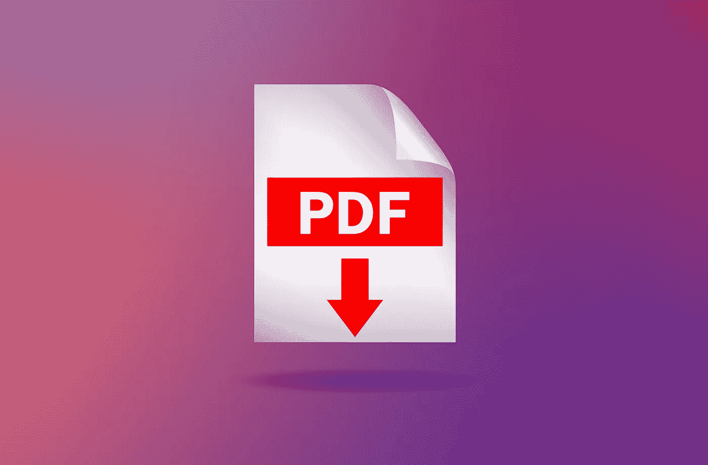

# 已解决:从多个 PDF 中提取表格

> 原文：<https://medium.com/mlearning-ai/extract-data-from-pdf-ccc16843be79?source=collection_archive---------0----------------------->

## 我知道将 PDF 文件中的数据行复制粘贴到 Excel 中有多痛苦。使用这段代码，您可以用 python 从多个 PDF 文件中快速提取表格。

Photo by Kaspersky Daily

您是否遇到过试图将 PDF 中的数据复制到 Excel 中的问题？您粘贴了数据，然后…