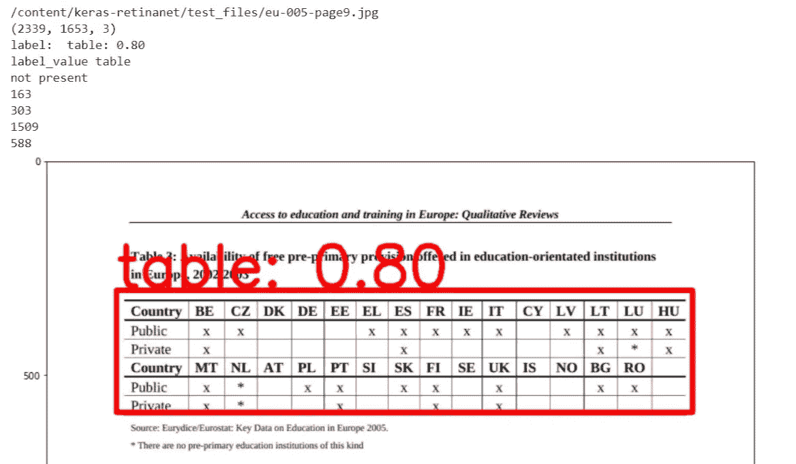
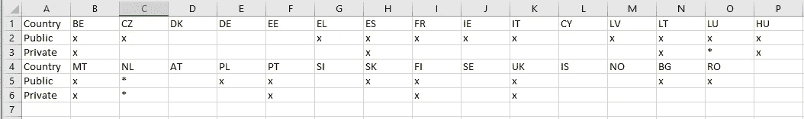

# 使用深度学习表格检测从 PDF 中提取表格数据

> 原文：<https://medium.com/mlearning-ai/extracting-tabular-data-from-pdf-using-deep-learning-table-detection-81242cbad6d?source=collection_archive---------0----------------------->


Photo by [Agence Olloweb](https://unsplash.com/@olloweb?utm_source=medium&utm_medium=referral) on [Unsplash](https://unsplash.com?utm_source=medium&utm_medium=referral)

众所周知，尽管数据已经存在了几个世纪，但数据是这个千年创新的中心。多亏了计算机编程的进步，人们现在才意识到它的潜力。

因此，收集尽可能多的数据至关重要。然而，对于那些主要依赖纸质报告(如财务收据，甚至是以表格形式提供见解的小册子)的行业来说，这可能尤其困难。在本文中，我们将展示如何利用预训练的 RetinaNet 深度学习模型从 pdf 中识别表格，然后使用 python 包 Tabula 将其提取到 csv 中。

## 介绍

如果没有 Fizyr 的 T2 在 GitHub 上预建的令人惊叹的 RetinaNet 模型，这一切都是不可能的。我们还利用了 [ferrygun](https://github.com/ferrygun) 令人敬畏的 [PDFTableExtract](https://github.com/ferrygun/PDFTableExtract) 库。

我们从下载开放的 PDF 数据集开始，将它们转换成图像文件(JPEG 格式)，然后从 800 多张图像中手动注释所需的表格。接下来，我们在我们的数据上训练 Fizyr 的预训练模型权重，从而产生我们的表检测模型。最后，利用末端模型确定表格坐标，为使用 Tabula——python 包——提取提供区域限制。

为了给图像添加注释，我们使用了 labelImg，可以在这里 *下载 [*。*](https://tzutalin.github.io/labelImg/)*

> 注意:可以选择将 labelImg 直接安装到 python 中，并在代码中标注图像，但是我们发现下载应用程序本身更容易。

## 建立

由于该模型的计算量非常大，要在您自己的数据上运行该模型，强烈建议在支持 GPU 的系统上运行。如果您的计算机只有 CPU 处理能力，请不要担心。Google Colab 允许您在浏览器中编写和执行 Python，使用

*   不需要配置
*   免费访问 GPU
*   轻松分享

> 我们的脚本写在一个 Google Colab 笔记本上。代码可以在不同的云环境中复制，甚至可以在本地复制，但请注意，有些包需要降级，以适应预训练模型中的 Tensorflow 包。(更多信息请参考 Fizyer 的 git)

在我们进入代码之前，最后提一下，什么是 RetinaNet？

它是一种深度学习模型，利用卷积神经网络(CNN)来识别图像中的对象类别。为了更深入地理解它，Prakash Jay 在这篇文章中解释了 RetinaNet [背后的直觉。](/@14prakash/the-intuition-behind-retinanet-eb636755607d)

我将在这里链接包含代码的 GitHub 库，供您在我们进行的过程中使用。

[](https://github.com/ektaatomar/Extracting-Tabular-Data-from-PDFs-using-Object-Detection-with-Keras-Retinanet.git) [## ektaatomar/Extracting-Tabular-Data-from-pdf-using-Object-Detection-with-Keras-retina net

### 受 https://github.com/fizyr/keras-retinanet.git 工作的启发，我们利用谷歌实验室来满足 GPU 的需求

github.com](https://github.com/ektaatomar/Extracting-Tabular-Data-from-PDFs-using-Object-Detection-with-Keras-Retinanet.git) 

## 数据准备

收集 PDF 文件后，您需要将文件转换为一组图像。

> 注意:Google Colab 将临时存储您的数据，然后在运行时重新启动后清除所有数据，因此我们建议运行以下转换代码，然后将文件夹下载到您的硬盘上。

如果你碰巧有 PNG 图像想添加注释，那么不要担心，我们已经包含了将 PNG 文件转换为 JPG 的代码。

万岁！现在，您有了一组要使用 labelImg 进行注释的图像。注释完图像后，您的数据应该包含一个图像文件文件夹和一个 XML 文件文件夹。

模型需要两个文本文件' ***train.txt*** '和' ***test.txt*** '，这样就可以创建下面需要的文件。它们只是简单的文本文件，包含没有文件扩展名的图像名称。例如，训练文件将包含“图像 1”、“图像 2”..等等。没有了。jpg '扩展名。下面的 test.txt 示例代码也是如此，它将 Image 文件夹中的图像名称写入 train.txt，然后将 train.txt 更改为 test.txt 以创建 test.txt 文件:

## 装置

现在我们准备好进入有趣的部分了。克隆 Fizyr keras-retinanet repo 并安装 setup.py

将图像上传至文件夹*'/content/keras-re Tina net/images/*'，将注释上传至文件夹'*/content/keras-re Tina net/annotations/'。*这样做之后，您将运行以下程序，这将生成 3 个新的 csv 文件:train file-*' retina net-train . CSV '，*test file-*' retina net-test . CSV '，*以及类文件 *'retinanet-classes.csv '。*我们建议您保存 csv 文件，以避免每次都重新创建它们，以便您在使用相同数据时可以重复使用它们。

我们还在 GitHub 中包含了一些样本数据集，以防您需要一些公共数据集来运行模型。

在安装了其他需要的包之后，我们需要下载预先训练好的模型权重来用于我们的数据。

最后，我们准备好对我们的数据运行模型。批量大小、步长和时期是可配置的参数。如果代码由于内存不足而出错，首先尝试减少批处理大小和步骤。

模型运行完成后，您需要将模型转换为推理模型。我们需要这样做，以便在图像上执行对象检测。

我们现在准备在我们的测试文件上测试这个模型。代码请参考上面的 GitHub。

测试结果应该是这样的:



Test Sample with 80% Table Detection Accuracy

## 使用 Tabula 将表格提取为 CSV 格式

既然我们能够从图像中检测出桌子坐标，我们可以将它传递给 Tabula python 包，以便于提取。

关于 Tabula 需要注意的一点是，它不是从图像中提取表格，而是从文本 PDF 文件中提取。因此，即使我们找到了桌子的坐标，我们也必须将其转换成 Tabula 可以读取的单位。我们发现 Tabula 的“面积”参数以 pdf 点为单位。如果您想测试或找到 PDF 表格的精确点，那么您可以使用 Adobe Acrobat Reader 中的测量工具。

因此，由于我们的坐标是像素，我们需要将它们转换为点。像素到点的转换公式为:

*   点数=像素* 72 / DPI

DPI 是每英寸点数的缩写。您可以使用 pdf2image 包中的 *img_page.info['dpi']* 函数找到图像的 DPI。在我们的例子中，DPI 是 200。像素是由模型产生的 x1，y1，x2，y2 坐标。Tabula 不遵循 x1，y1，x2，y2 的约定，而是将面积参数输入为 area(y1，x1，y2，x2)。因为我们的 DPI 是 200，那么我们的 tabula 函数看起来如下:

```
output_tabula = read_pdf(PDF_PATH, pages=str(pg), guess = **True**, area =(x[1]*72/200, x[0]*72/200, x[3]*72/200, x[2]*72/200))
```

然后我们有了 out 表，现在我们只需要将它导出到一个 csv 文件中。

```
db.to_excel(pdf_file[:-4]+"-"+str(pg)+"-table-"+str(i)+".xlsx", header = **False**, index = **False**)
```

请参考 GitHub 以获得在您的文件上运行的完整代码。生成的 CSV 文件:



Extraction Result

这就是深度学习对象检测的另一个可怕的用例！希望 AI 让你的生活轻松一点。感谢您的宝贵时间！

喜欢这个帖子就鼓掌分享。请在下面评论任何问题或反馈。

**注:**这篇文章和代码是与[埃克塔·托马尔](https://github.com/ektaatomar)合作完成的。