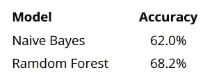
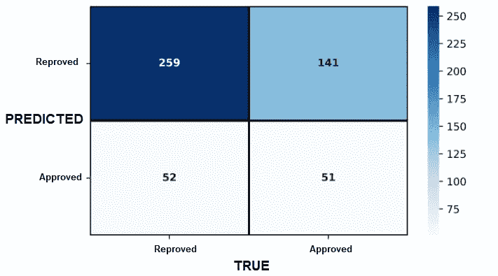
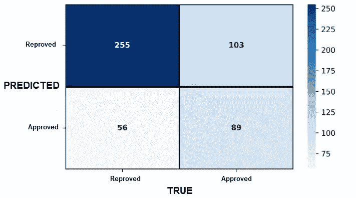
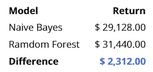

# 从混淆矩阵中提取值($)

> 原文：<https://medium.com/mlearning-ai/extracting-value-from-the-confusion-matrix-21ec737fad20?source=collection_archive---------10----------------------->

Image by the author.

**混淆矩阵**是一种*权变*表，用于**总结**或**可视化**机器学习**分类模型**的*性能*。它定义了算法在*分类*任务中的表现好坏，是获取**准确性**、**召回**、**精度**、**特异性**以及 **AUC** 和 **ROC 曲线**等性能指标的基础。但是如何**从混淆矩阵中提取价值**(在 ***财务术语*** )呢？

# 让我们考虑以下场景

假设有一家**教育公司**为其学生(客户)准备认证**考试**。由于公司注意到学生对年度计划的认可率很高，公司在其**商业模式**上实施了以下**规则**:

> *本公司最近组建了一个* ***数据团队*** *即能够通过* ***预测*** *，通过* **机器学习模型** *后，学生是否会被***T59 认可** *或 ***不*因此，本公司存在*** **两种情况***:*
> 
> *×*×**×*如果认购学生考试不及格，公司将退还其年度计划 20%的投资。***
> 
> *×*×**×*否则收取 5%的费用(超过年度计划)***

团队获得了 ***两款*** 数据，准确率如下**:**

****

****Accuracies** for the two **classification models** proposed for the data team.**

# **每种模式会给公司带来多少回报(美元)？**

**现在是时候使用*混淆矩阵* …**

## **朴素贝叶斯**

****

**Naive Bayes Confusion Matrix. Image by the author.**

## **随机森林**

****

**Random Forest Confusion Matrix. Image by the author.**

**除了作为获得 ***机器学习分类模型*** 的**性能指标**的基础之外，**混淆矩阵**还可以给我们*对所提出的解决方案的财务洞察力*。为了量化这两种情况下公司的收益(单位为 **U$D** ),我们假设学生的年度计划为 **$80.00** ，基础为 **3，000 名学生**。因此，每个模型的**利润**或**损失**(取决于可能为正或负的结果)由下式给出:**

> ****Ammount ($) = -(亏损)*真阴性-(亏损)*假阳性+(盈利)*假阴性+(盈利)*真阳性。****

# ****财务结果****

****财务结果**如下所示。**

****

****Financial results**. Both classification models generated **profit**.**

# **结论**

**准确率**提高了 6.2%的分类模型**为公司带来了**高 7.9%的财务回报**。然而， ***精度较低的型号*** 可能偶尔会更*，尽管事实并非如此。因此，除了分析*算法(和模型)的**性能指标**之外，总是与**评估**财务术语中的解决方案相关。****

****你喜欢它的内容吗？那就跟着我上 [**中**](/@vo.freelancer5) 定期接收更多 ***数据科学&分析*** 这样的内容吧。还有，在 [**Linkedin**](http://www.linkedin.com/in/vinicius-oviedo) 上随时联系我。****

**** [## Mlearning.ai 提交建议

### 如何成为 Mlearning.ai 上的作家

medium.com](/mlearning-ai/mlearning-ai-submission-suggestions-b51e2b130bfb)****