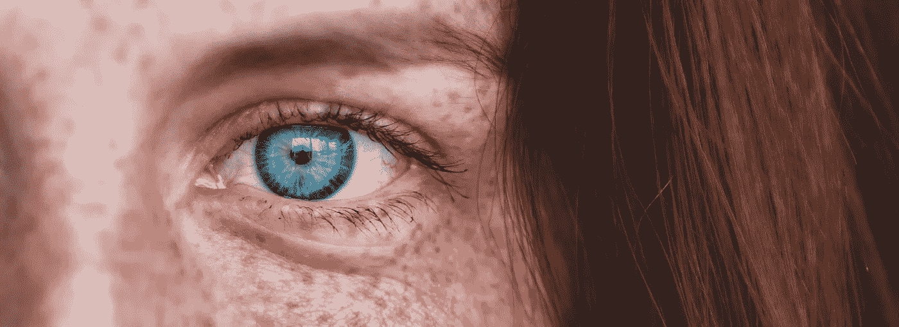
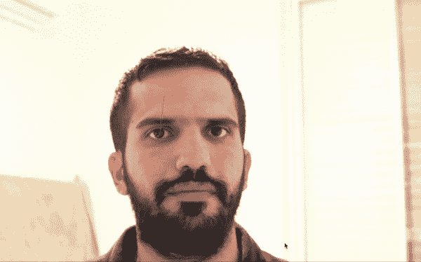
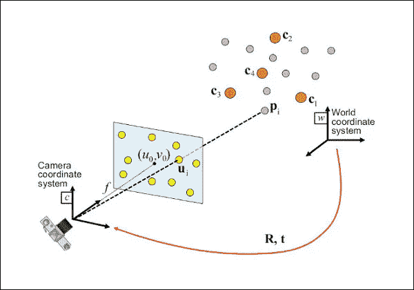
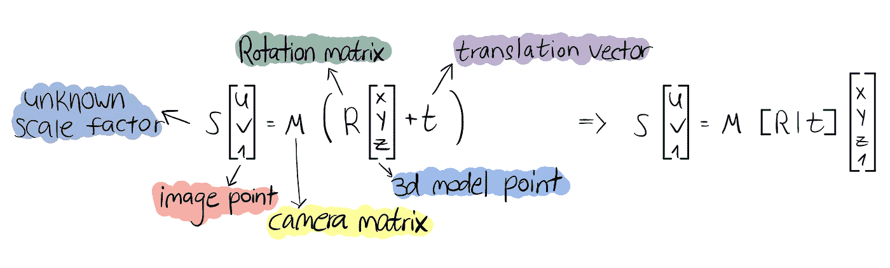
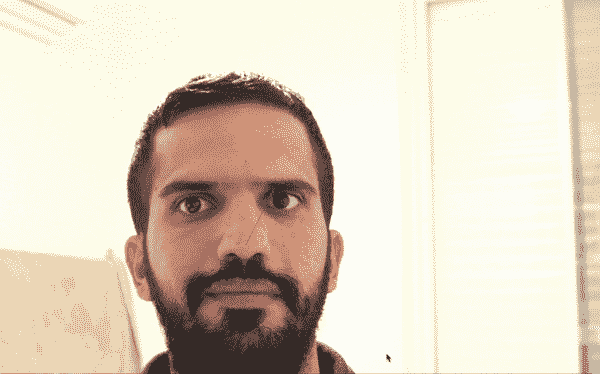
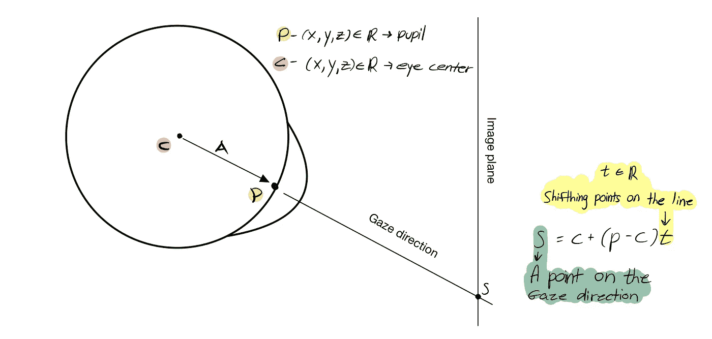
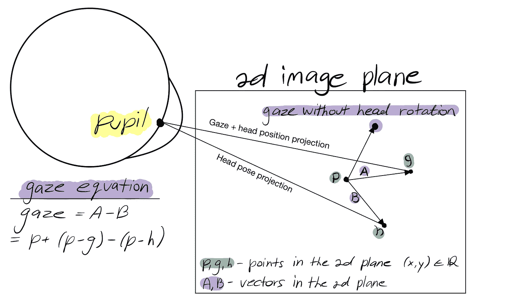

# 使用网络摄像头进行眼睛注视估计。100 行代码

> 原文：<https://medium.com/mlearning-ai/eye-gaze-estimation-using-a-webcam-in-100-lines-of-code-570d4683fe23?source=collection_archive---------2----------------------->

Taken from [https://unsplash.com/@introspectivedsgn](https://unsplash.com/@introspectivedsgn)

让我们来看看下面的场景，你坐在图书馆里，你刚刚看到最漂亮的女人坐在图书馆的另一边。还有**哎呀，**她发现你在盯着她看。她估计你的目光注视着她，你注意到她通过理解她的目光是针对你而抓住了你。

> **眼睛注视点**:一个人的眼睛聚焦的点

就像我们神奇的大脑毫不费力地完成的许多任务一样，这是一个“教”计算机的难题，因为我们需要执行几个困难的任务:

*   人脸识别
*   眼睛识别和瞳孔定位
*   确定头部和眼睛的 3D 位置

商用凝视跟踪器有各种形状和尺寸。从眼镜到屏幕基础解决方案。尽管这些产品非常精确，但它们使用专有的软件和硬件，而且非常昂贵。

# 让我们开始建造我们的凝视跟踪器

为了让这个博客保持一个合理的长度，我们将建立一个基本形式的视线跟踪。做了一些粗略的估计。而且我们不会确定确切的凝视点，而是凝视方向。

Gaze is relative to the camera, and I'm sitting under the camera

**人脸识别和瞳孔定位**

对于这个任务，我们将使用 [MediaPipe](https://google.github.io/mediapipe/solutions/face_mesh.html) ，这是一个由谷歌开发的惊人的深度学习框架，它将使用很少的资源，实时为我们提供 468 个 2D 人脸地标。

让我们看一些代码:

这里没有什么特别的，在第 27 行，我们将当前帧和从 mediapipe 框架获得的标志点传递给我们的凝视函数，这就是所有的乐趣所在。

# **3D 里的 2D？**

视线追踪是一个 3D 问题，但我们在标题中说我们只使用了一个简单的网络摄像头，这怎么可能呢？

我们将使用一些极客魔术(线性代数)来实现它。首先，让我们了解一下我们的相机是如何“看”这个世界的。

Image from [OpenCV docs](https://docs.opencv.org/4.x/dc/d2c/tutorial_real_time_pose.htmlhttps://docs.opencv.org/4.x/dc/d2c/tutorial_real_time_pose.html)

你在屏幕上看到的 2D 图像用蓝色表示，3D 世界用世界坐标系表示。它们之间有什么联系？你问。我们如何从 2D 图像中绘制 3D 世界地图，或者至少得到一个粗略的估计？我们来想办法吧！

## 我们都一样

我们人类比我们想象的更相似，我们可以获得人脸的通用 3D 模型，这将是对大多数人口的 3D 比例的良好估计。

让我们使用这样一个模型来定义一个 3D 坐标系统，我们将把鼻尖设置为坐标系统的原点，并且相对于此我们将定义另外 5 个点，如下所示:

现在我们有了从 mediapipe 获得的 6 个 2D 点，以及我们定义的世界坐标系中相应的 3D 点。我们的目标是通过使用我们的 2D 图像来了解这些点的 3D 位置的变化。怎么才能做到呢？

## 针孔摄像机模型来拯救

[针孔摄像机模型](https://en.wikipedia.org/wiki/Pinhole_camera_model)是一个数学模型，描述了 3D 世界中的点和它们在 2D 图像平面上的投影之间的关系。从该模型中，我们将推导出以下等式:

使用这个等式，我们可以获得将 3D 点投影到图像 2D 图像平面的变换。但是我们能解决吗？嗯，至少不是通过简单的代数工具，但是不要担心，这就是 OpenCV 用 [solvePnP](https://docs.opencv.org/4.5.4/d9/d0c/group__calib3d.html#ga549c2075fac14829ff4a58bc931c033d) 函数来拯救的地方，查看链接获得更深入的解释。

我们将获得 6 个图像点和相应的 3D 模型点，并将它们传递给 solvepnp 函数。我们将得到一个旋转和平移向量，从而得到一个变换，帮助我们将一个点从 3D 世界点投影到 2D 平面。

> 点击[这里](https://learnopencv.com/approximate-focal-length-for-webcams-and-cell-phone-cameras/)学习如何估算相机矩阵，或者[这里](https://docs.opencv.org/3.4/dc/dbb/tutorial_py_calibration.html)学习如何校准你自己的相机。

使用我们的新变换，我们可以从 3D 空间中选取一个点，并将其投影到 2D 图像平面。因此，我们将得到这个 3D 点在空间中指向哪里的概念。这就是点(0，0，150)的样子。

# **来自 3D 的 2D**

现在我们将瞳孔 2D 图像坐标投影到我们的三维模型坐标。与我们在头部姿势估计部分所做的正好相反。

如代码片段所示，我们将使用 OpenCV estimateAffline3D 函数。这个函数使用了我们讨论过的针孔摄像机模型的相同原理。它采用两组 3D 点，并返回第一组点和第二组点之间的转换。但是等等，我们的图像点是 2D，这怎么可能？我们将获取图像点(x，y)并将其作为(x，y，0)传递，因此将获得图像坐标到模型坐标之间的转换。利用这种方法，我们可以从 mediapipe 获取的 2D 图像点得到瞳孔的三维模型点。

> 注意:这不是一个非常准确的估计

我没有告诉你，但是如果你看上面的第二个代码片段，你可以看到我们有眼睛中心模型点(3D)，我们刚刚使用 estimateAffline3D 获取了瞳孔 3D 模型点。现在要找到凝视的方向，我们需要解决这个线平面相交的问题，如上图所述。我们试图寻找的点用 ***S*** 表示。让我们把这个点投影到 2D 平面上。

> 注意:在第 5 行，我们使用了“神奇”的数字 10，这是因为我们不知道主体离相机的距离。因此在图中由 t 表示的瞳孔到照相机之间的距离是未知的

# 完事了吗？

还没有。现在我们需要考虑头部运动，这样，我们的视线跟踪器将对头部运动有弹性。让我们从一开始就使用我们的头部姿态估计。

瞳孔的 2D 位置由点 ***p*** 表示，点 ***g*** 是凝视+头部旋转投影，点 ***h*** 是头部姿态投影。现在，为了获得清晰的凝视信息，我们从矢量 ***A*** 中子构造矢量 ***B*** 。

> 在第 5 行中，我们使用了神奇的数字 40，原因与我们在上面的代码片段中使用 10 的原因相同。

# 剧终

我们结束了，至少现在。你可以在我的 Github 页面上看到完整的代码，并在你的机器上运行它。

 [## GitHub-amitt 1236/Gaze _ estimation

### 此时您不能执行该操作。您已使用另一个标签页或窗口登录。您已在另一个选项卡中注销，或者…

github.com](https://github.com/amitt1236/Gaze_estimation) 

# 但是我们真的完了吗？

嗯，我们抄了一些近路，以保持这个博客在一个合理的长度。因此，我们可以改变一些事情来提高准确性:

1.  正确校准相机，不要使用估计值。
2.  用双眼计算两个位置之间的平均值。(我们只用了左眼)
3.  我们使用 estimateAffine3D 方法将 2d 瞳孔位置投影到 3D 空间，但这不是一个精确的估计。我们可以使用眼睛结构和眼窝中的瞳孔位置来推断瞳孔的 3d 位置。
4.  我们完全忽略了拍摄对象与摄像机的距离。因此，我们只有一个注视方向，而没有一个注视点。这可能是最重要的部分，但也是最复杂的部分。

只需做一点工作，您就可以实现您的解决方案，并将其用于您的特定需求。我会很高兴收到你的来信。你想看第二部分吗？它应该包括什么？或许我们可以更深入地探讨其中一个主题？

如果你看到任何错误，不要犹豫，立即联系我们。

 [## Mlearning.ai 提交建议

### 如何成为 Mlearning.ai 上的作家

medium.com](/mlearning-ai/mlearning-ai-submission-suggestions-b51e2b130bfb)