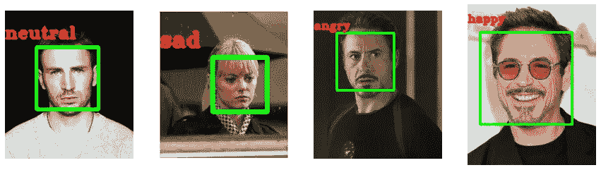
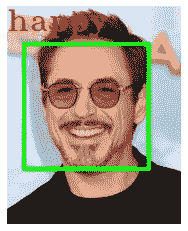
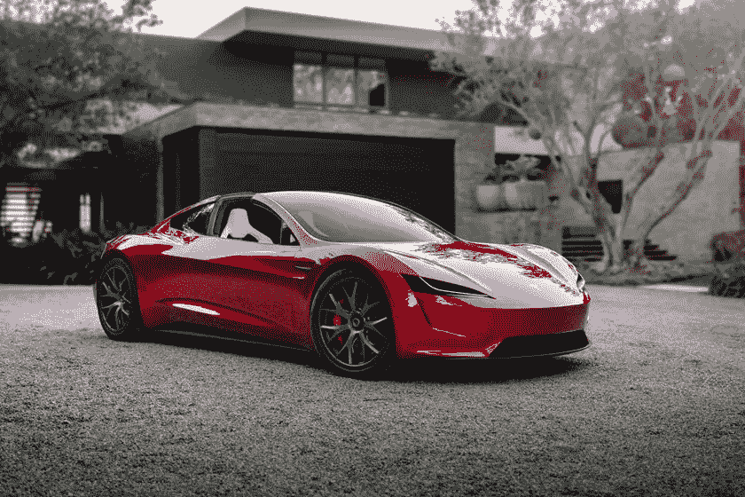
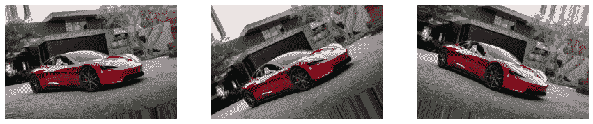
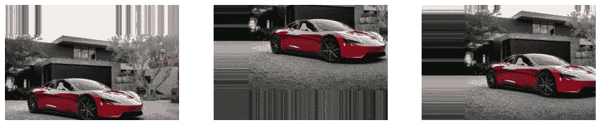
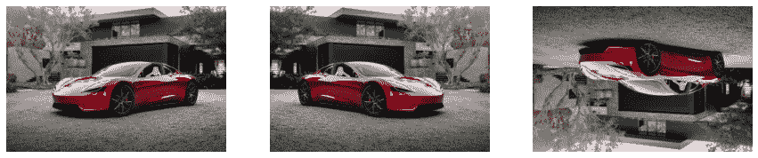
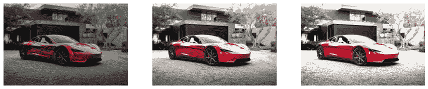
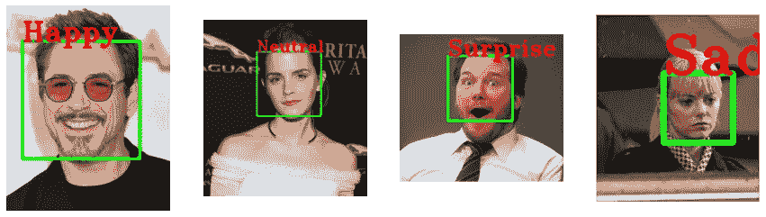

# 人脸情感识别(FER)

> 原文：<https://medium.com/mlearning-ai/face-emotion-recognition-fer-114ccb359604?source=collection_archive---------3----------------------->

在这篇博客中，我将解释如何使用不同的深度学习模型从图像中识别面部情绪。

## 目录:

1.  FER——使用 DeepFace 和 OpenCV
2.  FER- VGG

# 1.FER——使用 DeepFace 和 OpenCV

在下面的例子中，我们已经认识到不同的面部情绪，如快乐、悲伤、愤怒等。使用 **DeepFace** 人脸识别包和 OpenCV。



DeepFace 是 Sefik Ilkin Serengil 创建的人脸识别和面部属性分析 Python 库。此外，我们将使用 OpenCV 来检测图像中的人脸，以便我们可以在人脸周围绘制边界框。

使用 DeepFace 包，我们只需要几行代码就可以识别面部情绪。您可以在链接中找到该代码的 Jupyter 文件。([朱庇特笔记本](https://github.com/Prabhitha/FaceEmotionRecognition/blob/main/FaceEmotionDetection_DeepFace.ipynb))

首先，导入所需的库，如 cv2 和 DeepFace。加载输入图像。然后，使用 DeepFace 来识别该人的面部情绪。使用 OpenCV 库绘制人脸周围的包围盒。有关人脸检测的详细说明，请参考此链接。([使用 OpenCV 的人脸检测](https://prabhitha3.medium.com/?p=d71f78870271))

**输入:**



Face Emotion Recognition

**输出:**我们的模型预测主导情绪为快乐，年龄为 53，性别为男性，主导种族为白人。

```
{'emotion': {'angry': 5.69619108083056e-08,
  'disgust': 3.1070864423150083e-13,
  'fear': 2.130725735972857e-11,
  'happy': 99.9999463558165,
  'sad': 1.3578462719752345e-06,
  'surprise': 7.25795497813735e-11,
  'neutral': 5.4453287083243254e-05},
 'dominant_emotion': 'happy',
 'region': {'x': 35, 'y': 78, 'w': 258, 'h': 258},
 'age': 53,
 'gender': 'Man',
 'race': {'asian': 0.024189992109313607,
  'indian': 0.2852343022823334,
  'black': 0.016142033564392477,
  'white': 72.07229137420654,
  'middle eastern': 13.463360071182251,
  'latino hispanic': 14.138786494731903},
 'dominant_race': 'white'}
```

# FER -VGG:

在这里，我们不是使用 DeepFace 人脸识别包，而是要训练我们自己的定制 VGG 模型来识别面部情绪。

我们将在 FER 2013 数据集上训练我们的模型。该数据集包含大小为 48*48 像素的灰度人脸图像。它有 6 个分类标签:愤怒、厌恶、恐惧、快乐、悲伤、惊讶和中立。训练集由 28，709 幅图像组成，测试集由 3，589 个示例组成。但是我们将用 11，448 幅训练图像和 4，798 幅测试图像来训练我们的模型。

**训练图像示例:**


Happy Faces


Sad Faces

## 步骤:

*   数据扩充
*   建立和训练模型

## **a)数据扩充:**

一般来说，要训练一个高精度低误差的模型，需要在大数据上进行训练。但实际操作起来，就没那么容易了。所以在这里，我们将做数据增强来增加训练数据。数据扩充没什么，但是给定一个输入图像，我们通过改变图像的不同属性来创建它的多个副本。我们执行图像旋转，移位，翻转，修改其亮度，改变角度等。我们也可以通过将图像除以最高像素值(1)来标准化图像。/255).

主要优点是，它不会将转换后的图像添加到我们的原始数据集中。当我们训练模型时，我们同时变换图像。此外，我们分批加载训练图像，这减少了过拟合的问题，并降低了内存的使用。

**原始图像:**



Tesla Roadster

## 代码:

**图像旋转:**我们可以指定图像需要在 0 到 360 度之间旋转多少度。



**图像移动:**我们可以水平和垂直移动图像。



**图像翻转:**我们可以翻转图像。第一个图像水平翻转，第三个图像垂直翻转。



**图像亮度:**我们可以调节图像的亮度。第一张图像比上一张暗。



**图像缩放:**我们可以放大和缩小图像。


我们将通过执行旋转、剪切、缩放、宽度移动、高度移动和水平翻转来增加我们的训练数据。我们不应该增加试验数据。

## b)构建和训练模型:

在我们的模型中，我们总共有 7 个块，具有多个卷积层和最大池层。我们使用批量标准化和退出来避免过度拟合。我们的最终模型将有 1，325，861 个可训练参数。

最后，我们使用分类交叉熵损失和 Adam 优化器编译和拟合我们的模型。我们用不同的学习速率、时期和批量大小来训练我们的模型。

然后，我们将使用 OpenCV Haar 级联分类器来检测人脸，并在其周围绘制边界框。

**最终输出:**



同样，我们可以从直播/录制的视频中识别面部情绪。

**我的 GitHub 页面上有实现:**

[https://github.com/Prabhitha/FaceEmotionRecognition](https://github.com/Prabhitha/FaceEmotionRecognition)

**参考文献:**

1.  [https://viso.ai/computer-vision/deepface/](https://viso.ai/computer-vision/deepface/)
2.  [https://github . com/pydeveloperashish/face-Expressions-Recognition](https://github.com/pydeveloperashish/Facial-Expressions-Recognition)

[](/mlearning-ai/mlearning-ai-submission-suggestions-b51e2b130bfb) [## Mlearning.ai 提交建议

### 如何成为 Mlearning.ai 上的作家

medium.com](/mlearning-ai/mlearning-ai-submission-suggestions-b51e2b130bfb)