# 利用计算机视觉检测人脸面具。

> 原文：<https://medium.com/mlearning-ai/face-mask-detection-using-computer-vision-d4aa4ad8cacd?source=collection_archive---------3----------------------->

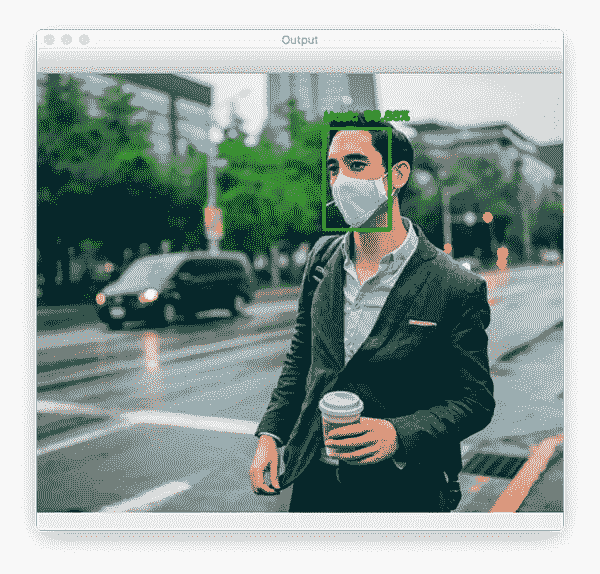

# **简介:**

在新冠肺炎的情况下，有必要在公共场合戴口罩，以避免感染。在这里，我们建立了一个计算机视觉模型，可以检测人是否戴面具。
**在继续之前，我要感谢**[**Rahul Arora**](https://medium.com/u/c7c98846a04f?source=post_page-----d4aa4ad8cacd--------------------------------)**与我在这方面的合作。**

# 数据集集合:

在这种情况下，我们在我们的数据集上建立了模型，其中有 **331 个训练图像**和 **17 个测试图像**，带有**标签屏蔽，无屏蔽**

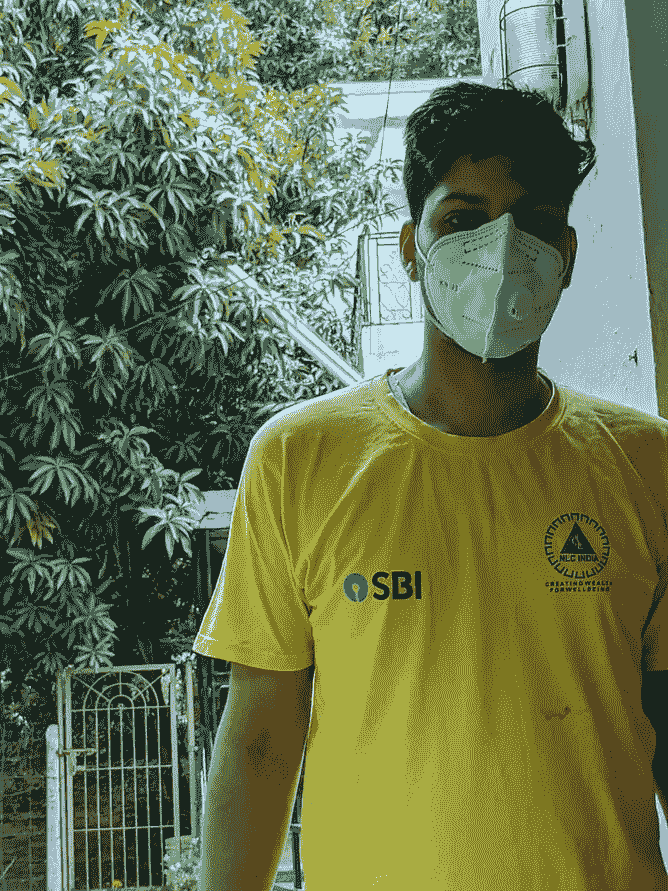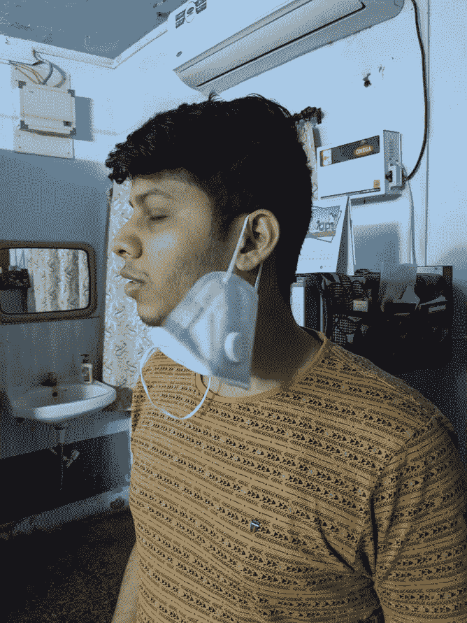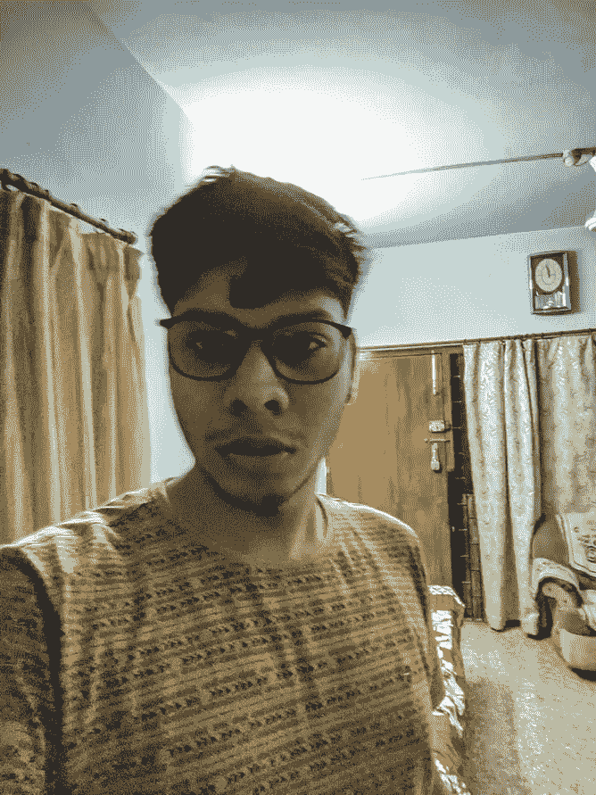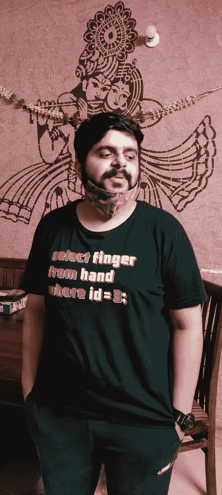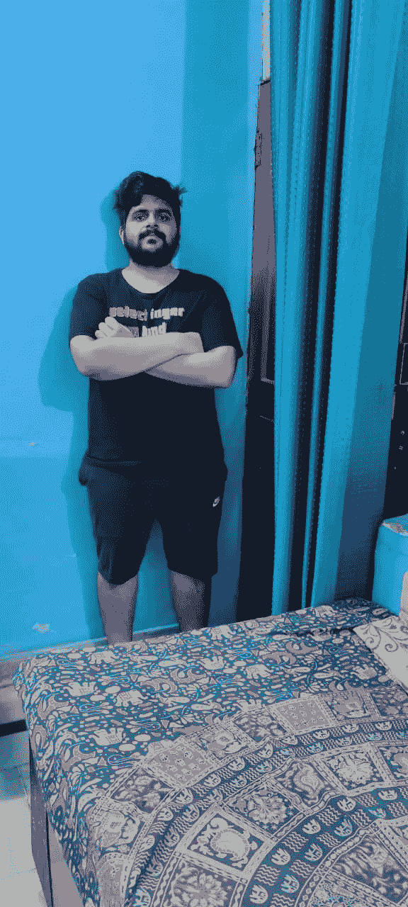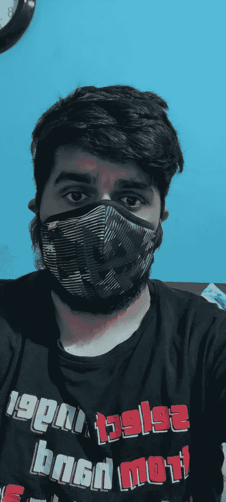

**Images With and Without Mask**

# **数据标注:**

使用 [**MakeSense 对图像进行了注释。艾**](https://www.makesense.ai/) 。这是一个开源网站，可以帮助你注释图片，并根据我们的选择下载任何格式的图片。
这里已经用两种方式做了注解:
1。英寸 xml 格式，我们有 **X-min，X-max，Y-min，Y-max 坐标**

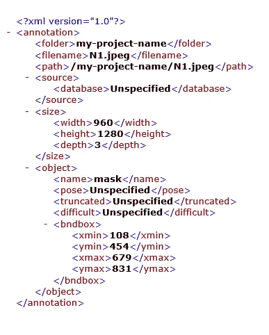

2.英寸 txt 格式它包含**对象类、对象坐标、图像宽度、图像高度**

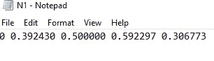

# 数据准备和建模:

由于这里我们使用了两种不同的模型，数据准备以两种不同的方式完成。这里我们不会包括所有使用的库或 python 代码，因为这会使这篇博客太冗长。参考资料将在参考资料部分提供。

## 1.采用预训练 SSD Resnet 的 Tensorflow 对象检测:

我们必须创造。来自 xml 的 csv 文件。

之后，我们需要分别创建训练和测试 tf 记录。

我们已经为 **10000 步**训练了我们的模型。这是我们损失的最后几步

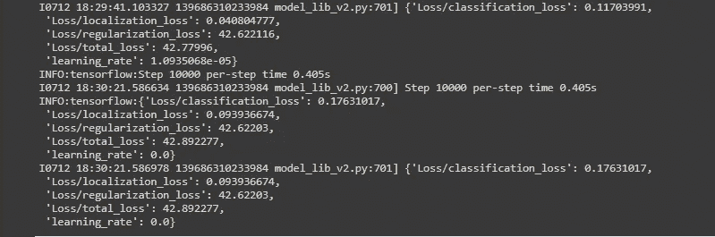

正如我们从上面看到的总损失太大了，所以我们不期望这个模型正常工作。
对于模型的**推理，我们提供了如下要点。**

让我们看看我们的模型表现如何。

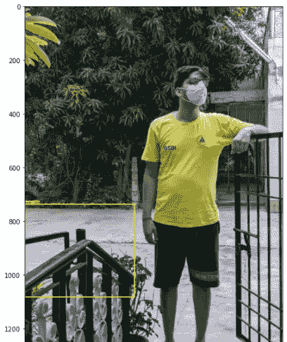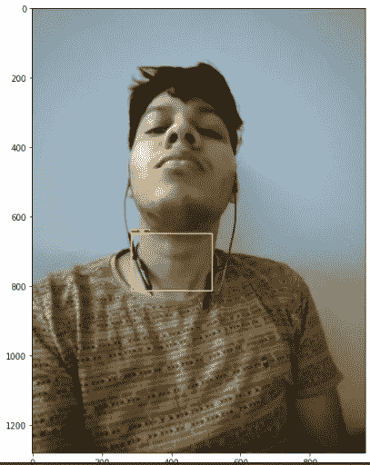

从上面，我们可以清楚地看到，我们的模型表现得不够好。要么需要对更多的步骤进行训练，要么需要使用更好的模型，但对于少数最终步骤，损失没有减少太多，这可能是我们已经达到了饱和点。我们需要使用更好的模型。

## 2.YoloV5s:

这里我们将使用。用于训练模型的 txt 文件批注。yolo v5 有不同的版本。我们已经初步使用 Yolo v5s 版本来检查模型的性能。我们只会发布需要修改的片段。

在训练模型之前，确保您的文件结构如下所示:

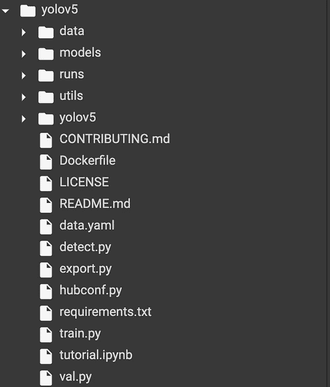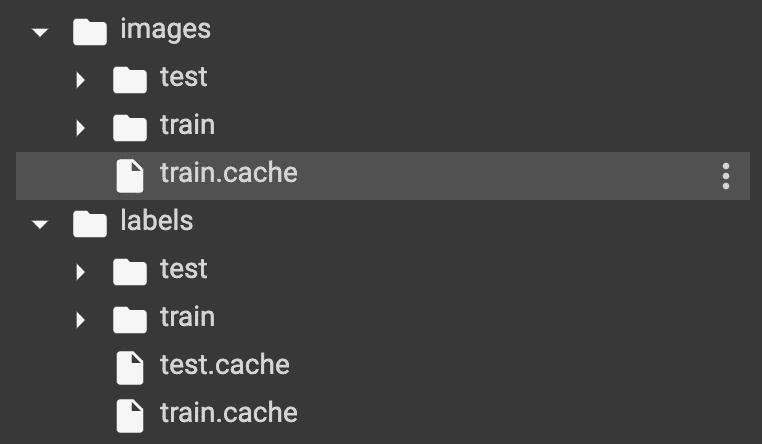

确保图像、标签文件名大小写完全一致，否则会抛出错误。
现在我们将为 **200 个时代**训练我们的模型，而**的批量为 80 个**。对于最后的几个时代，这就是我们损失的样子。

让我们来看看我们的模型表现如何:

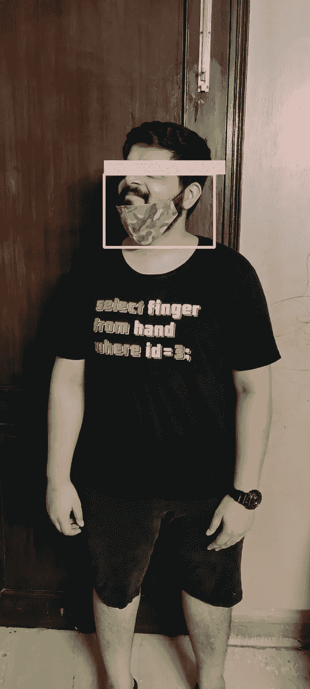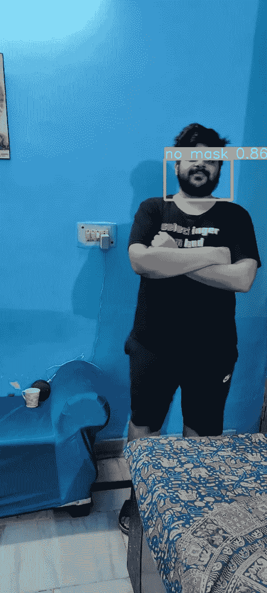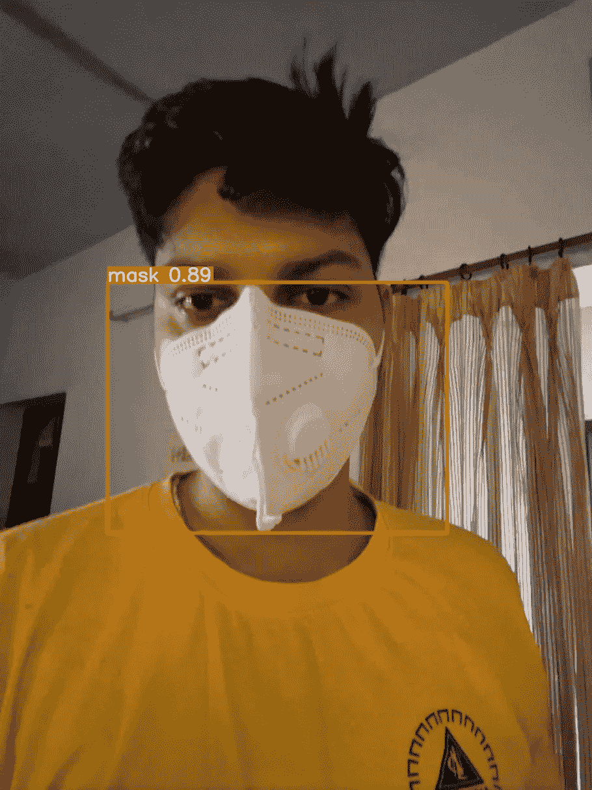

我们可以看到我们的模型表现良好。让我们看看情节是怎样的:

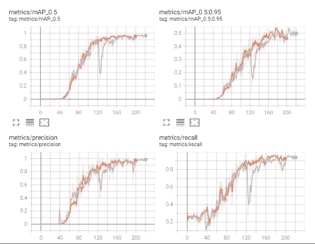

从上面我们可以观察到我们的模型一点也没有过度拟合。

# 参考链接:

1.  **张量流对象检测**:
    [https://www.youtube.com/watch?v=XoMiveY_1Z4](https://www.youtube.com/watch?v=XoMiveY_1Z4)
2.  **Yolo:**[https://colab . research . Google . com/drive/16 qcayztuhcof 9 cqiqymgnxmty 1 xkaidn？USP = sharing # scroll to = dorw G4 mthaji](https://colab.research.google.com/drive/16QCaYzTuHCOF9CQLQYmGNxmtY1xKAIdn?usp=sharing#scrollTo=dOrWg4mthaji)

# Github 资源库:

 [## GitHub-ni pun-1997/面罩-检测

### 在 GitHub 上创建一个帐户，为 ni pun-1997/面罩检测开发做出贡献。

github.com](https://github.com/Nipun-1997/Face-Mask-Detection) 

这里是我们的 linkedin 个人资料。尼普·阿格拉瓦尔[https://www.linkedin.com/in/nipun-agrawal-200597110/](https://www.linkedin.com/in/nipun-agrawal-200597110/)2。拉胡尔·阿罗拉[https://www.linkedin.com/in/rahul-arora-461a19125/](https://www.linkedin.com/in/rahul-arora-461a19125/)