# 使用 Keras 中的 VGGFace2 进行叠加面具的人脸识别

> 原文：<https://medium.com/mlearning-ai/face-recognition-for-superimposed-facemasks-using-vggface2-in-keras-c13e610acd56?source=collection_archive---------0----------------------->

使用 Keras 中的 VGGFace2 对带有叠加面罩的人脸执行人脸识别。这篇文章是上一篇文章- [用 OpenCV-dlib](/@xictus77/facial-mask-overlay-with-opencv-dlib-4d948964cc4d) 做面膜的延续。

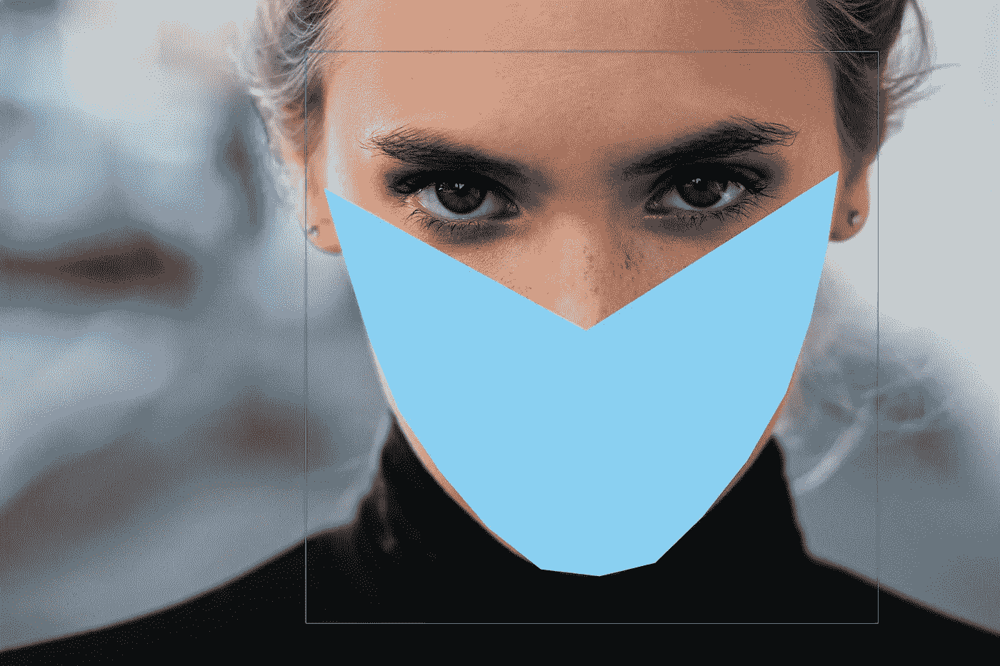

Photo by [Andrey Zvyagintsev](https://unsplash.com/@zvandrei?utm_source=unsplash&utm_medium=referral&utm_content=creditCopyText) on [Unsplash](https://unsplash.com/s/photos/masked-face?utm_source=unsplash&utm_medium=referral&utm_content=creditCopyText) (Original image edited using [face mask overlay](/mlearning-ai/facial-mask-overlay-with-opencv-dlib-4d948964cc4d))

在本文中，我们将尝试使用 *MTCNN(多任务级联卷积网络)*对使用 OpenCV 和 dlib 库生成的“被掩盖”的人脸进行人脸检测。此后，我们将在 Keras 中使用 *VGGFace2* 对“被掩盖”的面部进行面部识别测试。

我们还将使用深度学习模型测试我们的“掩蔽”面部，以确定我们的面部“掩蔽”是否成功。不过，那会在另一篇帖子里。

# F ace 识别定义

人脸识别是从人脸图像中识别和验证人的过程。根据*《人脸识别手册》*，人脸识别主要有两种模式——*人脸验证*和*人脸识别*。

*   **人脸验证**。给定人脸与已知身份的一对一映射
*   **人脸识别**。给定人脸与已知人脸数据库的一对多映射

# 基于 MTCNN 的人脸检测

然而，在人脸识别之前，我们需要检测人脸。人脸检测是人脸识别流程中一个重要且必不可少的阶段。正如在[上一篇文章](/mlearning-ai/facial-mask-overlay-with-opencv-dlib-4d948964cc4d)中提到的，面部检测可以通过多种方式进行。在本帖中，我们将使用 [MTCNN](https://kpzhang93.github.io/MTCNN_face_detection_alignment/index.html) 或多任务级联卷积网络对我们的“蒙面”人脸进行人脸检测。它是一种用于人脸检测的现代深度学习模型，在 2016 年题为*[*使用多任务级联卷积网络*](https://arxiv.org/abs/1604.02878)*的论文中进行了描述。这是一个强大的面部检测器，提供高检测分数。**

## **了解多任务级联卷积网络**

**MTCNN(多任务级联神经网络)是一种深度学习方法，用于检测图像和视频上的人脸和面部标志。它是作为人脸检测和人脸对齐的解决方案而开发的框架。MTCNN 是人脸检测中的一种流行技术，因为它不仅能够在一系列基准数据集上获得最先进的结果，还能够识别其他关键的面部特征，如眼睛和嘴巴，我们称之为面部标志检测。关于面部标志的简要描述，请参考我之前的[帖子](/mlearning-ai/facial-mask-overlay-with-opencv-dlib-4d948964cc4d)。**

**网络采用三网级联结构；首先，将图像重新缩放到不同大小的范围(称为图像金字塔)，然后第一个模型(建议网络或 P-Net)提出候选面部区域，第二个模型(细化网络或 R-Net)过滤边界框，第三个模型(输出网络或 O-Net)提出面部标志。图 1 展示了 MTCNN 的架构。图 2 显示了级联框架的流水线，包括三级多任务深度卷积网络。**

**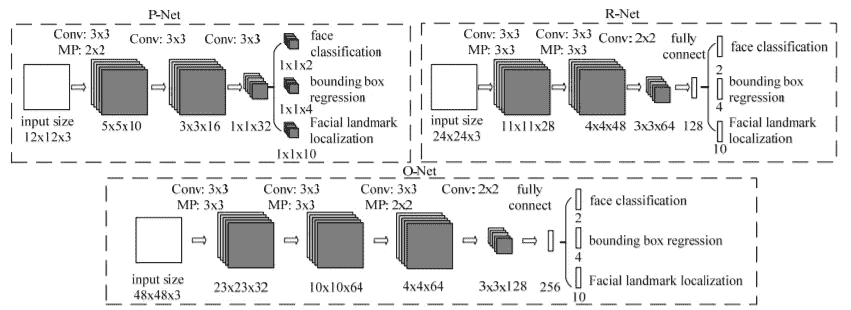**

**Figure 1 — MTCNN architecture : P-Net, R-Net, and O-Net [[source](https://arxiv.org/ftp/arxiv/papers/1604/1604.02878.pdf)]**

**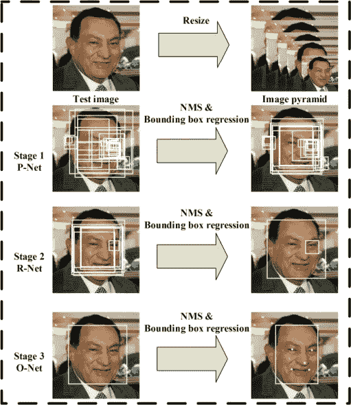**

**Figure 2 — MTCNN pipeline [[source](https://arxiv.org/ftp/arxiv/papers/1604/1604.02878.pdf)]**

**在本帖中，我们将在 [ipazc/mtcnn](https://github.com/ipazc/mtcnn) 项目中使用由 [Iván de Paz Centeno](https://www.linkedin.com/in/ivandepazcenteno/) 提供的实现。这可以通过 pip 安装。(请参考下面的安装部分)**

# **入门指南**

**要开始使用这个脚本，*用本文末尾的链接克隆库*。**

# **安装所需的软件包**

**建议[用 Python 3.7 制作一个新的虚拟环境](https://towardsdatascience.com/setting-up-python-platform-for-machine-learning-projects-cfd85682c54b)，并安装依赖项，使用 MTCNN 执行*面部检测。*其他用于*面部识别*的库将在稍后阶段根据需要安装。**

```
**# requirements.txtnumpy == 1.19.2
keras == 2.3.1
matplotlib >=  3.3.2
pillow >= 7.2.0
tensorflow == 2.0.0
mtcnn == 0.1.0
opencv-python == 4.4.0.44
pip    >= 20.2.2
python >= 3.7.9**
```

**由于 MTCNN 要求使用特定版本的 Tensorflow 和 Keras 以及其他外设库，因此按照此[链接](https://mc.ai/face-detection-using-mtcnn-part-2/)按照特定步骤安装相关库至关重要。**

# **导入库**

**我们将从导入所需的必要库开始: *numpy，os，* *matplotlib，pillow* 和 *mtcnn* 。**

**下一步是设置导入图像的目录和路径。已知目录将包含所有被标记的已知人脸。该目录将用于*人脸验证*的后续部分。**

**我们将创建一个 MTCNN 人脸检测器类。该检测器将用于检测加载图像中的所有人脸，并提取人脸以供后面部分中的 VGGFace 人脸检测器模型使用。**

**我们将继续定义一个函数*extract _ face _ from _ image()*，它将从加载的文件名中加载一个图像并返回提取的面部。该函数将检测并返回检测到的人脸列表。*extract _ face _ from _ image()*函数将在后期使用，我们需要将检测到的每个人脸与已知数据集进行比较。**

**来自 *faces* (第 10 行)的结果是一个边界框列表，其中每个边界框定义了边界框的左下角，以及宽度和高度。第 14–18 行定义了边界框的像素坐标，它们用于提取检测到的面。第 23 — 27 行定义了如何使用 PIL 库将提取的人脸图像调整到所需的尺寸:在我们的例子中，模型需要形状为*224×224*的正方形输入人脸。**

**我们定义的接下来 3 个函数— *highlight_faces()、draw_faces()* 和 *print_faces()* 将用于通过 MTCNN 进行的人脸检测。**

***highlight_faces()* 函数为图像中检测到的每个人脸绘制红色边框或矩形。**

***draw_faces()* 函数将提取检测到的面部，并分别绘制每个面部。**

***print_faces()* 功能的主要目的是打印出检测到的人脸数量，然后执行 *highlight_face()* 功能。**

# **结果**

**在我们的测试图像上使用 *print_faces()* 和 *draw_faces()* 函数——奥巴马和著名的艾伦的 wefie 照片产生了以下结果——参见图 3 和图 4。这两个测试图像都叠加了使用我上一篇文章中的脚本绘制的面具——用 OpenCV-dlib 叠加面具。**

**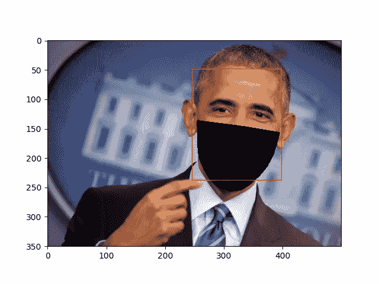****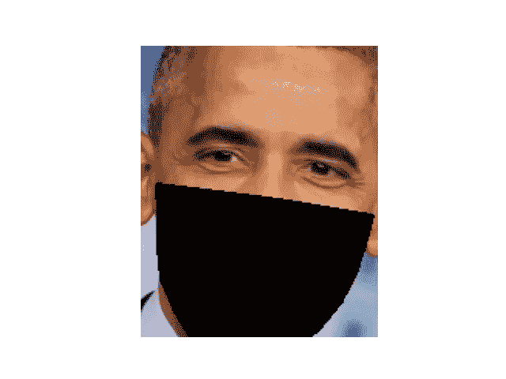**

**Figure 3 — (left image) bounding box drawn with detected “masked” face of Obama using print_face() function | (right image) extracted face from the detected face using draw_face() function**

**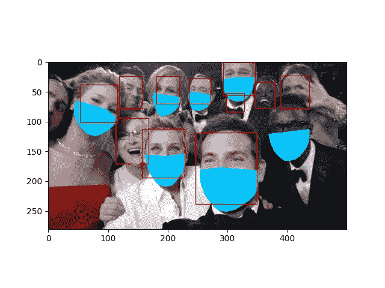****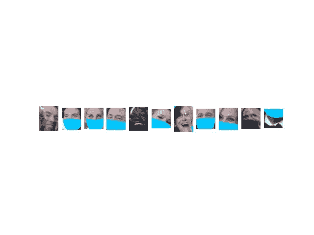**

**Figure 4— (left image) bounding box drawn with detected faces of wefie shot using print_face() function | (right image) extracted faces from the detected faces using draw_face() function**

**从所获得的结果来看，很明显，MTCNN 检测器在检测和提取遮挡的掩蔽人脸和未掩蔽人脸方面都是成功的。如图 4 所示，MTCNN 不能只检测一个“被屏蔽”的面部，并且在对“被屏蔽”的面部的检测之一中返回两个面部。结果表明，我们可以使用这些函数来检测和提取“被掩盖”的人脸，作为后续部分中 VGGFace 人脸识别模型的输入。**

**图 5 到图 7 提供了使用 OpenCV-dlib 生成的合成面具脸在 3 个名人图像上运行这个脚本的更多例子。**

**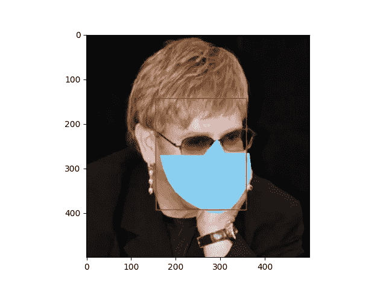****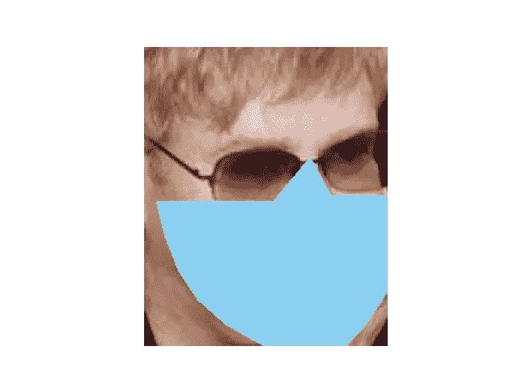**

**Figure 5— (left image) bounding box drawn with detected “masked” face of Elton John using print_face() function | (right image) extracted face from the detected face using draw_face() function**

**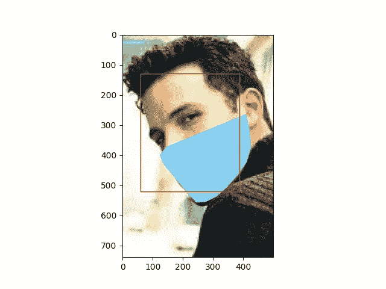****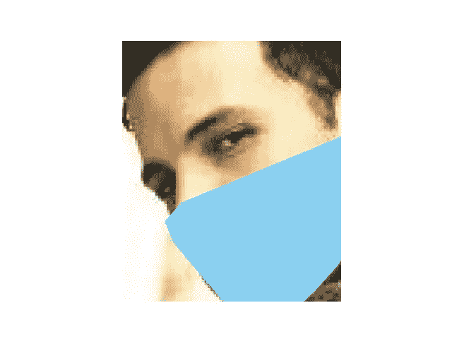**

**Figure 6— (left image) bounding box drawn with detected “masked” face of Ben Affleck using print_face() function | (right image) extracted face from the detected face using draw_face() function**

**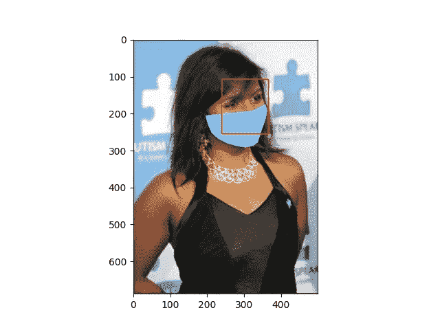****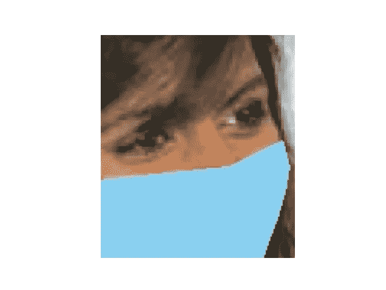**

**Figure 7— (left image) bounding box drawn with detected “masked” face of Mindy Kaling using print_face() function | (right image) extracted face from the detected face using draw_face() function**

**随着使用 MTCNN 成功检测和提取“被掩盖”的人脸，我们可以继续使用 Keras 中的 *VGGFace2* 执行人脸识别。如前所述，有两种识别模式— *人脸识别*和*人脸验证*。**

# **使用 VGGFace2 执行面部识别**

**在本节中，我们将使用 *VGGFace2* 模型对“蒙面”名人的图像执行人脸识别。在深入研究代码之前，我们需要了解什么是 VGGFace2。**

## **了解 VGGFace2**

> **[VGGFace2 是大规模人脸识别数据集。图片是从谷歌图片搜索下载的，在姿势、年龄、光照、种族和职业方面有很大的差异。](http://www.robots.ox.ac.uk/~vgg/data/vgg_face2/)**

**该数据集包含 9131 个对象(身份)的 331 万幅图像，平均每个对象 362.6 幅图像。整个数据集被分成一个训练集(包括 8631 个身份)和一个测试集(包括 500 个身份)。**

**然而，VGGFace2 已经成为在该数据集上训练的用于人脸识别的预训练模型的同义词。**

**在数据集上训练了各种模型，特别是 ResNet-50 和 SqueezeNet-ResNet-50 模型(称为 SE-ResNet-50 或 SENet)。这些模型和相关代码可以通过[链接](https://github.com/ox-vgg/vgg_face2)下载。这些模型在标准人脸识别数据集上进行评估，展示了当时最先进的性能。还提到了基于 SqueezeNet 的模型总体上提供了更好的性能。**

**必须注意，VGGFace2 的模型和预训练模型都不能直接用于 TensorFlow 或 Keras 库。需要进行转换才能在 TensorFlow 或 Keras 中使用它们。必须强调的是，这种转换工作已经完成，可以由第三方项目和库直接使用。我们在 Keras 中使用的 VGGFace2(和 VGGFace)模型是 Refik Can Malli 的 [keras-vggface 项目](https://github.com/rcmalli/keras-vggface)和库。**

## **安装用于人脸识别的 keras-vggface 库**

**该库可以通过 pip 安装:**

```
**# Most Recent One (Suggested)
pip install git+https://github.com/rcmalli/keras-vggface.git
# Release Version
pip install keras_vggface**
```

**其他依赖项也可以通过 pip 安装:**

```
**keras-applications == 1.0.8
keras-preprocessing == 1.1.0**
```

## **导入库和定义函数**

**我们将继续导入必要的库，并使用 VGGFace2 为人脸识别定义新的函数。**

```
**from keras_vggface.utils import preprocess_input
from keras_vggface.utils import decode_predictions
from keras_vggface.vggface import VGGFace**
```

**如前所述，人脸识别是给定人脸与已知人脸数据库的一对多映射。我们将被要求从包含一个人的图像中只提取一张人脸。**

**类似于函数*extract _ face _ from _ image()*将从加载的文件名加载图像并返回提取的面部列表， *extract_face()* 函数将检测并返回单个面部。提取的面将使用 PIL 库调整到 VGGFace2 模型所需的输入尺寸。然后，这个提取的人脸将作为输入传递给 *model_pred()* 函数，在这里，它将用于与 [MS-Celeb-1M 数据集](https://www.microsoft.com/en-us/research/project/ms-celeb-1m-challenge-recognizing-one-million-celebrities-real-world/)中的 8631 个身份列表进行比较。**

***model_pred()* 函数将提取的人脸加载并准备到预训练的模型中，该模型用于预测给定人脸属于八千多个已知名人中的一个或多个的概率。但是，在我们可以用一张脸进行预测之前，像素值必须按照 VGGFace 模型拟合时准备数据的相同方式进行缩放。具体来说，像素值必须使用训练数据集的平均值位于每个通道的中心。这是通过使用 *keras-vggface* 库中提供的 *preprocess_input()* 函数并指定“*version = 2”*来实现的，以便使用用于训练 VGGFace2 模型而不是 VGGFace1 模型(默认)的平均值来缩放图像。**

**使用 *VGGFace()* 构造函数创建预训练模型，并通过“ *model* ”参数指定要创建的模型类型。见第 13 行。 *keras-vggface* 库提供了三个预训练的 VGGModels，一个 VGGFace1 模型通过*model = ' vgg 16 '*(默认)，两个 VGGFace2 模型' *resnet50'* 和' *senet50'* 。在我们的例子中，我们使用 VGGFace2，我们可以选择' *resnet50'* 或' *senet50'* 。在这篇文章中，我们将使用' *senet50'* 。这个 Keras 模型将被直接用来预测一张给定的脸属于 8000 多名已知名人中的一个或多个的概率。**

**给定模型将人脸嵌入预测为 2048 长度的向量。然后使用 [L2 向量范数](https://machinelearningmastery.com/vector-norms-machine-learning/)(离原点的欧几里德距离)将向量的长度归一化，例如长度为 1 或单位范数。这被称为'*面部描述符'*。使用余弦相似度计算面部描述符(或称为“主题模板”的面部描述符组)之间的距离。余弦相似性得分越接近，匹配的概率越高。**

**一旦做出预测，类整数就被映射到名人的名字，通过 *keras-vggface* 库中的 *decode_predictions()* 函数可以检索出概率最高的前五个名字。**

**我们定义了 *decoder()* 函数，它接受 *decode_predictions()* 函数并打印出前五个概率。**

**我们将和三位名人——马特·达蒙、迈克尔·乔丹和奥普拉·温弗瑞一起测试这个模型。这些名人在 [MS-Celeb-1M 数据集](https://www.microsoft.com/en-us/research/project/ms-celeb-1m-challenge-recognizing-one-million-celebrities-real-world/)的 8631 个身份列表中。**

**我们图片的来源:马特·达蒙(维基百科)，迈克尔·B·乔丹(维基百科)和奥普拉·温弗瑞([《卫报》](https://www.theguardian.com/tv-and-radio/2018/jan/12/oprah-winfrey-unlikely-to-run-for-us-president-but-could-win-if-she-did))**

******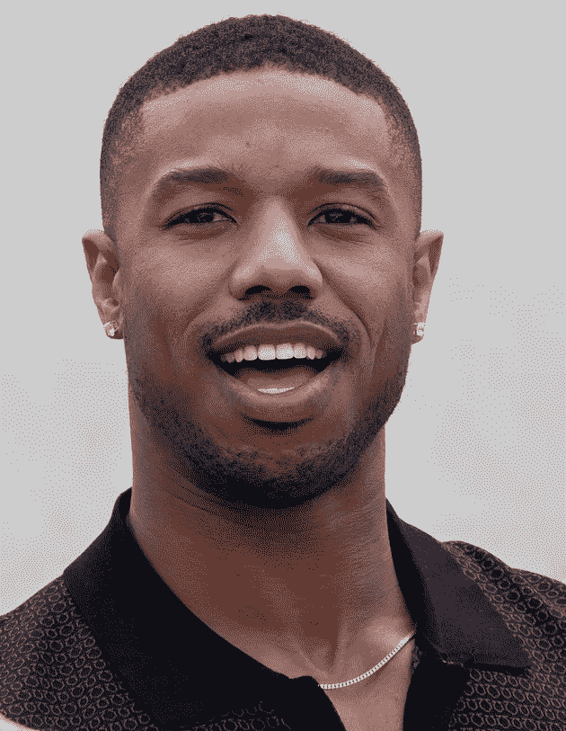******

**Figure 8 — (From Left to Right) Test images of Matt Damon, Michael B. Jordan and Oprah Winfrey**

**在对原始和“被遮罩”的脸运行 face_identity.py 之前，我们需要使用我们的脚本叠加合成的面具。**

## **人脸识别的结果**

**在分别对原始和“遮罩”人脸的每个测试图像运行 face_identity.py 脚本后，结果如下所示:**

**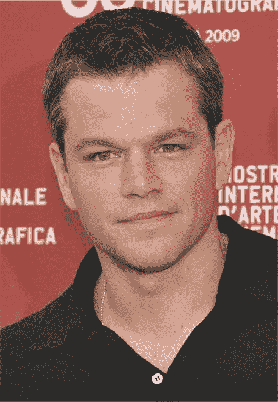****

Figure 10 — Matt Damon** **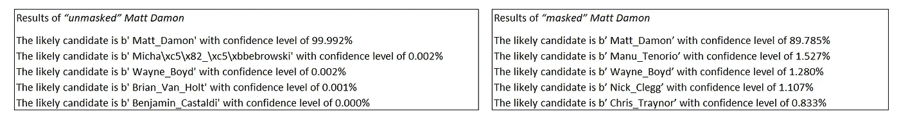********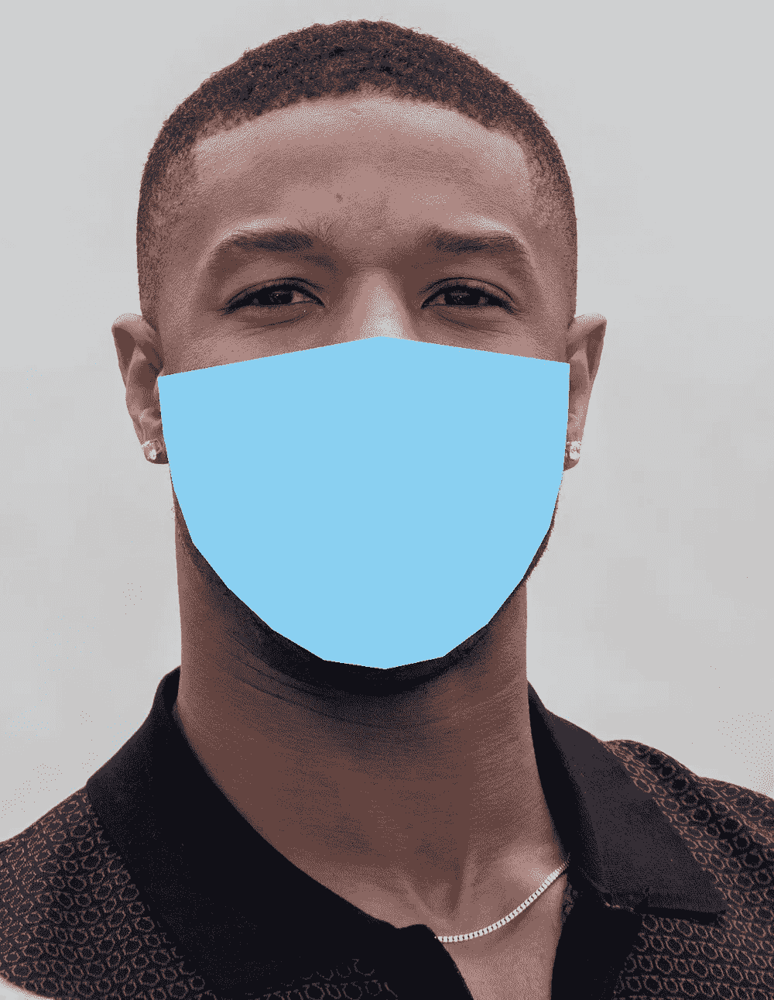**

**Figure 11 — *Michael B. Jordan***

**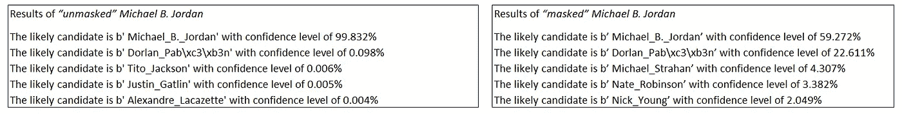********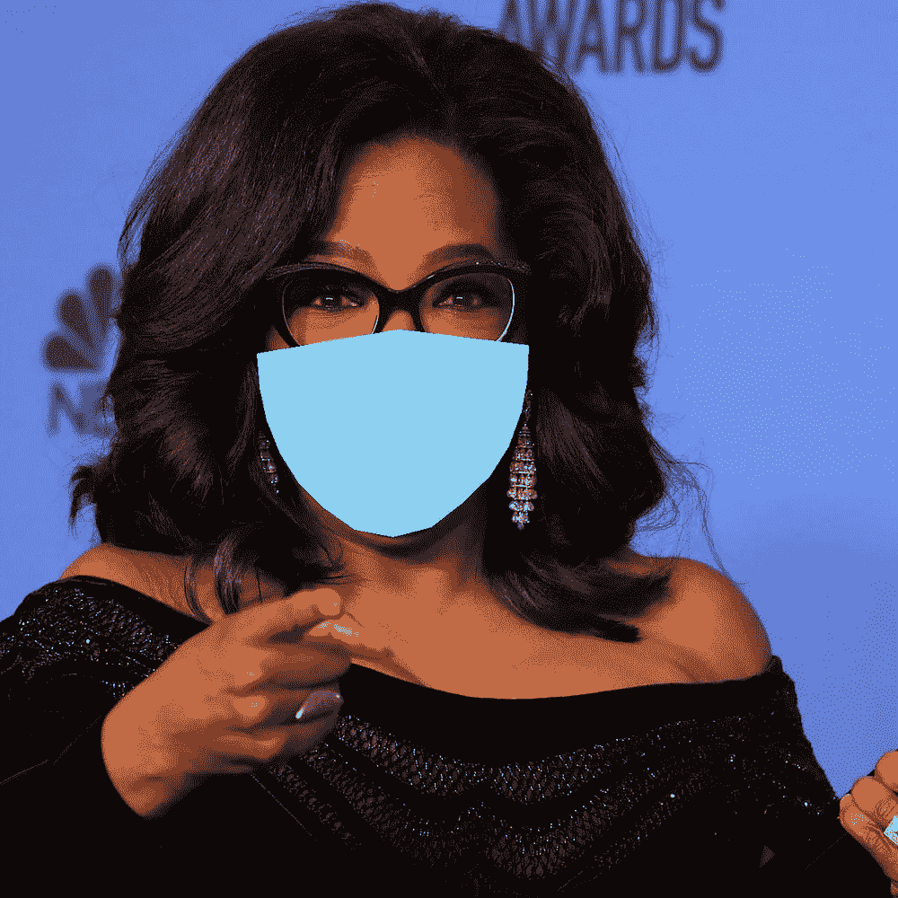**

**Figure 11 — *Oprah Winfrey***

**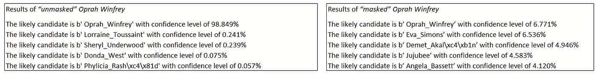**

**从结果中，我们可以观察到合成人脸面具的添加不同程度地降低了人脸识别的置信度。预先训练的模型( *senet50* )能够识别所有三个名人的假面，但是具有不同程度的置信度。这一点在奥普拉·温弗瑞的案例中尤为明显，她的信任度随着“戴面具”从 98.8%急剧下降到 6.8%。与“蒙面”马特·达蒙和“蒙面”迈克尔·B·乔丹相比，前者的可信度分别下降了 10%和 40%，该模型在预测奥普拉·温弗瑞戴着“面具”的身份时最没有信心。**

**这也表明，我的文章中的脚本— [使用 OpenCV-dlib 的人脸面具覆盖图](/@xictus77/facial-mask-overlay-with-opencv-dlib-4d948964cc4d)可以成为创建带有人脸面具的人的图像数据集的另一种选择，这些图像数据集可用于训练和评估人脸识别系统。**

# **使用 VGGFace2 执行人脸验证**

**在本节中，我们将使用 VGGFace2 模型进行人脸验证。如前所述，人脸验证是给定人脸与已知身份的一对一映射。我们将被要求从一幅图像中提取所有的人脸，并与另一幅具有已知身份的图像进行比较。**

**这包括计算测试未知人脸的人脸嵌入，并将该嵌入与系统已知人脸的嵌入进行比较。**

**人脸嵌入是表示从人脸提取的特征的向量。这将用于与其他面生成的矢量进行比较。类似于给定模型预测的人脸嵌入，当两个向量接近时(通过某种度量)，这表明两个人脸可能是同一个人；另一方面，当两个向量相距很远时(通过某种度量)，将显示两个面可能不同(就同一性而言)。**

**计算两个嵌入之间的典型度量，例如欧几里德距离和余弦距离，并且如果距离低于预定义的阈值，则认为面匹配或验证，通常针对特定数据集或应用进行调整。**

## **导入库和定义函数**

**必要的库与人脸识别相同。需要的额外的库是: *glob* 和 *SciPy* 的*余弦*函数来计算两个面之间的距离。**

```
**#Additional libraries necessary in face verification
import glob
from scipy.spatial.distance import cosine**
```

**接下来，我们将定义额外的人脸验证函数— *get_model_scores()* 和 *compare_face()* 。**

***get_model_scores()* 函数将提取的人脸作为输入，并返回计算的模型分数。该模型返回一个向量，该向量表示一个或多个面部的特征。与 *model_pred()* 函数类似，使用 *keras-vggface* 库中提供的 *preprocess_input()* 函数准备输入，并指定“*version = 2”*，以便使用用于训练 VGGFace2 模型而非 VGGFace1 模型(默认)的平均值来缩放图像。**

**我们通过将' *include_top* '参数设置为' *False'* ，通过' *input_shape'* 指定输出的形状，并将' *pooling'* 设置为' *avg'* ，来加载没有分类器的 VGGFace 模型，以便使用全局平均池将模型输出端的过滤图简化为向量。然后，该模型将用于进行预测，该预测将返回作为输入提供的一个或多个人脸的人脸嵌入或矢量。**

**由于每个人脸的模型分数是向量，我们需要找到两张人脸的分数之间的相似性。如前所述，我们将使用余弦函数来计算相似性，因为人脸的矢量表示适合余弦相似性。余弦函数计算两个向量之间的余弦距离。这个数字越低，两张脸就越匹配。在我们的例子中，我们将把阈值( *thres_cosine* )设置为 0.5 的距离。该阈值可以改变，并会随着不同使用情况而变化。根据数据集，该阈值可以基于应用进行微调。两个向量或嵌入之间的最大距离是 1.0 分，这意味着面部完全不同；而最小距离是 0.0，这意味着这些面是相同的。用于面部识别的典型截止值在 0.4 和 0.6 之间。**

***compare_face()* 函数取两幅图像的矢量作为输入，比较余弦距离。它返回分数，如果根据余弦分数发现两个人脸相似，则显示这两个人脸。**

***face_verification.py* 脚本的最后一部分在执行时是一个循环，将遍历库(数据集)中的所有已知人脸，并将测试图像中检测到的人脸与这些已知人脸进行比较。**

**我们将使用奥巴马和乔·拜登的测试图像运行脚本，thres_cosine = 0.5 。与上一节相似，在对原始和“被遮罩”的脸运行 *face_verification.py* 之前，我们需要使用我们的脚本叠加合成的面具。**

**图 12 显示了原始测试图像和在检测到的奥巴马和乔·拜登的面部上叠加了面罩的图像。示出了两个测试图像的结果比较的表格，其中 thres_cosine 值= 0.5**

## **人脸识别的结果**

**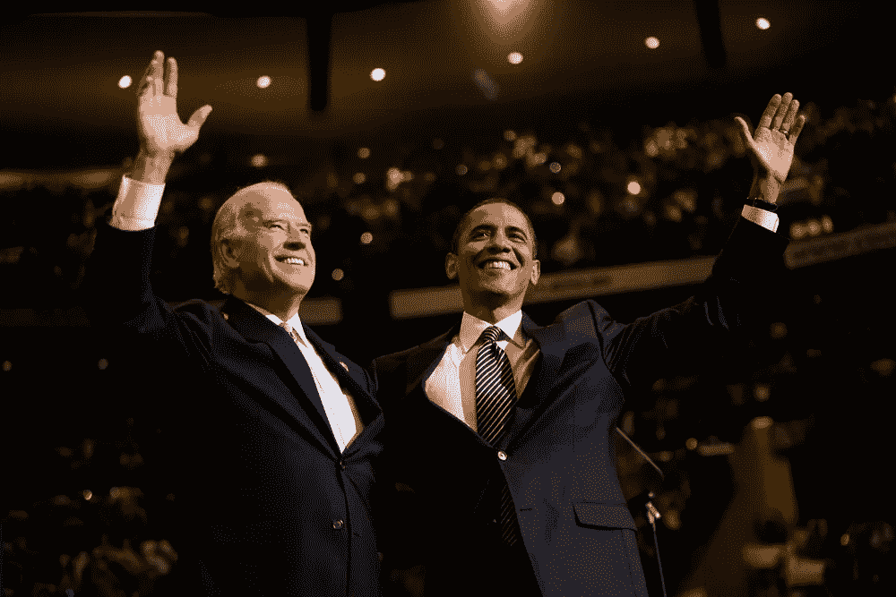****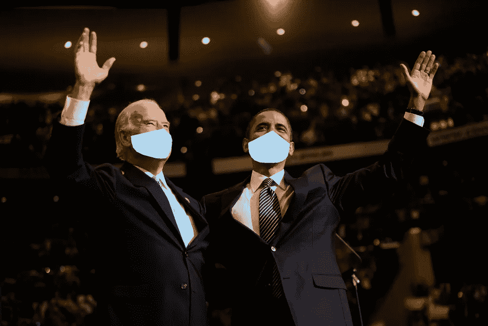**

**Figure 12 — (Left Image) Photo of Joe Biden and Obama ([image extracted from Source](https://www.nytimes.com/2019/08/16/us/politics/biden-obama-history.html)) | (Right Image) Photo of Joe Biden and Obama with superimposed face masks**

****

**Comparison of results between original image and “masked” faces**

**从我们上面的结果来看，模型*(‘resnet 50’)*能够对原始图像(图 12 中的左图)中的乔·拜登和奥巴马的身份与已知数据库中的那些图像进行高精度的正确比较和验证。在我们已知的数据库中，有 3 张乔·拜登的照片和 4 张奥巴马的照片。乔·拜登的准确率是 67%，奥巴马是 100%。**

**然而，当我们在检测到的人脸上叠加面罩时(图 12 中的右图)，乔·拜登和奥巴马的模型精度分别下降了 33%和 25%。该模型只能正确地比较和验证已知数据库中乔·拜登的三分之一的图像，以及已知数据库中奥巴马的四分之三的图像。图 13 和 14 显示了匹配的面作为一个子图一起显示的子图。子图的左图像是从测试图像中提取的面部(被遮掩的面部)，而右图像是从已知数据库中提取的面部。**

**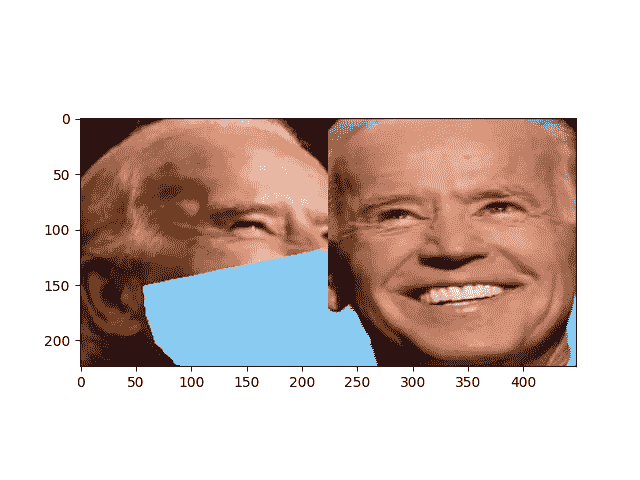**

**Figure 13 — Subplot showing the extracted matched face of test image of masked Joe Biden with known face of Joe Biden in the database directory**

**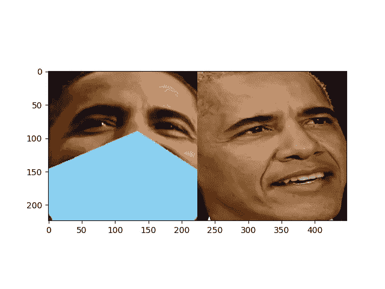****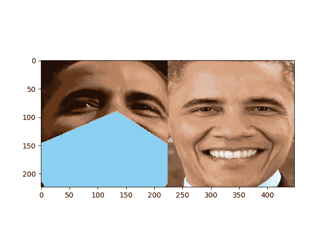****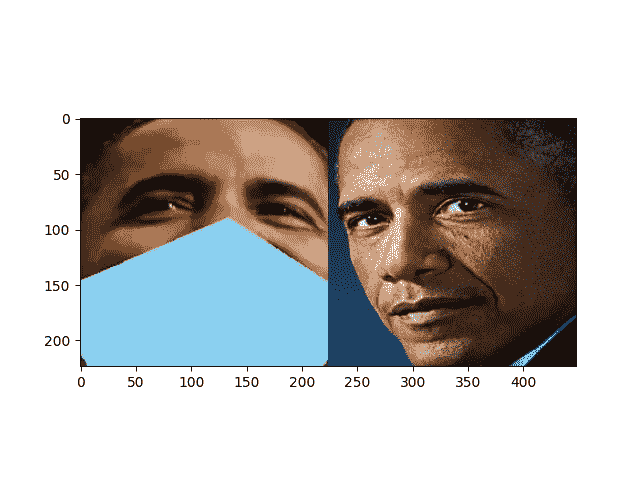**

**Figure 14 — Subplots showing the extracted matched face of test image of masked Obama with known faces of Obama in the database directory**

**我们可以观察到，类似于人脸识别中使用的*‘senet 50’*模型，该模型*‘resnet 50’*也能够在阈值= 0.5 的情况下相当准确地检测和验证被掩盖的人脸。**

**然而，当使用阈值 0.6 时，我们将对“伪装”的乔·拜登和奥巴马之间的匹配产生假阳性。图 15 示出了蒙面的乔·拜登和蒙面的奥巴马的测试图像与数据库目录中的奥巴马的已知面部的提取的匹配面部。还显示了比较分数的结果。**

**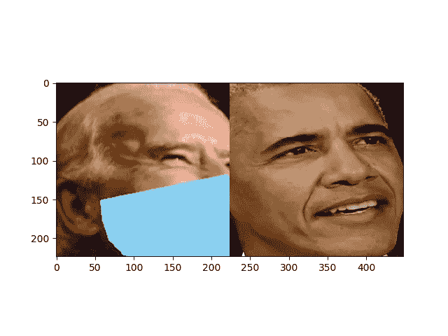******

**Figure 15 — Subplots showing the extracted matched face of test image of masked Joe Biden and masked Obama with a known face of Obama in the database directory**

***比较形象……/数据库\奥巴马(1)。jpeg
有匹配！0 0 0.48499590158462524
有匹配！1 0 0.5521898567676544***

**从结果来看，两个图像匹配的分数都低于阈值 0.6。因此，必须强调的是，还有其他因素，如面部情绪和面部角度，也会影响面部验证系统的准确性。因此，应微调阈值以匹配特定应用。**

**使用相同的模型，我们将使用使用 OpenCV-dlib 生成的合成面具人脸对 3 张名人图像[ [源](https://www.kaggle.com/dansbecker/5-celebrity-faces-dataset) ]进行人脸验证—参见图 5 至图 7。用于这种情况的阈值是 0.6。为了避免结果中的假阳性，我们在多次实验后获得了这个值。**

**从与名人图像的测试图像相同的[源](https://www.kaggle.com/dansbecker/5-celebrity-faces-dataset)中选择已知目录或数据库中的图像。**

**结果如图 16 至 18 所示。下面的表格显示了原始无遮罩面部和遮罩面部之间的结果。**

**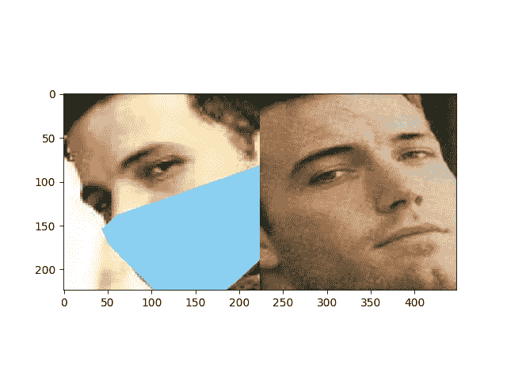****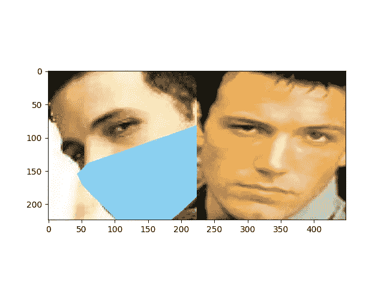**

**Figure 16— Subplots showing the extracted matched face of test image of masked Ben Affleck with known faces of Ben Affleck in the database directory**

**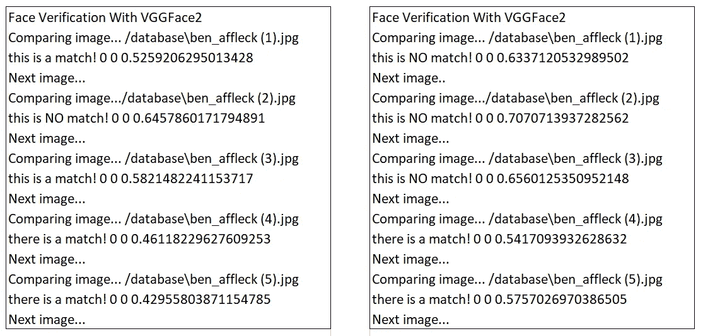**

**Comparison of results between original image and “masked” face**

**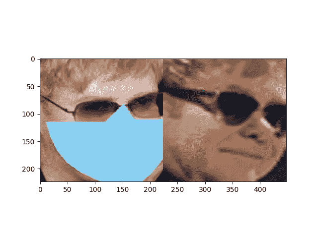****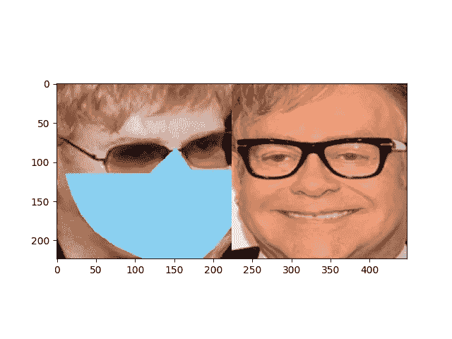****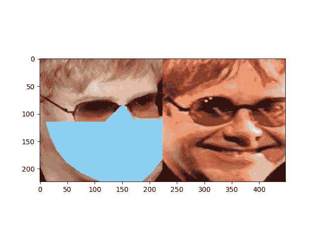**

**Figure 17 — Subplots showing the extracted matched face of test image of masked Elton John with known faces of Elton John in the database directory**

**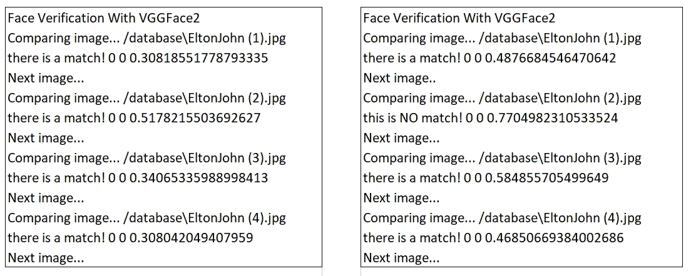**

**Comparison of results between original image and “masked” face**

**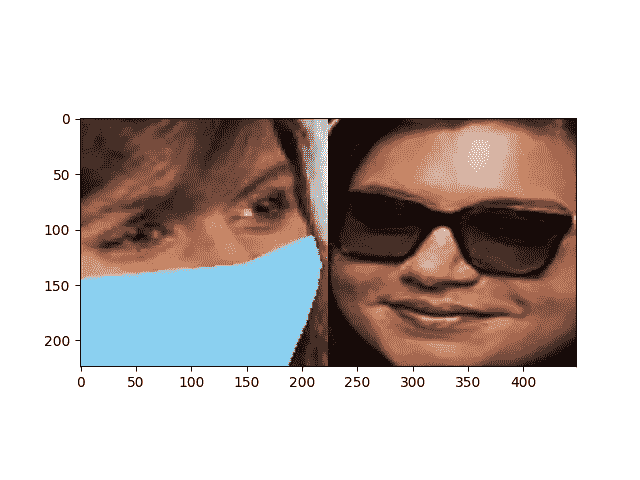****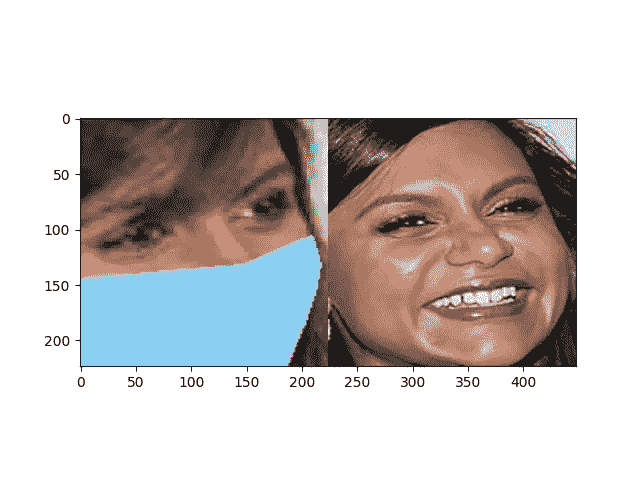**

**Figure 18 — Subplots showing the extracted matched face of test image of masked Mindy Kaling with known faces of Mindy Kaling in the database directory**

****

**Comparison of results between original image and “masked” face**

**可以观察到，对于本·阿弗莱克、埃尔顿·约翰和敏迪·卡灵的蒙面人脸，模型在人脸验证中的准确率分别下降了 50%、25%和 33%。正如前面所强调的以及从上面的结果中观察到的，不存在将两幅图像匹配在一起的通用阈值。随着新数据进入分析，有必要重新定义或微调*阈值*值。还观察到，除了合成的人脸面具之外，人脸的情绪和人脸的角度也是确定分数的因素，因此也是确定模型准确性的因素。**

# **结论**

**在这篇文章中，我们已经成功地检测到了使用 OpenCV 和 dlib 库生成的“蒙面”人脸，使用 *MTCNN(多任务级联卷积网络)*和在图像中高亮显示它们，以确定模型是否正确工作。此后，我们使用 Keras 中的 *VGGFace2* 对“被掩盖”的面部执行面部识别测试——面部识别和面部验证。 *VGGFace2* 算法以矢量形式从人脸中提取特征，并匹配不同的人脸以将它们分组在一起。**

**在名人假面的人脸识别中，预先训练的模型( *senet50* )能够识别三个名人的假面，但具有不同程度的置信度。**

**使用预先训练的模型(*‘resnet 50’*)通过微调阈值，可以使用 VGGFace2 模型执行面部验证，以确认给定“被掩盖”面部照片的人的身份。人脸的情绪、人脸角度等其他因素也会影响人脸验证系统的准确性。**

**结果还表明，我的文章中的脚本— [使用 OpenCV-dlib](/@xictus77/facial-mask-overlay-with-opencv-dlib-4d948964cc4d) 进行面部遮罩叠加可以提供另一种备选解决方案来创建带有面部遮罩的人的图像数据集，这些图像数据集可以用于 ***训练*** 和 ***评估*** 面部识别系统。**

**你可以在这里下载我的完整代码:[https://github.com/xictus77/Maskedface_verify.git](https://github.com/xictus77/Maskedface_verify.git)**

# **参考资料:**

1.  **[如何在 Keras 中用 VGGFace2 进行人脸识别](https://machinelearningmastery.com/how-to-perform-face-recognition-with-vggface2-convolutional-neural-network-in-keras/)**

**2.[如何用深度学习进行人脸检测](https://machinelearningmastery.com/how-to-perform-face-detection-with-classical-and-deep-learning-methods-in-python-with-keras/)**

**3.[使用 MTCNN 的人脸检测(第二部分)](https://mc.ai/face-detection-using-mtcnn-part-2/)**

**4.斯坦. z .李和安尼尔. k .贾恩。2011.*人脸识别手册*(第 2 期。由…编辑).斯普林格出版公司。**

**5.图片来源——开源和[https://www.kaggle.com/dansbecker/5-celebrity-faces-dataset](https://www.kaggle.com/dansbecker/5-celebrity-faces-dataset)**

**6.[http://www.robots.ox.ac.uk/~vgg/data/vgg_face2](http://www.robots.ox.ac.uk/~vgg/data/vgg_face2/)**