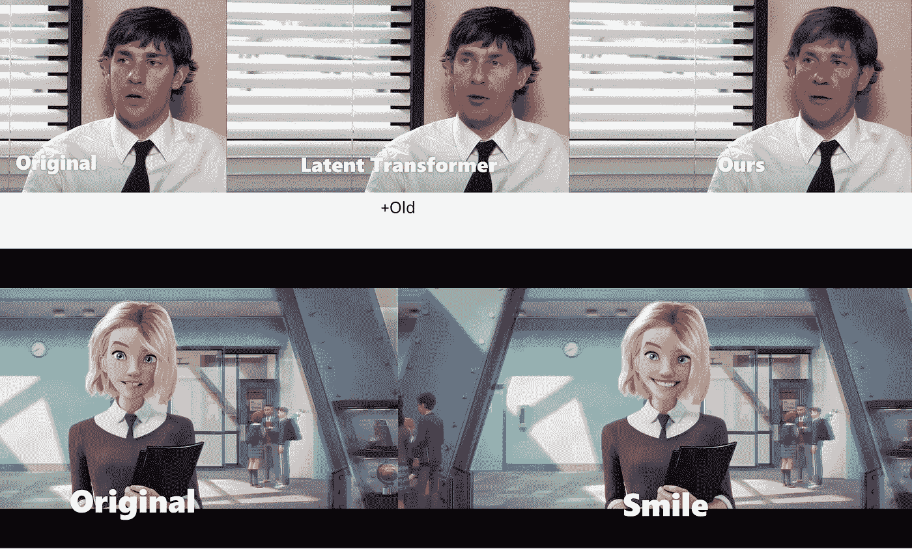

# 真实视频的面部编辑

> 原文：<https://medium.com/mlearning-ai/facial-editing-of-real-videos-38aeb072e61f?source=collection_archive---------6----------------------->

## 人工智能艺术|计算机视觉和模式识别

## 及时缝合:甘

[https://stitch-time.github.io/](https://stitch-time.github.io/)

StyleGAN 已被广泛用于编辑真实的人物图像，但编辑视频对保持时间一致性提出了额外的挑战。此外， [StyleGAN](https://towardsdatascience.com/how-to-start-your-adventure-with-ai-art-fd74afaf30c1) 通常不是编辑视频的最佳选择，因为它依赖于罕见的高质量数据…