# 用 OpenCV-dlib 覆盖面膜

> 原文：<https://medium.com/mlearning-ai/facial-mask-overlay-with-opencv-dlib-4d948964cc4d?source=collection_archive---------1----------------------->

使用 OpenCV-dlib 库叠加面罩

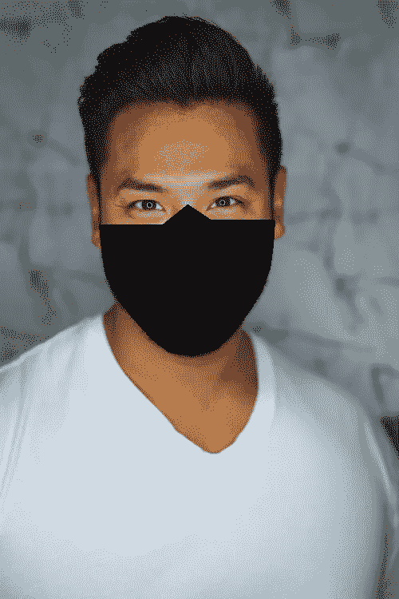

Photo by [Joseph Gonzalez](https://unsplash.com/@miracletwentyone?utm_source=unsplash&utm_medium=referral&utm_content=creditCopyText) on [Unsplash](https://unsplash.com/s/photos/face?utm_source=unsplash&utm_medium=referral&utm_content=creditCopyText) (original image edited using facial mask overlay)

事实证明，口罩是防止新冠肺炎病毒传播的最佳手段之一。然而，这也导致了面部识别算法的失败，这些算法是围绕包括鼻子、嘴和下颌线在内的面部特征建立的。在全局疫情之前，面部识别系统通过在检测到的不同面部特征之间执行比较测量来验证两幅图像中的面部。在一个人的鼻子、嘴和脸颊上戴上面具，已经大大减少了通常用于识别他/她的身份的信息。

将需要重新训练或重新设计有效的识别系统来识别受管制区域中的蒙面人脸。为了做到这一点，需要一个大的蒙面人脸数据集来训练深度学习模型，以检测戴口罩的人和不戴口罩的人。目前，可用于训练和评估面部识别系统的带面罩的人的图像数据集有限。据报道，美国国家标准和技术研究所(NIST)的研究解决了这个问题，方法是将(各种颜色、大小和位置的)面具叠加在无面具人脸的图像上。[ [来源](https://www.cnet.com/news/face-masks-are-thwarting-even-the-best-facial-recognition-algorithms-study-finds/?ftag=COS-05-10aaa0b&TheTime=2020-07-27T22%3A23%3A21&PostType=link&UniqueID=C7330AC8-D057-11EA-8580-DE063A982C1E&ServiceType=twitter)

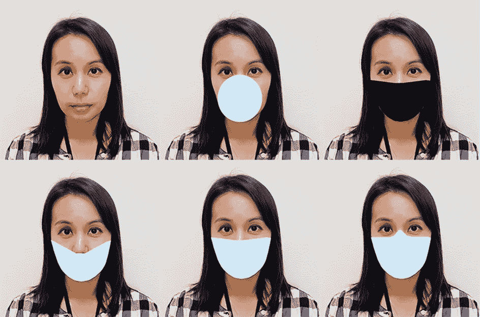

Figure 1 — NIST superimposed 5 types of face masks to immigration photos to test 89 facial recognition algorithms. [[source](https://www.cnet.com/news/face-masks-are-thwarting-even-the-best-facial-recognition-algorithms-study-finds/?ftag=COS-05-10aaa0b&TheTime=2020-07-27T22%3A23%3A21&PostType=link&UniqueID=C7330AC8-D057-11EA-8580-DE063A982C1E&ServiceType=twitter)]

这篇文章试图使用 OpenCV 和 dlib 库来复制这个过程，在那里我们综合生成了 5 种类型的人脸面具来绘制在人脸图像上。图 1 显示了生成的 5 种类型的面罩。

我们还将在另一篇文章中使用深度学习方法之一——mt CNN(多任务级联卷积网络)对“被掩盖”的人脸进行测试或验证。

# 入门指南

要开始使用这个脚本，*用本文末尾的链接克隆库*。

# 安装所需的软件包

建议[用 Python 3.7 制作一个新的虚拟环境](https://towardsdatascience.com/setting-up-python-platform-for-machine-learning-projects-cfd85682c54b)并安装依赖项。所需的库如下所述:

```
#requirements_facemask.txt
numpy == 1.18.5
pip == 20.2.2
imutils == 0.5.3
python >=3.7
dlib == 19.21.0
cmake == 3.18.0
opencv-python == 4.4.0
```

由于该脚本需要 dlib 库，因此在开始运行该脚本之前安装 dlib 非常重要。您可以通过以下链接了解如何使用 Python 绑定安装 dlib:

[](https://www.pyimagesearch.com/2017/03/27/how-to-install-dlib/) [## 如何安装 dlib - PyImageSearch

### 两周前，我采访了 dlib 库的创建者和主要维护者 Davis King。今天我打算…

www.pyimagesearch.com](https://www.pyimagesearch.com/2017/03/27/how-to-install-dlib/) 

Dlib 是一个高级机器学习库，旨在解决复杂的现实世界问题。这个库是使用 C++编程语言创建的，它可以与 C/C++、Python 和 Java 一起工作。

# 导入库

我们将从导入执行面罩数字叠加所需的必要库开始:OpenCV、dlib、numpy、os 和 imutils。

下一步是初始化面罩的颜色，并设置导入图像的目录和路径。请注意，OpenCV 的色彩空间是 BGR 顺序，而不是 RGB 顺序。

下面的链接可以让你立即从视觉上探索这种颜色。它可以用来做颜色从十六进制到 RGB 的转换，反之亦然—[https://www.rgbtohex.net/rgb/](https://www.rgbtohex.net/rgb/)

# 预处理图像

接下来，我们将通过 OpenCV 加载我们的输入图像，然后通过调整图像大小使其宽度为 500 像素并将其转换为灰度来预处理图像。

# 使用 dlib、OpenCV 和 Python 检测和提取面部标志

为了覆盖面具，我们需要进行人脸检测。有许多方法可以完成这项任务。我们可以使用 OpenCV 内置的 Haar Cascade XML 文件甚至 TensorFlow 或者使用 Keras。在这篇文章中，我们使用的是 dlib 的人脸检测器。

在我们进一步进行之前，了解 dlib 的面部检测器和面部标志检测是如何工作的很重要。dlib 中的正面人脸检测器基于*方向梯度直方图(HOG)* 和*线性 SVM。*

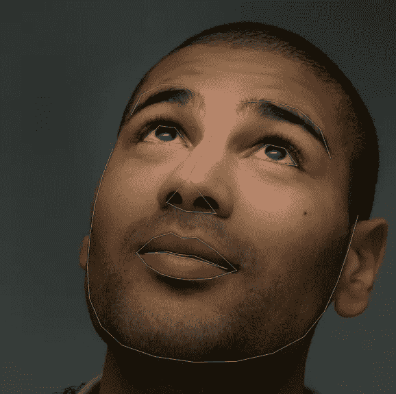

Figure 2— Output of dlib’s face landmarking [[source](http://blog.dlib.net/2014/08/real-time-face-pose-estimation.html)].

我们正在使用 dlib 的正面人脸检测来首先检测人脸，然后使用 dlib 库中的面部标志预测器 dlib.shape_predictor 来检测面部标志。

> 面部标志检测被定义为检测面部关键标志并跟踪它们的任务(对由于头部运动和面部表情引起的刚性和非刚性面部变形具有鲁棒性)

## 什么是面部标志？

面部标志用于定位和表示面部的显著区域，例如眼睛、眉毛、鼻子、下颌线、嘴等。

这是一种已经应用于诸如面部对准、头部姿态估计、面部交换、眨眼检测、睡意检测等应用的技术。

在面部标志的情况下，有必要使用形状预测方法来检测面部上的重要面部结构。面部标志检测包括两个步骤:

1.  定位图像中检测到的面部。
2.  面部关键面部结构的检测

如前所述，我们可以用多种方式执行面部检测，但每种方法本质上都试图定位和标记以下面部区域:

*   鼻子
*   下巴
*   左右眼
*   左右眉
*   口

在这篇文章中，我们使用了基于深度学习的人脸定位算法。该算法也将用于检测图像中的人脸。我们还将通过一些方法获得人脸包围盒，其中我们分别使用图像中人脸的(x，y)坐标。一旦面部区域被检测和界定，我们将进行下一步检测面部区域中的关键面部结构。

我们使用 dlib 库中包含的预训练面部标志检测器。它是卡泽米和沙利文(2014 年)论文的 [***一毫秒人脸对齐与回归树***](https://www.semanticscholar.org/paper/One-millisecond-face-alignment-with-an-ensemble-of-Kazemi-Sullivan/d78b6a5b0dcaa81b1faea5fb0000045a62513567?p2df) 集合的实现，其中它估计映射到人脸面部结构的 *68 (x，y)*坐标的位置。我们可以使用下图来可视化这些 68 个坐标或点的索引:


Figure 3 — The 68 facial landmark points from the iBUG 300-W dataset [[source](https://ibug.doc.ic.ac.uk/resources/facial-point-annotations/)]

从图 3 中，面部特征的位置可以通过不同组的点[起点，终点]来评估:

*   左眼:点数[42，47]
*   口:分[48，67]
*   左眉:分[22，26]
*   鼻子:点[27，34]
*   右眉:分[17，21]
*   右眼:点数[36，41]
*   下颌线:点数[0，16]

请注意，标志点从 0 开始

这些注释是 dlib 面部标志预测器被训练的 68 点 [**iBUG 300-W 数据集**](https://ibug.doc.ic.ac.uk/resources/facial-point-annotations/) 的一部分。

# 面部检测和面部标志检测

下一步包括基于对用于对象检测的标准 [**方向梯度直方图+线性 SVM 方法**](https://pyimagesearch.com/2014/11/10/histogram-oriented-gradients-object-detection/) 的修改，初始化 dlib 的预训练人脸检测器。这个检测器将处理图像中人脸包围盒的检测。

检测器的第一个参数是我们的灰度图像。(这种方法也适用于彩色图像)。

第二个参数是在应用检测器之前放大图像时要应用的图像金字塔层数。在人脸检测之前增加输入图像的分辨率的优点是，它可以允许我们在图像中检测更多的人脸。然而，缺点是输入图像越大，计算成本越高，检测过程的速度越慢。

我们还将打印出边界框的坐标以及检测到的面的数量。我们也可以使用 cv2 通过 for 循环在检测到的人脸周围绘制边界框。

为了检测面部标志，我们需要从 dlib 库中下载面部标志预测器 dlib.shape_predictor。

我们的形状预测方法需要下载名为“shape _ predictor _ 68 _ face _ landmarks . dat”的文件，该文件可以从以下链接下载:[http://dlib . net/files/shape _ predictor _ 68 _ face _ landmarks . dat . bz2](http://dlib.net/files/shape_predictor_68_face_landmarks.dat.bz2)
需要强调的是，该模型文件仅设计用于 dlib 的 HOG 人脸检测器，不应用于 dlib 的基于 CNN 的人脸检测器。原因是它期望来自面部检测器的边界框按照 dlib 的 HOG 面部检测器的方式对齐。

当与产生不同对齐框的另一个面部检测器(例如基于 CNN 的 mmod_human_face_detector.dat 面部检测器)一起使用时，结果不会很好。

一旦下载了形状预测器，我们就可以初始化该预测器，以便随后用于检测在输入图像中检测到的每个面部上的面部标志。

一旦检测到面部标志，我们将能够开始“绘制”/通过使用 OpenCV 中的 [***绘制功能连接所需的点，将面具覆盖在面部上***](https://docs.opencv.org/master/dc/da5/tutorial_py_drawing_functions.html)

# Dlib 掩蔽方法

以下步骤包括确定绘制不同类型面罩所需的点。我们正在复制的面罩类型由 [NIST 研究论文附录 a 中提到的不同点集合定义。](https://doi.org/10.6028/NIST.IR.8311)视觉效果见图 4。

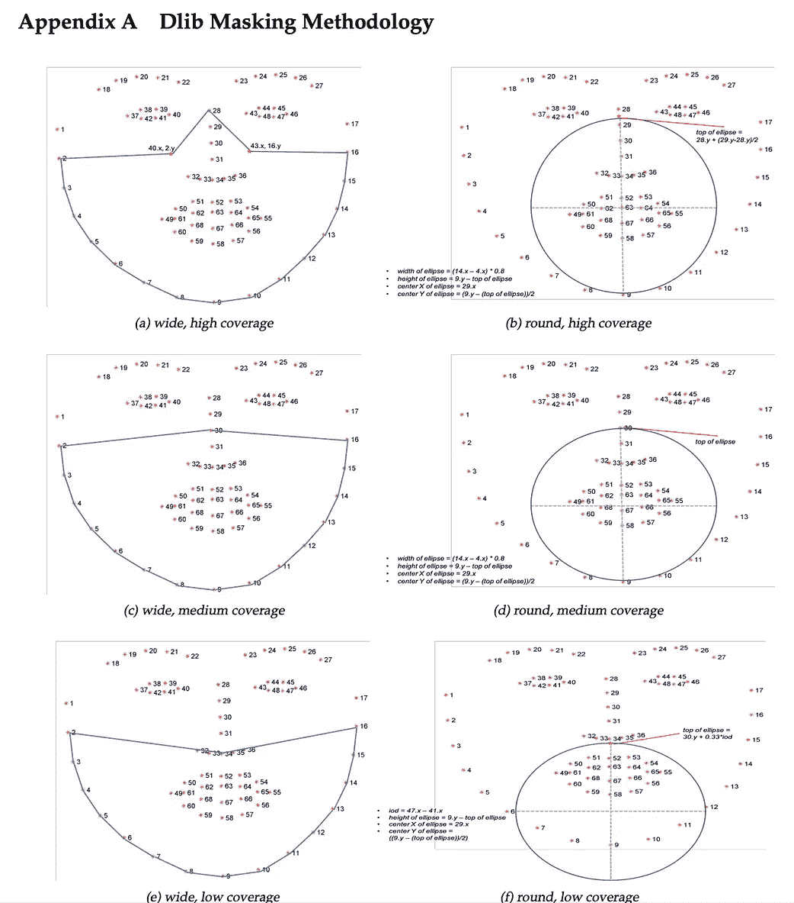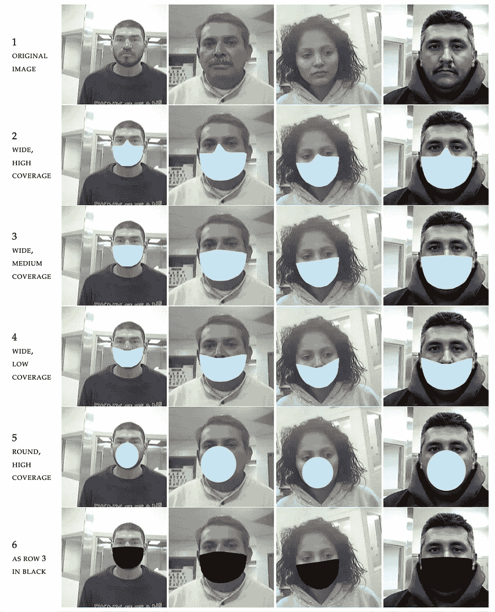

Figure 4 — Dlib Masking Methodology (left image) and the 5 different types of facemasks to be superimposed (right image) [[source](https://doi.org/10.6028/NIST.IR.8311)]

我们将通过连接论文附录 a 中定义的标志点来定义面罩的形状。例如，为了形成宽和中等覆盖范围的面罩，我们将连接(绘制)下颌线[0，16]的标志点，标志点坐标为点 29。

使用 OpenCV*中的 [***绘图功能，可以绘制椭圆形和其他三种规则形状遮罩的轮廓。然后我们可以使用***](https://docs.opencv.org/master/dc/da5/tutorial_py_drawing_functions.html) ***[*cv2.fillpoly*](https://docs.opencv.org/2.4/modules/core/doc/drawing_functions.html?highlight=fillpoly) 函数给绘制的面具填充颜色。****

*facemask_pts.py defines the 3 regular shapes of face masks — wide, high/medium/low coverage*

*facemask_roundpts.py defines the ellipse shape of face masks — round, high coverage*

*面罩的颜色和类型将由用户在图像检测开始之前通过选择来预先确定。我们已经在用户输入功能中为面罩预先选择了两种颜色——蓝色和黑色。*

# *结果*

*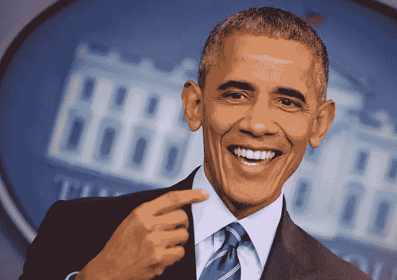**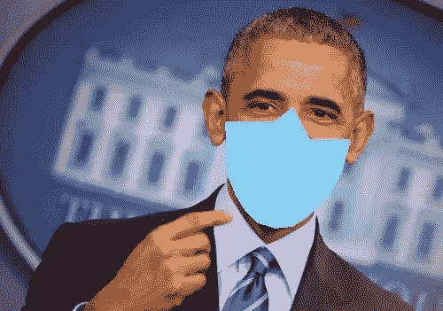**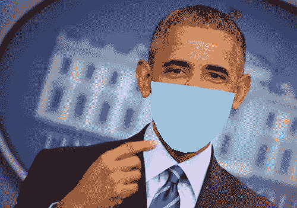**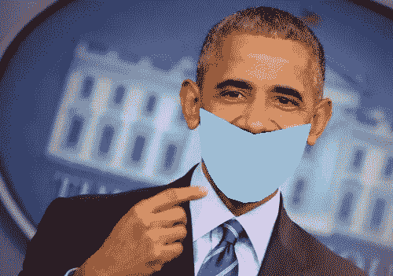**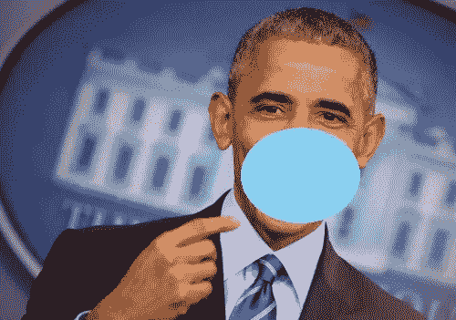**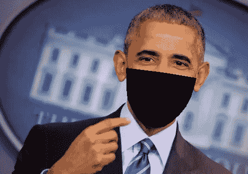*

*Figure 5 — (First row left image) Input : original image of Barack Obama | Output : Five different types of facemasks superimposed on Barack Obama’s face*

*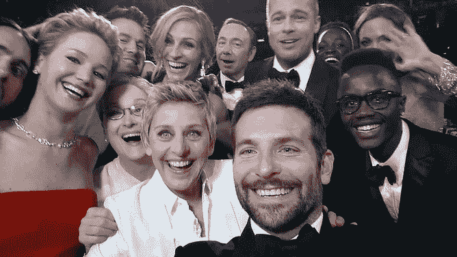****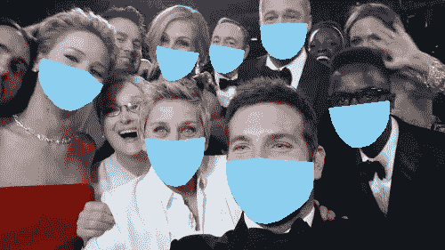**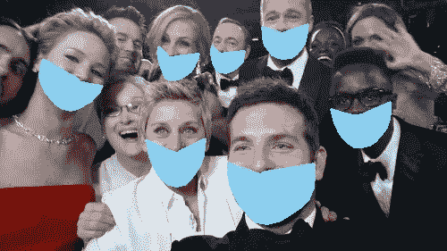****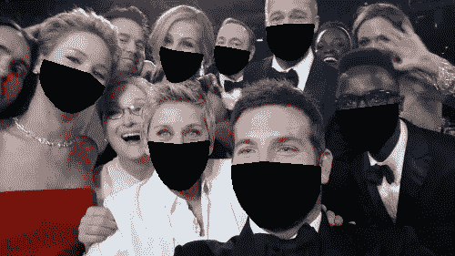*

*Figure 6 — (First row left image) Input : original image of Ellen’s wefie shot | Output : Five different types of facemasks superimposed on group faces detected*

*图 5 显示了原始输入图像(巴拉克·奥巴马的图像)和使用脚本叠加了面具的输出图像之间的比较。我们也可以在集体照中使用这个脚本。在著名的 Ellen's wefie 镜头中，在检测到的人脸上叠加面罩的结果见图 6。*

*我们能够成功地复制生成 5 种不同类型的面罩(详见附录 A)的过程，这些面罩可以使用 dlib 和 OpenCV 叠加在无面罩面部的图像上。*

*图 7 到图 9 展示了在不直视摄像机的人脸上运行这个脚本的更多例子。*

***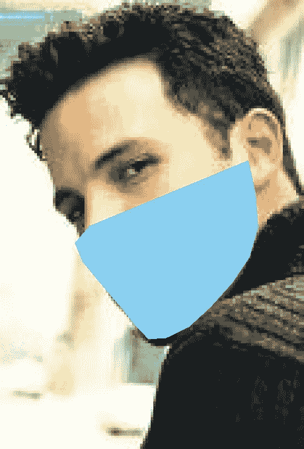

Figure 7— (left image) Input : original image of Ben Affleck | Output : wide, medium coverage facemask superimposed* ***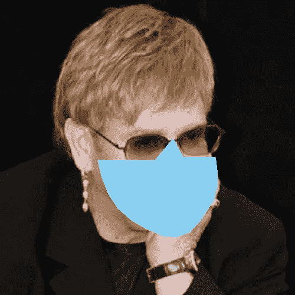

Figure 8— (left image) Input : original image of Elton John | Output : wide, high coverage facemask superimposed* *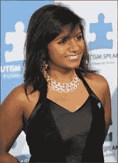**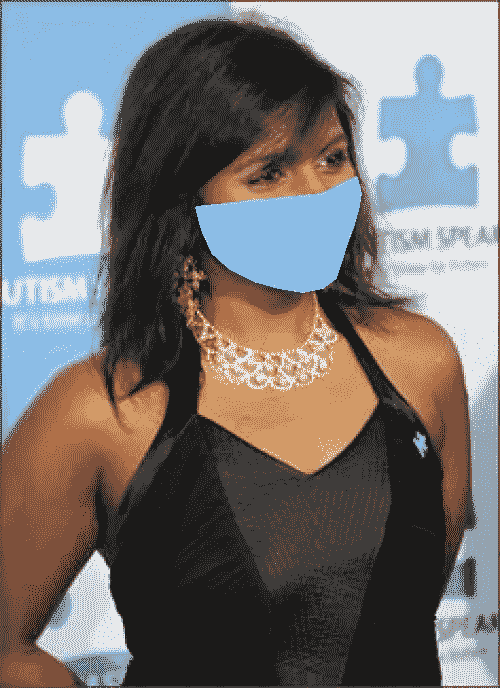

Figure 9— (left image) Input : original image of Mindy Kaling | Output : wide, medium facemask superimposed* 

# *结论*

*该脚本能够在检测到的人脸上生成合成面具人脸，然后输出图像可用于 ***测试或验证*** 其他面向应用的 ML 网络，如室内考勤系统的人脸识别、面具检测等。*

*你可以在这里下载我的完整代码*

*[https://github . com/xictus 77/face-mask-overlay-with-OpenCV-dlib . git](https://github.com/xictus77/Facial-mask-overlay-with-OpenCV-Dlib.git)*

# *参考资料:*

*[1。用 dlib、OpenCV 和 Python 实现的面部标志](https://www.pyimagesearch.com/2017/04/03/facial-landmarks-dlib-opencv-python/)*

*[2。面部点标注](https://ibug.doc.ic.ac.uk/resources/facial-point-annotations/)*

*[3。实时人脸姿态估计](http://blog.dlib.net/2014/08/real-time-face-pose-estimation.html)*

*[4。OpenCV 中的绘图功能](https://docs.opencv.org/master/dc/da5/tutorial_py_drawing_functions.html)*

*5.图片来源——开源和[https://www.kaggle.com/dansbecker/5-celebrity-faces-dataset](https://www.kaggle.com/dansbecker/5-celebrity-faces-dataset)*