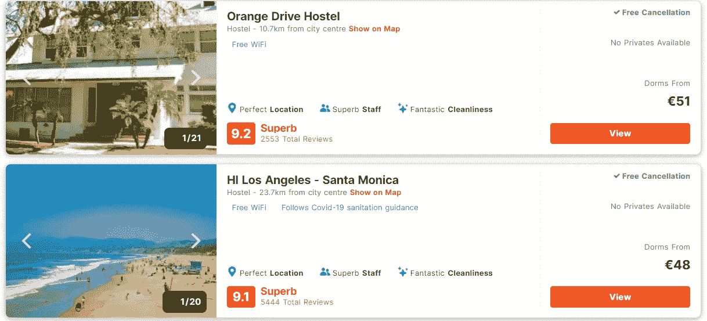
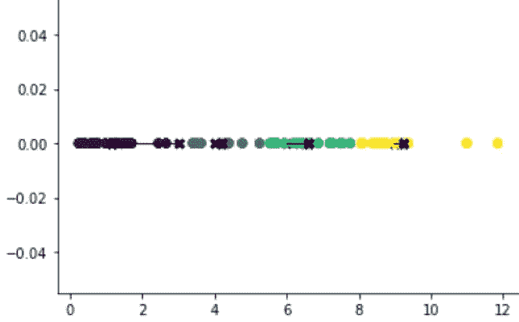
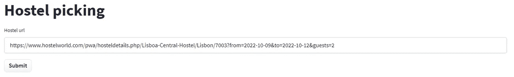
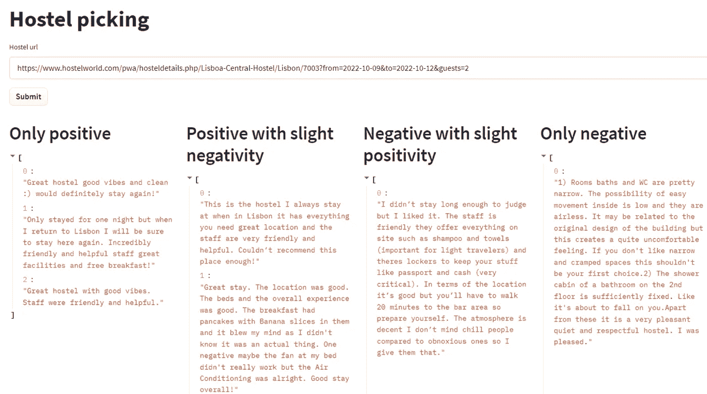

# 公平的宿舍选择与人工智能

> 原文：<https://medium.com/mlearning-ai/fair-hostel-pick-with-ai-86f16cd60cb3?source=collection_archive---------4----------------------->

## 如何不带偏见地为你的下一次旅行选择旅馆

最近我去欧洲旅行了两周。每次大型旅行都需要大量的时间来计划，所以我必须做出一些重要的决定。我发现**最耗时的决定之一**是**选择旅馆**。这个选择很难，因为我不得不在每个地方的几家评级不错的旅馆中做出选择。

我一回到家，就对我去过的所有旅社进行了评级，并自发产生了一个想法。

> 这个想法将**缩短为你选择最佳旅舍的决策时间**。

## 现在的决策流程是怎样的？

如果你要选择一家旅馆，首先你会看星级。而且通常情况下，大旅馆的评级几乎相同，价格也相对接近。

确定**哪家旅社更好**的唯一方法就是看评论。你会注意到，最能提供信息的评论是那些给你关于旅舍正面和负面信息的评论。

因此，为了做出明智的决定，您需要阅读以下每个类别的评论:

*   只有积极的
*   积极中带着一点消极
*   消极中带着一点积极
*   只有负面

> 但是，如果你随机滚动阅读评论，你遇到所有四个类别的评论的机会有多大？

## 确实很低。

> 解决办法来了

## 更容易决策

这就是自然语言处理发挥作用的地方。

这个想法是用下面的符号表示每一个评论:(正面的，负面的)，其中:

*   正面表示评论中的正面情绪
*   负面表示评论中的负面情绪

比率 z =正面/负面会给我们一个正确的评价，即每个评论有多正面。z 越大，评论越正面。

请注意下面的评论。它是由一个去旅舍的旅行者写的:

> 只住了一个晚上，但是当我回到里斯本的时候，我一定会再次住在这里。令人难以置信的友好和乐于助人的员工、一流的设施和免费早餐！

我们的直觉是，这是一个非常积极的评论。事实上，这个算法告诉我们，它的积极面有 60 分，消极面只有 5 分。那么 z = 12

然后，是时候使用无监督聚类，并定义四个独立的聚类，这将是我们的四个目标类别。x 轴表示 z。从下图中，我们可以看到大多数正面评论属于黄色聚类，大多数负面评论属于紫色聚类，依此类推。

所以现在我们有一种方法来确定评论的确切类别。

## 一种用于旅舍内评论自动分组的系统

还记得最初的任务吗？我们想要做出**明智的决定**。只有当我们考虑到不同类型的评论时，这才是可能的。

我写了一个应用程序，可以收集旅舍内的所有评论。然后，它将对评论进行分类，并从每个部分生成三条评论，如下所示:

> 现在你已经优化了选择合适旅馆的耗时过程

如果你想让你的下一个旅舍被无偏见地选中，你现在就可以开始使用该应用程序！可从以下网址获取:

> [https://huggingface.co/spaces/popaqy/Choosino](https://huggingface.co/spaces/popaqy/Choosino)。

然而，请记住，尽管该模型目前产生了一些好的结果，但它仍然非常不成熟，有很大的改进空间。此外，该应用程序目前仅限于与 https://www.hostelworld.com/的**一起工作。**

* [## Mlearning.ai 提交建议

### 如何成为 Mlearning.ai 上的作家

medium.com](/mlearning-ai/mlearning-ai-submission-suggestions-b51e2b130bfb)*