# 假新闻——利用机器学习进行数据分析和预测

> 原文：<https://medium.com/mlearning-ai/fake-news-data-analysis-and-predictions-with-machine-learning-83c2260a0491?source=collection_archive---------2----------------------->

[了解假新闻](https://www.kaggle.com/mrisdal/fake-news)
正文&元数据来自网络上有偏见的假新闻来源&

> *是否可以根据暗示新闻不真实的某些特征来检测假新闻，如何用证据来支持这些特征？*

随着世界进入一个疫情时代，全世界大多数人的信息来源是互联网，假新闻爆发了。假新闻可能包括观点、谣言和编造的故事，可以通过某种方式加以掩盖，使其看起来像真实合法的新闻。正是因为这个原因，在世界范围内传播假新闻或错误信息是一个强大的工具，因为假新闻比真相传播得更快。怀有恶意的个人利用这个工具的一个非常重要的原因是因为它的传播速度更快。

清理数据集的过程分几步完成:

**数据清理:**

最初，我们使用不同的数据清理技术来过滤冗余、粗糙和不相关的数据。一些列被重新命名以使它们更容易理解。这将有助于正确地分析和建模我们的数据。

删除不相关的列:我们从数据集中删除了“未命名”、“ord_in_thread”、“domain_rank”和“main_img_url”列，因为它们与我们的数据分析无关。此后，删除了“thread_title”，因为它与“title”列具有相同的内容，因此是多余的。

删除丢失的值:我们从数据集中删除了丢失的值，以便它给出值和属性的正确分布。

划分列:“published”列既有发布的日期又有发布的时间，所以它被划分为两个单独的列:“published_date”和“published_time”。

更改值:“spam_score”的数值被替换为标记“低”、“高”和“中”。“低”的分数小于或等于 0.3，“中”的分数大于 0.3 且小于或等于 0.6，“高”的分数在 0.6 至 1 的范围内。此外，这些列有许多零，这些零被删除以消除分布的偏斜。

编写文件并导入 Jupyter 笔记本:最后，将数据写入 excel 文件，并加载到 Jupyter 笔记本中进行探索性数据分析

**删除的列:**

以下各列已从数据集中删除，因为它们对预测没有帮助:

**未命名**:分配给数据帧每一行的随机 id。
**赞**:给线程的赞数。
**评论**:主题
**分享的评论数**:主题
**抓取的分享数**:新闻主题抓取的日期和时间。
**发布**:发布线程的日期和时间。
**类型**:每篇文章的类别就内容而言。
**发布 _ 日期**:帖子发布的日期
**发布 _ 时间**:帖子发布的时间。

**加入约定栏:**

一个名为“post_engagement”的新列被添加到数据框架中，该列基本上是帖子上的喜欢、分享和评论的总和，以暗示帖子对公众的影响。

**功能包括:**

1.  **UUID:** 分配给每个新闻的 ID，以便唯一地标识它们。
2.  **作者:**新闻作者的姓名。
3.  **标题:**新闻的标题。
4.  **正文:**新闻的内容。
5.  语言:撰写新闻线索的语言。
6.  **Site_url:** 新闻线索中包含的网站的 url。
7.  **国家**:撰写新闻线索的国家。
8.  **Spam_score:** 贴在每个新闻线索上的标签(低、中、高)表示它们的垃圾邮件级别。
9.  **Replies_count:** 新闻跟帖的回复数。
10.  **参与者 _ 计数:**新闻线程的参与者数量。
11.  **Post_engagement:** 喜欢、评论和分享的组合栏。

**探索性数据分析:**

导入了以下库来执行 EDA:

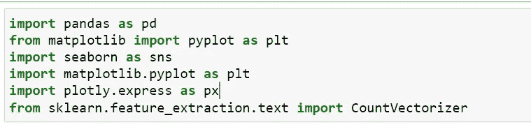

**数值属性的相关矩阵**

由于我们的数据有少量的数字变量，所以我们发现哪些变量实际上与垃圾邮件分数相关是很重要的。为了计算变量及其强度之间的相关性，使用以下代码绘制了相关矩阵:

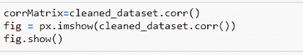

相关矩阵的代码

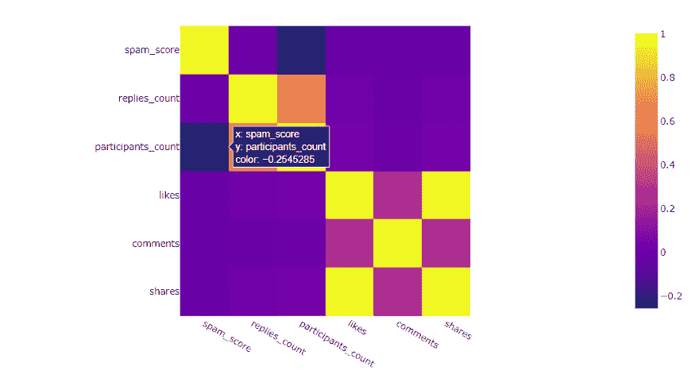

数值变量的相关矩阵

我们可以从图中看到，参与者计数的属性具有最强的负相关性，这意味着如果给定新闻主题有更多的参与者，则表明它不是虚假新闻主题。

至于其他因素，如 replies_count、like、comments 和 shares，相关性较弱，但表明与特定帖子的参与度越高，则表明该帖子的垃圾邮件得分越低。

来自相关性的结果意味着测量特定帖子的更多参与和/或参与的变量可以暗示该线索的真实性并确定垃圾邮件分数。

**垃圾邮件评分频率**

下面可视化可以用来衡量有多少新闻线索被分配了垃圾邮件分数方面的低、中或高标签。

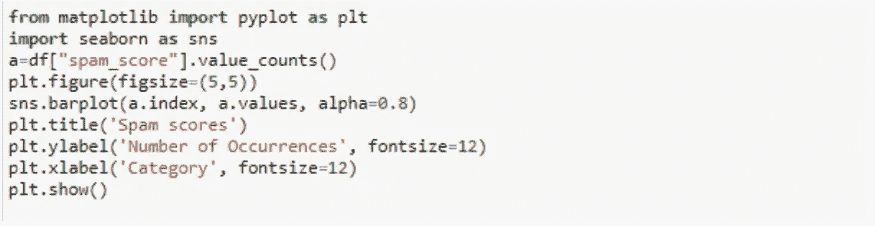

垃圾邮件分数计数的代码

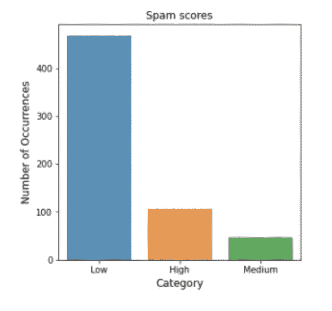

【作者 垃圾邮件频率

此外，对可用数据集的可能洞察可以是哪个作者具有归因于他们的最高数量的高垃圾邮件分数。

以下代码用于获取垃圾邮件得分高的前 10 名作者:

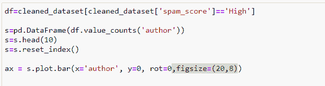

用于提取高垃圾邮件分数作者的代码

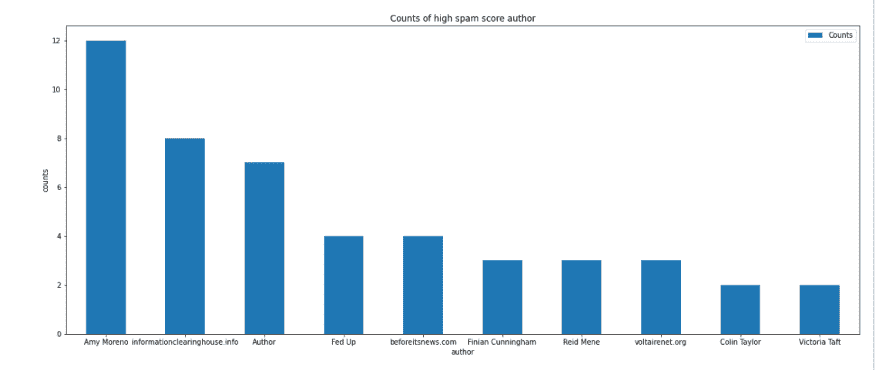

代表高垃圾邮件分数的最频繁作者的条形图

顶级作家 Amy Moreno 也可以在中低等级中看到，这表明作家上传的内容可能会招致更高的垃圾邮件分数。包括“作者”的其他未命名的作者也可以在两个括号中看到，即高和低。

在较高的垃圾邮件分数中，一个作者是信息交换所，在那里它在垃圾邮件分数较低的括号中看不到，这表明该新闻源是错误信息传播的潜在中心。

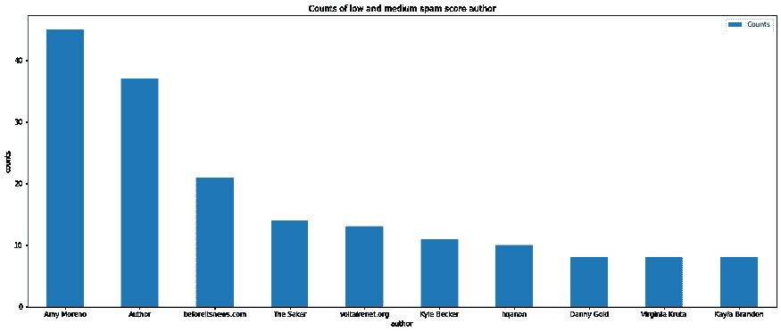

低和中垃圾邮件分数的条形图

**标题对垃圾邮件分数的影响**

贴有假新闻的帖子的标题是为了吸引用户，让他们点击新闻标题，直接进入新闻正文。对标题中垃圾邮件得分高的热门词汇的统计显示，它主要包含诸如“ **wwiii** ”(第三次世界大战)等热门词汇，以及大量“**于戈**”这个词，这是一个与唐纳德·特朗普的口音相关的术语，暗示了假新闻主要针对政治和时事的性质。

下面的图表比较了高括号和非高括号中的单词数与使用 sklearn 从标题中提取单词的代码:

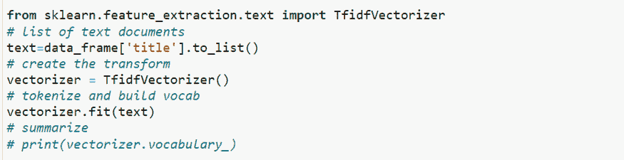

令牌矢量化以评估词汇表

并绘制计数图:

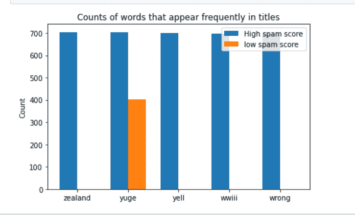

反其道而行之

**国别频率**

下面的可视化可以用来衡量有多少线程来自哪个国家。这将有助于我们了解哪个国家的假新闻最多。

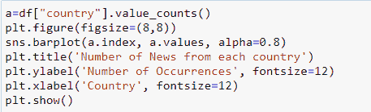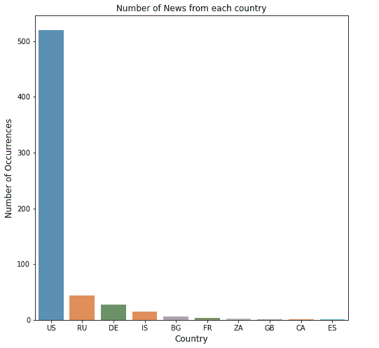

**跨度分数与题目中标点符号使用的关系**

对可用数据集的一个可能的洞察是标题中标点符号的使用增加，导致高垃圾邮件分数归因于它们。为了验证这一观察结果，下面的代码用于获得显示两个属性之间关系的可视化结果。

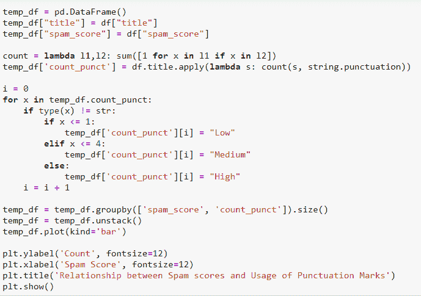

为了显示这种关系，向数据框中添加了另一列，该列包含标题中使用的标点符号总数。总计数的范围各不相同，因此我们将其分为三个级别:

*   小于 2 的计数被认为是低使用率
*   介于 2 和 4(包括 2 和 4)之间的计数被视为中等使用率
*   大于 4 的计数被视为高使用率

随后，垃圾邮件分数和标点符号的数量被分组以绘制条形图。

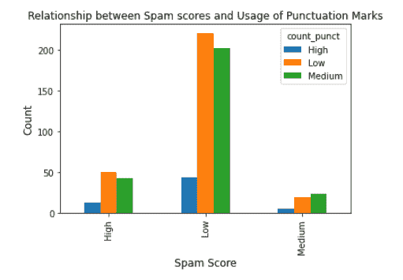

通过该可视化，可以观察到标点符号计数低的标题具有归因于它们的低垃圾邮件分数，而中等垃圾邮件分数归因于标点符号使用一般的标题。但是，垃圾邮件分数相对较高的标题的标点符号数范围不一。

**按网址统计的垃圾邮件频率**

此外，对可用数据集的合理洞察可能是哪些 URL 具有最高数量的高垃圾邮件分数。

以下代码用于获取 10 个垃圾邮件分数最高的网址:

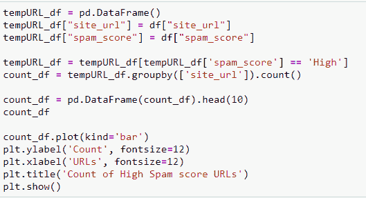

以下可视化用于突出显示具有最高 Span 分数的前几个 URL:

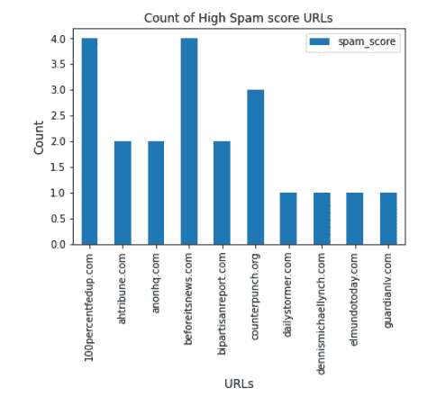

可以看出，网站 URL“100 percent fed up . com”和“beforeitsnews.com”具有归因于它们的最高频率的高 Span 得分，这表明在这些网站上张贴的内容或张贴内容的作者的种类可能属于垃圾邮件类别，从而招致高垃圾邮件得分。

**按参与度划分的垃圾邮件频率**

垃圾邮件得分与赞数、评论数、分享数、回复数和参与者数的散点图显示，通过赞数、分享数、回复数和参与者数的参与度，垃圾邮件得分高的推文比得分低和中等的推文少得多。有趣的是，推特上所有三个类别(低、中、高)的评论数量是相同的。

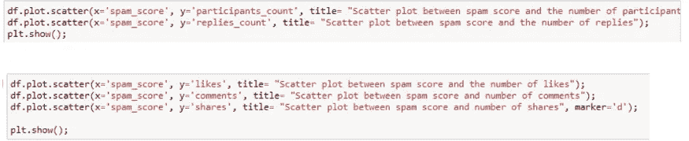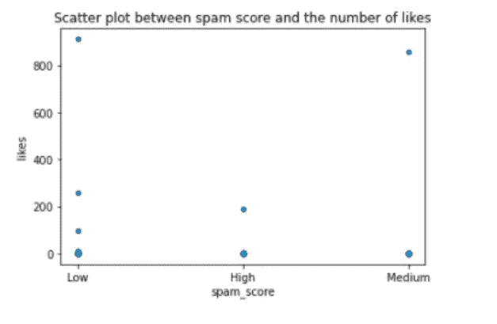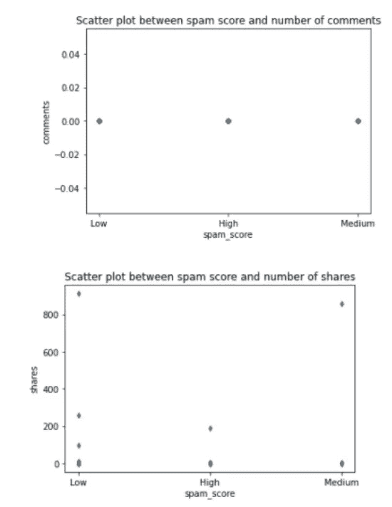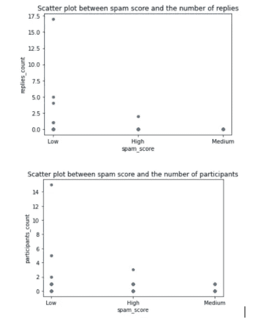

# 机器学习——预测假新闻

“Machine” learning to identify fake news

基于我们对假新闻数据集的 EDA，我们现在对哪些特征可以帮助我们预测新闻是否具有低、中或高垃圾邮件内容有了相当好的理解。

**特色工程**

数据集主要是需要编码的分类数据，要素主要是字符串数据，不能以原始形式使用，因此使用 sklearn 的库进行编码:

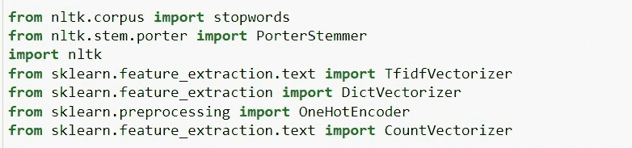

sickit learn’s libraries

在从“文本”和“标题”的字符串中移除停止字，并使用正则表达式移除不必要的字符之后，数据被编码。

平衡、矢量化和编码数据:

1.  非数字标签通过编码进行转换，即数据集中的数字列的值使用通用的比例。
2.  使用 tfidf 向量对标题和文本数据进行矢量化，该向量为从训练数据集创建的 ngram 分配分数。这种编码更好地将数据矢量化，而不仅仅是给它们分配一个计数，分数更好地反映了对预测有很大帮助的单词的重要性。
3.  所有其他特征都使用 dict 矢量器进行编码，因为它们是分类的，但是单独使用标签编码器进行编码会为它们分配数字，这些数字可以从编码中创建有意义的数据或序数数据。因此，在标签编码完成后，向量使用一个热编码进行编码，该热编码处理标签编码创建权重或序数数据的问题。

其结果与已编码或标准化的其他特征一起堆叠在设计矩阵上。

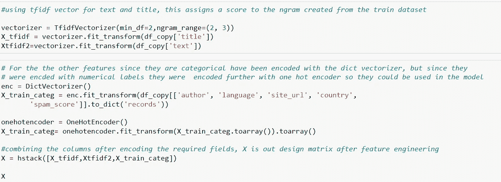

code for X design matrix

**数据分割**

分割数据集的过程分两步完成:

1.  从我的数据框中提取 y_target，这是我们数据集的垃圾邮件分数标签，即低、中、高。
2.  使用 Scikit 中的 train_test_split 以 70:30 的比例分割数据

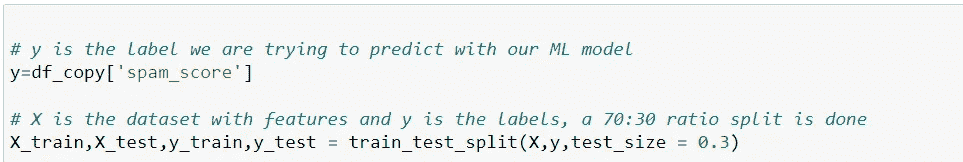

**公制评估**

以下指标用于对每个模型的质量进行评分:准确度、精确度、召回率和 f-1 分数。

**准确性**指标帮助我们确定我们所做预测的正确分类数量。

**F1 得分**指标对我们来说也至关重要，因为它提供了模型在我们数据集上的准确性。鉴于我们的数据集是不平衡的，高和中垃圾邮件得分数据点较少，该得分将帮助我们区分哪个分类器更好。

**Precision** 将告诉我们与对特定类别做出的所有正面预测相比做出的正面预测，例如，如果我们关注高垃圾邮件分数类别，那么我们将看到它们中有多少被正确预测，以及与所有类别中所有正确预测的比率。

**回忆**是一个类的正确正面预测与实际类的观察次数之比。F-1 分数是精确度和召回率的加权平均值。因此，这个分数同时考虑了误报和漏报。

**型号选择**

记录结果是为了选择最佳方法来预测哪个模型具有更高的准确性。

我们训练和测试数据的第一个模型是**多项式朴素贝叶斯**，它给出了 80%的准确率，但我们的类的 F1 分数明显较低，这表明该模型在数据集上表现不佳。可能的原因是，多项朴素贝叶斯假设特征是相互独立的，这种情况非常罕见，尤其是在新闻中，某些词被结合在一起以增加炒作。

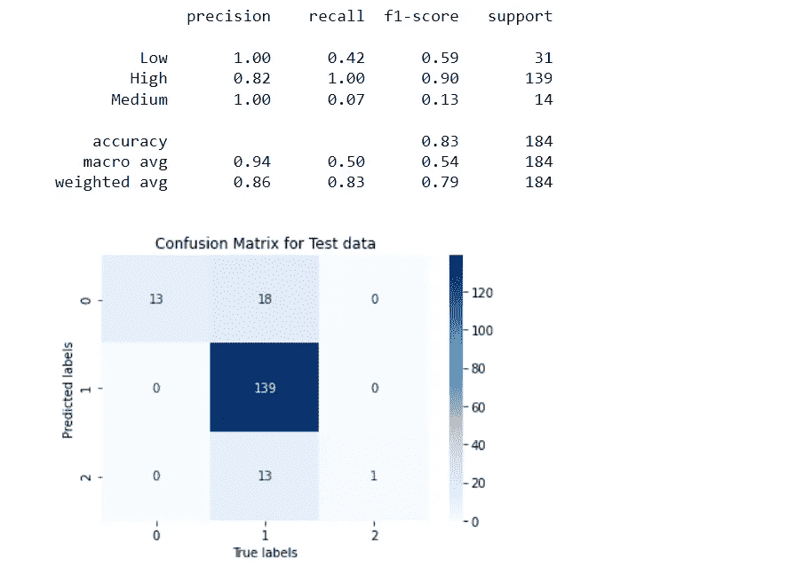

Accuracy report and Confusion Matrix for Multinomial Naïve Bayes

**进入 KNN**

一个非参数分类器 **K 最近邻**对底层分布不做任何假设，非常适合。KNN 分类器根据测试数据点与训练数据点的相似性进行预测。

我们现在面临的唯一问题是找到 Ks 的最佳值，使所有的关系都得到解决，并且误差最小。

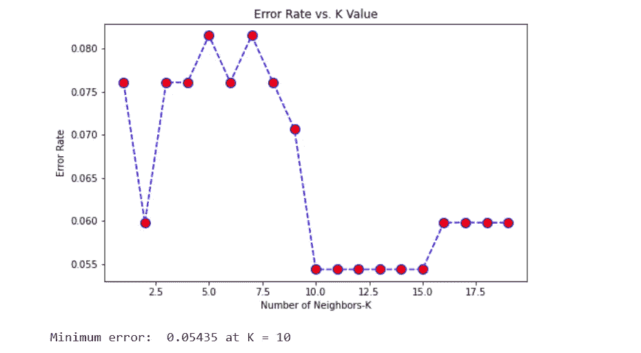

Plot for error rate vs K value for KNN classifier

因此，构建一个从 0- 20 范围内不同 K 值的图表，我们观察到，在 K=10 时，误差最小，这是我们的最佳 K 值，准确率约为 94%，所有类别的 f1 分数都相当好。以下是获得的结果:

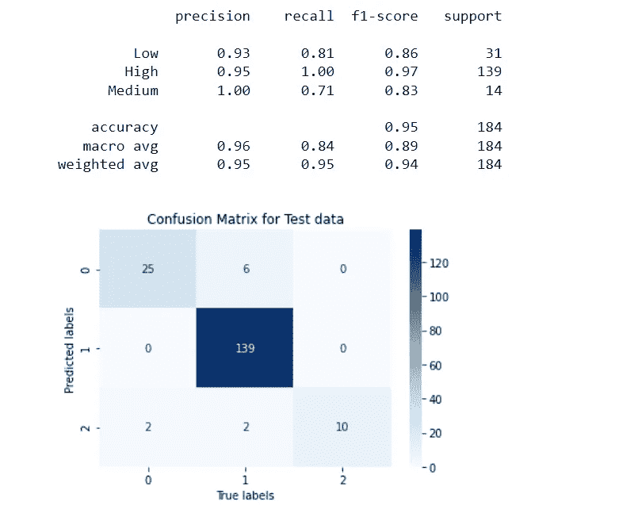

Classification report and Confusion Matrix for KNN

因此，KNN 成功地以高精度和准确性预测了可能是假的新闻。以及回答我们的问题，因为模型根据 EDA 中涉及的特征对特定模式进行了预测。

# 结论

最初，我们对某些因素如何与垃圾邮件分数相关有一定的假设，并希望通过数据分析来确定我们的假设。

探索性数据分析的结果显示，存在某些文本结构、发布新闻的来源以及与发布新闻的条件相关的特征，收集的新闻线索是在 2016 年美国大选期间，这可能也有助于高垃圾邮件分数和与政治相关的文本。此外，与新闻线索的接触还提供了数据分析所揭示的洞察力，并且可能是垃圾邮件分数的主要指标。

KNN 分类器进一步支持了我们关于各种预测因素的主张，这些预测因素暗示了新闻可能具有的垃圾邮件分数，这有助于回答我们最初的问题陈述。

 [## Mlearning.ai 提交建议

### 如何成为 Mlearning.ai 上的作家

medium.com](/mlearning-ai/mlearning-ai-submission-suggestions-b51e2b130bfb)