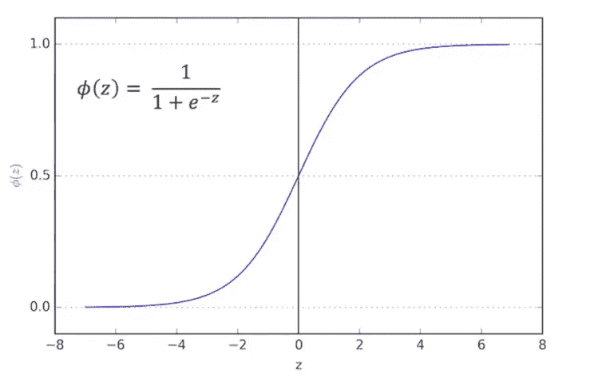
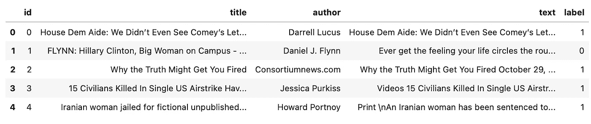
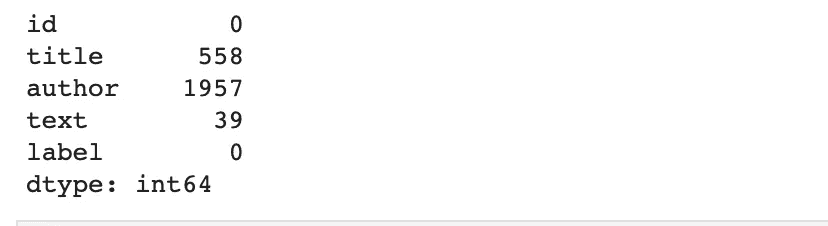
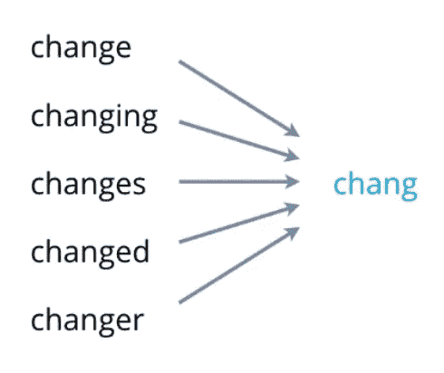
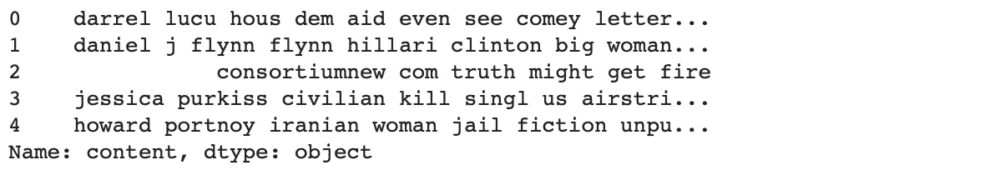
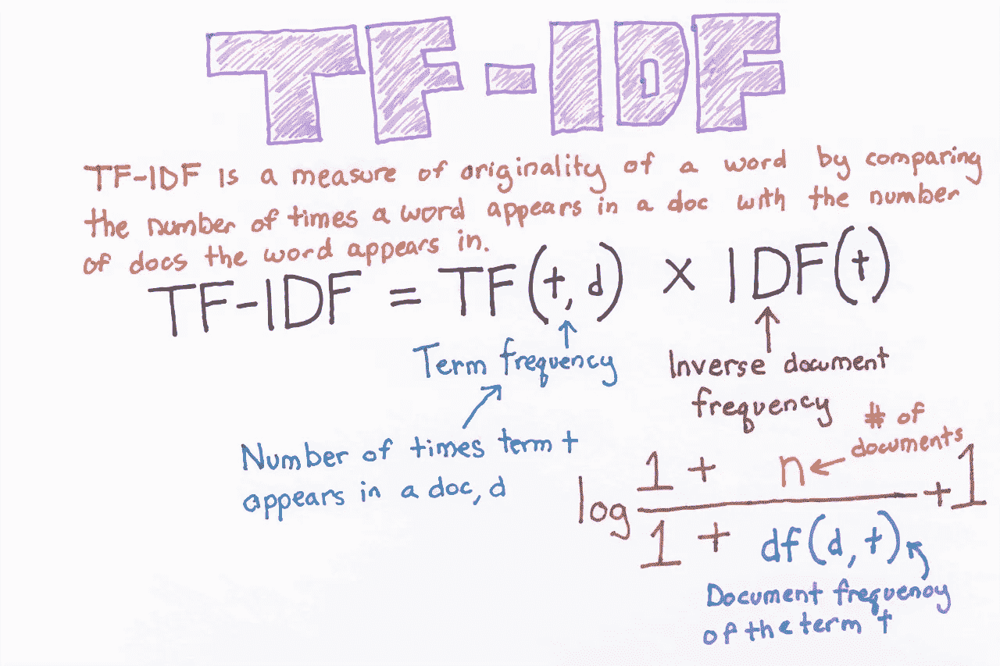
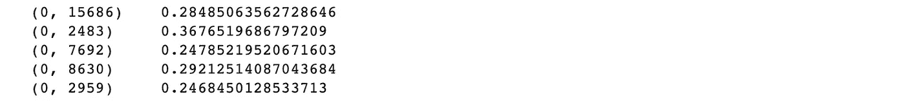
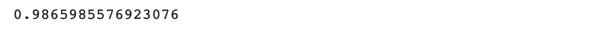
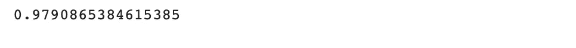
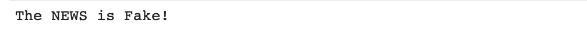

# 利用逻辑回归 ML 项目检测假新闻教程(初学者)

> 原文：<https://medium.com/mlearning-ai/fake-news-detection-using-logistic-regression-ml-project-tutorial-beginners-89b5c704d6ee?source=collection_archive---------1----------------------->


Photo from [europarl](https://www.europarl.europa.eu/news/sl/press-room/20191007IPR63550/eu-to-take-action-against-fake-news-and-foreign-electoral-interference)

对网上流传的错误信息的广泛信仰是现代社会的一个关键挑战。根据麻省理工学院的一项研究[*这主要是通过点击诱饵来完成的，这些诱饵用华丽的标题或设计来吸引用户和好奇心，并欺骗他们点击链接以增加广告收入。因此，为了控制假新闻的流行，确定互联网上可用信息的完整性至关重要。*](https://news.mit.edu/2018/study-twitter-false-news-travels-faster-true-stories-0308)

*因此，我们现在将尝试使用**逻辑回归**来建立一个简单的机器学习模型，以检测一篇新闻文章是否是假的。*

# *逻辑回归*

*在深入研究代码之前，让我们修改一下逻辑回归的概念。逻辑回归是一种统计分析方法，根据对数据集的先前观察来预测二元结果，如是或否(二元分类)。它是一种监督统计技术，用于发现因变量的概率。下图是一个 **Sigmoid 函数**，我们也称之为 **Logit** 。该函数将概率转换为二进制值，可进一步用于预测。*

**

*Sigmoid Function from [rasbt](http://rasbt.github.io/mlxtend/user_guide/classifier/LogisticRegression/)*

*根据该图，如果我们获得的概率值为**小于 0.5** ，那么它被认为是属于第 0 类的**，如果该值为**大于 0.5** ，那么它将是第 1 类**的**的一部分。***

*如果你想深入学习这个概念，可以查看 [***这个链接***](https://machinelearningmastery.com/logistic-regression-for-machine-learning/) 出来甚至观看 [***这个视频***](https://youtu.be/yIYKR4sgzI8) ！*

# *密码*

*现在终于从我们的代码开始了，你可以把它写在你的 Jupyter 笔记本或者 Google Colab 或者任何你喜欢的平台上。*

*也可以从 [***这里***](https://www.kaggle.com/c/fake-news/data?select=train.csv) 下载你的数据集。(我只使用了训练数据集，所以您也可以下载它本身。)*

## ***导入库/依赖关系***

```
***import** numpy **as** np
**import** pandas **as** pd
**import** re
**import** nltk
**from** nltk.corpus **import** stopwords
**from** nltk.stem.porter **import** PorterStemmer
**import** sklearn **from** sklearn.feature_extraction.text **import** TfidfVectorizer
**from** sklearn.model_selection **import** train_test_split
**from** sklearn.linear_model **import** LogisticRegression
**from** sklearn.metrics **import** accuracy_score*
```

*涵盖我们导入的每个库/模块/函数的重要性:*

*   *NumPy 是一个通用的数组和矩阵处理包。*
*   ***熊猫**:它允许我们对数据集进行各种操作。*
*   ***re** :这是一个内置的正则表达式包，可以用来处理正则表达式。*
*   *NLTK :这是一套用于符号和统计自然语言处理(NLP)的库和程序。*
*   ***nltk.corpus** :*
*   *****停用词**:自然语言处理前一般被过滤掉的词称为停用词。这些实际上是任何语言中最常见的单词(如冠词、介词、代词、连词等)，不会给文本增加太多信息。(例-and，of，are 等。)***
*   ***PorterStemmer:一个帮助我们词干化的包。(在数据预处理一节中有更多关于词干的内容)***
*   *****Sci-kit Learn (sklearn)** :通过 Python 中的一致性接口，为机器学习和统计建模提供了一系列高效的工具，包括分类、回归、聚类和降维。***
*   *****feature _ extraction . text**:用于从包含文本的数据集中提取机器学习算法支持格式的特征。***
*   ***TfidfVectorizer :它将文本转换成特征向量，这些向量可以作为估算器的输入。(关于 TfidfVectorizer 的更多信息，请参见数据预处理部分)***
*   *****train_test_split** :这是 Sklearn 模型选择中的一个功能，用于将数据阵列分成两个子集——训练数据和测试数据。***
*   *****LogisticRegression** :代码的一个非常简单的部分，用于导入逻辑回归分类器。***
*   *****指标**和**准确度分数**:从指标模块导入准确度分类分数。***

## ***加载数据集***

***我希望你现在已经下载了数据集。现在您可以加载数据集，***

```
***data **=** pd**.**read_csv('fakenews.csv')
data**.**head()***
```

***在这里，我将我的 csv 文件重命名为 **fakenews.csv** ，并将其保存在与我的 jupyter 笔记本相同的文件夹中。如果您将数据集和 jupyter 笔记本保存在两个不同的文件夹中，您可以在代码中添加数据集文件的路径作为前缀，***

```
***data **=** pd**.**read_csv('/Users/chandana/Documents/fakenews.csv')***
```

***(这是一个 macbook 路径，因此如果您使用的是 Windows 或任何其他操作系统，该路径可能会有所不同。)***

***数据帧看起来会像这样，***

******

***这里标签表示一篇新闻文章是否是假的，0 表示它是真的，1 表示它是假的。***

## ***数据预处理***

***在导入我们的库和数据集之后，在我们训练 ML 模型之前预处理数据是很重要的，因为可能会有一些异常和丢失的数据点，这可能会使我们的预测与实际值有些偏差。***

***现在，我们可以检查 dataframe/table 的大小，因为它将决定我们是否可以在不影响数据集大小的情况下删除具有 null 值的行。***

```
***data**.**shape***
```

***这给了我们 **(20800，5)** ，这意味着我们有 20800 个条目和 5 列(特性)。***

***检查每列中缺失值的总数。***

```
***data**.**isnull()**.**sum()*** 
```

******

***从这里我们可以看到，我们将不得不删除至少 1957 行来删除所有的空值，因此最好用一个空字符串来填充这些空值。为此，我们可以使用**菲尔娜。*****

```
***df1 **=** data**.**fillna('')***
```

***在这一步之后，我们不再有任何丢失的数据点，您可以使用*T5 检查是否为空()。总和()****

***现在，我们将尝试将这 5 列减少到只有 2 列，因为这对我们训练模型来说更容易。为此，我们将把**标题**和**作者**列合并成一列，命名为**内容**。我们可以删除其他栏目，因为它们对确定文章的真伪没有太大影响。这一步将留给我们两列- **内容**和**标签**。***

```
***df1['content'] **=** df1['author'] **+** ' ' **+** df1['title']***
```

*****词干*****

***现在来看词干部分，它基本上是把一个单词简化成词干的过程，词干附加在后缀、前缀或词根上。***

******

***Stemming example***

***单词的词干可能以有意义的词根结束，也可能不以有意义的词根结束，就像在这个例子中，chang 实际上并不意味着改变或任何事情。为了让词根有意义，我们使用了**词汇化**。但是对于这个项目来说，词干工作很好。***

```
***stemmer **=** PorterStemmer()***
```

***我们为自己创建了一个新的 Porter 词干分析器，这样我们就可以使用这个函数，而不必每次都显式地键入 Porter stemmer()。***

```
*****def** stemming(content):
    stemmed_content **=** re**.**sub('[^a-zA-Z]',' ', content) #1
    stemmed_content **=** stemmed_content**.**lower() #2
    stemmed_content **=** stemmed_content**.**split() #3
    stemmed_content **=** [stemmer**.**stem(word) **for** word **in** stemmed_content **if** **not** word **in** stopwords**.**words('english')] #4
    stemmed_content **=** ' '**.**join(stemmed_content) #5
    **return** stemmed_content #6***
```

***好，让我们深入研究一下，看看这个函数实际上是做什么的。我将每一行从 1 到 6 进行了编号，以便您可以轻松区分不同的代码行，并理解每一行的用法。***

***首先，我们使用 **re** 包，删除所有不是字母的东西(小写或大写字母)。***

***#2 然后我们将每个大写字母转换成小写字母。***

***#3 然后，我们将每个句子分成一个单词列表。***

***#4 然后，我们使用词干分析器对列中存在的每个单词进行词干分析，并删除列表中存在的每个英语停用词。***

***#5 然后，我们将所有这些以列表形式出现的单词连接起来，并将它们转换回一个句子。***

***#6 最后，我们返回经过预处理的词干内容。***

***将这个函数应用于我们的数据集，***

```
***df1['content'] **=** df1['content']**.**apply(stemming)
df1['content']**.**head()***
```

******

***下一步是命名我们的输入和输出特性***

```
***X **=** df1**.**content**.**values
y **=** df1**.**label**.**values***
```

***我们最后的预处理步骤是将文本 X 转换成数字，这样我们的 ML 模型就可以理解并使用它。这就是**tfidf 矢量器**发挥作用的地方。这里有一张简单解释它的图片，***

******

***Source: [https://becominghuman.ai/word-vectorizing-and-statistical-meaning-of-tf-idf-d45f3142be63](https://becominghuman.ai/word-vectorizing-and-statistical-meaning-of-tf-idf-d45f3142be63)***

***要深入了解，请访问 [***此链接***](https://www.analyticsvidhya.com/blog/2021/11/how-sklearns-tfidfvectorizer-calculates-tf-idf-values/) 。***

```
***X **=** TfidfVectorizer()**.**fit_transform(X)
print(X)***
```

***这段代码的输出应该是这样的，***

******

***现在我们有了想要的形式的 X，我们可以进入下一步了。***

## ***分割数据集***

```
***X_train, X_test, y_train, y_test **=** train_test_split(X, y, test_size **=** 0.2, stratify **=** y, random_state **=** 2)***
```

***这意味着我们将数据集分成 80%作为训练集，20%作为测试集。*分层= y* 意味着我们已经确保训练测试集的划分具有大约相等的类别分布(0 和 1 或者真实和虚假)。 *random_state = 2* 将保证分割始终相同。***

## ***训练模型***

***将模型拟合到我们的数据集***

```
***model **=** LogisticRegression()model**.**fit(X_train, y_train)***
```

***既然我们已经训练了它，让我们检查我们的训练集预测的准确性，***

```
***X_train_prediction **=** model**.**predict(X_train)
training_accuracy **=** accuracy_score(X_train_prediction, y_train)
print(training_accuracy)***
```

******

***Training accuracy score***

***所以我考了 98.66%左右，还算不错了。测试数据集也是如此。***

```
***X_test_prediction **=** model**.**predict(X_test)
testing_accuracy **=** accuracy_score(X_test_prediction, y_test)
print(testing_accuracy)***
```

******

***Test accuracy score***

***所以测试精度也相当不错。***

***(注意:如果您对此代码进行任何更改，分数可能会有所不同)***

***这样我们就成功地训练了我们的 ML 模型！***

## ***建立一个系统***

***最后，为了让这个模型有用，我们需要建立一个系统。从测试集中抽取一个样本(我抽取了第一个样本)，***

```
***X_sample **=** X_test[0]***
```

***检查我们对这个样本的预测，***

```
***prediction **=** model**.**predict(X_sample)
**if** prediction **==** 0:
    print('The NEWS is Real!')
**else**:
    print('The NEWS is Fake!')***
```

******

***有了这个，我们也建立了一个系统。现在，如果你想更进一步，尝试输入一个文本样本，并使用它进行预测。你现在可以拍拍自己的背，因为你现在知道如何只使用逻辑回归检测假新闻文章！！！***

******参考文献******

***[](https://github.com/chandana-21/ml-projects/blob/main/fake-news-detection/fake-news-detection.ipynb) [## ml-projects/fake-news-detection . ipynb at main chandana-21/ml-projects

### 在 GitHub 上创建一个帐户，为 chandana-21/ml 项目的开发做出贡献。

github.com](https://github.com/chandana-21/ml-projects/blob/main/fake-news-detection/fake-news-detection.ipynb) [](https://news.mit.edu/2018/study-twitter-false-news-travels-faster-true-stories-0308) [## 研究:在 Twitter 上，虚假新闻比真实故事传播得更快

### 三名麻省理工学院学者的一项新研究发现，虚假新闻在社交网络 Twitter 上的传播速度比……

news.mit.edu](https://news.mit.edu/2018/study-twitter-false-news-travels-faster-true-stories-0308) [](https://pubmed.ncbi.nlm.nih.gov/32571950/) [## 数字媒体素养干预增加了主流和虚假新闻之间的辨别力…

### 对网上流传的错误信息的广泛信仰是现代社会的一个关键挑战。当研究到…

pubmed.ncbi.nlm.nih.gov](https://pubmed.ncbi.nlm.nih.gov/32571950/) [](https://searchbusinessanalytics.techtarget.com/resources/Big-data-analytics) [## 大数据分析

### 阅读关于大数据分析的新闻和最佳实践建议。获取管理大数据分析项目的技巧，并了解…

searchbusinessanalytics.techtarget.com](https://searchbusinessanalytics.techtarget.com/resources/Big-data-analytics) [](https://www.w3schools.com/python/python_regex.asp) [## Python 正则表达式

### 正则表达式是构成搜索模式的一系列字符。正则表达式可以用来检查是否…

www.w3schools.com](https://www.w3schools.com/python/python_regex.asp)  [## 语料库读者

### NLTK 数据包包括一组不同的语料库，可以使用 nltk.corpus 包读取。每个语料库…

nltk.sourceforge.net](http://nltk.sourceforge.net/corpus.html) [](https://towardsdatascience.com/text-pre-processing-stop-words-removal-using-different-libraries-f20bac19929a) [## 文本预处理:使用不同的库停止单词删除

### Python 中英文停用词移除的便捷指南！

towardsdatascience.com](https://towardsdatascience.com/text-pre-processing-stop-words-removal-using-different-libraries-f20bac19929a) [](https://www.tutorialspoint.com/scikit_learn/scikit_learn_discussion.htm) [## 讨论 Scikit 学习

### Scikit-learn (Sklearn)是 Python 中最有用、最健壮的机器学习库。它提供了多种选择…

www.tutorialspoint.com](https://www.tutorialspoint.com/scikit_learn/scikit_learn_discussion.htm) [](https://scikit-learn.org/stable/modules/feature_extraction.html) [## 6.2.特征抽出

### 注意特征提取与特征选择有很大的不同:前者在于转换任意数据…

scikit-learn.org](https://scikit-learn.org/stable/modules/feature_extraction.html) [](https://www.bitdegree.org/learn/train-test-split) [## 使用 Train_test_split 函数分割数据集的指南

### TL；train _ test _ split 函数是为了两个不同的目的分割单个数据集:训练和…

www.bitdegree.org](https://www.bitdegree.org/learn/train-test-split) [](/mlearning-ai/mlearning-ai-submission-suggestions-b51e2b130bfb) [## Mlearning.ai 提交建议

### 如何成为 Mlearning.ai 上的作家

medium.com](/mlearning-ai/mlearning-ai-submission-suggestions-b51e2b130bfb)***