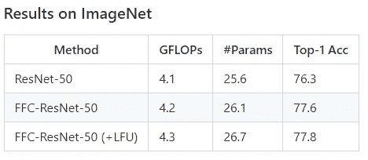

# 快速傅里叶卷积——详细视图

> 原文：<https://medium.com/mlearning-ai/fast-fourier-convolution-a-detailed-view-a5149aae36c4?source=collection_archive---------0----------------------->

## 深度学习

## 用普通 CNN 解决问题

Results of adding FFC into ResNet-50 (Source: [Github](https://github.com/pkumivision/FFC))

大家好，希望你们一切都好。在本帖中，我们将浏览一篇名为“[快速傅里叶卷积](https://papers.nips.cc/paper/2020/file/2fd5d41ec6cfab47e32164d5624269b1-Paper.pdf)”的研究论文。本文探讨了细胞神经网络中卷积算子存在的问题，提出了一种新的算子来代替卷积算子。这提高了精确度…