# 利用统一网络快速定位文本(FOTS)

> 原文：<https://medium.com/mlearning-ai/fast-oriented-text-spotting-with-a-unified-network-fots-e200917ea0aa?source=collection_archive---------0----------------------->

从图像中检测和识别文本(也称为文本定位)是一个非常有用和具有挑战性的问题，因为它在文档扫描、机器人导航和图像检索等领域有实际应用，所以深度学习研究人员多年来一直在研究这个问题。迄今为止，几乎所有的方法都包括两个独立的阶段:1)文本检测 2)文本识别。文本检测只是找出文本在给定图像中的位置，根据这些结果，文本识别实际上从文本中识别字符。由于这两个阶段，需要训练两个独立的模型，因此预测时间有点长。由于测试时间较长，这些模型不适合实时应用。与此相反，FOTS 通过同时检测和识别文本，使用统一的端到端可训练模型/网络来解决这个两阶段问题。它在文本检测和识别任务之间使用共享的卷积特征，学习更多的通用特征并改进测试时间，使得它可以在实时应用中有用，例如从较高 FPS 的视频流进行 OCR。FOTS 还改进了对具有对齐/旋转文本的场景的文本检测，因为它有一个名为“RoIRotate”(感兴趣区域旋转)的特殊组件，该组件通过保持纵横比不变来旋转对齐的文本，然后应用文本识别。

# 概述

1.  商业问题
2.  ML 问题公式化
3.  数据来源和概述
4.  *探索性数据分析*
5.  *数据预处理/地面实况生成*
6.  *造型*
7.  *损失计算*
8.  结果
9.  *结论*
10.  *未来工作*
11.  参考

这是我的 Github 库，包含了全部代码:[https://github.com/Kaushal28/FOTS-PyTorch](https://github.com/Kaushal28/FOTS-PyTorch)

# 1.商业问题

从自然图像中读取文本在许多领域非常有用，如文档分析、场景理解、机器人导航、图像检索和自动驾驶汽车。这也是最具挑战性的任务之一，因为现实生活中的图像文本有不同的字体、大小/比例和对齐方式。这些应用中的一些还要求不仅准确而且更快地从图像中检测和识别文本(从视频流中识别)，这使得文本识别问题更加具有挑战性。

# 2.ML 问题公式化

从自然图像中提取文本的问题可以表述为两个阶段的过程:1)文本检测/定位 2)文本识别。文本检测可以进一步公式化为边界框回归和文本的每像素分类(无论该像素是否是文本的一部分)。FOTS 结合了这两个阶段，并允许训练一个端到端的模型，用于准确的文本检测和识别。

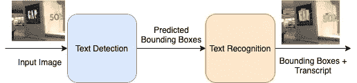

# 3.数据来源和概述

为了训练端到端 FOTS 模型，如原始论文所建议的，应使用以下数据集:

[SynthText 数据集:](https://www.robots.ox.ac.uk/~vgg/data/scenetext/)这是一个合成生成的数据集，其中 word 实例被放置在自然场景图像中，同时考虑到场景布局。这是一个非常大的数据集，包含 80 万张不同文本的图片。

[ICDAR-2015](https://iapr.org/archives/icdar2015/index.html?p=254.html) 数据集:这是真实世界的数据集，包含来自可穿戴相机的图像。与 SynthText 数据集相比，该数据集相对较小(只有 1000 个训练图像)。

由于 SynthText 数据集足够大，该论文建议在其上训练整个模型，然后适应真实世界的图像，该模型可以在 ICDAR-2015 数据集上进行微调。

# *4。探索性数据分析(EDA)*

这里是详细的 EDA 的关键，这样做是为了理解给定的数据。

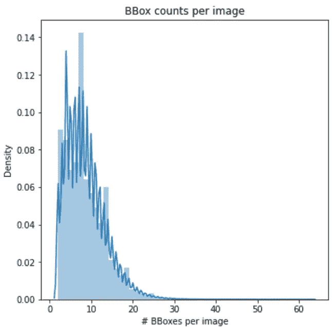

Distribution of bounding boxes per image

图像大小的分布:

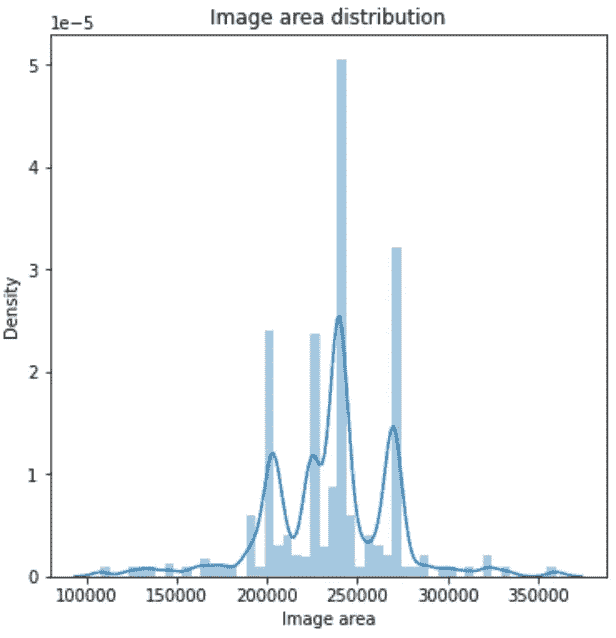

Distribution of image area in px²

以下是来自 SynthText 数据集的一些示例:

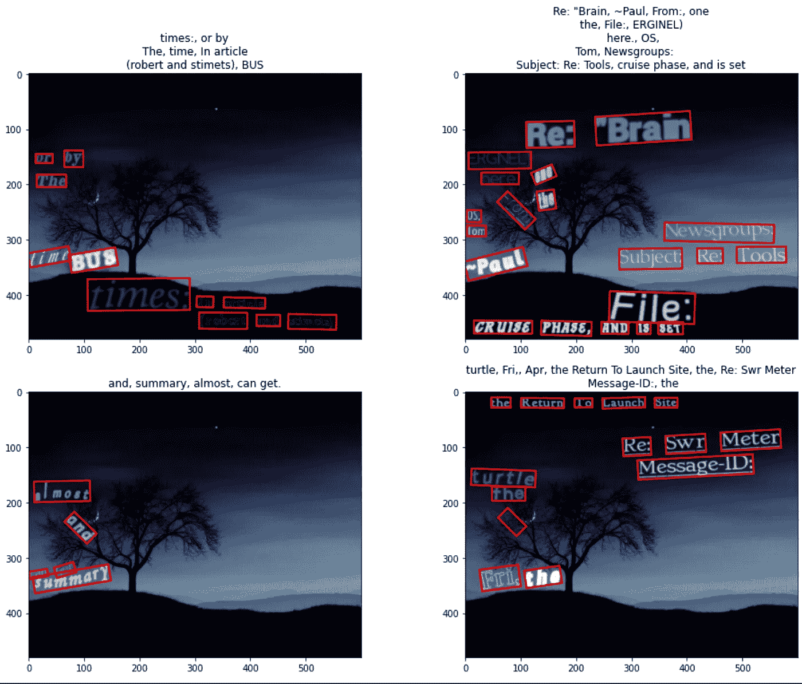

SynthText image samples from SynthText dataset with bboxes

以下是来自 ICDAR-2015 数据集的一些样本

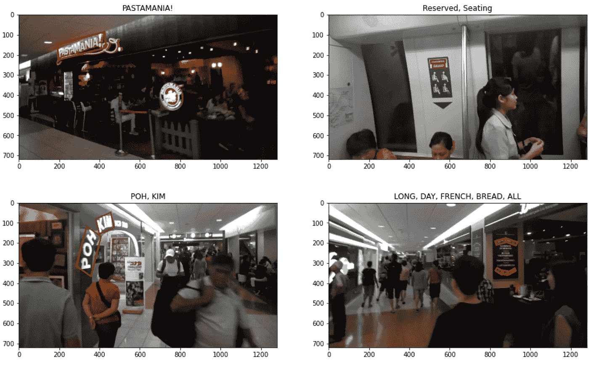

ICDAR-2015 image samples with bboxes

从图像质量和边界框的大小/方向来看，很明显，与 SynthText 数据集相比，ICDAR-2015 数据集非常具有挑战性。

# *5。数据预处理/地面实况生成*

为了训练 FOTS 模型的文本检测组件，需要为每个基本事实图像生成以下基本事实遮罩/图像。

1.  分数图:这是一个图像通道，表示给定图像中每个像素的像素是文本的一部分还是背景的一部分。以下是地面实况得分图和相应图像的示例:


Ground truth image and score-map visualization

2.地理图:地理图包含 5 个遮罩/通道:对于作为文本一部分的每个像素，前 4 个通道预测其到包含该像素的边界框的顶部、底部、左侧、右侧的距离，最后一个通道预测相应边界框的方向。以下是这 5 个地理地图通道的可视化，以及相应的地面实况:

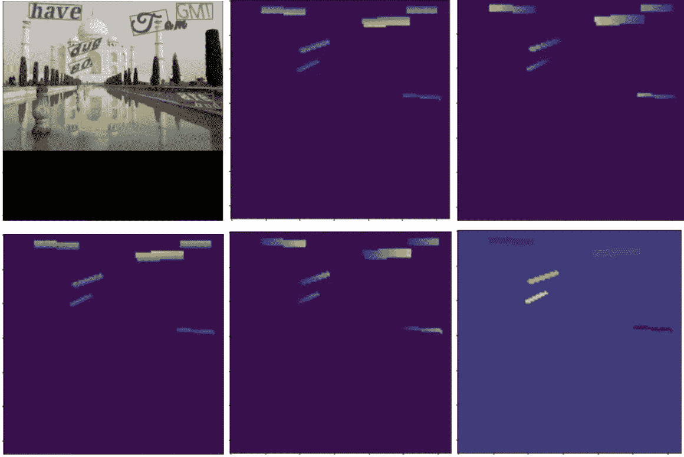

Geo map visualization

这里是用于生成上述图像的地面真实生成的详细信息。

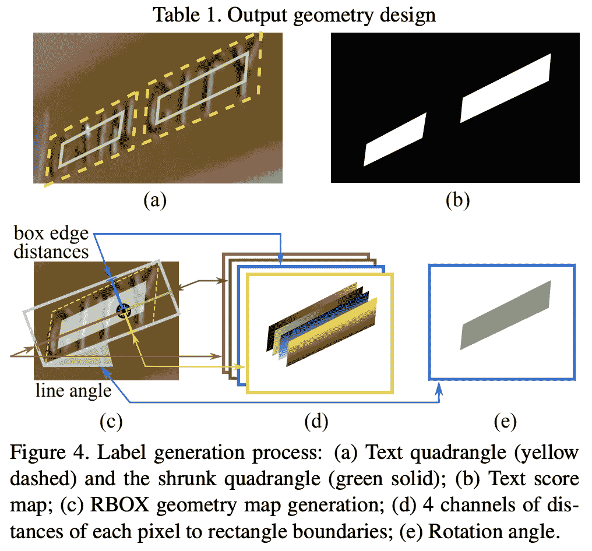

Ground truth generation process. Source - EAST: [https://arxiv.org/pdf/1704.03155.pdf](https://arxiv.org/pdf/1704.03155.pdf)

3.训练遮罩:这是单通道图像，用于忽略非常小的边界框和没有来自训练和损失计算过程的抄本的边界框。

因此，在训练模型之前，必须生成以下基本事实:1)得分图，2)地理图，3)边界框列表，4)文本抄本，5)训练掩码

因此，地面实况生成过程变得资源昂贵，并占用大量 CPU 时间。如果模型在 GPU 上进行训练，并进行动态数据预处理，GPU 将继续等待下一批数据，因为批量地面真实生成将在 CPU 上进行。这将浪费不必要的 GPU 时间/资源。因此，作为该实现的一部分，数据将被预先预处理和保存，然后直接用于训练。这提高了训练速度以及资源效率。

以下是作为实现的一部分，为训练生成的预处理数据集的链接:[https://www.kaggle.com/kaushal2896/synth1k-preprocessed](https://www.kaggle.com/kaushal2896/synth1k-preprocessed)。它包括来自 SynthText 数据集的 12800 幅图像和地面实况。

# *6。建模*

如 FOTS 文件所述，该模型由以下主要部分组成:

## 特征抽出

为了从输入图像中提取高级特征，使用共享卷积层，以预先训练的(在 ImageNet 上)ResNet50 作为主干。共享卷积只不过是卷积层之间具有共享权重。以下是共享卷积的体系结构:

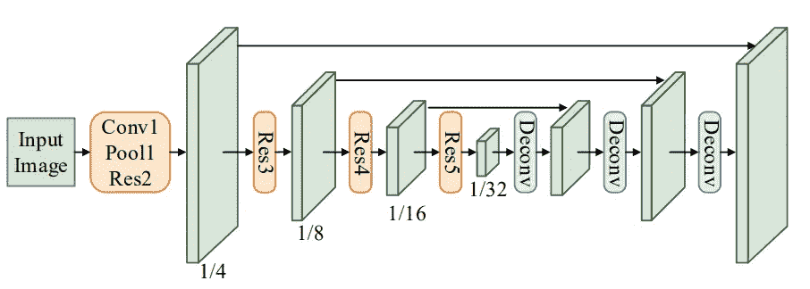

Shared Convolutions

浅橙色块是用于特征提取的预训练 ResNet-50 层。浅绿色块是相应 ResNet50 块的输出要素。“去卷积”模块用于对输入图像/特征进行上采样，以增加输出图像/特征的大小。另请注意，低级功能与高级功能地图直接相连，在上图中显示为黑色箭头。

下面是从 ResNet50 的不同块中提取特征的代码

```
def _extract_features(self, x): """Extract features from given input and backbone.""" x = self.back_bone.conv1(x) x = self.back_bone.bn1(x) x = self.back_bone.relu(x) x = self.back_bone.maxpool(x) res2 = self.back_bone.layer1(x) res3 = self.back_bone.layer2(res2) res4 = self.back_bone.layer3(res3) res5 = self.back_bone.layer4(res4) return res5, res4, res3, res2
```

下面是“deconv”模块的实现:

```
def _deconv(self, feature): """Apply deconv operation (inverse of pooling) on given feature map.""" # Upsample the given feature. # Doc: https://pytorch.org/docs/stable/nn.functional.html#interpolate return F.interpolate( feature, mode='bilinear', scale_factor=2,  # As per the paper align_corners = True )
```

## 文本检测分支

文本检测分支使用全卷积网络作为文本检测器。这些卷积层将具有用于分数图和地理图 5 个通道。一旦边界框由文本检测器分支提出，位置感知 NMS(非最大抑制)将被用于获得具有高于地面真实边界框的最高 IoU 的边界框。

下面是使用卷积层实现检测器的代码片段。

```
class Detector(nn.Module): """Detector branch of FOTS. This is basically fully convolutions.""" def __init__(self): super().__init__() self.conv_score = nn.Conv2d(32, 1, kernel_size = 1) self.conv_loc = nn.Conv2d(32, 4, kernel_size = 1) self.conv_angle = nn.Conv2d(32, 1, kernel_size = 1) def forward(self, x):
        ...
```

## RoIRotate(感兴趣区域旋转)

RoIRotate 对定向/对齐的特征区域应用变换，以获得轴对齐的特征图。这是 RoIRotate 过程的直观视图:

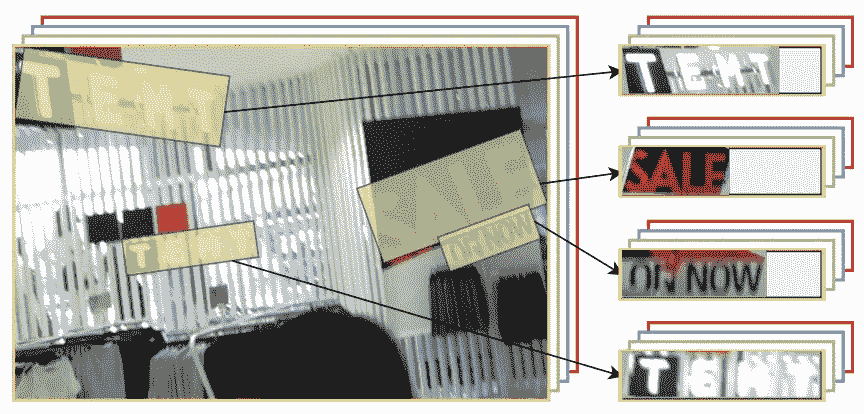

RoIRotate

注意，上图只是为了形象化。RoIRotate 的实际实现对通过共享卷积而不是原始图像提取的特征图进行操作。

## 文本识别处

文本识别分支旨在使用由共享卷积提取并由 RoIRotate 变换的区域特征来预测文本标签。

文本识别分支包括类似 VGG 的顺序卷积、仅沿高度轴减少的池化、一个双向 LSTM、一个全连接和最终的 CTC(连接主义时间分类)解码器。这些组件统称为 CRNN(卷积递归神经网络)。

以下是典型 CRNN 的高级架构:

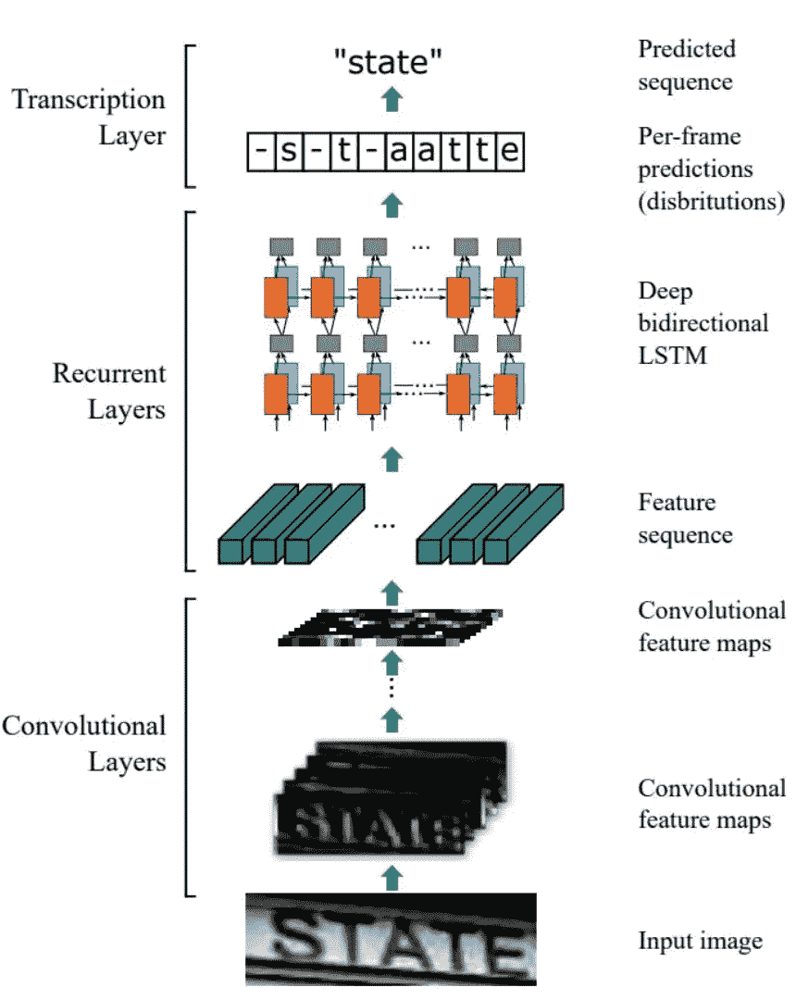

CRNN Architecture: [https://arxiv.org/pdf/1507.05717.pdf](https://arxiv.org/pdf/1507.05717.pdf)

在 FOTS，卷积层是类似 VGG 的连续层。其架构如下表所示:

```
Type                Kernel              Out[size, stride]      Channels---------------------------------------------------conv_bn_relu        [3, 1]              64---------------------------------------------------conv_bn_relu        [3, 1]              64---------------------------------------------------height-max-pool     [(2, 1), (2, 1)]    64---------------------------------------------------conv_bn_relu        [3, 1]              128---------------------------------------------------conv_bn_relu        [3, 1]              128---------------------------------------------------height-max-pool     [(2, 1), (2, 1)]    128---------------------------------------------------conv_bn_relu        [3, 1]              256---------------------------------------------------conv_bn_relu        [3, 1]              256---------------------------------------------------height-max-pool     [(2, 1), (2, 1)]    256---------------------------------------------------bi-directional      lstm                256---------------------------------------------------fully-connected                     |S| = n_classes---------------------------------------------------
```

FOTS 模型是使用上述四个组件构建的。下面是工作流程的简要总结:首先，输入图像将通过共享卷积传递，特征将被提取(特征将具有输入图像的 1/4 大小)，接下来，边界框将由文本检测分支预测，这些边界框将通过 RoIRotate 并水平对齐。这些变换后的边界框将通过文本识别分支，该分支将使用 CTC 解码器从特征中预测抄本。

这是整个 **FOTS** 模型的架构:

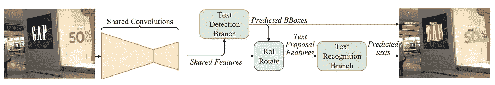

FOTS overall architecture, The network predicts both text regions and text labels in a single forward pass.

# *7。损失计算*

FOTS 损失模型包括文本检测和文本识别两个分支。

## 检测损失

检测损失考虑平衡的二进制交叉熵(根据论文，但是在该实现中，dice 系数用于更快的收敛)，这也被称为分类损失。

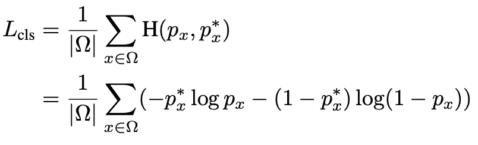

Detection loss (Classification component)

检测损失的另一个组成部分考虑预测边界框和地面真实边界框之间的 IoU 以及预测边界框的旋转。


Detection loss (regression loss)

总检测损耗由上述损耗组成:

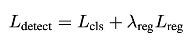

Detection Loss

lambda_reg 是一个超参数，在此实现中设置为 20。

## 识别损失

CTC 损失用作确认损失。

总 FOTS 损失由检测损失+识别损失组成。

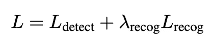

FOTS Loss

lambda_reg 也是一个超参数，在此实现中设置为 1。

# 8.结果

该模型最初仅被训练用于使用约 12K SynthText 图像和 25 个时期的文本检测。结果令人满意。

以下是检测损失图(仅针对文本检测训练模型时):

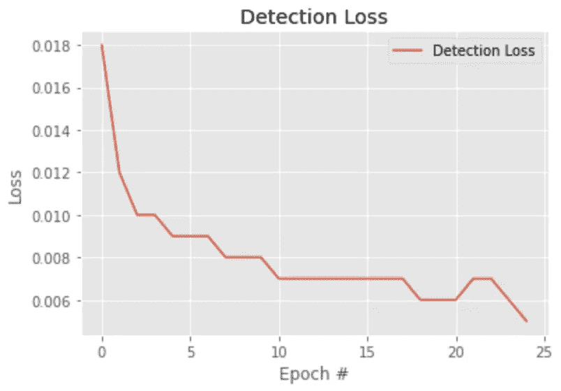

Detection Loss

然而，为了训练用于文本识别和文本检测的模型，需要相当大的数据集(完整的 SynthText)和更长的训练时间。由于硬件限制，该模型没有针对文本识别进行充分的训练和测试。

这是模型被训练用于检测和识别时的损失图。

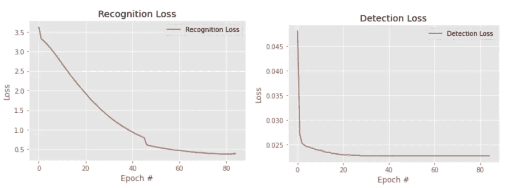

Recognition Loss + Detection Loss

以下是模型的一些预测(仅检测)

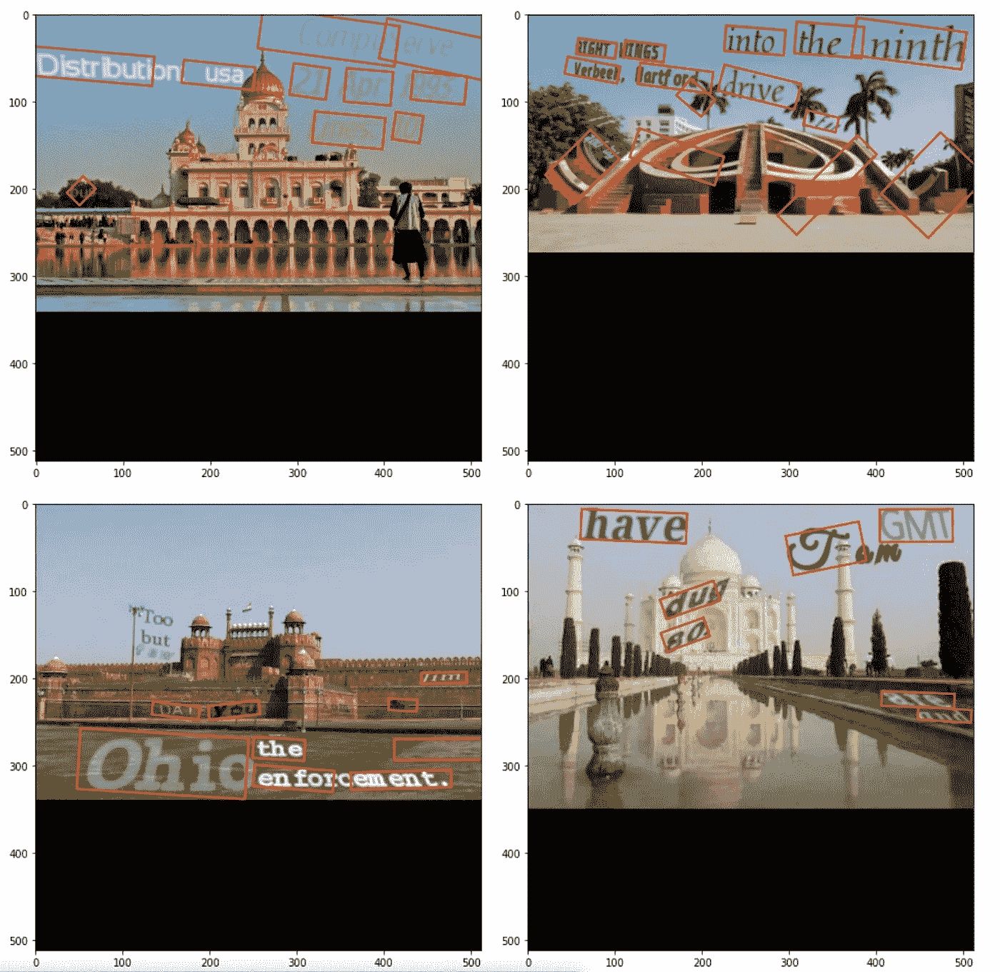

Detection results

# 9.结论

在这项工作中，我实现了 FOTS，一个面向场景文本识别的端到端可训练框架。提出了一种新颖的 RoIRotate 操作，将检测和识别统一到一个端到端的流水线中。通过共享卷积特征，文本识别步骤几乎是免费的，这使得我们的系统能够以实时速度运行。

# 10.未来的工作

如前所述，由于硬件限制，该模型没有在 SynthText 数据的整个 800K 图像上进行完全训练。我计划一旦有足够的 GPU 可用于更长时间的训练，就完全训练 FOTS 模型，以获得良好的识别结果和文本检测结果。

# 11.参考

[https://arxiv.org/pdf/1801.01671.pdf](https://arxiv.org/pdf/1801.01671.pdf)

[](https://github.com/jiangxiluning/FOTS.PyTorch) [## 江西路宁/FOTS。PyTorch

### ICDAR 数据集 SynthText 800K 数据集检测分支(在训练集上验证，有效！)eval 多 gpu 培训…

github.com](https://github.com/jiangxiluning/FOTS.PyTorch) 

https://arxiv.org/pdf/1704.03155.pdf

[](https://www.appliedaicourse.com/) [## 应用课程

### 我们知道转行是多么具有挑战性。我们的应用人工智能/机器学习课程被设计为整体学习…

www.appliedaicourse.com](https://www.appliedaicourse.com/) 

如果你喜欢这篇文章，请为这个故事鼓掌，并在 LinkedIn 上与我联系:【https://www.linkedin.com/in/kaushal-shah-466587110/