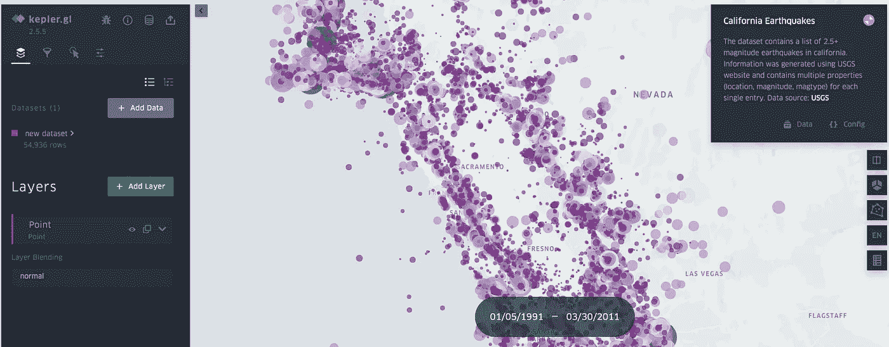
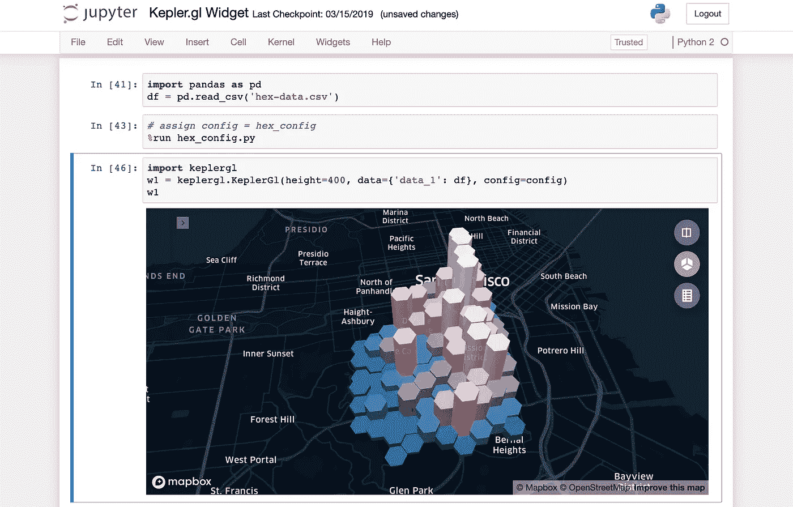

# 在地图上快速绘制 GIS 数据

> 原文：<https://medium.com/mlearning-ai/fast-plotting-gis-dataon-map-828f670c0aa?source=collection_archive---------6----------------------->

## 两分钟内从 CSV 和 GeoJSON 创建交互式地图



如果您在 stackoverflow 上搜索，并想将您的熊猫或地理熊猫数据集绘制到地图上，您将会看到各种工具，如

*   Matplotlib/Seaborn
*   薄层
*   plotly/地图框

这些工具很好地服务于它的目的，但是一个巨大的缩减

1.  他们需要时间
2.  他们有如此多的选项，以至于人们可能不得不争论大量的文档才能在地图上找到正确的选项。

作为一种快速的替代方案，优步公司开发了 Kepler.gl，它使网络用户界面能够处理你可能需要绘制数据的一切。

# 步骤:

1.  前往[https://kepler.gl/demo](https://kepler.gl/demo)
2.  拖放您的 CSV/ geoJson 文件(确保 lat/ lon 在 EPSG:4326；参考此[页面](https://gis.stackexchange.com/questions/174159/converting-pandas-dataframe-to-geodataframe)了解更多关于投影、geopandas 和 shapely 的信息)
3.  瞧，keplr.gl 将从数据中自动检测多边形/坐标，并绘制最合理的视图。

您可以使用选项、视图、添加过滤器等等。

如果你想要持久的结果，你也可以在 **jupyter 笔记本**中运行 keplr.gl。

```
# Load a map with data and config and height
from keplergl import KeplerGl
map_2 = KeplerGl(height=400, data={"data_1": my_df}, config=config)
map_2
```



**尽情享受！**

[](/mlearning-ai/mlearning-ai-submission-suggestions-b51e2b130bfb) [## Mlearning.ai 提交建议

### 如何成为 Mlearning.ai 上的作家

medium.com](/mlearning-ai/mlearning-ai-submission-suggestions-b51e2b130bfb)