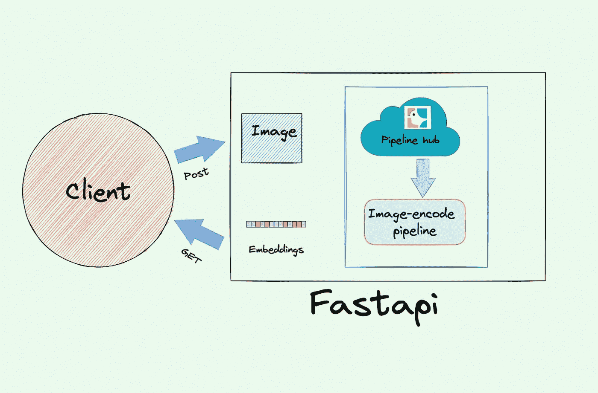
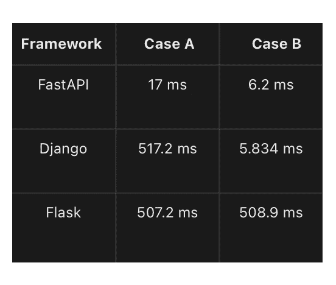
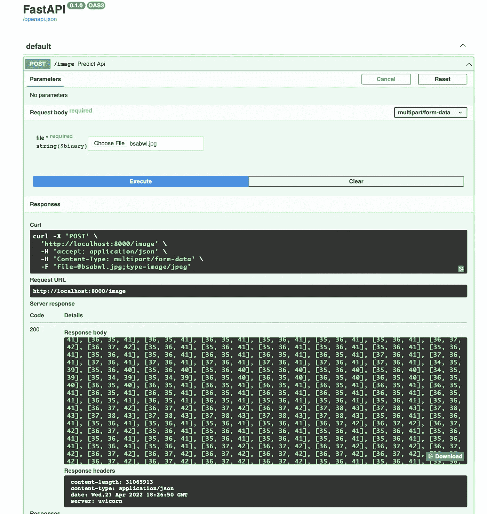
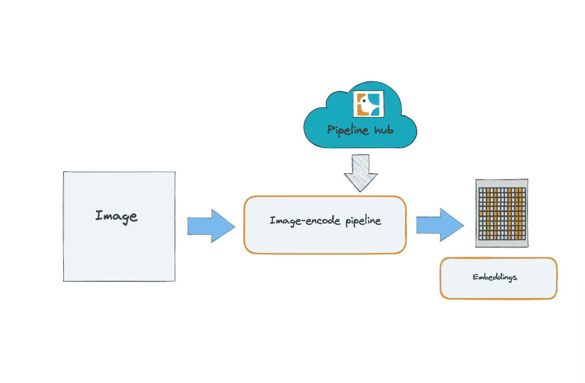

# FastApi 和机器学习

> 原文：<https://medium.com/mlearning-ai/fastapi-and-machine-learning-b75ac9c60412?source=collection_archive---------3----------------------->

开发机器学习项目后的下一步是使可部署。传统上，Flask 用于部署机器学习模型，但现在有一个更好的替代方案，FastApi。API 是应用程序编程接口的首字母缩写，它是一种软件中间体，允许两个应用程序相互通信。FastApi 是一个 Python web 框架，基于 OpenAPI 规范和 JavaScript 对象符号模式，用于开发 RESTful APIs。OpenAPI 规范为 HTTP APIs 定义了一个标准的、与编程语言无关的接口描述，它允许人类和计算机在不需要访问源代码、附加文档或检查网络流量的情况下发现和理解服务的能力。JSON Schema 是一个允许注释和验证 JSON 文档的词汇表。FastAPI 是为了利用现代 Python 特性而从头构建的。它使用异步服务器网关接口标准来实现与客户端的异步、并发连接，如果需要，它可以使用 Web 服务器网关接口。异步函数可用于路由和端点。FastAPI 允许使用简洁的现代 Python 代码和类型提示高效地编写 web 应用程序。它完全支持异步编程，可以与 Uvicorn 和 Gunicorn 一起运行。



Fig 1:API Architecture

由于轻量级的 Starlette ASGI 框架/工具包和 pydantic，性能非常高。强大的编辑器支持，无处不在的补全和减少人为错误的可能性，大大提高了开发速度。根据 nfolytx.com 的说法，与 Flask 和 Django 等其他主流 Python 框架相比，FastAPI 的速度相当快。以下来自 Techempower 的得分图表显示了性能差异:



Fig 2:Speed comparison

## 装置

```
pip install fastapi
pip install “uvicorn[standard]”
pip install towhee
```

## **演示 FastApi 代码**

```
from fastapi import FastAPI
app = FastAPI()
@app.get("/")
async def root():
return {"Response": "Hello Friend"}
```

在这篇文章中，我们将使用 Towhee。 [Towhee](https://github.com/towhee-io/towhee) 是一个开源项目。开源软件是根据许可证发布的。版权所有者授予用户使用、研究、修改和向任何人出于任何目的分发软件及其源代码的权利。开源软件的例子包括 GNU/Linux、Mozilla Firefox 和 VLC media player。

是一个用于开发 ML 驱动的数据处理和搜索管道的框架。这是一个 Python 项目，旨在促进复杂的多阶段机器学习任务的创建和部署，允许每个人——从初学者到大型组织——只需几行代码就可以部署复杂的管道。我们将上传一个图像，并得到它的嵌入。嵌入被定义为“离散变量的低维、学习的连续向量表示，以翻译高维向量。它们使机器学习模型更有效，更容易使用，并与其他模型一起使用。”应用编程接口可以用 swagger ui 测试，有了交互探索，直接从浏览器调用和测试你的 API。它可以在最新版本的 Chrome、Safari、Firefox 和 Edge 上运行。



Fig 3:Api testing

# 密码

在/Image 路由中，predict_api 函数获取输入文件，并检查上传的文件是否是有效的图像。使用 read_imagefile()函数处理该文件。使用 io python 模块将输入流转换为枕形图像。embedding_gen(图像:图像。Image)处理枕头图像并获取嵌入内容，然后使用 json.dumps(image_emb.tolist())函数将嵌入内容转换为 json 友好因子。



Fig 4:Towhee Image decode

```
#IMPORT LIBRARIES
import uvicorn
from fastapi import FastAPI, File, UploadFile
from io import BytesIO
import numpy as np
from towhee import pipeline
from PIL import Image
from  towhee.utils.pil_utils import from_pil
from towhee.utils.ndarray_utils import to_ndarray
import json#FILE TO PILLOW IMAGE
def read_imagefile(*file*) -> Image.Image:
  image = Image.open(BytesIO(*file*))
  return image#PILLOW TO JSON FRIENDLY OUTPUT USING JSON AND TOWHEE
def embedding_gen(*image*: Image.Image) -> np.ndarray:
  image_obj=from_pil(*image*)
  image_emb=to_ndarray(image_obj)
  image_emb=json.dumps(image_emb.tolist())
  return image_emb
#APPapp = FastAPI()
#this code is for image based towhee api only
@app.post("/image")
#FILE INPUT AND FILE CHECKING
async def predict_api(*file*: UploadFile = File(...)):
  extension = *file*.filename.split(".")[-1] in ("jpg", "jpeg", "png")
  if not extension:
    return "Image must be jpg or jpeg or png format!"
#FILE PROCESSING
  image = read_imagefile(await *file*.read())
  emd=embedding_gen(image)
  return {"Image_Embeddings":emd}#SERVER
if __name__ == "__main__":
  uvicorn.run(app, *debug*=True)
```

查看其他有趣的文章:

[矢量数据库简介](https://frankzliu.com/blog/a-gentle-introduction-to-vector-databases) [使用嵌入的逆向图像搜索](https://docs.towhee.io/tutorials/reverse-image-search/) [音乐识别系统](https://docs.towhee.io/tutorials/music-recognition-system/)

如果你喜欢这篇文章，请给[一颗星](http://github.com/towhee-io/towhee)。感谢您阅读这篇文章。如果您有任何反馈，请告诉我:)

[](/mlearning-ai/mlearning-ai-submission-suggestions-b51e2b130bfb) [## Mlearning.ai 提交建议

### 如何成为 Mlearning.ai 上的作家

medium.com](/mlearning-ai/mlearning-ai-submission-suggestions-b51e2b130bfb)