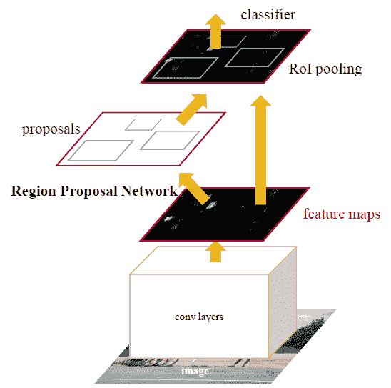
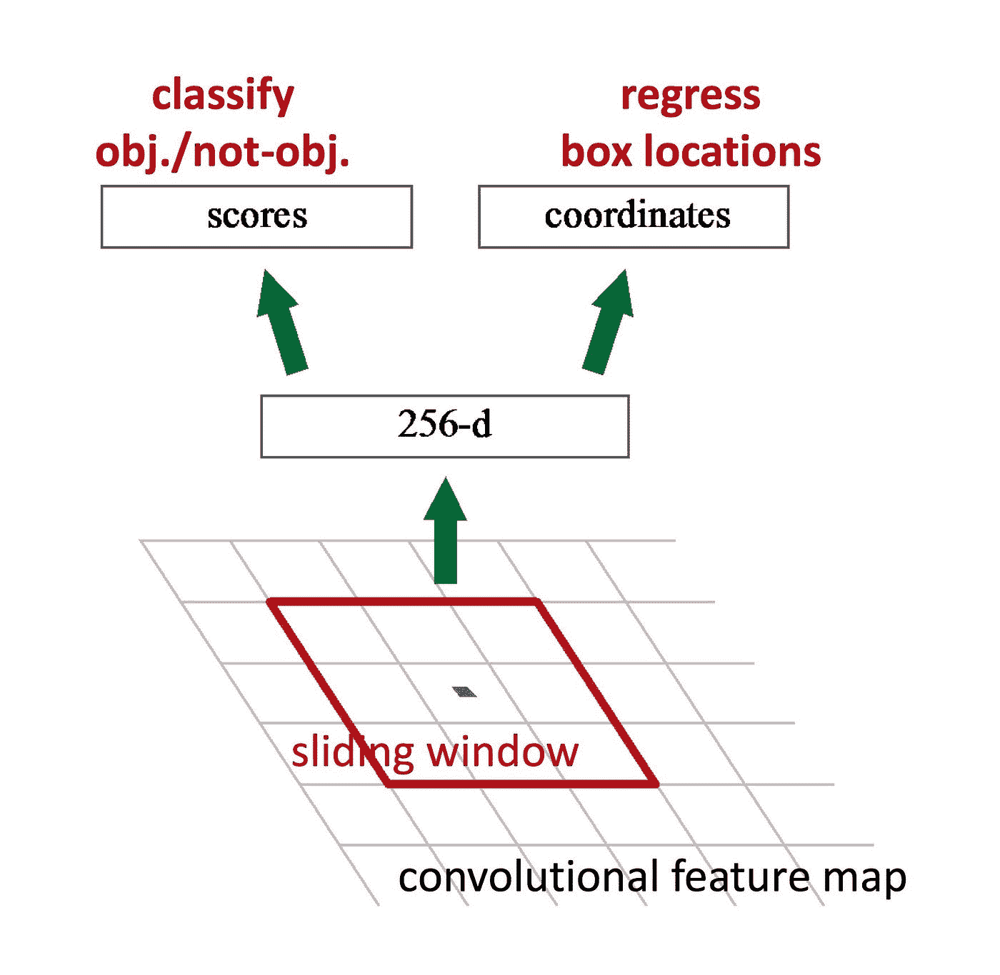
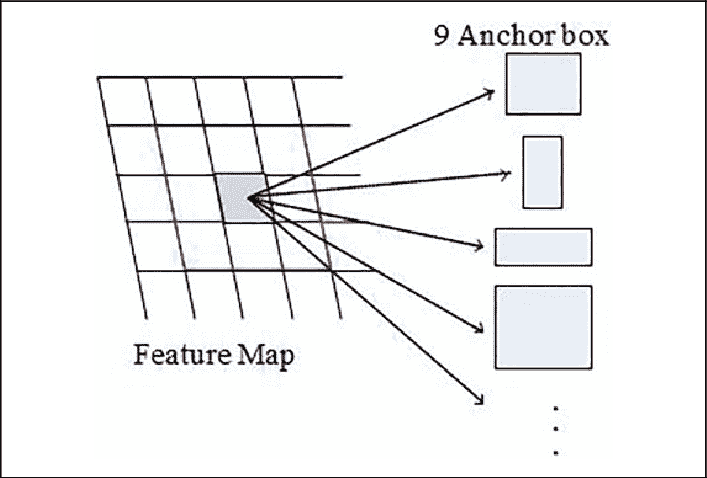
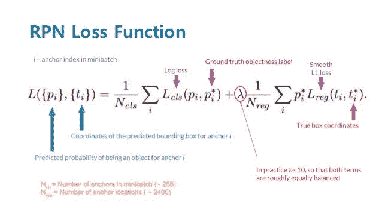

# 更快的 RCNN:用区域建议网络实现实时目标检测

> 原文：<https://medium.com/mlearning-ai/faster-rcnn-towards-real-time-object-detection-with-region-proposal-networks-9d2db3e23c06?source=collection_archive---------2----------------------->

# 介绍

## 为什么

区域建议是当前检测系统中测试时的计算瓶颈。区域建议步骤仍然消耗与检测网络一样多的运行时间。

## 怎么

我们引入了一个区域建议网络(RPN ),它与检测网络共享完整图像的卷积特性，从而实现几乎无成本的区域建议。RPN 是一个完全卷积的网络，它同时预测每个位置的对象边界和对象性分数。RPN 被端到端地训练以生成高质量的区域提议，其被快速 R-CNN 用于检测。

# 模型

更快的 RCNN 建立在两个模块之上:

1.  第一个模块是提议区域的深度完全卷积网络(区域提议网络或“RPN”)。
2.  第二个模块是快速 R-CNN 检测器，它使用建议的区域来检测对象。

这两个模块共同构成了一个单一的、统一的目标检测网络，如下图所示:

## 区域提案网络

区域提议网络(RPN)将图像(任何大小)作为输入，并输出一组矩形对象提议，每个提议都有一个对象分数。这是使用 CNN 完成的，通过共享卷积层，CNN 的计算与快速 RCNN 对象检测网络共享。

为了生成区域建议，我们在最后共享的卷积层的特征映射输出上滑动一个 n×n 窗口。该特征被提供给两个完全连接的兄弟层-盒回归层(reg)和盒分类层(cls)。

RPN 的简化视图:

**RPN 中的锚**

在每个滑动窗口位置，我们同时预测多个区域提议，其中每个位置的最大可能提议的数量被表示为 k。因此 reg 层具有编码 k 个框的坐标的 4k 个输出，并且 cls 层输出 2k 个分数，这些分数估计每个提议的对象或非对象的概率。这 k 个建议相对于 k 个参考框被参数化，称为*锚*。

本文中用于快速 RCNN 的锚定器以滑动窗口为中心，具有 3 个尺度和 3 个纵横比。因此，每个滑动位置有 9 个锚。

注意:锚点是*平移不变量*。如果一个人翻译一个图像中的对象，该建议应该翻译，并且相同的功能应该能够预测在任何位置的建议

锚的图像化:

**RPN 的损失函数**

对于训练 rpn，我们给每个锚点分配一个二进制类标签(是否为对象)。我们给两种锚分配正标签:(I)具有最高交集-并集(IoU)的锚与基础事实框重叠，或者(ii)与任何基础事实框具有高于 0.7 的 IoU 重叠的锚。

如果非正锚的 IoU 比率对于所有地面实况框都低于 0.3，则我们将负标签分配给非正锚。其他主播对 RPN 的训练没有贡献。

根据这些定义，我们最小化以下目标函数:

**RPN 培训**

RPN 可以通过反向传播和随机梯度下降(SGD)进行端到端的训练。每个小批量从包含许多正面和负面示例锚点的单个图像中产生。为了防止偏向负样本，我们在图像中随机采样 256 个锚来计算小批量的损失函数，其中采样的正锚和负锚的比率高达 1:1。如果图像中的阳性样本少于 128 个，我们用阴性样本填充小批量。

使用高斯分布初始化新层，并且通过在 ImageNet 分类上预先训练模型来初始化共享卷积层。

## 4 步交替训练

本文采用 4 步训练算法，通过交替优化来学习共享特征。这些步骤是:

1.  按照上一节所述训练 RPN。
2.  使用步骤 1 训练的 RPN 产生的建议，通过快速 RCNN 训练单独的检测网络。注意*此时，两个网络不共享任何卷积层*
3.  使用检测器网络来初始化 RPN 训练，保持共享卷积层固定，仅微调 RPN 独占层。*现在两个网络共享卷积层。*
4.  最后，保持共享卷积层固定，我们微调快速 R-CNN 的独特层。

## 结果

## **在帕斯卡 VOC 上**

在 PASCAL VOC 2007 测试集(在 VOC 2007 trainval 上训练)上，具有与具有 ZF 的快速 R-CNN 一样的检测器，但是不同的区域提议方法，RPN 方法给出比选择性搜索和 edgebox 更好的 1.3 mAP。

当检测器为快速 RCNN 和 VGG16 时，在 VOC 2007 测试集上 78.8%的 mAP，在 COCO+07+12(VOC 2007 trainval 和 VOC 2012 trainval 的联合集)上训练。

**关于田蜜女士**

与快速 RCNN 相比，当在 COCO 训练数据集上训练时，在 COCO 测试-dev 上，更快的 RCNN(在 VGG-16 上)将 mAP@0.5 提高了 2.8%，mAP@[0.5，0.95]提高了 2.2%。

仅通过将 VGG-16 替换为 101 层残差网(ResNet-101)，更快的 R-CNN 系统在 COCO train 数据集上训练时，将 mAP@0.5/mAP@[0.5，0.95]从 COCO val 集上的 41.5%/21.2% (VGG- 16)提高到 48.4%/27.2% (ResNet-101)。

**整个物体检测系统的运行时间**

使用 ZF 网络，速度是 17 帧/秒，使用 VGG 16，速度是 5 帧/秒。