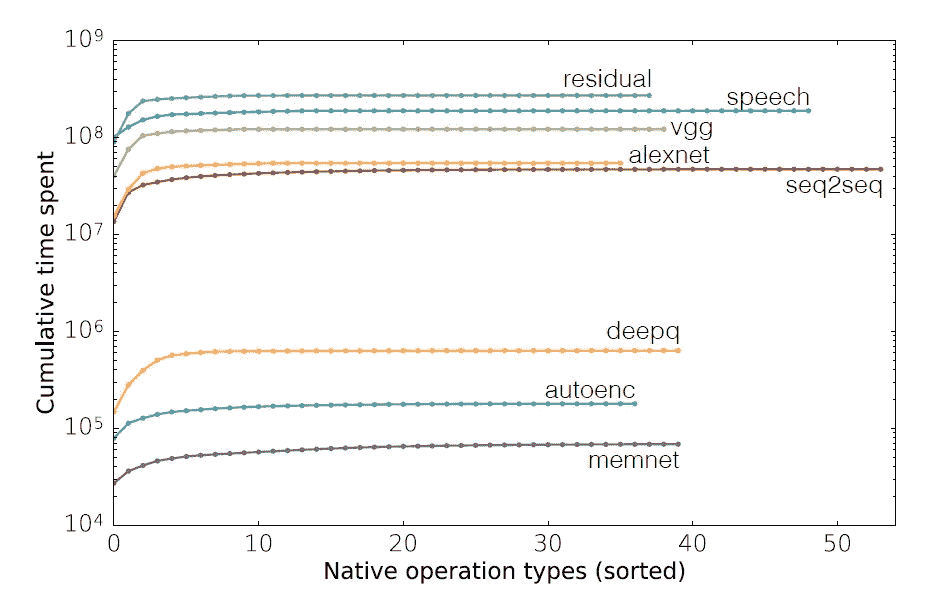
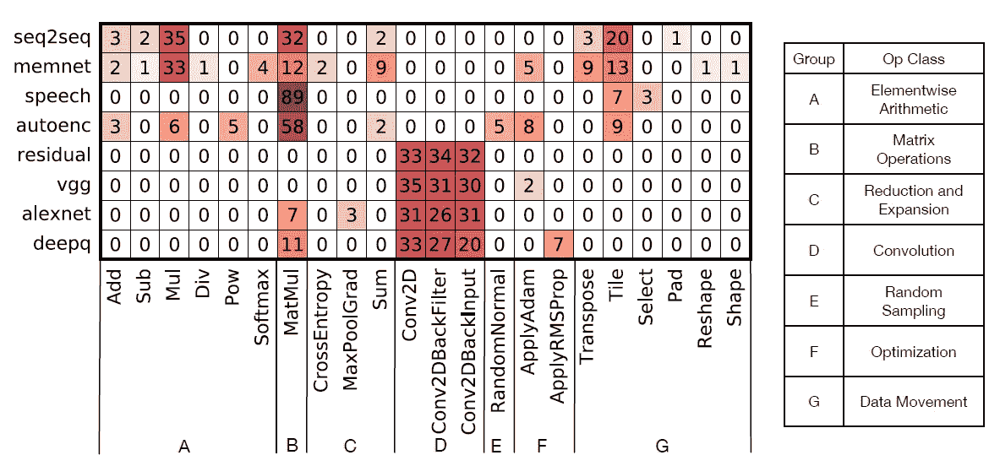
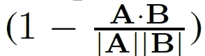
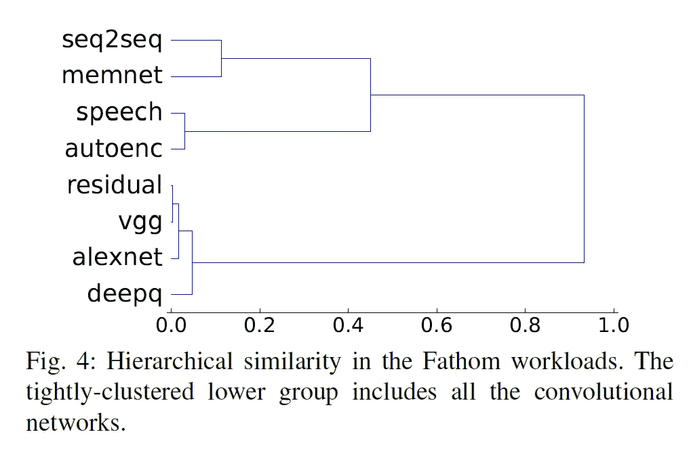
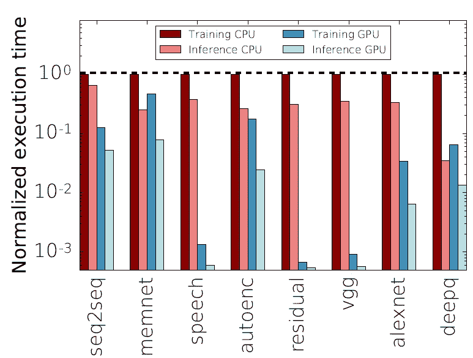
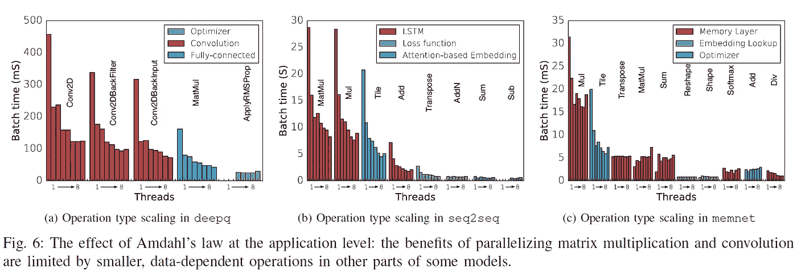

# “Fathom:现代深度学习方法的参考工作负载”摘要

> 原文：<https://medium.com/mlearning-ai/fathom-reference-workloads-for-modern-deep-learning-methods-2a36eee41760?source=collection_archive---------3----------------------->

# 介绍

深度学习(DL)已经变得很受欢迎，因为它在为图像分类、自然语言处理、对象检测等应用提出可接受的解决方案方面表现出了有效性。DL 任务需要巨大的计算能力。它们是浮点计算密集型任务。他们在大规模并行 GPU 或其他加速器(如谷歌的 TPUs)上接受训练和服务。计算机架构师已经提出了大量的加速器来促进他们的计算。所提出的机制通常集中在狭窄的应用领域，这并没有降低它们的价值。然而，对于更灵活的体系结构，需要检查来自整个 DL 的最新模型的特征。 [Fathom](https://github.com/rdadolf/fathom) [1]收集了一组 8 个 DL 工作负载，用于研究它们的特征和行为。

# 所选工作负载的特征

Robert Adolf 等人在[1]中指出了工作负载的三个特性，这些特性可以融入到捆绑包中。这些特性是(1) **代表性**、(2) **多样性**、(3) **影响力**。(1)基准测试套件应该反映 DL 社区已经提出的最佳方案。(2)每个模型必须带来一些独特的东西，以保持多样性。(3)影响是特定技术改变数字图书馆研究前景的程度。

# Fathom Suite 的工作负载

## 1.序列间翻译

**seq2seq** 是一个[递归神经网络( **RNN** )](https://www.freecodecamp.org/news/the-ultimate-guide-to-recurrent-neural-networks-in-python/) 用于解决机器翻译。它是 2014 年在谷歌开发的，使用多层管道的[长短期记忆(LSTM)](https://en.wikipedia.org/wiki/Long_short-term_memory) 神经元提取句子的意思，然后将其重新发射到另一种语言中[ **2，3** ]。

## 2.端到端存储网络

记忆网络将状态从神经网络的结构中分离出来。记忆网络的发展源于有状态神经元在捕捉长程相关性方面的困难。脸书的人工智能研究小组通过将间接可寻址存储器与神经网络结合起来解决了这个问题，从而产生了一种可以显式存储和回忆信息的模型。端到端的内存网络[ **5** ]是一种扩展，它消除了对输入的类型注释的需要，并极大地简化了训练(自然语言处理)。

## 3.深沉的演讲

这是百度研究院对可扩展语音识别模型的尝试[ **6** ]。它使用连接主义时间分类(CTC)损失函数，该函数可以从不分段的数据中学习，从而显著降低产生训练数据的成本。

## 4.变分自动编码器

编码器是灵活的、无监督的模型，通常用于维度、特征提取或生成数据。2013 年发明的变分编码器对真实数据的属性进行统计假设，以学习有效地重建其输入[ **8** ]。

## 5.剩余网络

残差网络是实现非常深的神经网络(超过 150 层)的里程碑。

## 6.VGG-19

它是牛津大学视觉几何小组开发的 19 层卷积网络的实现。它的灵感来自于 AlexNet 的成功。关键的见解是，更多层的较小卷积滤波器更容易训练，这提高了精度，并大大减少了可学习参数的数量。

## 7.AlexNet

这个模型被认为是 DL 历史上的重要事件之一[ **11** ]。

## 8.深度强化学习

[DeepMind](https://en.wikipedia.org/wiki/DeepMind) 在 **2013** 用一个深度强化学习系统震惊了 AI 社区，该系统学会了仅从像素和分数赢得几十个雅达利游戏。与监督学习不同，该算法在接收游戏中的反馈时改进其选择的动作，而不是通过观察整个游戏。该方法的架构是一个卷积网络，它使用 2–3 个卷积层和 2–3 个密集层[ **12** ]来选择动作。

# 了解 DL 工作负载的性能特征

作者从不同的角度研究了组装的工作负载。这些旨在让计算机架构师对 DL 工作负载的行为有一个直观的了解，例如，时间花在哪里，以及给定模型和它在其上运行的硬件之间的关系。

## DL 框架中的测量和分析

作者使用**操作**作为理解 Fathom 模型性能的主要抽象。操作是粗粒度数据流图中定义张量流模型的节点。它被实现为一个 Python 函数，指示框架构建该节点，还被实现为一个 C++函数，执行计算或调用低级库来执行计算。底层库可以是 CPU 上的 [**Eigen**](https://eigen.tuxfamily.org/index.php?title=Main_Page) 线性代数包，也可以是 GPU 上的[**cuBLAS**](https://docs.nvidia.com/cuda/cublas/index.html)**或[**cud nn**](https://developer.nvidia.com/cudnn)**等 CUDA 库。操作是 TensorFlow 运行时中最小的可调度单元。示例包括像 2D 矩阵乘法(**马特穆尔**)、逐元素张量取幂(**幂**)这样的函数，或者像从正态分布采样(**标准随机正态**)或者计算特定优化算法的损失函数(**交叉熵**)这样的专用函数。****

## ****操作类型分析****

****关于工作负载，最基本的性能问题是时间花在了哪里。这取决于所考虑的模型、环境和用例。下图显示了几个繁重的操作类型(通常在 5 到 15 个之间)共同承担了程序持续时间的 90%以上。每条曲线上的每个点都代表单一操作类型对执行时间的累积贡献。****

********

****[**1**]****

****下图显示，这些重要的独特操作对于每个型号都不相同，也不呈现相同的比率。****

********

****来自作者实验的一些见解:****

1.  ****卷积神经网络确实是由卷积支配的。****
2.  ****全连接网络严重依赖矩阵乘法。****
3.  ******alexnet** 、 **vgg** 和 **residual** 的运算分解表明，卷积网络已经变得更深，并且大多数运算都是卷积。此外，完全联网的大学在久而久之的份额较少。****
4.  ******语音**模型正如其作者所提出的那样，有意避免使用更复杂的组件，而倾向于结构简单、易于优化的网络。如上图所示，这种模型几乎只受矩阵-矩阵乘法运算的影响。****

## ****性能相似性****

****作者使用下面的公式来计算操作向量的向量之间的距离，这些向量在上图中显示为行。****

********

****结果如下图所示，对于一个 DL 专家来说可能并不奇怪。****

********

****speech 和 seq2seq 这两个递归网络之间的巨大差异会有点意思。虽然这两个网络都是递归的，但与序列到序列翻译模型使用的有状态 LSTM 神经元和标准交叉熵损失相比，深度语音使用 CTC 损失和一堆迟钝连接的神经元。seq2seq 中的元素乘法是 LSTM 神经元的结果，数据移动操作是它使用的基于注意力的编码器/解码器的一部分。****

## ****训练和推理****

****在下图中，作者显示了训练和推理阶段的标准化执行时间之间的差异。****

********

## ****并行性和操作平衡****

****作者在下图中强调了三种模型的主要操作以及并行性对它们的影响。他们将学到的经验总结为:****

> ****DL 模型的性能行为依赖于它们的应用程序级结构。虽然卷积和矩阵乘法对硬件支持来说是有吸引力的目标，但从中获得的好处是有限的。对于具有非卷积层、复杂损失函数或优化算法或稀疏存储的 DL 模型来说尤其如此。****

********

# ****参考****

****[1] Adolf，Robert 等.“ **Fathom:现代深度学习方法的参考工作负载。***2016 IEEE 国际工作负载特性研讨会(IISWC)* 。IEEE， **2016** 。****

****[ **2** ]苏茨基弗、伊利亚、奥里奥尔·维尼亚尔斯、阔克诉勒。**用神经网络进行序列对序列学习。***神经信息处理系统的进展*。 **2014** 。****

****[ **3** ] Bahdanau，Dzmitry，Kyunghyun Cho，Yoshua Bengio。**神经机器翻译通过联合学习来对齐和翻译。***arXiv 预印本 arXiv:1409.0473*(**2014**)。****

****韦斯顿、杰森、苏米特·乔普拉和安托万·博德斯。"**记忆网络**" *arXiv 预印本 arXiv:1410.3916*(**2014**)。****

****【 **5** 】苏赫巴托尔、塞恩巴雅尔等】**端到端存储网络。***arXiv 预印本 arXiv:1503.08895*(**2015**)。****

****【**6**】Hannun，Awni 等.**深度语音:放大端到端语音识别。***arXiv 预印本 arXiv:1412.5567*(**2014**)。****

****辛顿、杰弗里·e 和鲁斯兰·r·萨拉胡季诺夫。**用神经网络降低数据的维度。**“*理科*313.5786(**2006**):504–507。****

****金玛、迪德里克·p 和马克斯·韦林。**随机梯度 VB 和变分自动编码器。***第二届国际学术代表大会，ICLR* 。第 19 卷。 **2014** 。****

******9** 何，，等.**深度残差学习用于图像识别。***IEEE 计算机视觉与模式识别会议论文集*。 **2016** 。****

****西蒙扬、凯伦和安德鲁·齐泽曼。**用于大规模图像识别的极深度卷积网络。***arXiv 预印本 arXiv:1409.1556*(**2014**)。****

****克里日夫斯基、亚历克斯、伊利亚·苏茨基弗和杰弗里·e·辛顿。**用深度卷积神经网络进行 Imagenet 分类。***神经信息处理系统进展*25(**2012**):1097–1105。****

****【**12**】belle mare，Marc G .等.**街机学习环境:总代理评估平台。***人工智能研究杂志*47(**2013**):253–279。****

**** [## Mlearning.ai 提交建议

### 如何成为 Mlearning.ai 上的作家

medium.com](/mlearning-ai/mlearning-ai-submission-suggestions-b51e2b130bfb)****