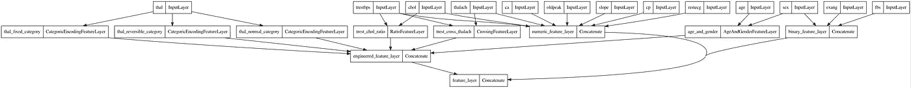

# 使用定制 Keras 层的特征工程，用于完整的训练和推理管道。

> 原文：<https://medium.com/mlearning-ai/feature-engineering-using-custom-keras-layers-part-2-aead2b89ee06?source=collection_archive---------3----------------------->

在之前的[帖子](/mlearning-ai/feature-engineering-using-keras-lambda-layers-ae0c6d3c904f)中，我们看了 Keras Lambda 图层的特征工程应用。我们还提到 Lambda 层有一些序列化限制。在本帖中，我们将看到如何通过子类化 Keras 层接口来克服这些问题，并创建自定义层来实现特征工程。

快速回顾一下之前的帖子:

我们使用 Keras/Tensorflow 在本地实现了一个训练和推理管道。从用 tf.data 加载数据。我们利用 Lambda 层进行特征工程。我们最终有了一个训练管道，其中特征工程是网络架构的一部分，并且可以作为独立的推理被持久化和加载。从设计和服务的角度来看，如果例如使用 Tensorflow 服务于模型，这有一些好处。在将数据提供给服务端点之前，不需要使用不同的库来设计数据。

我们将遵循的步骤:

*   用 tf.data 加载数据
*   创建输入层
*   子类 Keras 图层类
*   火车模型

我们将再次使用心脏病数据集。让我们导入张量流并读入数据:

为每个要素创建一个输入对象字典:

我们将研究两种创建要素图层的方法。场景 1 为不同的功能使用多个自定义 Keras 层，场景 2 仅使用一个层。

## 场景 1:多个自定义层

在这里，我们将为不同的要素创建单独的自定义图层，最后一步，我们将连接我们的图层以创建一个完整的要素图层。

让我们使用自定义图层来构建我们的图表。

接下来，我们将创建一个 Keras 模型来帮助可视化我们的网络图。这将说明一切是如何一起流动的，并展示层的依赖性。

这将生成下图:

场景 1 包含一些步骤，但最终会有一个信息丰富的图表，显示所有输入如何进入网络以及如何创建要素。在下一节中，我们将使用一个单独的自定义层来创建与上面相同的功能。但是，我们将无法绘制与下图相同的图表，因为要素图层将包含在一个图表中。

## 场景 2:单个自定义层

在本节中，我们将实现一个更简单的要素层。

如果我们只使用一层，这就是我们所需要的。让我们编译并构建我们的模型:

总之，我们展示了两种实现特征工程定制层的方法。场景 1 使用了多个层，涉及更多的实现步骤，但也产生了一个显示特性流的信息图。场景 2 更快，实施步骤更少。

 [## Mlearning.ai 提交建议

### 如何成为 Mlearning.ai 上的作家

medium.com](/mlearning-ai/mlearning-ai-submission-suggestions-b51e2b130bfb)