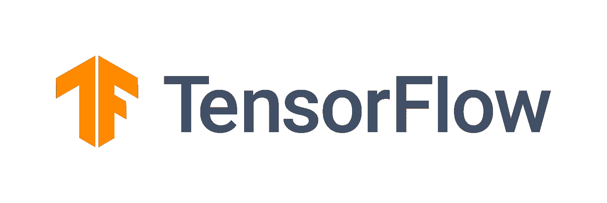

# 使用 Keras Lambda 层的特征工程，用于完整的培训管道。

> 原文：<https://medium.com/mlearning-ai/feature-engineering-using-keras-lambda-layers-ae0c6d3c904f?source=collection_archive---------7----------------------->

通常对于结构化数据问题，我们最终会使用多个库进行预处理或特征工程。我们甚至可以有一个完整的 ML 训练管道，使用不同的库，例如用于读取数据的 Pandas，以及用于编码特征的 sklearn，例如 OneHot 编码和标准化。估计器可以是 sklearn 分类器 xgboost，或者它可以是例如 Keras 模型。在后一种情况下，我们将最终得到用于特征工程和编码的工件，以及用于保存的模型的不同工件。管道也被断开，需要一个额外的步骤来向 Keras 模型提供编码数据。对于这一步，在将数据输入 Keras 模型之前，可以将数据从 dataframe 映射到类似 tf.data.Datasets 的类型或 numpy 数组。

在本帖中，我们将考虑使用 Keras/Tensorflow 在本地实现一个培训管道。如标题所示，我们将使用 Lambda 层进行特征工程。这些工程特征将是无状态的。对于有状态预处理，我们可以使用类似 Keras 预处理层的东西。我们将最终得到一个训练管道，其中特征工程将成为网络架构的一部分，并且可以作为独立的推理被持久化和加载。

请记住，tf.keras.layers.Lambda 层有序列化(反序列化)限制，因为 Lambda 层是通过序列化 python 字节码保存的。

我们将遵循的步骤:

*   用 tf.data 加载数据
*   创建输入层
*   使用 Lambda 图层创建要素图层
*   火车模型

对于下面的例子，我们将使用心脏病数据集。让我们导入张量流并读入数据:

为每个要素创建一个输入对象字典:

我们将在这个例子中使用 Lambda 层进行特征工程。以下是我们将用于创建工程特征的功能。

现在我们有了自己的函数，让我们创建 Lambda 层的功能:

我们所有的工程特征层都已创建，现在我们可以将其与其他特征相结合。

我们的最后一步是创建和适应我们的 Keras 模型。对于这个例子，我们将使用一个简单的模型架构。我们将持久化模型，并加载它以进行推理。

总之，我们能够成功地建立一个模型使用 Keras Lambda 层。该模型被保存并加载用于推理。我们的特征工程是我们保存的模型(模型架构)的一部分。**一切都原产于喀拉斯。**

 [## Mlearning.ai 提交建议

### 如何成为 Mlearning.ai 上的作家

medium.com](/mlearning-ai/mlearning-ai-submission-suggestions-b51e2b130bfb)